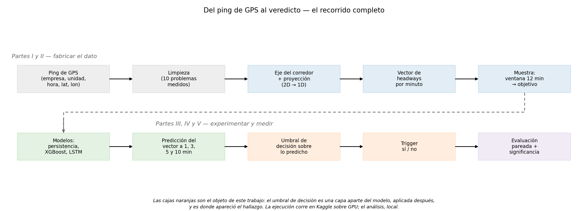
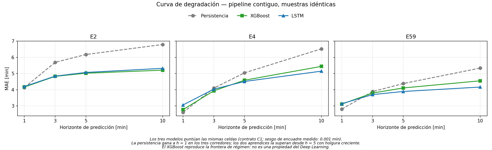
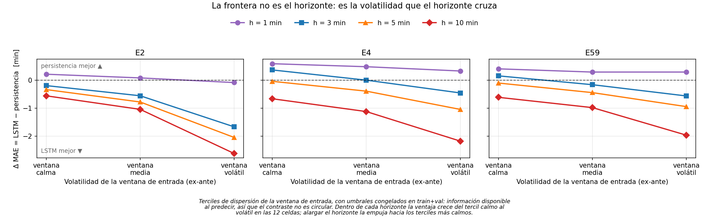
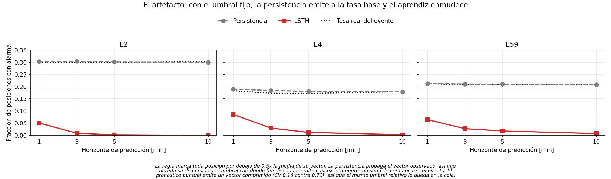

# Metodología y resultados

Qué se hizo, en qué orden, por qué, y qué se obtuvo — desde los datos crudos de
GPS hasta los resultados finales.

Está escrito para leerse de principio a fin sin conocimiento previo del proyecto.
Cada término técnico se explica la primera vez que aparece, y al final hay un
glosario de consulta rápida.

> Sobre las figuras. El documento usa dos series. Los diagramas 1 a 5
> explican el método; las figuras 1 a 5 muestran resultados medidos. Todas
> están hechas y se regeneran con sus constructores (ver el final del documento).

---

# Parte 0 — Orientación

## 0.1 El problema

El *bunching* es el fenómeno por el cual dos buses de la misma línea terminan
circulando pegados, seguidos de un hueco largo sin servicio. Es el modo de falla
característico de los corredores de alta frecuencia: degrada el servicio aunque la
cantidad total de buses sea la correcta.

El objetivo de este trabajo fue anticiparlo: predecir, con varios minutos de
antelación, cómo van a quedar los intervalos entre buses, para que un operador
pueda intervenir antes de que el problema ocurra.

La cantidad que se predice se llama *headway*: el tiempo que pasa entre un bus
y el siguiente por un mismo punto. Un corredor sano tiene *headways* parecidos
entre sí. Un corredor con *bunching* los tiene muy desparejos.

## 0.2 Qué se encontró

Conviene adelantarlo, porque todas las decisiones de las Partes I a IV se
entienden mejor sabiendo adónde llevan.

**Primero, el modelo funciona.** A 10 minutos de anticipación, la red neuronal
mejora el error de pronóstico sobre el método trivial —repetir el último valor
observado— entre un 21 % y un 22 % en los tres corredores estudiados, y contra ese
rival la ventaja se concentra donde más importa: en los momentos de mayor
irregularidad. Con dos fronteras que conviene fijar desde acá. **A 1 y a 3 minutos
no hay ventaja** — a 1 minuto gana la persistencia; la afirmación sólida empieza en
los 5 minutos. Y contra una vara más exigente que la persistencia —el promedio
histórico por franja horaria— el modelo gana en dos de los tres corredores: en E2 a
10 minutos pierde por cuatro segundos. El resultado se sostiene en tres períodos de
prueba distintos, lo que muestra estabilidad frente a la elección del período, no
réplica independiente.

**Segundo, y es el hallazgo central: ese mismo modelo parecía completamente ciego
a la irregularidad.** Al aplicarle la regla de detección estándar, disparaba 14
alarmas donde había 15 245 eventos reales, en E2 a 10 minutos: un cociente de F1 de
255 a 1 contra el método trivial.

**Tercero, esa ceguera resultó ser un artefacto del instrumento de medición, no
una propiedad del modelo.** El pronóstico aplana la variabilidad: describe un
corredor más parejo de lo que realmente es. La regla de detección del campo está
calibrada sobre la realidad, que es despareja, y aplicada sobre una predicción
aplanada simplemente nunca se dispara. Corrigiendo el punto de corte —o midiendo
sin ningún corte— el veredicto se invierte y el modelo detecta mejor que el método
trivial.

El aporte del trabajo es haber medido ese mecanismo y haber mostrado cómo
repararlo.

## 0.3 El hecho raíz del que cuelga todo

Los datos de Arequipa **no traen horario programado**. No existe una tabla de
servicio publicada que diga "este bus debe pasar cada 8 minutos". Tampoco hay
GTFS ni una tabla de paradas confiable.

Esa única carencia encadena el documento entero:

> Sin horario → tampoco hay paradas confiables → hubo que reconstruir la geometría
> del corredor desde los propios registros de GPS (Parte II) → eso permitió definir el
> *headway* por cruce de posición (Parte II) → con el *headway* definido se
> armaron las muestras y el experimento (Parte III) → pero para medir detección
> hacía falta definir el evento, y la definición del campo se apoya en el horario
> que no existe → hubo que fabricar una alternativa (Parte IV) → y al medirla contra
> la convención del campo quedó al descubierto un defecto que esa convención
> arrastra (Parte V).

Cada parte del documento resuelve el problema que dejó abierta la anterior.

## 0.4 Cómo está organizado

```
Parte I    Qué datos había, y en qué estado
Parte II   Fabricar la cantidad a predecir
Parte III  Construir el experimento
Parte IV   Cómo se mide
Parte V    Resultados
Parte VI   Limitaciones
```

Y el flujo técnico, de punta a punta:

```
programa constructor → notebook → Kaggle (GPU) → resultados por muestra → análisis local
```



*Diagrama 1 — Todo el trabajo en una imagen. La fila de arriba fabrica el dato; la
de abajo lo usa. Las cajas naranjas son el objeto del hallazgo.*

## 0.5 Alcance declarado

El trabajo predice *headways* y evalúa la calidad de la detección. **No construye
ni evalúa un sistema de control de despacho.** Lo que se establece es que la
información está presente y es explotable, no que alcance para operar un sistema
real.

---

# Parte I — Qué datos había, y en qué estado

## I.1 Origen y forma del dato

Los datos provienen del sistema AVL del Sistema Integrado de Transporte de
Arequipa. AVL significa *Automatic Vehicle Location*: es el equipo de GPS a bordo
que reporta la posición del bus, en este caso aproximadamente cada 20 segundos.

Lo que llega es una lista enorme de registros con esta forma: *empresa, unidad,
fecha y hora, latitud, longitud*. Nada más.

A cada uno de esos registros —**un bus, un instante, una posición**— lo llamamos
**ping**, que es el nombre habitual en telemetría. Es la unidad mínima del dato:
todo lo que sigue se construye apilando pings.

| | |
|---|---|
| Período | 2023-10-01 → 2024-02-29 |
| Días | 152 días seguidos, sin huecos |

**Qué significan E2, E4 y E59.** El dato crudo viene identificado por empresa
operadora, y el estudio toma tres. La letra **E** es de *empresa* y el número es su
identificador en el sistema: E2 es la empresa 2. Un corredor, acá, es el conjunto de
unidades de una empresa: el trazado, el eje y los intervalos se calculan por separado
para cada una. Esta notación se usa en todo el documento.

| Corredor | Unidades operativas | Registros GPS crudos |
|---|---|---|
| E2 | 31 | ~17.7 millones |
| E4 | 19 | ~7.8 millones |
| E59 | 40 | ~17.9 millones |
| **Total** | **90** | **~43.4 millones** |

## I.2 La restricción raíz: no hay horario programado

Ya adelantada en la Sección 0.3, pero conviene dejarla asentada acá con su
consecuencia técnica.

Casi toda la literatura de *bunching* define el evento como una fracción del
*headway* programado. Sin horario publicado, esa definición no se puede
aplicar. Hubo que construir una alternativa, y esa construcción es el origen de la
Parte IV y del hallazgo de la Parte V.

## I.3 Por qué cada bus se identifica con dos campos y no con uno

Cada vehículo se identifica por el par (empresa, unidad), nunca por el número
de unidad solo.

La razón es concreta: los números de unidad se repiten entre empresas, y una
fracción sustantiva de ellos aparece en tres o más. Si se indexa solo por número
de unidad, se mezclan buses de operadores distintos como si fueran el mismo
vehículo, y el cálculo de intervalos queda corrompido.

## I.4 Qué venía mal, y qué se decidió

Un análisis exploratorio midió cada problema antes de decidir cómo tratarlo.
Ese es el criterio general del proyecto: primero cuantificar, después decidir.

| # | Problema encontrado | Cuánto | Decisión | Por qué |
|---|---|---|---|---|
| 1 | Registro sin hora | 19 filas | Descartar la fila | Sin hora no se puede ubicar el registro en el tiempo |
| 2 | Registro sin coordenada | 19 filas | Descartar la fila | Sin coordenada no hay posición |
| 3 | Coordenada exactamente `(0, 0)` | 48 018 filas | Descartar la fila | El punto (0,0) está en medio del océano Atlántico. Es el valor que el GPS escribe cuando no logró fijar posición, no un lugar real |
| 4 | Velocidad mayor a 80 km/h entre dos registros seguidos | 0.015 %–0.044 % | Descartar el **par** de registros, no la fila | Ningún bus urbano en Arequipa va a esa velocidad. Se descarta el par para que el salto no contamine el cálculo de intervalos; la fila se conserva para otros usos |
| 5 | Salto de más de 500 m en menos de 60 s | 0.008 %–0.012 % | Descartar el par | Es un salto imposible: el GPS "teletransportó" el bus. Criterio geométrico, independiente del anterior |
| 6 | El GPS reporta velocidad cero mientras el bus se movió 50 m o más | E2 1.89 %, E4 3.26 % | **Ignorar el campo de velocidad del GPS** en todo el trabajo y calcular la velocidad como distancia sobre tiempo | El campo está descalibrado o directamente no se reporta. Es más confiable calcularla que creerle |
| 7 | Campo de rumbo igual a 0 | E2 0.80 %, E4 0.58 % | Tratar el 0 como "sin dato", no como "rumbo norte" | Es el valor que el equipo escribe con el bus detenido |
| 8 | **E59 no reporta rumbo en absoluto** | 100 % | Cambiar el método para detectar el sentido de marcha | Ver I.5 — cambió el diseño |
| 9 | Huecos de más de 30 minutos entre registros | miles por corredor | Cortar el viaje en ese punto | Un hueco así significa apagón de GPS, fin de viaje o falla de comunicación. No se puede suponer que el bus siguió circulando |
| 10 | Registros duplicados | 0 | Sin acción | La verificación pasa limpia |

## I.5 La decisión que cambió el diseño

El plan original detectaba si el bus iba de ida o de vuelta usando el campo de
rumbo que reporta el GPS. El análisis reveló que E59 no lo reporta en absoluto, y
E59 es un corredor obligatorio del estudio.

Decisión: el sentido se infiere de si el bus avanza o retrocede a lo largo del
eje del corredor. El campo de rumbo quedó solo como verificación cruzada donde
existe.

Conviene declararlo como lo que es: una decisión forzada por la realidad del dato.
Pero el método resultante no depende de un campo opcional del proveedor de GPS, lo
cual lo hace más aplicable a otros sistemas, no menos.

---

# Parte II — Fabricar la cantidad a predecir

Sin horario y sin tabla de paradas confiable, el *headway* no viene en el dato.
Hay que construirlo desde cero, usando únicamente las posiciones que reporta el
GPS.

## II.1 Reconstruir el eje del corredor

Se ajusta una línea que representa el recorrido, a partir de las posiciones de los
buses en movimiento.

| Parámetro | Valor | Por qué |
|---|---|---|
| Velocidad mínima para usar un ping | 10 km/h | Los buses detenidos en terminales y semáforos acumulan cientos de pings en un mismo punto y deforman la línea. Con 5 km/h no alcanzaba |
| Recorte de coordenadas extremas | percentiles 0.5 y 99.5 | Descarta posiciones geográficamente absurdas antes de ajustar. Remueve ~1.7 % |
| Resolución del trazado | 50 tramos | El corredor se parte en 50 tramos a lo largo de su eje y cada uno aporta un punto a la línea. Los tramos con menos de 5 posiciones se descartan, así que los puntos efectivos son 44 en E2, 50 en E4 y 49 en E59 |

Un percentil indica el valor por debajo del cual queda cierto porcentaje de
los datos. El percentil 99 es el valor que supera solo el 1 % más alto.


*Diagrama 2 — Cómo se recupera el trazado sin mapa: se ajusta una línea a la nube
de posiciones, y lo que cae fuera de la banda se descarta.*

## II.2 Convertir dos dimensiones en una

Cada ping se proyecta sobre ese eje y se convierte en **un solo número: cuántos
metros lleva recorridos el bus a lo largo del corredor**.

Por qué es clave: con latitud y longitud no se puede decidir sin ambigüedad cuál
bus va adelante. Con un solo número sí — el que tiene el número mayor va más
adelantado. Todo el cálculo de intervalos depende de poder ordenar los buses.


*Diagrama 3 — Cada ping se lleva perpendicularmente al eje, y lo que queda es un
solo número: cuántos metros lleva recorridos el bus.*

## II.3 Filtro de fuera de ruta, y grilla temporal

Fuera de ruta. Los pings que quedan a más de 300 metros del eje se descartan.
Es un filtro agresivo: en la calibración previa descartaba el 43.7 % de los pings.
La razón es que los corredores de Arequipa comparten trazado con calles paralelas,
depósitos y otras líneas; sin este filtro entran vehículos que no están haciendo
el recorrido. Quedó documentado como ajustable a 500 m si el volumen útil bajara
demasiado.

Grilla de un minuto. El GPS reporta cada ~20 segundos y de forma irregular.
Todo se lleva a una grilla uniforme de un minuto — es decir, se toma una "foto"
del corredor cada 60 segundos. Da un factor de tres de suavizado sin perder
detalle operativo. Probado estable contra grillas de 30 y de 120 segundos.

## II.4 La definición de *headway* adoptada

> El *headway* de un bus es **hace cuánto tiempo el bus de adelante pasó por el
> punto donde el bus de atrás está ahora.**

En cada foto del corredor, y para cada par de buses consecutivos en el mismo
sentido, se calcula ese tiempo. El resultado es un vector de *headways*: si
hay `N` buses circulando, el vector tiene `N − 1` números, en minutos.

Un vector, acá, es simplemente una lista ordenada de números — un intervalo
por cada par de buses consecutivos, de punta a punta del corredor.

Es una definición de cruce por posición, no por parada. Eso importa porque la
hace inmune a la ausencia de una tabla de paradas confiable, que es exactamente lo
que falta en estos datos.


*Diagrama 4 — Tiempo en horizontal, distancia recorrida en vertical. El bus de
atrás está en un punto; se busca hacia atrás cuándo pasó por ahí el de adelante.
Esa diferencia de tiempo es el headway.*

## II.5 Se evaluaron cuatro formulaciones, no una

La definición no se eligió por intuición. Se probaron cuatro candidatas sobre
siete criterios de calidad, en **E2 y E59**. Los criterios, y qué pregunta cada
uno:

| | Criterio | Pasa si | Qué pregunta |
|---|---|---|---|
| 1 | Computabilidad | ≥ 80 % | ¿Con qué frecuencia se puede calcular el valor? |
| 2 | Variabilidad | CV ≥ 0.2 | ¿La señal se mueve lo suficiente como para que valga la pena predecirla? |
| 3 | Autocorrelación a 5 min | ≥ 0.3 | ¿El valor de ahora dice algo sobre el de dentro de 5 minutos? |
| 4 | Información mutua entre vecinos | ≥ 0.1 bits | ¿El intervalo de un bus informa sobre el de su vecino? |
| 5 | R² de la persistencia | entre 0.5 y 0.85 | ¿La vara mínima es exigente pero superable? |
| 6 | Volumen | ≥ 50 000 pares | ¿Alcanza el dato? |
| 7 | Estabilidad | KL < 0.1 | ¿La distribución conserva su forma al mover los parámetros? |

**Con una advertencia que conviene leer antes que la tabla siguiente: el criterio
5 falla en las cuatro formulaciones y en los dos corredores.** Su umbral quedó mal
calibrado — en estas series la persistencia da R² negativo, así que ninguna
formulación podía entrar en la banda `[0.5, 0.85]`. El máximo alcanzable era 6 de
7, y un "6 de 7" no significa que a esa formulación le falte algo, sino que pasó
todos los criterios que estaban bien puestos. Que la persistencia sea una vara tan
pobre no invalida el método: es información sobre el sistema, y reaparece en la
Parte V como el resultado de que a horizonte corto sea difícil de superar.

Con eso dicho, el veredicto:

| ID | Definición | Veredicto |
|---|---|---|
| A | Tiempo entre puntos virtuales del recorrido | Descartada — la serie resultante era casi ruido |
| B | Distancia en metros entre buses | Descartada — **pasa los criterios de calidad**, pero mide separación espacial y no tiempo entre pasadas, que es la cantidad que el operador necesita y la que la literatura de *bunching* define. Se descarta por el objeto de estudio, no por su desempeño |
| C.1 | Tiempo estimado proyectando hacia adelante | Descartada — el modelo no aprendía nada de ella |
| **C.2** | **Tiempo desde el cruce hacia atrás** | **Adoptada** — 6 de 7 criterios en ambos corredores, en unidades de tiempo, y con la relación más fuerte entre buses vecinos de las tres formulaciones temporales |

Lo que decidió, con precisión. C.2 y B empatan en 6 de 7 criterios; ninguna
de las dos gana por desempeño. B se descartó porque mide metros y el objeto de
estudio es tiempo. Entre las tres formulaciones que sí están en unidades de
tiempo —A, C.1 y C.2— A quedó afuera por autocorrelación casi nula, y C.2 le gana
a C.1 con holgura. Ese es el camino de la decisión.

Una medida que conviene mirar es la información mutua, que dice cuánto informa
el intervalo de un bus sobre el de su vecino. Que sea alta en C.2 confirma que la
formulación captura la propagación del retraso de bus a bus, que es el mecanismo
físico del *bunching*. Si fuera cero, el problema no tendría estructura que
aprender y no habría nada que predecir.

**Y hay que ser exacto con lo que esa medida dice y lo que no.** C.2 le gana a
C.1 por factores de 6.6 a 58, y a B por factores de 3.8 a 22, que es la
comparación pertinente. Pero **no tiene la información mutua más alta de las
cuatro**: A la supera en dos de los tres corredores.

| Información mutua entre vecinos, en bits | E2 | E4 | E59 |
|---|---|---|---|
| A — puntos virtuales | **1.367** | **2.466** | 0.638 |
| B — distancia en metros | 0.153 | 0.142 | 0.059 |
| C.1 — proyección hacia adelante | 0.088 | 0.052 | 0.022 |
| **C.2 — adoptada** | 0.585 | 1.096 | **1.268** |

Que A puntúe alto acá no la rehabilita: promedia sobre ventanas de cinco minutos
en puntos fijos del recorrido, y esa suavización es también la razón de que su
serie sea casi ruido en el tiempo, que es por lo que se la descartó.

*Estos valores se recalcularon con `uv run python -m src.build_mi_recheck`, que
corre las definiciones del propio estudio de viabilidad sobre los datos
procesados actuales; salen a `docs/resultados/csv-multihorizon/mi_recheck.csv`.
No reproducen el estudio original —que construía su propio eje del corredor— sino
que vuelven a hacerle la pregunta con la geometría de producción. E4 no formaba
parte de aquella comparación y se agrega acá.*

## II.6 El techo de 30 minutos

Al aplicar C.2 apareció un problema serio. En corredores donde varias líneas
comparten el mismo eje —E2 en particular—, la búsqueda del cruce podía encontrar
un paso de horas o días antes. Se observaron valores de hasta 161 666 minutos,
que son 112 días.

Decisión: si el cruce encontrado tiene más de 30 minutos de antigüedad, se
emite "sin dato" en lugar de un número absurdo.

Por qué 30 y no otro número: en E59 —el corredor sin ese problema, o sea el caso
limpio— el 95 % de los intervalos está por debajo de 18 minutos. Un techo de 30 es
de dos a tres veces el intervalo típico en hora pico: conserva prácticamente todos
los pares válidos y elimina los patológicos. Corrigió el 58.4 % de los intervalos
patológicos en E2 **en el sentido de ida** —los que la búsqueda de cruce devolvía
con más de media hora de antigüedad—, que es el sentido donde el problema se
concentraba.

## II.7 Cobertura obtenida

| Corredor | Sentido | Pares con intervalo válido | Total | Cobertura |
|---|---|---|---|---|
| E2 | vuelta | 495 562 | 702 619 | 70.5 % |
| E2 | ida | 513 722 | 888 040 | 57.9 % |
| E59 | vuelta | 1 155 295 | 1 449 818 | 79.7 % |
| E59 | ida | 913 898 | 1 235 060 | 74.0 % |

Alrededor de 3 millones de intervalos válidos en E2 y E59, sobre 152 días seguidos,
con ambos sentidos confirmados. **E4 no tiene fila en esta tabla**: su cobertura no
quedó tabulada en este formato. Es un faltante del documento, no del procesamiento —
E4 tiene datos procesados y resultados en toda la Parte V.

**Qué pasa con el 20 % a 42 % restante.** Una posición del vector sin intervalo
válido queda como "sin dato": no se imputa ni se convierte en cero. El error se
computa solo sobre las posiciones observadas, y son las mismas para todos los
modelos por el contrato de identidad de muestra (Sección III.6). La consecuencia que
hay que declarar es que los resultados describen el comportamiento del corredor
**donde el dato existe**, y esa cobertura no es uniforme: va del 57.9 % al 79.7 %.

---

# Parte III — Construir el experimento

## III.1 Qué observa y qué predice el modelo

El modelo mira una ventana de 12 minutos de historia reciente —los 12 vectores
anteriores— y predice el vector completo a 1, 3, 5 y 10 minutos hacia
adelante.

Son cuatro horizontes entrenados por separado: un modelo por horizonte, en lugar
de un modelo que se realimenta con sus propias predicciones. Se evita así que el
error de un paso se acumule sobre el siguiente.

## III.2 La partición es por tiempo, no al azar

| Conjunto | Para qué sirve | Desde | Hasta | Días |
|---|---|---|---|---|
| **Entrenamiento** | El modelo aprende de acá | 2023-10-01 | 2024-01-15 | 107 |
| **Validación** | Se eligen configuraciones acá | 2024-01-16 | 2024-02-07 | 23 |
| **Prueba** | Se mide el desempeño acá, y solo acá | 2024-02-08 | 2024-02-29 | 22 |

Los tres bloques son consecutivos, no se solapan, y suman los 152 días
disponibles. Todos los resultados reportados corresponden al conjunto de prueba.

Por qué por tiempo y no al azar. Si se mezclara aleatoriamente, el modelo
entrenaría con minutos del futuro y se evaluaría con minutos del pasado del mismo
día. El resultado sería optimista y no se reproduciría en operación real, porque
un operador solo tiene el pasado.


*Diagrama 5 — Los 152 días y cómo se reparten. Abajo, los tres orígenes: mismo día
de inicio, entrenamiento cada vez más largo, y períodos de prueba que no se
solapan.*

## III.3 Winsorización

**Winsorizar significa recortar los valores extremos a un tope, en lugar de
borrarlos.** Un valor que supera el tope se reemplaza por el tope.

El problema que resuelve. Los intervalos entre buses tienen cola larga: la
enorme mayoría está entre 3 y 15 minutos, pero unos pocos valen mucho más. Al
entrenar, esos pocos valores enormes dominan el aprendizaje y el modelo termina
optimizando para casos rarísimos en lugar de para la operación normal.

Por qué recortar y no borrar. Borrar la fila elimina también el resto de la
información de ese instante, que es válida. Recortar conserva el dato y neutraliza
solo la magnitud desproporcionada.

Dónde se pone el tope: en el percentil 99. Es decir, el 1 % de intervalos más
largos se lleva al valor del percentil 99.

Y acá está el contrato que importa: **el tope se calcula únicamente con los
datos de entrenamiento**, y ese mismo número se aplica a los tres conjuntos.

Si el tope se recalculara dentro de cada conjunto, el recorte del conjunto de
prueba usaría información sobre cómo se distribuye la prueba — información que en
operación no se tiene. Es una fuga sutil y muy fácil de cometer. De hecho, una
versión anterior del código la tenía: aplicaba el recorte solo a entrenamiento y
dejaba validación y prueba sin tocar. Hoy hay una prueba automática dedicada
exclusivamente a impedir que ese error vuelva.

El recorte afecta entre el 0.78 % y el 1.11 % de los objetivos, y su efecto sobre
los veredictos se midió: es nulo.

## III.4 Tres orígenes de evaluación, no uno

El problema que resuelve. Con una sola partición, un resultado podría deberse
a que *ese* período de prueba en particular fue favorable. Febrero podría ser un
mes raro. No habría forma de distinguir un hallazgo real de una casualidad de
calendario.

La técnica se llama evaluación de origen rodante (*rolling origin evaluation*),
en su variante de ventana expansiva. Es el procedimiento estándar para validar
pronósticos sobre series de tiempo: se repite todo el experimento moviendo el
punto de corte hacia atrás en el tiempo, y se comprueba si la conclusión se
sostiene.

Se ejecutaron tres orígenes. En cada uno se rehízo todo el procedimiento: recorte,
controles, entrenamiento y exportación de resultados.

| Origen | Entrenamiento | Días | Período de prueba | Días | Rol |
|---|---|---|---|---|---|
| **Origen 1** | 2023-10-01 → 2023-11-30 | 61 | 2023-12-23 → 2024-01-13 | 22 | Réplica más antigua |
| **Origen 2** | 2023-10-01 → 2023-12-22 | 83 | 2024-01-14 → 2024-02-04 | 22 | Réplica intermedia; además **calibra el umbral de decisión** del Origen 3 |
| **Origen 3** | 2023-10-01 → 2024-01-15 | 107 | 2024-02-08 → 2024-02-29 | 22 | **El que se reporta como resultado principal** |

*En el código del proyecto estos orígenes se llaman `r1`, `r2` y `main`
respectivamente. Son etiquetas internas, sin significado metodológico.*

Cómo leer la tabla. Los tres arrancan el mismo día y el entrenamiento se va
alargando: 61, 83 y 107 días. Entre el fin del entrenamiento y el inicio de la
prueba queda en cada caso una ventana de validación de unas tres semanas. Los tres
períodos de prueba no se solapan entre sí, de modo que cada uno es una oportunidad
distinta de contradecir el resultado. No son réplicas independientes: ver el último
párrafo de esta sección.

El doble papel del Origen 2. Además de ser una réplica, es la ventana sobre la
que se ajusta el umbral de decisión que después se aplica al Origen 3 (Sección
IV.9). Se usa esa y no otra porque es la inmediatamente anterior al período que se
reporta: es la información más reciente que un operador tendría disponible al
momento de calibrar.

No es una re-partición de los mismos resultados: son entrenamientos nuevos, con
todo el costo de cómputo que eso implica.

Como los tres arrancan en la misma fecha, los conjuntos de entrenamiento están anidados y no son independientes en
sentido estricto — el Origen 3 vio todos los días que vio el Origen 1. Por lo
tanto lo que esto establece es **estabilidad frente a la elección del período de
prueba**, que es una afirmación más modesta que una réplica independiente.

## III.5 Modelos comparados

| Modelo | Qué es, y qué hace | Por qué está |
|---|---|---|
| **Persistencia** | **No es un modelo: es una regla.** Predice que dentro de N minutos todo estará igual que ahora — formalmente, `ŷ(t+h) = y(t)`. No aprende nada, no tiene parámetros y no se entrena. En pronóstico de series de tiempo se la conoce como *pronóstico ingenuo* o de camino aleatorio | Es la vara mínima. Sobre series cortas es sorprendentemente difícil de superar, y es el rival que la literatura del subcampo rara vez incluye. Si un modelo no le gana a esto, no sirve |
| **Promedio histórico por franja horaria** | Tampoco aprende del presente: es **estadística descriptiva**. La media de los intervalos observados en entrenamiento para cada sentido, cada posición del vector y cada hora del día. Solo mira el reloj. Lo llamamos *almanaque* | Es una vara más exigente que la persistencia, y responde una pregunta que ella no cubre: si el modelo aprendió algo del presente o solo lo que suele pasar a esa hora. Se desarrolla en la Sección V.1 |
| **XGBoost** | **Aprendizaje automático clásico, no profundo.** Un conjunto de árboles de decisión que se corrigen entre sí, sobre la misma ventana de 12 minutos más hora, día y sentido | Es el competidor no profundo. Muy fuerte en datos de tabla |
| **LSTM** | **Red neuronal recurrente**, pensada para series de tiempo: procesa la secuencia paso a paso y arrastra memoria de lo anterior | Es el modelo profundo principal, y el que produce los resultados de la Parte V |

Se evaluaron además dos arquitecturas que incorporan explícitamente la estructura
espacial del corredor. No superan al LSTM simple sobre estos datos. Ese resultado
proviene de experimentos anteriores y no se rehízo bajo los contratos de la
Sección III.6, de modo que se reporta como antecedente y no como evidencia de este
trabajo.

### El presupuesto de ajuste no está nivelado, y corre en contra de la red

Ajustar un modelo requiere probar configuraciones. **XGBoost recibió 24
configuraciones por caso, elegidas en validación. El LSTM recibió una** en E2 y
E59, y tres en E4, heredadas de una fase previa.

La consecuencia para leer los resultados es directa:

- Donde gana el LSTM, la conclusión es sólida — gana con menos presupuesto.
- Donde gana el XGBoost, la ventaja no es atribuible al tipo de modelo, porque
  recibió entre 8 y 24 veces más intentos según el corredor.

Nivelarlo requiere unas catorce horas de cómputo en tarjeta gráfica y no se hizo.

## III.6 Las garantías: qué verifica el programa, y qué lo detiene

Esta sección junta todo lo que impide que un resultado sea un accidente. Un
contrato, acá, es una condición que el programa verifica automáticamente y
que, si no se cumple, **detiene la ejecución**. No advierte: se detiene.

| Contrato | Qué garantiza | Cómo se verifica |
|---|---|---|
| **Identidad de muestra** | Todos los modelos se evalúan sobre exactamente las mismas filas | Cada corrida recalcula el índice y compara su huella digital contra una copia congelada |
| **Contigüidad temporal** | Los minutos de una ventana son consecutivos de verdad | Se verifica al construir; una violación aborta la corrida |
| **Frontera de información** | Ninguna variable de entrada usa información posterior al momento de predecir | El control falla cerrado si aparece una variable prohibida. **Tiene una excepción conocida**, la bandera de día atípico: ver VI.3, defecto 11 |
| **Huella de entrada** | Ninguna corrida usa datos distintos de los declarados | Cada archivo de entrada tiene su **SHA-256** registrada. Antes de entrenar se recalcula y se compara |

Por qué importa la identidad de muestra. Si dos modelos se evalúan sobre filas
distintas, parte de la diferencia entre ellos viene de qué filas le tocaron a cada
uno, no de su calidad. La comparación deja de ser atribuible.

Y no es un riesgo hipotético: está medido. Bajo una versión anterior del
procesamiento, sin estos contratos, ese sesgo iba de 0.28 a 0.53 minutos — más
grande que la mayoría de las ventajas que se reclamaban por encima de él. Con los
contratos activos, el sesgo medido es de 0.001 minutos como máximo.

**El contrato de frontera de información no se cumple del todo.** La bandera de día atípico viola sus
dos mitades: su punto de corte se calcula sobre los 152 días incluyendo prueba, y
es un agregado del día completo usado en instantes en que ese total todavía no se
conoce. El control no la detiene porque la variable no figura en su lista de
prohibidas. Está activa en las corridas que producen los resultados de la Parte V.
Lo que sí está medido es que el hallazgo no depende de ella: el modelo de árboles
no la recibe y reproduce el cruce con margen comparable o mayor. El detalle
completo está en VI.3.

Por qué importa la contigüidad. Sin ella, "predecir a 10 minutos" podría
significar en realidad "predecir 10 filas más adelante". Si hay huecos en los
datos, esas 10 filas pueden abarcar una hora, y el horizonte dejaría de ser
tiempo. Cuánto importa está medido: sin el contrato, en E2
a 10 minutos el 30 % de las muestras eran ventanas rotas, con un horizonte real
medio de 41 minutos para un nominal de 10.

Exigir contigüidad cuesta datos: sobrevive entre el 81.9 % y el 90.2 % de las
ventanas candidatas. Se pierde menos de una quinta parte, y se gana que el
horizonte signifique lo que dice.

Notebooks generados, nunca editados a mano. Cada notebook se emite desde un
programa constructor. Para cambiar la lógica se edita el programa y se regenera.
Un cambio hecho a mano en el notebook se pierde en la siguiente generación.

Resultados idénticos entre ejecuciones. Los programas de análisis fijan el
paralelismo a un solo hilo, de modo que dos ejecuciones producen archivos
idénticos byte a byte. Sin eso, el orden en que terminan los hilos puede cambiar
los últimos decimales.

Pruebas automáticas. Alrededor de 1700 pruebas cubren los contratos descritos.
Los contratos metodológicos —recorte, control de entrada, terciles congelados,
determinismo— tienen pruebas dedicadas cuyo único propósito es impedir que alguien
los rompa sin darse cuenta.

---

# Parte IV — Cómo se mide

Esta parte describe el instrumento de medición. Empieza por la distinción
conceptual que el resto de la parte usa, y de la que depende que la Parte V se
entienda; sigue con las reglas de comparación, y termina con las métricas.

## IV.1 Criterio de *bunching* y umbral de decisión son dos cosas distintas

Todo el argumento de la Parte V descansa en esta distinción.

Todo el argumento depende de separar dos conceptos que la literatura trata como si
fueran uno solo. Se les da acá nombres distintos, y nunca se comparten.

| | **Criterio de *bunching*** | **Umbral de decisión** |
|---|---|---|
| Qué hace | Define **qué es** *bunching* en la realidad | Convierte la salida del modelo en una alarma |
| Disciplina | Transporte | Aprendizaje automático |
| De dónde sale | Convención del campo (TCQSM) | Se elige según la métrica que se quiera optimizar |
| Sobre qué se aplica | Sobre lo **observado** | Sobre lo **predicho** |
| Término en inglés | *bunching criterion*, *event definition* | *decision threshold*, *operating point* |
| En el código | `BUNCHING_RATIO` | `best_threshold`, `threshold_fitted` |

*La regla concreta que este trabajo usa como criterio de *bunching* se define en la
Sección IV.6; acá solo interesa que son dos capas distintas del sistema.*

**El error que este trabajo documenta es haberlos tratado como si fueran el
mismo:** tomar el criterio de *bunching* —calibrado sobre la realidad— y usarlo
como umbral de decisión sobre las predicciones. No son intercambiables,
porque las predicciones no tienen la misma variabilidad que las observaciones
(Sección V.4).

Hay una forma de verlo que deja el asunto más claro que cualquier tabla, y es
cómo quedó escrito en el programa. Marcar una celda como *bunching* no es aplicar
una regla aparte: es **puntuar cada celda por cuán apretado viene su intervalo, y
después cortar ese puntaje en un valor**. El puntaje es continuo y no tiene nada
de arbitrario. Lo arbitrario es dónde se corta.

Vista así, la regla heredada del campo no es una definición: es **una elección
particular de dónde cortar, hecha mirando corredores reales**. Y una vez que se
entiende que es una elección y no una propiedad del fenómeno, la pregunta de si
esa misma elección sirve para cortar un pronóstico —que no se parece a un corredor
real en su variabilidad— deja de sonar herética y pasa a ser obligatoria.

Qué es un umbral de decisión y por qué hace falta. El modelo produce números
continuos: 7.3 minutos, 9.1, 6.8. Pero una alarma no puede sonar "7.3" — tiene que
sonar o no sonar. Un umbral de decisión es la raya que convierte un número
continuo en una decisión de sí o no. Todo sistema que produce un puntaje y tiene
que decidir necesita uno. No es opcional. En análisis ROC se lo llama también
punto de operación, y la práctica de ajustarlo cuando las clases están
desbalanceadas se conoce como *threshold moving*.

> Una observación útil para buscar bibliografía. El umbral de decisión no
> forma parte del modelo: es una regla que se aplica *después*, sobre su salida.
> Por eso una búsqueda del tipo "umbral LSTM" no devuelve nada útil — son dos
> capas distintas del sistema, y la literatura las trata por separado. Esa
> separación es precisamente la razón por la que el problema que este trabajo
> documenta pasó inadvertido.

**Y conviene ser preciso sobre el alcance de esta afirmación, porque no se trata
de un tropiezo propio.** La receta que produce el problema está enunciada sin
ambigüedad por el trabajo más citado del subcampo. Yu et al. (2016) la escriben
así: *"the occurrence of bus bunching can be detected by thresholding the
predicted headway with the planned bus schedule."* Umbralizar el *headway*
**predicho** contra una referencia calibrada sobre observaciones es, textualmente,
el procedimiento estándar.

Y la consecuencia no es un accidente que dependa de cómo esté implementado: es
necesaria. Un pronóstico puntual devuelve un funcional central de la distribución
condicional, y por lo tanto está sub-disperso por construcción — Patton y
Timmermann (2012) lo establecen como teorema, con la sub-dispersión creciendo de
forma monótona con el horizonte. Cualquier procedimiento que aplique a ese vector
comprimido un corte calibrado sobre la realidad va a disparar de menos. No hace
falta que alguien se equivoque para que ocurra; basta con seguir la receta.

Podría pensarse que la referencia fija de Yu et al. —el *headway* observado en la
primera parada, que no se mueve con el pronóstico— queda a salvo de esto. **La
Sección V.6 mide que es al revés:** con un corte absoluto, que es exactamente el
que no se mueve con el pronóstico, el colapso empeora hasta un F1 de cero. La
forma de referencia fija está *más* expuesta, no menos.

Dicho eso, hay un límite que este trabajo no cruza: **no se afirma que los
resultados publicados por Yu et al. ni por ningún otro trabajo sean incorrectos.**
Eso exigiría medir sobre sus datos, y no se hizo. Lo que se afirma es más acotado
y más verificable: que el procedimiento que el subcampo describe como estándar
tiene un modo de falla necesario, que acá está medido sobre datos reales, y que se
repara moviendo el corte en lugar de cambiar el modelo. Que lo hayamos encontrado
cometiéndolo nosotros mismos es la razón de que esté medido con este detalle, no
el alcance del hallazgo.

**Una nota de vocabulario que no es de estilo, sino parte del argumento.** La
literatura llama *threshold* a las dos cosas: al criterio que define el evento y al
corte que dispara la alarma. Una sola palabra para dos capas del sistema que se
calibran sobre poblaciones distintas y con criterios distintos.

**Esa colisión de vocabulario es el terreno donde crece el problema.** Cuando dos
objetos comparten nombre, tratarlos como intercambiables deja de parecer un error y
empieza a parecer una obviedad — y nadie revisa las obviedades. Por eso acá llevan
nombres distintos y nunca se abrevian: **criterio de *bunching*** y **umbral de
decisión**, siempre completos. Al citar trabajos ajenos se respeta su vocabulario.

## IV.2 Comparaciones sobre las mismas filas

Todas las comparaciones entre modelos son pareadas sobre muestras idénticas.

No es una precaución cosmética. La prueba estadística estándar para comparar
pronósticos —el contraste de Diebold-Mariano— se construye restando el error
de un modelo menos el error del otro, fila por fila. Si los modelos no comparten
las filas, esa resta no existe, y el estadístico queda indefinido, no simplemente
sesgado.

## IV.3 Cómo se mide si una diferencia es real

Las muestras de un mismo día de servicio comparten clima, incidentes y demanda: un
accidente a las 08:00 moldea toda la mañana. Tratarlas como si fueran
independientes infla artificialmente la significancia — hace parecer sólido lo que
no lo es.

Decisión: los datos se agrupan por día de servicio. El conjunto de prueba
tiene 22 días, y ese es el tamaño de muestra real — no las decenas de miles de
filas.

Se aplica además una corrección por muestra pequeña, se usan estimadores que
toleran que la variabilidad no sea constante y que los errores estén
correlacionados en el tiempo, y se reporta también la prueba de Wilcoxon, que
no supone ninguna forma particular de distribución.

El tamaño del efecto se presenta primero, y el valor *p* actúa como piso, no como
veredicto. Importa cuánto mejora, no solo si la mejora cruza la línea convencional
de significancia.

## IV.4 Estratificación anticipada

Los resultados se separan según la **variabilidad de la propia ventana de
entrada**: cuánto se movió el intervalo en los 12 minutos que el modelo
efectivamente observó.

Es una variable conocida en el momento de predecir. Sus cortes en tercios
—terciles— se congelan usando entrenamiento y validación, y se aplican a
prueba. Nunca se calculan sobre prueba.

Por qué importa. Separar los datos usando una variable calculada sobre el
conjunto de prueba, y después comparar sobre ese mismo conjunto, es circular: se
elige la partición sabiendo el resultado. Congelar los cortes de antemano es lo
que vuelve legítimo condicionar y luego comparar.

## IV.5 Métricas de error numérico

- Error absoluto medio (MAE) — en promedio, cuántos minutos se equivoca.
- Error cuadrático medio — lo mismo pero penalizando más los errores grandes.

Se reportan juntos porque a horizonte corto nombran ganadores opuestos, y esa
discrepancia es en sí un resultado (Sección V.1).

## IV.6 El evento: qué se heredó del campo y qué es elección propia

Acá es donde el trabajo se aparta de la convención, y conviene ser exacto.

> Se marca *bunching* cuando un intervalo cae por debajo de **la mitad del
> promedio de su propio corredor en ese instante**.

Con un punto que hay que subrayar, porque es donde se concentra todo el argumento:
el promedio se calcula siempre sobre el mismo vector que se está marcando. Al
evaluar la realidad, es el promedio real; al evaluar una predicción, es el
promedio de la predicción.

Por qué así: en el momento de decidir si suena la alarma, el operador tiene el
vector que su modelo predijo, no el que va a ocurrir. Cualquier otra opción usaría
información no disponible.

No se descartó la regla del campo para construir otra: se conservó su **estructura**
—una fracción de una referencia— y se reemplazó el único término que estos datos no
permiten calcular, que es el **denominador**:

| | Regla |
|---|---|
| **Convención del campo** | *bunching* si intervalo < 0.5 × *headway* **PROGRAMADO** |
| **Regla de este trabajo** | *bunching* si intervalo < 0.5 × **PROMEDIO DEL VECTOR** |

El cociente de un medio es el mismo, y es heredado. Proviene del TCQSM, el
manual de referencia de calidad de servicio de transporte público, que lo usa para
caracterizar cuándo un vehículo está fuera de intervalo, y aparece en uso reciente
en Zhang et al. (2022). No se modificó.

Lo que cambió es el denominador, y no fue una búsqueda. No se probaron
denominadores alternativos ni se optimizó ninguna expresión. La convención del
campo normaliza por el *headway* programado —un cuarto del programado en Yu et al.
(2016) y Moreira-Matias et al. (2016), la mitad en el TCQSM— y la única
alternativa publicada es un corte fijo en minutos, como en Sun et al. (2021). Las
dos exigen algo que estos datos no tienen: un horario publicado, o un valor en
minutos fijado de antemano. El promedio del propio vector es la única referencia
disponible en el dato, no la mejor de varias candidatas.

La sustitución tiene precedente, aunque la forma exacta no. Yu et al. (2016)
enfrentan el mismo vacío en Pekín —el operador no publica tabla fija— y lo
resuelven tomando como *headway* "programado" el observado en la primera parada de
la misma corrida. Sustituir un horario ausente por una referencia extraída del
propio dato es, entonces, práctica establecida en el trabajo más citado del
subcampo. Lo que no se encontró en la literatura publicada es esta forma concreta,
"fracción del promedio observado", y se declara como elección propia.

**La diferencia con Yu et al. es exactamente el mecanismo que este trabajo
estudia:** su punto de referencia es observado y queda fijo a lo largo de la
corrida; el nuestro se recalcula sobre el vector evaluado y por lo tanto se mueve
junto con la predicción.

## IV.7 Consecuencia declarada: el evento es frecuente

La regla produce entre **17.2 % y 30.3 %** de eventos, según corredor y horizonte.
Es alto para el subcampo, cuyos trabajos reportan entre 0.15 % y 17 %.

Y juega a favor del argumento. Cuanto más frecuente es el evento, más alto es
el puntaje que puede sacar un detector que no sabe nada con la métrica F1. El
régimen de este trabajo vuelve ese argumento más exigente, no más laxo.

## IV.8 Métricas de detección, y por qué no F1

- MCC (coeficiente de correlación de Matthews) — resume el acierto usando las
  cuatro casillas de la tabla de confusión y descontando el azar.
- ROC-AUC — mide si el modelo ordena bien los casos de más a menos
  peligroso, sin necesitar ningún umbral de decisión. Un valor de 0.5 es azar
  puro.
En cada tabla de detección se reporta además el **piso trivial**: el puntaje que
saca un detector sin ninguna información que marque absolutamente todas las celdas de detección
como *bunching*. Con una tasa base *p*, ese piso vale 2*p*/(1+*p*) — en E2 a 10
minutos, con *p* = 0.303, da **0.465**. Cualquier F1 por debajo de ese número es
peor que no saber nada.

Por qué no se usa F1 para decidir. Es la métrica que usa todo el subcampo, y a
estas frecuencias de evento (17 %–30 %) premia hacer trampa: marcar absolutamente
todo como *bunching*, sin saber nada, produce un F1 presentable. El MCC no cae en
eso porque usa las cuatro casillas y descuenta el azar.

## IV.9 Cómo se calibra el umbral de decisión

Cuando una métrica necesita un punto de decisión, el corte se ajusta maximizando
MCC sobre el Origen 2 —la ventana inmediatamente anterior— y se aplica hacia
adelante, al Origen 3, que es el que se reporta. La ventana donde se calibra y la
ventana donde se mide no se solapan.

Por qué en esa dirección. Es la única en la que un operador podría calibrar en
producción: con datos del pasado, aplicados al futuro. Ajustar el corte sobre la
misma ventana donde después se mide sería hacer trampa.

**Dos salvedades.** La primera: la ventana de calibración
—prueba del Origen 2, del 2024-01-14 al 2024-02-04— se solapa **dos días** con el
entrenamiento del Origen 3, que llega hasta el 2024-01-15. No se solapa con el
período donde después se mide, que es lo que invalidaría la comparación, pero el
solape existe y no es cero. La segunda: el Origen 2 y el Origen 3 son modelos
distintos, entrenados sobre 83 y 107 días. El punto de operación se transfiere
entre dos distribuciones de error que no son idénticas.

---

# Parte V — Resultados

Todos los números de esta parte salen de la población pareada bajo los contratos
de la Sección III.6, sobre el conjunto de prueba del Origen 3.

## V.1 El modelo pronostica bien

A 10 minutos de anticipación, sobre muestras idénticas:

| Corredor | MAE LSTM | MAE persist. | Δ MAE | Mejora | RMSE LSTM | RMSE persist. |
|---|---|---|---|---|---|---|
| E2 | 5.321 | 6.793 | **−1.473** | −21.7 % | 6.880 | 9.191 |
| E4 | 5.146 | 6.526 | **−1.381** | −21.2 % | 6.659 | 8.928 |
| E59 | 4.162 | 5.335 | **−1.173** | −22.0 % | 5.433 | 7.508 |

*Todo en minutos. Las Δ salen de los valores sin redondear, así que difieren en la
tercera decimal de la resta de las dos columnas impresas.*

**Para poner el error en escala:** un MAE de 5.32 minutos convive con intervalos que
en su enorme mayoría están entre 3 y 15 minutos (Sección III.3). El error es del
orden de la mitad del valor típico. La mejora sobre la persistencia es real y
medida; la magnitud absoluta del error sigue siendo grande.

Los tres corredores mejoran entre 21 % y 22 %. La consistencia es en sí un dato:
no es un corredor afortunado, es el mismo efecto en tres flotas de tamaño
distinto.



*Figura 1 — Error de pronóstico frente al horizonte, por corredor. Más bajo es
mejor. La persistencia (gris) empieza al nivel de los aprendices a 1 minuto —en E2
prácticamente empatada— y termina claramente arriba a 10: ese cruce es el
resultado. Los tres modelos puntúan exactamente las mismas celdas.*

Dónde está la frontera de esta afirmación. El resultado no es uniforme sobre
los horizontes:

| Horizonte | Qué se puede afirmar |
|---|---|
| **h = 1** | Gana la persistencia. Firme en E4 y E59; al borde en E2 (*p* = 0.062) |
| **h = 3** | Zona de transición. **Sin victoria declarable** |
| **h ≥ 5** | El aprendiz gana en media y en mediana, con significancia amplia, en los tres corredores. **Esta es la afirmación sólida** |

Dos matices:

- A h = 1 el error absoluto y el cuadrático nombran ganadores opuestos. El
  LSTM pierde el absoluto y gana el cuadrático, en los tres corredores. Es el
  comportamiento esperable de un pronóstico contraído: evita los errores grandes
  —que el cuadrático castiga desproporcionadamente— al costo de fallar más seguido
  por poco, que es lo único que el absoluto cuenta. Esa contracción es el mismo
  fenómeno que causa el hallazgo de la Sección V.4.
- El XGBoost reproduce el patrón completo. El cruce no es una propiedad del
  aprendizaje profundo: es una propiedad del problema. Existe un horizonte a
  partir del cual el último valor observado deja de ser suficiente, y cualquier
  aprendiz razonable lo cruza.

### Dónde se concentra la ventaja

Separando cada predicción según la volatilidad de su propia ventana de entrada
(Sección IV.4), la ventaja no está repartida pareja:



*Figura 2 — Diferencia de error contra la persistencia según lo agitado que
estuviera el corredor en los 12 minutos observados. Por debajo de cero gana el
modelo. Todas las líneas bajan de izquierda a derecha: dentro de cualquier
horizonte, el modelo gana más cuanto más se movía el corredor — la única excepción
es E59 a 1 minuto, donde el tramo del tercio medio al volátil es plano. Y alargar el
horizonte baja la línea entera, hasta que incluso el tercio más calmo queda por
debajo de cero.*

La lectura importa: **la frontera real no es el horizonte, es la volatilidad que el
horizonte cruza.** Contra la persistencia, el modelo aporta justamente donde el
corredor está irregular, que es donde un operador necesitaría la alarma.

### ¿Aprendió algo, o encontró el promedio?

Ganarle a la persistencia deja abierta una pregunta incómoda: **¿el modelo aprendió
algo del presente, o simplemente aprendió lo que suele pasar a esa hora?**

Hay una vara que responde eso y que la persistencia no cubre: el **promedio
histórico por franja horaria**. Se calcula como la media de los intervalos
observados en entrenamiento, para cada sentido, cada posición del vector y cada
hora del día, y se aplica a prueba. Es deliberadamente ciego al presente — no mira
la ventana de entrada, solo el reloj. Lo llamamos *almanaque* por eso.

Se lo puntuó sobre las mismas filas que el LSTM y la persistencia, bajo el mismo
contrato de identidad de muestra. A 10 minutos:

| Corredor | LSTM | Almanaque | Persistencia | LSTM − almanaque |
|---|---|---|---|---|
| E2 | 5.321 | **5.250** | 6.793 | **+0.071** |
| E4 | **5.145** | 5.712 | 6.526 | −0.567 |
| E59 | **4.162** | 4.761 | 5.335 | −0.599 |

*El MAE del LSTM en E4 figura acá como 5.145 y en la tabla de V.1 como 5.146: esta
comparación no incluye al modelo de árboles, así que corre sobre diez filas más.
Mismo modelo, poblaciones que difieren en una diezmilésima parte.*

**En 11 de las 12 celdas de corredor × horizonte el LSTM le gana al almanaque.** La
excepción es E2 a 10 minutos, donde pierde por 0.071 min — cuatro segundos.

Ese cruce se localiza. Separando por la volatilidad de la ventana de entrada, en
E2 a 10 minutos:

| Ventana de entrada | LSTM | Almanaque | Diferencia |
|---|---|---|---|
| Calma | 4.534 | 4.537 | −0.002 |
| Media | 5.338 | 5.292 | **+0.046** |
| Volátil | 5.904 | 5.752 | **+0.152** |

**La desventaja crece con la volatilidad, no se reduce.** El mismo patrón, sin
cambiar de signo, aparece en los otros dos corredores: la ventaja del LSTM sobre el
almanaque se encoge del tercio calmo al volátil.

Y eso contradice lo esperado. Contra la persistencia la ventaja **crece** con la
volatilidad; contra el almanaque **se encoge**. Los dos hechos son compatibles
porque los rivales son distintos: en una ventana revuelta la persistencia se
destroza, mientras que el almanaque, plano por construcción, no.

Lo que queda al descubierto es que **en el régimen volátil el pronóstico se contrae
tanto que su error se vuelve indistinguible del de un promedio**. Por qué se
contrae, y qué le hace eso a la detección, es lo que sigue.

## V.2 Pero la alarma no suena

Aplicado el procedimiento de evaluación estándar del subcampo —umbralizar el
*headway* predicho contra el criterio de *bunching*, y resumir con F1— el veredicto
es que el modelo profundo falla en detección aunque su error numérico mejore. El
cuadro parece inapelable:

| E2, a 10 minutos de anticipación | LSTM | Persistencia | Piso trivial |
|---|---|---|---|
| Error absoluto medio (menor es mejor) | **5.32 min** | 6.79 min | — |
| F1 usando el criterio de *bunching* como corte fijo | 0.0013 | 0.332 | **0.465** |
| Veces que sonó la alarma | **14** | 15 083 | 50 353 |
| Eventos reales que había que detectar | 15 245 | 15 245 | 15 245 |

*La unidad de conteo es la **celda de detección**: una posición del vector en un
minuto del conjunto de prueba. Son 50 353 acá, sobre la intersección de los tres
modelos; las tablas que solo comparan LSTM contra persistencia no necesitan esa
intersección y trabajan sobre 50 356. Ninguna de las dos coincide con las 75 747
predicciones escalares de V.1, que cuenta de otro modo.*

Leído directamente: el modelo profundo predice mejor los minutos y sin embargo tocó
la alarma catorce veces donde había quince mil eventos. El cociente de F1 entre los
dos es de 255 a 1. La lectura inmediata es que se volvió ciego a la irregularidad,
y es la lectura que este procedimiento induce.

Pero la columna del piso trivial ya deja ver que algo no cierra en la medición:
**un detector que marca absolutamente todo saca 0.465, y la persistencia saca
0.332.** El "ganador" de esta tabla está por debajo de no saber nada. Los dos
métodos pierden contra el detector vacío; lo único que los distingue es cuánto
pierden.

Y no es un caso aislado de E2. Es el patrón completo, en los tres corredores y en
los cuatro horizontes. A 10 minutos, con la misma unidad de conteo de la tabla
anterior:

| A 10 minutos de anticipación | E2 | E4 | E59 |
|---|---|---|---|
| Celdas de detección | 50 353 | 54 430 | 209 106 |
| Eventos reales que había que detectar | 15 245 | 9 760 | 43 470 |
| Veces que sonó la alarma del LSTM | **14** | **150** | **1 572** |
| Sub-disparo | **0.09 %** | **1.54 %** | **3.62 %** |
| F1 del LSTM | 0.0013 | 0.0151 | 0.0345 |
| Piso trivial | 0.465 | 0.304 | 0.344 |

*El sub-disparo es cuántas veces dispara el modelo por cada vez que el evento
ocurre; un 100 % sería disparar tan seguido como el evento sucede. A este horizonte
los tres corredores quedan por debajo de su piso trivial. E2 es el caso más
extremo, y es el que la tabla anterior desarrolla. Sobre las doce celdas —tres
corredores por cuatro horizontes— el sub-disparo va de 0.09 % a 47.0 %, con mediana
7.9 %, que es la cifra que reaparece en la Sección V.6.*



*Figura 3 — Con qué frecuencia dispara cada método, contra la frecuencia con que
el evento realmente ocurre (punteado). La persistencia (gris) se apoya sobre la
línea punteada: dispara casi exactamente tan seguido como ocurre el bunching. La
del modelo (roja) se hunde a cero.*

Conviene mirar esa figura con cuidado, porque contiene la pista: **ninguna de las
dos curvas mide qué sabe el modelo. Miden dónde quedó el corte.**

## V.3 La prueba decisiva: ¿esto mide al modelo, o al instrumento?

El veredicto de la sección anterior es el que la práctica establecida entrega, y
es el que quedaría publicado si el procedimiento no se somete a examen. La pregunta
que lo desarma es una sola: **ese número, ¿mide al modelo, o mide a la regla con la
que se lo está midiendo?**

Es una pregunta contestable, porque las dos hipótesis predicen cosas distintas. Si
el modelo carece de la información, ninguna manipulación del corte va a recuperar
capacidad de detección. Si la información está y lo que falla es dónde quedó la
raya, entonces basta con correrla —o con medir de un modo que no dependa de
ninguna raya— para que reaparezca.

Se aplicaron las dos pruebas que separan esas hipótesis:

1. Reajustar libremente el umbral de decisión sobre una ventana anterior y
   separada, y aplicarlo hacia adelante.
2. Puntuar sin ningún umbral de decisión, midiendo solo si el modelo ordena bien
   los casos
   de más a menos peligroso.

Las dos dieron lo mismo: **la información estaba presente. El modelo no es ciego.**
La hipótesis del corte mal puesto sobrevive y la de la información ausente queda
descartada, de modo que el veredicto de V.2 mide al instrumento y no al modelo. Lo
que sigue es medir por qué el instrumento falla de esa manera.

## V.4 El mecanismo, medido

El pronóstico aplana la variabilidad. Se midió con el **coeficiente de
variación**, que es la desviación estándar dividida por el promedio — o sea, qué
tan desparejo es algo en relación a su tamaño.

Ejemplo con buses que pasan cada 10 minutos en promedio:

| | Intervalos | Coeficiente de variación |
|---|---|---|
| Corredor ordenado | 9, 10, 11, 10 | bajo |
| Corredor con *bunching* | 2, 18, 3, 17 | alto |

Los dos tienen el mismo promedio. **El promedio no distingue. El coeficiente de
variación sí.**

> En E2, la realidad da **0.79** y la predicción del modelo da **0.16**. En E59 es
> 0.61 contra 0.26, y en E4 0.58 contra 0.21.

Con sesgo negativo en las 36 mediciones —las doce celdas por cada uno de los tres
períodos de prueba—,
y empeorando de forma sostenida con el horizonte. Sin una sola excepción.

Traducido con una relación que el propio TCQSM establece, el mismo corredor
califica como nivel A, "servicio prestado como un reloj" según la predicción, y
nivel F, "la mayoría de los vehículos van pegados" según lo observado.


*Figura 4 — En gris, qué tan desparejo es el corredor de verdad; en rojo, qué tan
desparejo lo describe cada método.*

Esa figura tiene un control incorporado que conviene señalar. **La persistencia
iguala la barra gris casi exacto** —sesgo de −0.005 en E2— porque propaga el
vector observado y por lo tanto hereda su dispersión real. No es que la
persistencia sea mejor: es que no predice nada, y por eso no aplana nada.

Y un dato que cierra el argumento: el XGBoost aplana tanto como el LSTM, o
más. El aplanamiento no es un defecto de las redes neuronales. Es lo que hace
cualquier pronóstico puntual, porque predecir el valor esperado es exactamente
promediar los futuros posibles.

Y esto no es una interpretación de lo medido: es teoría establecida. Patton y
Timmermann (2012) demuestran que la varianza de lo observado se descompone en la
varianza del pronóstico óptimo más el error cuadrático medio, de modo que el
pronóstico **no puede** tener tanta dispersión como la variable que predice; y su
Corolario 2 establece que esa brecha **crece de forma monótona con el horizonte**.
Los dos hechos son teoremas, no hallazgos de este trabajo. Lo que estas páginas
aportan no es descubrir la sub-dispersión, sino medir su tamaño en este dominio y
mostrar qué le hace a la detección de *bunching* — que el sesgo empeore con el
horizonte en las 36 mediciones —doce celdas por cada uno de los tres períodos de
prueba— es exactamente lo que el corolario predice, y sirve
como verificación de que lo medido es el fenómeno y no un artefacto del montaje.

### Por qué eso rompe la detección

El criterio de *bunching* fue calibrado sobre la realidad, que es despareja. Usado
como umbral de decisión sobre predicciones aplanadas, nunca se dispara.

Y hay un agravante: como el criterio se calcula sobre el promedio del propio
vector, cuando la predicción se aplana **se mueven al mismo tiempo el valor y la
raya**.

## V.5 La reparación

Ajustando el corte por MCC sobre una ventana anterior y separada:

| | Multiplicador que le queda mejor |
|---|---|
| Persistencia | **cerca de 0.5×** en 10 de los 12 casos — de 0.465 a 0.544. Las dos excepciones son E2: 0.597 a h = 5 y **1.202 a h = 10** |
| LSTM | **de 0.584× a 0.913×** en los 12 casos, siempre más laxo que 0.5 |

*La excepción de E2 a h = 10 merece nombrarse porque cae en la celda que este
documento usa como ilustración. Ahí la persistencia calibrada alcanza un MCC de
0.027 sobre el conjunto de prueba —prácticamente nulo—, de modo que el
multiplicador ajustado no identifica un punto de operación informativo y no debe
leerse como tal.*

Es decir: para la persistencia el 0.5 publicado era prácticamente su óptimo en 10
de las 12 celdas. Para el modelo profundo no lo fue en **ninguna**.

Lo primero que se recupera es la frecuencia de disparo. Con el corte del campo el
LSTM estaba prácticamente mudo; con el corte reajustado vuelve al orden de magnitud
del evento:

| A 10 minutos — alarmas del LSTM sobre los eventos que había | E2 | E4 | E59 |
|---|---|---|---|
| Con el corte del campo | 0.09 % | 1.54 % | 3.62 % |
| Con el corte reajustado | **89.1 %** | **163.5 %** | **135.3 %** |

*Reajustar el corte no calibra la frecuencia de disparo: la devuelve al orden de
magnitud del evento. En E4 y E59 el modelo pasa a disparar más seguido de lo que el
evento ocurre.*

Con el corte reajustado, o midiendo sin ningún umbral de decisión, **el veredicto
se invierte**. Los números, a 10 minutos:

| Corredor | MCC calibrado LSTM | MCC calibrado persistencia | AUC LSTM | AUC persistencia |
|---|---|---|---|---|
| E2 | **0.085** | 0.027 | **0.565** | 0.528 |
| E4 | **0.126** | 0.111 | **0.604** | 0.558 |
| E59 | **0.161** | 0.119 | **0.632** | 0.571 |

Y a 1 minuto se invierte de nuevo, a favor de la persistencia en los tres
corredores: AUC 0.723 contra 0.714 en E2, 0.833 contra 0.811 en E4, y 0.781 contra
0.760 en E59. El error numérico y la detección **coinciden** una vez removido el
artefacto: la persistencia manda en el horizonte corto y el aprendiz en el largo.

**Y hay que leer las magnitudes, no solo los signos.** Un AUC de 0.60 sobre un piso
de azar de 0.50 recorre una fracción chica del camino. Lo que estos números
establecen es que la información está presente y que el orden entre los dos
métodos se invierte con el horizonte. No que ninguno de los dos sea desplegable.


*Figura 5 — Los dos cruces, juntos. En azul, cuánto error le gana el modelo a la
persistencia. En rojo y gris, la calidad de detección medida sin ningún umbral de
decisión —
que por construcción no puede ser movida por el aplanamiento del vector. Los dos
cruces van en el mismo sentido y en la misma zona. Ninguna serie cae por debajo del
azar (0.5), de modo que el aprendiz no es ciego a este evento en ninguna celda —
aunque a 10 minutos la persistencia queda muy cerca de ese piso (AUC 0.528 en E2).
La afirmación se limita al evento tal como esta figura lo define; bajo el corte
absoluto del cociente del campo hay una celda en el azar (Sección V.6).*

*Al leerla, ojo con los ejes: la serie azul usa el izquierdo, las series roja y gris
el derecho.*

Las Figuras 3 y 5 usan los mismos modelos, los mismos datos y las mismas filas.
Lo único que cambia entre una y otra es si se mide a través del corte fijo o sin
él. Y el veredicto se da vuelta.

## V.6 El hallazgo no depende de la regla propia

Como la definición del evento es elección propia, no se defendió con argumentos:
se sometió a prueba. Se repitió la detección completa con un **corte absoluto en
minutos**, que no es auto-referencial: su denominador no se mueve con el
pronóstico. El corte se fijó como ρ × la mediana observada en el Origen 2,
calibrado fuera de muestra y aplicado idéntico a lo observado y a lo predicho.

Conviene ser exacto en algo que es fácil de confundir: **no se usó ningún horario
programado, porque no existe** (Sección I.2). Lo que se replicó es el *cociente* de
la convención del campo, no su denominador. Se probaron ρ = 0.5, para quedar
comparable con nuestra regla, y ρ = 0.25, que es el cociente de Yu et al. (2016) y
Moreira-Matias et al. (2016).

| Corte aplicado | F1 del LSTM, E2 a 10 min | Sub-disparo mediano, 12 celdas |
|---|---|---|
| Nuestra regla — 0.5 × la media del propio vector | 0.0013 | 0.079 |
| Absoluto — 0.5 × la mediana del Origen 2 | 0.00056 | 0.040 |
| Absoluto — 0.25 × la mediana del Origen 2 (cociente del campo) | **0.0000** | **0.00068** |

*Dos medidas distintas, y conviene no confundirlas. La primera columna es una
celda: el F1 en E2 a 10 minutos, comparable con la tabla de la Sección V.2. La
segunda es el sub-disparo —cuántas veces dispara el modelo por cada vez que el
evento ocurre— en su mediana sobre las doce celdas. Un sub-disparo de 1.0 sería
disparar tan seguido como el evento sucede.*

**El colapso no se atenúa: con el cociente del campo el sub-disparo empeora unas
115 veces** respecto de nuestra regla — 0.079 contra 0.00068, las dos cifras de la
columna derecha. Y en la celda, el desenlace es más nítido todavía: con el cociente
del campo el F1 en E2 a 10 minutos es **cero exacto**. El modelo no toca la alarma
ni una sola vez en las 50 356 celdas de detección del conjunto de prueba.

La razón es geométrica: un corte absoluto vive en la cola lejana de la
distribución, que es donde el aplanamiento muerde más fuerte; nuestra regla al menos
mueve su denominador con el nivel del vector. La regla propia resultó ser la
conservadora de las dos.

**Y una salvedad que corre en contra.** El modelo carga **menos** información sobre el evento
absoluto que sobre el relativo. Con ρ = 0.25 el ROC-AUC mediano cae a **0.599**, y
en E2 a 10 minutos toca **0.4934** — indistinguible del azar. Con ρ = 0.5 el cuadro
mejora: mediana 0.655 y mínimo 0.518.

La consecuencia es concreta y acota una afirmación de la Sección V.5: que el
aprendiz no sea ciego al evento en ninguna celda **vale para el evento relativo, y
no vale para el absoluto en esa celda**. Bajo el cociente del campo, en el peor
caso medido, el modelo no ordena mejor que tirar una moneda.

Este es el paso que sostiene el argumento frente a la objeción obvia. La regla no
se defiende diciendo que es razonable: se pone a prueba contra la alternativa del
campo, y el hallazgo sobrevive.

## V.7 Robustez: no es una casualidad de febrero

Todo lo anterior sale de una ventana de prueba de 22 días. Para descartar que el
titular fuera una propiedad de febrero de 2024 y no del problema, se re-corrió el
protocolo completo en los dos orígenes anteriores (Sección III.4).

11 de las 12 celdas ponen la victoria del mismo lado en los tres orígenes. La
única que no coincide es E4 a h = 3, que es justamente la celda declarada como
zona de transición en la Sección V.1.

La mejora del aprendiz a h ≥ 5 se sostiene en las tres ventanas, con el mismo
signo y magnitudes comparables.

---

# Parte VI — Limitaciones

## VI.1 Limitaciones de alcance

1. El valor operativo está argumentado, no modelado. No se construyó la cuenta
   que demuestre que el error medido, o la calidad de detección alcanzada, cambien
   una decisión concreta de despacho. Lo establecido es que la información está
   presente, no que alcance para operar un sistema real.
2. Alcance geográfico y temporal. Tres corredores de una ciudad, cinco meses.
   E4 aporta validez externa de escala de flota, no geográfica.
3. El criterio de *bunching* no está calibrado contra incidentes registrados. Su
   denominador es una elección declarada; solo el cociente de un medio es heredado.
4. La calibración usa dos ventanas, no un esquema rotativo completo.
5. **En E2 a 10 minutos el modelo no supera al promedio histórico por franja
   horaria**, y la desventaja crece en las ventanas volátiles (Sección V.1). La
   ventaja sobre la persistencia se sostiene en los tres corredores, pero contra
   esta vara más exigente el resultado es de dos de tres. El almanaque tampoco se
   comparó bajo los tres orígenes ni con prueba de significancia.

## VI.2 Limitaciones de cobertura experimental

6. **La estabilidad temporal se midió para el LSTM y la persistencia, no para el
   XGBoost**, porque volver a correrlo en las ventanas anteriores requiere cómputo
   en tarjeta gráfica.
7. Confusor en el período de prueba: febrero de 2024 en Arequipa incluye
   Carnaval, y la composición del conjunto de prueba no está caracterizada.
8. Cobertura de semillas: solo el LSTM tiene barrido de semillas aleatorias;
   las arquitecturas espaciales no.
9. El resultado nulo espacial es previo a los contratos de la Sección III.6 y
   no se rehízo bajo ellos.
10. Sin separación por magnitud del intervalo: un error de un minuto sobre un
   intervalo de tres y sobre uno de quince no pesan igual, y esa diferencia queda
   absorbida en el promedio.

## VI.3 Dos defectos identificados en auditoría interna

Ambos están incorporados en las corridas actuales. Corregirlos exige volver a
entrenar.

11. La bandera de día atípico tiene tres problemas. (a) su punto de corte se
    calcula sobre los 152 días incluyendo el conjunto de prueba; (b) es un
    agregado del día completo, así que a las 08:00 no se podría conocer el total
    del día — es información del futuro dentro de la prueba; (c) descarta la
    empresa, así que un día marcado para un corredor marca a los tres.
    **Contradice el contrato de frontera de información de la Sección III.6.**

    **Pero el hallazgo no cuelga de ella, y eso sí está medido.** El modelo de
    árboles **no recibe la bandera** —se excluyó a propósito, por ser un agregado
    del día completo y por lo tanto no conocible al momento de predecir— y
    reproduce el cruce sobre las mismas filas, con margen comparable o mayor. En
    E2 le gana al LSTM en los tres horizontes largos: −1.585 contra −1.473 a 10
    minutos, −1.155 contra −1.109 a 5, −0.866 contra −0.851 a 3. En 4 de las 9
    celdas con horizonte ≥ 3 el modelo sin la bandera supera al que la tiene. Un
    aprendiz que nunca la vio produce el mismo resultado, de modo que la bandera
    no puede ser lo que lo fabrica.

    Lo que queda sin acotar, entonces, es más chico de lo que parece: no si el
    hallazgo depende de la bandera —no depende—, sino cuánto de la cifra concreta
    del LSTM le debe a ella. Acotar eso no exige reentrenar: alcanza con apagar la
    bandera en inferencia y reportar el delta. No se hizo.
12. Cada objetivo se cuenta entre 2.4 y 5.4 veces. Por la forma de anclar las
    ventanas, un mismo objetivo se emite una vez por posición de anclaje. El error
    reportado es por lo tanto un promedio ponderado por densidad de flota, y esa
    ponderación se concentra en los instantes más cargados.

## VI.4 Un desajuste declarado y medido

13. Ancho de vector. El LSTM se dimensiona con un ancho máximo por corredor y
    el modelo de árboles con el de cada sentido, de modo que la red predice unas
    pocas posiciones de cola que el otro no emite. Afecta al 0.05 % de las filas
    en el peor caso, quedan fuera de todo veredicto, y el sesgo medido de 0.001
    minutos confirma que no mueven ningún resultado.

---

# Cierre — Los siete criterios que guiaron todas las decisiones

1. Medir antes de decidir. Cada problema del dato se cuantificó antes de
   elegir cómo tratarlo.
2. Evaluar alternativas, no adoptar la primera. La definición de *headway*
   salió de comparar cuatro formulaciones sobre siete criterios.
3. Nunca usar información del futuro. Partición por tiempo, recorte calculado
   sobre entrenamiento, terciles congelados, calibración hacia adelante.
4. Comparar sobre las mismas filas. Sin eso la comparación no es atribuible, y
   la prueba estadística ni siquiera está definida.
5. Fallar de forma cerrada. Si un archivo de entrada cambió, el procedimiento
   se detiene en lugar de seguir con datos distintos de los declarados.
6. Poner a prueba las decisiones propias. La definición del evento se contrastó
   contra la convención del campo, y el resultado favoreció a la propia.
7. Declarar lo que no se hizo. El presupuesto de ajuste no nivelado, los defectos
   de auditoría interna y los límites de alcance están en la Parte VI.

---

# Estado de las figuras

Todas están hechas. Se regeneran con sus constructores y no hace falta volver a
entrenar nada.

Figuras de resultados — construidas desde los CSV commiteados, de modo que una
figura nunca puede contradecir a la tabla que ilustra. Viven en
`docs/resultados/`, las emite `src/build_contiguous_figures.py`:

| | Dónde | Archivo |
|---|---|---|
| Figura 1 | V.1 | `contiguo-degradacion.png` |
| Figura 2 | V.1 | `contiguo-volatilidad.png` |
| Figura 3 | V.2 | `contiguo-artefacto-umbral.png` |
| Figura 4 | V.4 | `contiguo-compresion-dispersion.png` |
| Figura 5 | V.5 | `contiguo-deteccion-sin-umbral.png` |

Diagramas del método — esquemas, no mediciones: su geometría está declarada en
el propio constructor. Viven en `docs/paper/figuras/`, los emite
`src/build_schematic_figures.py`:

| | Dónde | Archivo |
|---|---|---|
| Diagrama 1 | 0.4 | `esquema-pipeline.png` |
| Diagrama 2 | II.1 | `esquema-eje-corredor.png` |
| Diagrama 3 | II.2 | `esquema-proyeccion.png` |
| Diagrama 4 | II.4 | `esquema-headway.png` |
| Diagrama 5 | III.2 | `esquema-particion-temporal.png` |

**Tablas del almanaque** — las dos tablas de la subsección *¿Aprendió algo, o
encontró el promedio?* (V.1) no vienen de una figura sino de dos scripts de
análisis. Corren en local, sin GPU y sin Kaggle: el promedio histórico es una media
agrupada, y las filas pareadas ya están exportadas.

| Qué produce | Salida | Constructor |
|---|---|---|
| LSTM vs almanaque vs persistencia, sobre filas idénticas | `contiguous_ha_paired.csv` | `src/build_ha_paired_audit.py` |
| Lo mismo, separado por tercil de volatilidad ex-ante | `contiguous_ha_volatility.csv` | `src/build_ha_volatility.py` |

**Para regenerar todo:**

```bash
uv run python -m src.build_contiguous_figures
uv run python -m src.build_schematic_figures
uv run python -m src.build_ha_paired_audit
uv run python -m src.build_ha_volatility
```

---

# Referencias

Las seis fuentes que el documento cita.

| | |
|---|---|
| **TCQSM** | *Transit Capacity and Quality of Service Manual*, 3.ª ed. Transportation Research Board. Manual de referencia del sector; de acá salen el cociente de un medio y la escala de niveles de servicio A–F |
| **Yu et al. (2016)** | Predicción de *bunching* en Pekín. Enuncian la receta que este trabajo examina —umbralizar el *headway* predicho contra la referencia programada— y sustituyen el horario ausente por el *headway* observado en la primera parada de la misma corrida. Es a la vez el precedente de sustituir un horario por una referencia del propio dato |
| **Patton & Timmermann (2012)** | *Journal of Business & Economic Statistics* 30(1):1–17. Establecen como teorema que el pronóstico óptimo está sub-disperso respecto de la variable que predice, y que la sub-dispersión crece de forma monótona con el horizonte. Es el fundamento teórico del mecanismo de la Sección V.4 |
| **Moreira-Matias et al. (2016)** | Usan un cuarto del *headway* programado como criterio de evento |
| **Sun et al. (2021)** | Usan un corte absoluto en minutos como criterio de evento |
| **Zhang et al. (2022)** | Uso reciente del cociente de un medio del TCQSM |

*Las referencias completas, con DOI, están en `docs/paper/fuentes-verificadas.md`.*

---

# Glosario

| Término | Qué significa |
|---|---|
| **Bunching** | Dos buses de la misma línea circulando pegados, seguidos de un hueco largo |
| **Headway** / intervalo | Tiempo entre un bus y el siguiente por un mismo punto |
| **AVL** | *Automatic Vehicle Location*: el GPS a bordo que reporta la posición del bus |
| **Ping** | Un registro de GPS: un bus, un instante, una posición. La unidad mínima del dato |
| **Vector** | Lista ordenada de números; acá, un intervalo por cada par de buses consecutivos |
| **Horizonte** | Cuántos minutos hacia adelante se predice (1, 3, 5 o 10) |
| **Umbral de decisión** (*decision threshold*) | La raya que convierte un número continuo en una decisión de sí o no. También llamado **punto de operación** (*operating point*) |
| **Criterio de *bunching*** (*bunching criterion*) | La regla que define qué es *bunching* en la realidad. Es una convención de transporte, no de aprendizaje automático. En el código se llama `BUNCHING_RATIO` |
| **Threshold moving** | Ajustar el umbral de decisión en lugar de cambiar el modelo. Es la reparación que propone este trabajo |
| **Aplanamiento** | Que una predicción tenga menos variabilidad que la realidad que describe. En la literatura estadística se lo llama *sub-dispersión* (*under-dispersion*) |
| **Percentil** | Valor por debajo del cual queda cierto porcentaje de los datos |
| **Winsorizar** | Recortar los valores extremos a un tope, en lugar de borrarlos |
| **Persistencia** | Predecir que el futuro será igual al presente. La vara mínima |
| **Aprendiz** | Cualquiera de los dos modelos que aprenden de los datos —LSTM o XGBoost— por oposición a la persistencia, que no aprende nada |
| **Celda** | Una combinación de corredor y horizonte. Hay 12 (3 corredores × 4 horizontes). Cuando algo se mide en los tres períodos de prueba, son 36 mediciones sobre esas mismas 12 celdas |
| **Celda de detección** | Una posición del vector en un minuto concreto del conjunto de prueba: la unidad sobre la que se cuenta si la alarma sonó |
| **Piso trivial** | El F1 que saca un detector que marca absolutamente todo. Con tasa base *p* vale 2*p*/(1+*p*) |
| **GTFS** | Formato estándar en que las agencias publican horarios y paradas. Estos datos no lo tienen |
| **LSTM** | Red neuronal para series de tiempo; procesa la secuencia arrastrando memoria |
| **XGBoost** | Método de árboles de decisión, muy fuerte en datos de tabla |
| **Tasa base** | Qué porcentaje de los casos son eventos reales |
| **Error absoluto medio (MAE)** | En promedio, cuántos minutos se equivoca el modelo |
| **F1** | Métrica de detección usada por el subcampo; a eventos frecuentes premia hacer trampa |
| **MCC** | Métrica de detección que usa las cuatro casillas de la confusión y descuenta el azar |
| **ROC-AUC** | Mide si el modelo ordena bien los casos, sin necesitar umbral de decisión. 0.5 es azar |
| **Coeficiente de variación** | Desviación estándar dividida por el promedio: qué tan desparejo es algo |
| **Información mutua** | Cuánto dice una variable sobre otra |
| **Terciles** | Los dos cortes que parten los datos en tres grupos del mismo tamaño |
| **Origen rodante** | Repetir todo el experimento moviendo el punto de corte en el tiempo, para comprobar que la conclusión no dependa de un período particular |
| **Ventana expansiva** | Variante del anterior en la que el entrenamiento se alarga en cada repetición en lugar de desplazarse |
| **Diebold-Mariano** | Prueba estadística para comparar dos pronósticos, fila por fila |
| **Wilcoxon** | Prueba estadística que no supone ninguna forma de distribución |
| **Valor *p*** | Probabilidad de que el resultado observado sea casualidad |
| **SHA-256** | Huella digital de un archivo; cambia por completo si se altera un solo byte |
| **TCQSM** | *Transit Capacity and Quality of Service Manual*, manual de referencia del sector |
