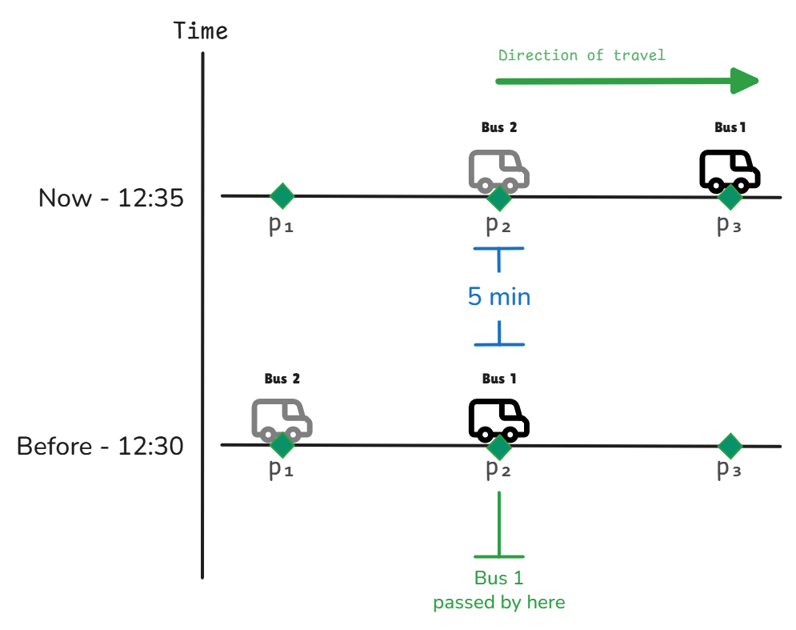
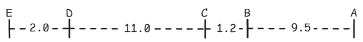
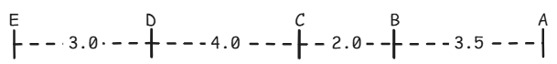
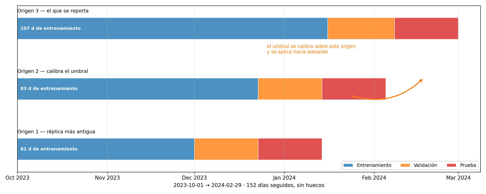
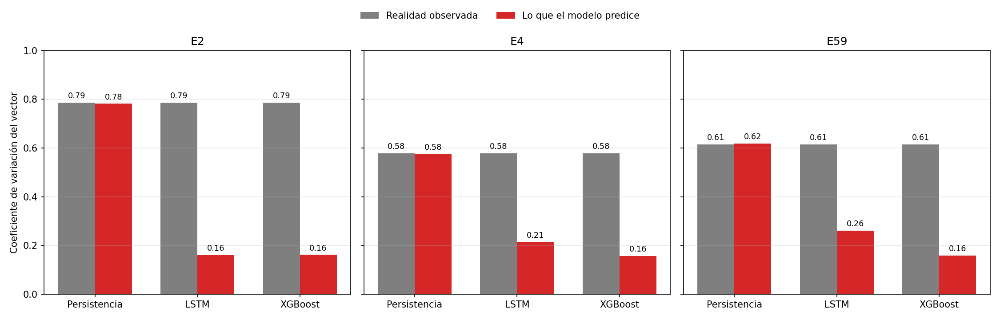
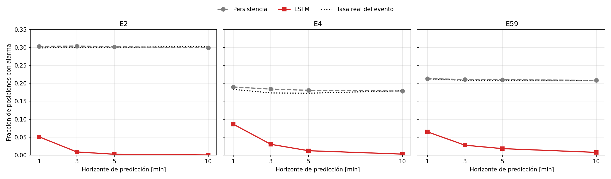
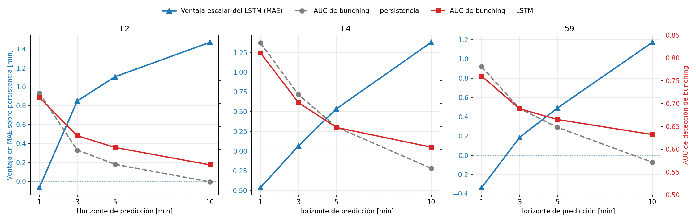

# Compresión de dispersión en la predicción del vector de headways: el punto de operación, y no el modelo, determina la detección de bunching

## Resumen

_(pendiente — se escribe al final)_

---

## I. Introducción

_(pendiente)_

> **AQUÍ VA ESTA CITA — Sun, Schmöcker y Nakamura (2021).** Diagnosticaron que el
> paradigma de predecir y umbralizar falla y que el veredicto se revierte al
> puntuar sin punto de operación. Van en las dos primeras oraciones del
> planteo del problema, para no escribir «nadie se dio cuenta»
> (`esqueleto.md:110`). Hoy esa atribución vive en el primer párrafo de la II-D,
> que se borra cuando esta sección se escriba.

---

## II. Trabajos relacionados

_(A–C pendientes. Cada una carga las atribuciones que hoy están apiladas en el
primer párrafo de la II-D: cuando las tres se escriban, ese párrafo se borra y la
II-D queda solo con la brecha y las tres contribuciones.)_

### A. La receta estándar

_(pendiente — predecir el headway y umbralizarlo contra la referencia.)_

> **AQUÍ VA ESTA CITA — Yu et al. (2016).** La formulación canónica del paradigma
> que este trabajo examina.
>
> **Y AQUÍ VA UNA CITA QUE FALTA — `[CITA_REQUERIDA]`.** El cruce entre la
> persistencia y un método entrenado al alargar el horizonte, ya reportado en
> predicción de tráfico. No está en `fuentes-verificadas.md`: hay que encontrarla
> o retirar la afirmación.

### B. Por qué el umbral se mueve

_(pendiente — la compresión de dispersión y su efecto sobre un corte relativo.)_

> **AQUÍ VAN ESTAS TRES CITAS.**
>
> - **Mayer y Yang (2022)** enuncian la sub-dispersión de la predicción puntual.
> - **Patton y Timmermann (2012)** la demuestran como teorema, y su Corolario 2 da
>   la monotonía en el horizonte. Es la atribución que la Sección III-B ya nombra
>   en prosa y que espera su número.
> - **Petetin et al. (2022)** ataron esa compresión a una métrica categórica y
>   observaron que empeora con el horizonte.

### C. Recalibrar el corte: precedente fuera del transporte

_(pendiente — recalcular el umbral contra la distribución de cada modelo.)_

> **AQUÍ VA ESTA CITA — Hoffmann, Menz y Spekat (2018).** El procedimiento en
> reducción de escala climática, ocho años antes. `esqueleto.md:130` la marca como
> obligatoria.

### D. Delimitación de lo previo y de la contribución

Buena parte del mecanismo que este trabajo mide ya está publicada, y delimitar
qué es previo deja a la vista una contribución más angosta que ese mecanismo
completo. Que una predicción optimizada en error cuadrático resulte menos dispersa
que la realidad está enunciado por Mayer y Yang y demostrado como teorema por
Patton y Timmermann. Nada de eso lo reclamamos. Tampoco reclamamos haber sido los
primeros en atar esa compresión a una métrica categórica ni en observar que
empeora con el horizonte: las dos cosas están en Petetin y colaboradores. Que el
paradigma de predecir y umbralizar falle, y que el veredicto se revierta al
puntuar sin punto de operación, lo diagnosticaron Sun, Schmöcker y Nakamura.
Recalcular un umbral contra la distribución de cada modelo es el procedimiento de
Hoffmann, Menz y Spekat en reducción de escala climática, ocho años antes. El
cruce entre la persistencia y un método entrenado al alargar el horizonte ya se
reporta en predicción de tráfico [CITA_REQUERIDA]. Y el resultado nulo de las
variantes espaciales coincide con trabajo previo [CITA_REQUERIDA]. Llegar segundo a una
conclusión no la vuelve propia.

Reclamamos tres contribuciones más angostas. **Primera**, medimos la compresión
sobre el vector de headways, como dispersión entre buses en un mismo instante;
los precedentes trabajan sobre la variabilidad temporal de una serie escalar, que
no es la misma cantidad. **Segunda**, invertimos la fórmula de calidad de
servicio del *Transit Capacity and Quality of Service Manual* (TCQSM) y la
aplicamos a lo predicho en lugar de a lo observado. **Tercera**, y es la que no
encontramos con precedente dentro ni fuera del transporte, la atamos a una regla
de evento **relativa y auto-referencial**, donde la compresión mueve el numerador
y el denominador a la vez. En Petetin y colaboradores esa pieza no falta por
descuido sino por construcción: sus umbrales son regulatorios y no admiten
recalibración.

---

## III. Método propuesto

Esta sección construye el headway a partir de posiciones GPS, formula la tarea de
predicción sobre el vector de headways y define la regla que convierte ese vector
en un evento de bunching.

### A. Construcción del headway a partir de posiciones GPS

El headway es el tiempo que separa el paso de dos buses consecutivos por un mismo
punto, y la Figura 1 lo ilustra. Es la cantidad que revela si un corredor mantiene
sus buses espaciados o si dos de ellos terminan viajando casi juntos y dejan un
intervalo largo detrás. Ese segundo caso es el evento que define la Sección III-C.
El headway es la variable que predecimos.

La forma habitual de medir el headway es en una parada, con la lista de paradas de
la ruta y los horarios de paso. Ninguna de las dos existe en este caso: el dato
disponible son coordenadas GPS crudas. Para llegar al headway desde esas
coordenadas se aplica la secuencia de seis pasos que sigue.

**1) El eje.** El trazado del corredor se estima de los propios buses: se ajusta
una línea central a las posiciones de las unidades en movimiento y después se
suaviza, lo que entrega una curva principal a lo largo del recorrido.

**2) La proyección a una dimensión.** Con el eje ya trazado, cada posición se
reduce a dos números: cuánto ha avanzado el bus a lo largo del corredor y a qué
distancia quedó del eje. Es la operación que la norma ISO 19148 [1] especifica
para referenciar posiciones contra un objeto unidimensional. La posición se
conserva solo si su desvío lateral no pasa de 300 m; lo que cae más lejos no
pertenece al corredor.

**3) El sentido de marcha.** Sobre ese mismo eje circulan los buses de ida y los
de vuelta, y el dato no distingue unos de otros. El sentido se asigna como el
signo del avance sobre el eje promediado en las últimas cinco posiciones, de modo
que un error aislado no invierta la dirección. La derivación es forzosa: uno de
los corredores no reporta rumbo en absoluto.

**4) Los viajes.** Ya con sentido, el recorrido de cada bus se corta en viajes: un
salto de más de treinta minutos sin señal, una inversión de sentido o una espera
prolongada en terminal cierran el viaje en curso.

**5) La rejilla común.** Los buses no emiten sincronizados entre sí, de modo que
hace falta un instante compartido. Todo se lleva a una rejilla de sesenta
segundos, y así cada minuto queda descrito por una **instantánea** del corredor:
la posición de todos sus buses en ese momento.

**6) El headway.** Sobre esa instantánea, para un par de buses consecutivos en el
mismo sentido —el de adelante $L$, el de atrás $F$— en el instante $T$:

$$t_{c} = \max\{\, t \le T \;:\; s_{L}(t) = s_{F}(T) \,\},
\qquad h = T - t_{c}, \tag{1}$$

donde $T$ es el instante evaluado, y $s_{L}$ y $s_{F}$ son las coordenadas de arco
del bus de adelante y del de atrás. El instante $t_{c}$ es el último en que el de
adelante ocupó la posición que el de atrás ocupa en $T$, y $h$ es el headway
resultante. Es un cruce por posición y no por parada, lo que permite prescindir de
la tabla de paradas. Si no existe tal $t_{c}$, o si $h$ supera los treinta
minutos, se emite «sin dato» en lugar de arrastrar un paso de horas antes.

**Fig. 1.** El headway en un punto fijo del corredor: el bus de adelante —el $L$ de
la Ecuación (1)— pasa por p₂ a las 12:30 y el de atrás —el $F$— a las 12:35, de
modo que el headway en p₂ es de cinco minutos. La separación espacial entre los dos
buses no interviene. Esquema ilustrativo, no datos reales.

La Ecuación (1) se adoptó tras comparar cuatro formulaciones candidatas sobre
siete dimensiones de calidad de señal, y dos decidieron los descartes. El tiempo
entre pasadas por puntos artificiales sembrados a lo largo del eje quedó afuera
por autocorrelación a cinco minutos: 0,167 en E2 y -0,005 en E59, contra 0,313 y
0,603 de la formulación adoptada. El tiempo proyectado hacia adelante —la
separación entre los dos buses dividida por la velocidad del de atrás— quedó
afuera por información mutua entre buses vecinos, 0,226 y 0,326 bits contra 0,358
y 1,256. Arrastra además una debilidad de forma. Dividir por la velocidad actual
supone que esa velocidad se mantiene. Introduce así una estimación dentro de la
cantidad que se busca estimar. La distancia en metros entre buses consecutivos
pasa seis de las siete dimensiones, igual que la adoptada, y quedó afuera por
medir separación espacial y no tiempo entre pasadas.

### B. Formulación de la tarea de predicción

La Sección III-A deja el corredor descrito, minuto a minuto, por un vector de
headways de $N-1$ posiciones, con $N$ el número de buses circulando en ese minuto.
Lo que predecimos es ese vector completo: no un headway suelto ni un
promedio del corredor, sino todas sus posiciones a la vez. Dado el historial de
los últimos $T$ minutos y un contexto de calendario, se busca el vector del
corredor $H$ minutos más adelante:

$$\hat{\mathbf{h}}(t+H) \;=\; f\big(\mathbf{h}(t-T+1), \dots, \mathbf{h}(t);\; c(t)\big),
\qquad T = 12, \tag{2}$$

donde $\mathbf{h}(t)$ es el vector de headways del corredor en el minuto $t$ y
$\hat{\mathbf{h}}(t+H)$ es el vector predicho para $H$ minutos más adelante.
El término $c(t)$ reúne cuatro variables de calendario disponibles en $t$ —el seno
y el coseno de la hora, y el seno y el coseno del día de la semana—, $f$ es el
modelo ajustado y $T$ es la cantidad de minutos de historia que recibe.

Se predice a cuatro horizontes —uno, tres, cinco y diez minutos— con un modelo
ajustado por separado para cada uno: no hay recursión, cada horizonte se predice
de forma directa. El vector no tiene longitud fija, porque $N$ varía minuto a
minuto. El modelo emite entonces una
salida de longitud fija y el error se computa solo sobre las posiciones donde hay
bus. **El objetivo que se minimiza es el error cuadrático**, promediado sobre esas
posiciones válidas:

$$\mathcal{L} \;=\; \frac{1}{|\mathcal{V}|}\sum_{i \in \mathcal{V}}
\big(\hat{h}_i - h_i\big)^{2}, \tag{3}$$

donde $\mathcal{L}$ es la pérdida que el ajuste minimiza, $\mathcal{V}$ es el
conjunto de posiciones del vector con bus asignado en el instante objetivo,
$|\mathcal{V}|$ es su cardinal, y $\hat{h}_i$ y $h_i$ son el valor predicho y el
observado en la posición $i$.

Esa elección gobierna el resto del trabajo. Una predicción que minimiza error
cuadrático tiende a la media condicional, y esa media es menos dispersa que la
realidad. Patton y Timmermann lo demuestran como teorema
[AQUÍ VA EL NÚMERO DE CITA DE PATTON Y TIMMERMANN]. La compresión de
dispersión que documenta la Sección V-B no es entonces una falla del ajuste. El
efecto de esa compresión sobre la regla del evento es el asunto de la
Sección III-C.

### C. Definición del evento de bunching

El bunching es el fenómeno en que dos o más buses que deberían circular espaciados
terminan viajando casi juntos y dejan un intervalo largo detrás de ellos. Su costo
recae sobre quien espera en ese intervalo: la espera que enfrenta es la que el
intervalo mide, y no el headway promedio del corredor. Sus causas son
heterogéneas, entre ellas la congestión, un día de demanda atípica, la acumulación
de pasajeros en el bus adelantado o las restricciones horarias del conductor
[CITA_REQUERIDA]. Este trabajo no observa ninguna de ellas: el registro disponible
trae identificador, instante y coordenada, y no pasajeros, ocupación ni estado del
tránsito. Por eso el evento se define sobre la geometría del vector de headways,
que sí es observable, y no sobre lo que la produjo.

Dos rasgos del fenómeno gobiernan cómo se lo define aquí. Es una propiedad del
patrón colectivo y no de una unidad: cada bus puede estar donde le corresponde y
el corredor estar apelotonado igual. Y se manifiesta en posiciones del vector de
la Sección III-A, de modo que un mismo instante puede llevar varias posiciones
afectadas a la vez.

Resta decidir cuándo un headway cuenta como bunching. La convención del campo es
una fracción del headway programado: un cuarto en las formulaciones más citadas, y
la mitad en el *Transit Capacity and Quality of Service Manual* (TCQSM)
[AQUÍ VA EL NÚMERO DEL TCQSM]. Estos corredores no tienen programación contra la
cual comparar, así que el denominador se sustituye por el promedio del propio
vector en ese instante. **Un headway cuenta como bunching si cae por debajo de la
mitad de ese promedio.** La sustitución del denominador es nuestra y no una
herencia: la fracción de la media observada no aparece como definición de evento
en la literatura consultada. La fracción sí es heredada, y es la del TCQSM. El
promedio del vector cumple la función de la programación: fijar la separación
normal en ese corredor en ese instante. Un corte fijo en minutos no la cumple,
porque no es comparable entre corredores que operan a frecuencias distintas. La
elección del valor tampoco es neutral: los umbrales publicados van desde veinte
segundos hasta un cuarto del headway programado
[AQUÍ VA EL NÚMERO DE REZAZADA], y no existe un único valor aceptado.

El vector de la Sección III-B se escribe por componentes como
$\mathbf{h}(t) = (h_1, \dots, h_m)$. Su promedio y el corte del evento son

$$\bar{h}(t) \;=\; \frac{1}{m}\sum_{j=1}^{m} h_j(t),
\qquad \tau(t) \;=\; \rho\,\bar{h}(t), \qquad \rho = \tfrac{1}{2}, \tag{4}$$

donde $m = N - 1$ es la cantidad de posiciones del vector, $N$ es la cantidad de
buses en circulación y $h_j(t)$ es el headway de la posición $j$. El promedio del
vector es $\bar{h}(t)$, el corte del evento es $\tau(t)$ y $\rho$ es la fracción
que lo fija. La posición $i$ cuenta como bunching cuando cae por debajo de ese
corte:

$$b_i(t) \;=\; \mathbb{1}\!\left[\, h_i(t) < \tau(t) \,\right],
\qquad \text{definido solo si } m \ge 3, \tag{5}$$

donde $b_i(t)$ vale 1 si la posición $i$ cuenta como bunching y 0 si no, y
$\mathbb{1}[\cdot]$ es la función indicadora. La condición $m \ge 3$ descarta los
vectores más cortos y exige al menos cuatro buses en circulación. Por debajo de
tres posiciones no hay patrón que describir. Con dos headways hay un solo
intervalo intermedio, así que cualquier medida de irregularidad se reduce a esa
única diferencia. Con tres ya hay patrón: uno colapsado, uno estirado, uno normal.

El detector que este trabajo evalúa es esa misma regla aplicada al vector predicho
de la Ecuación (2), con el promedio de ese mismo vector fijando el corte:

$$\hat{b}_i(t) \;=\; \mathbb{1}\!\left[\, \hat{h}_i(t) < \rho\,\bar{\hat{h}}(t)
\,\right], \tag{6}$$

donde $\hat{b}_i(t)$ es la detección emitida sobre la posición $i$ del vector
predicho y $\bar{\hat{h}}(t)$ es el promedio de ese mismo vector predicho. El
corte sale del vector predicho y no del observado porque quien opera un corredor
no dispone del observado al momento de decidir.

Como $\tau$ es función del propio vector que se evalúa, y no un número fijo de
minutos, las Ecuaciones (5) y (6) no comparan contra el mismo corte:

$$\tau(\hat{\mathbf{h}}) \;=\; \rho\,\bar{\hat{h}}
\;\neq\; \rho\,\bar{h} \;=\; \tau(\mathbf{h})
\qquad \text{siempre que } \bar{\hat{h}} \neq \bar{h}, \tag{7}$$

donde $\tau(\mathbf{h})$ y $\tau(\hat{\mathbf{h}})$ son los cortes que resultan de
aplicar $\rho$ al vector observado y al vector predicho. Las Figuras 2 y 3 lo
muestran con el mismo headway de dos minutos.

**Fig. 2.** Corredor disparejo. El vector es [9,5 · 1,2 · 11,0 · 2,0], su promedio
5,9 min y el corte 3,0 min. Los headways de 2,0 y 1,2 quedan debajo del corte:
**los dos son bunching.** Esquema ilustrativo, no datos reales.

**Fig. 3.** Corredor parejo. El vector es [3,5 · 2,0 · 4,0 · 3,0], su promedio
3,1 min y el corte 1,6 min. El mismo headway de 2,0 min queda ahora encima del
corte: **no es bunching.** Esquema ilustrativo, no datos reales.

Dos minutos entre buses es el mismo hecho físico en las dos figuras, y la regla lo
clasifica al revés porque el corte se movió con el vector. La Sección V mide qué
ocurre cuando esa diferencia se ignora sobre datos reales.

---

## IV. Diseño experimental

Esta sección describe los datos, los métodos comparados, el protocolo de
partición, las métricas y las pruebas estadísticas con los que se evalúa la
predicción del vector de headways.

### A. Datos

El trabajo usa los registros de posición de la flota del Sistema Integrado de
Transporte de Arequipa. Cada unidad emite su coordenada **cada 20 segundos**, y la
cadencia es regular: la mediana y el percentil 95 del tiempo entre emisiones
coinciden, de modo que el dato no llega a ráfagas. Esa regularidad sostiene la
rejilla de sesenta segundos de la Sección III-A, porque cada minuto reúne tres
emisiones por bus.

Se cubren tres corredores —identificados aquí como E2, E4 y E59, uno por empresa
operadora— durante 152 días seguidos, del 1 de octubre de 2023 al 29 de febrero de
2024, sin huecos de calendario. Son 90 unidades en total. El registro no incluye
horario publicado, archivo GTFS ni tabla de paradas, de modo que el corredor, el
sentido y el headway se construyen desde la posición cruda, como describe la
Sección III-A.

La construcción del headway desde la posición cruda no siempre produce un valor.
Dos condiciones dejan un par de buses sin headway: que la Ecuación (1) no
encuentre el cruce, o que el headway supere los treinta minutos. La cobertura —la
fracción de pares evaluados con headway válido— es del 63,5 % en E2, del 64,8 % en
E4 y del 77,1 % en E59: 3 938 174 pares en total. Una posición del vector sin
headway válido se enmascara.

Los huecos que deja ese enmascaramiento no se distribuyen al azar. Ninguna de las
dos condiciones es neutral: ambas recortan por el extremo alto de la distribución,
de modo que los descartados son los intervalos más largos. La cobertura tampoco es
pareja entre corredores: entre el mejor y el peor medido hay 13,6 puntos
porcentuales.

### B. Métodos comparados

Se comparan cuatro métodos sobre las mismas muestras, y cada uno cumple un papel
distinto. El método bajo estudio es una red recurrente con memoria de largo y corto
plazo (**LSTM**). Un conjunto de árboles con refuerzo de gradiente (**XGBoost**)
actúa como **control de arquitectura**: si reproduce el patrón del LSTM, ese patrón
no proviene del aprendizaje profundo sino del objetivo de la Ecuación (3). Los dos
restantes no ajustan parámetros y fijan el error de referencia. La **persistencia**
repite el último vector observado, así que su error crece con el horizonte. El
**promedio histórico por franja horaria** responde con el valor típico de esa hora
del día, calculado sobre entrenamiento por corredor y sentido; no lee la ventana de
entrada, de modo que su error no depende del horizonte.

Otros cinco métodos se evaluaron y quedaron fuera. Ninguno de los tres
estadísticos —la media del período de entrenamiento, la media móvil causal en tres
ventanas y el suavizado exponencial simple de factor 0,3— combina las dos entradas
de la Ecuación (2), el historial reciente y el calendario. Los tres repiten
información que la persistencia o el promedio histórico ya aportan. Los otros dos
modelan la relación entre posiciones vecinas del vector, con una convolución sobre
el eje de los buses (**SpatialConvLSTM**) y con atención entre posiciones
(**SpatialTransformer**). Una evaluación preliminar no encontró ganancia en su
componente espacial. Los cinco descartes se decidieron sobre esa evaluación y no se
rehicieron sobre las muestras definitivas.

De los cuatro métodos retenidos, solo el LSTM y el XGBoost ajustan parámetros.
Ambos se ajustan por corredor y por horizonte, y cada par de corredor y horizonte
se denomina aquí **celda**: hay doce. Los dos sentidos comparten el modelo de su
corredor y entran juntos al entrenamiento. Lo que se separa por sentido son los
estadísticos de estandarización, de modo que lo predicho se devuelve a minutos con
los del sentido que le corresponde. El LSTM usa 32 unidades ocultas, una o dos
capas según la celda, paso 5 × 10⁻⁴, lotes de 128 y semilla fija en 42. El XGBoost
usa hasta 400 rondas con corte tras 30 y la misma semilla. Los presupuestos de
búsqueda no son iguales: el XGBoost eligió veinticuatro configuraciones por celda
sobre las muestras definitivas, mientras que el LSTM heredó la suya de la
evaluación preliminar en dos de los tres corredores. La Sección VI acota qué
afirmaciones no se sostienen con esa diferencia.

### C. Protocolo de evaluación

La partición es **por fecha y nunca al azar**, porque un operador solo dispone del
pasado. El período se divide en 107 días de entrenamiento, 23 de validación y 22
de prueba. Todo el protocolo se repite después sobre tres orígenes de evaluación,
identificados aquí como ventanas 1, 2 y 3. Los tres arrancan el mismo día y
alargan el entrenamiento a 61, 83 y 107 días. Sus períodos de prueba no se solapan
entre sí, y el de la ventana 3 es el que se publica. Como los entrenamientos están
anidados, esto establece estabilidad frente a la elección del período de prueba y
no réplica independiente. La Figura 4 muestra el esquema.

**Fig. 4.** La partición por tiempo y los tres orígenes de evaluación. Los tres
arrancan el mismo día y alargan el entrenamiento; sus períodos de prueba no se
solapan.

La comparación exige además tres condiciones, cada una sobre una fuente distinta
de fuga: el tiempo, la población evaluada y los valores extremos.

- **Continuidad estricta.** Una muestra es válida solo si sus minutos son
  consecutivos. La regla evita que la ventana atraviese un hueco de señal. Sin
  ella, el horizonte mediría un intervalo mayor que el declarado. Retiene entre el
  81,9 % y el 90,2 % de las instantáneas.
- **Población compartida.** Los cuatro métodos se puntúan sobre exactamente las
  mismas filas. El trabajo de entrenamiento recalcula la lista de muestras, compara
  su resumen SHA-256 contra el registrado y aborta antes de usar la GPU si no
  coincide. La verificación evita comparar métodos puntuados sobre poblaciones
  distintas.
- **Tope al percentil 99.** El umbral es el percentil 99 del headway de
  entrenamiento y se aplica como techo a las tres particiones. Calcularlo por
  partición dejaría entrar información del período de prueba. Las posiciones sin
  headway válido siguen enmascaradas. El techo afecta entre el 0,78 % y el 1,11 %
  de los objetivos.

Sobre esa misma población, los resultados se desglosan además por régimen de
dispersión. La dispersión de una muestra es la desviación estándar de los headways
observados en su ventana de entrada, en minutos. Cada combinación de corredor y
horizonte se parte en tercios con los percentiles 33 y 66 de esa cantidad, fijados
sobre entrenamiento y validación y aplicados sin cambios a prueba. Calibrarlos
sobre prueba dejaría que la estratificación conociera el período que evalúa.

### D. Métricas

El modelo entrega un vector de headways que la regla de la Sección III-C convierte
en un indicador binario de bunching, y la evaluación mide esos dos objetos en
cadena. El error del vector es el error absoluto medio (MAE) sobre las posiciones
válidas que define la Ecuación (3):

$$\mathrm{MAE} \;=\; \frac{1}{|\mathcal{V}|}\sum_{i \in \mathcal{V}}
\big|\hat{h}_i - h_i\big|, \tag{8}$$

donde $\mathcal{V}$, $|\mathcal{V}|$, $\hat{h}_i$ y $h_i$ conservan el
significado de la Ecuación (3). Se reporta el MAE y no el error cuadrático porque
expresa el resultado en minutos de headway.

El MAE no describe la forma del vector. El coeficiente de variación (CV) es su
desviación estándar muestral dividida por su promedio:

$$\mathrm{CV}(\mathbf{h}) \;=\; \frac{1}{\bar{h}}
\sqrt{\frac{1}{m-1}\sum_{j=1}^{m}\big(h_j - \bar{h}\big)^{2}}, \tag{9}$$

donde $m$, $h_j$ y $\bar{h}$ conservan el significado de la Ecuación (4). Se
calcula sobre los vectores de tres posiciones o más que exige la Ecuación (5). Se
reporta porque es adimensional, de modo que corredores de frecuencias distintas
quedan sobre la misma escala. Su sesgo es el CV de lo predicho menos el de lo
observado, y un valor negativo dice que lo predicho es más regular que la realidad.

El indicador derivado se puntúa con tres cantidades, ordenadas por cuánto dependen
del umbral, sobre el cruce entre el indicador observado de la Ecuación (5) y el
detector de la Ecuación (6). Sean TP las posiciones con $b_i = \hat{b}_i = 1$, FP
las que tienen $\hat{b}_i = 1$ y $b_i = 0$, FN las que tienen $b_i = 1$ y
$\hat{b}_i = 0$, y TN las restantes. La precisión, el recall y el F1 son entonces

$$\mathrm{F}_1 \;=\; \frac{2PR}{P+R}, \qquad
P \;=\; \frac{\mathrm{TP}}{\mathrm{TP}+\mathrm{FP}}, \qquad
R \;=\; \frac{\mathrm{TP}}{\mathrm{TP}+\mathrm{FN}}, \tag{10}$$

donde $P$ es la precisión y $R$ el recall.

El F1 no usa TN, y premia por eso al detector que marca toda posición como evento.
La tasa base de una celda es la fracción de sus posiciones donde el indicador
observado vale 1. Ese detector alcanza recall 1 y precisión igual a la tasa base,
así que su F1 queda fijado por ella y acompaña como piso a todo F1 reportado. El
coeficiente de correlación de Matthews (MCC) usa los cuatro conteos. Para ese
detector su cociente queda indeterminado, porque numerador y denominador se anulan
a la vez, y se le asigna cero por extensión por continuidad. El área bajo la curva
ROC (AUC) prescinde del punto de operación y puntúa el ordenamiento del puntaje
continuo $-\hat{h}_i/\bar{\hat{h}}$, del cual la Ecuación (6) es el corte en
$-\rho$. Es la probabilidad de que una posición de bunching reciba un puntaje
mayor que una sin bunching, y vale 0,5 cuando el pronóstico no ordena.

Sobre esas cantidades se construyen tres cocientes. La tasa de disparo de un
método es la fracción de posiciones que marca como evento. El factor entre dos
métodos es el cociente de sus F1, y mide cuántas veces mejor aparece uno de ellos
bajo el mismo corte. El lift es la precisión dividida por la tasa base, de modo
que expresa cuántas veces más informativa que el azar resulta una marca.

El umbral no se hereda de lo observado. Se ajusta maximizando el MCC sobre el
período de prueba de la ventana 2 y se aplica sin cambios al de la ventana 3. Los
dos períodos son disjuntos y provienen de modelos entrenados por separado, de modo
que el período publicado no informa su propio umbral.

### E. Pruebas estadísticas

Una diferencia de MAE entre dos métodos puede ser ruido del período de prueba. Se
contrasta con la prueba de Diebold–Mariano [2] sobre el diferencial de pérdida por
muestra, con la corrección de muestra pequeña de Harvey–Leybourne–Newbold [3]. La
varianza se estima agrupando por día de servicio, porque las
muestras de un mismo día comparten clima, incidentes y demanda. El agrupamiento
lleva el tamaño efectivo de muestra de decenas de miles de filas a los 22 días del
período de prueba.

La precisión de la Ecuación (10) admite su propia acotación, porque puede
descansar sobre muy pocas posiciones marcadas. Se acota con el intervalo exacto de
Clopper–Pearson [CITA_REQUERIDA] al 95 %, calculado sobre los conteos de TP y de
FP de cada celda. Se prefiere el intervalo exacto a la aproximación normal. Los
conteos que necesitan acotarse aquí son los pequeños, y en ellos la aproximación
deja parte de su intervalo fuera del rango válido de una proporción. Una celda
donde el detector nunca marca no recibe intervalo: no hay precisión que acotar.

---

## V. Resultados y discusión

Esta sección reporta el error escalar del vector y la frontera de régimen que lo
acota. Mide después la dispersión transversal de lo predicho, la detección con el
corte del evento observado y el factor de degradación entre las tres ventanas.
Cierra con el punto de operación recalibrado, los ensayos de robustez frente a la
ventana y a la definición del evento, y las implicaciones operativas.

### A. Error escalar y su frontera de régimen

A diez minutos de anticipación, el LSTM predijo el headway entre buses
mejor que la persistencia. El error absoluto medio bajó 1,47 minutos en E2, 1,38
en E4 y 1,17 en E59: entre 21 % y 22 % en los tres corredores. A un minuto la
relación se invirtió y la persistencia ganó, por 0,46 minutos en E4 y 0,33 en E59.
En E2 la diferencia fue de 0,07 minutos y no resistió la prueba estadística al
agrupar las observaciones por día de servicio.

Tres precisiones acotan ese resultado. La primera es que el cruce no es una
propiedad del aprendizaje profundo: el XGBoost lo reprodujo entero, y a
diez minutos aventajó a la persistencia por 1,59 minutos en E2, 1,09 en E4 y 0,79
en E59. La segunda es que la frontera real no es el horizonte sino la dispersión
de la ventana de entrada. Medida con los tercios de dispersión de la
Sección IV-C, la ventaja del LSTM creció de forma ordenada del tercio calmo al
volátil en 11 de las 12 celdas.
Alargar el horizonte no cambió quién ganaba: movió la ventaja hacia tercios cada
vez más tranquilos.

La tercera es que el promedio histórico por franja horaria cumplió el papel que la
Sección IV-B le asignaba. Su error no se movió con el horizonte: se quedó entre
4,7 y 5,7 minutos en los tres corredores. La ventaja del LSTM sobre él se
estrechó entonces a medida que el horizonte crecía. En E2 el LSTM le ganó por
0,99 minutos a un horizonte de un minuto y le perdió por 0,07 a diez. Esa fue la
única
de las doce celdas donde el promedio histórico ganó, y es la razón de que a
horizonte largo el competidor exigente sea él y no la persistencia.

### B. Compresión de la dispersión transversal

El error escalar de la Sección V-A no dice nada sobre la forma del vector. El
coeficiente de variación de la Ecuación (9) sí. Medido sobre lo observado, fue de
0,79 en E2. Medido sobre lo que el modelo predijo para el mismo instante y el mismo
corredor a diez minutos, fue de
0,16. El vector predicho describió un corredor casi cinco veces más regular que el real.

Esa brecha no fue un caso aislado. El sesgo del coeficiente de variación resultó
negativo —lo predicho siempre más regular que la realidad— en
**las doce celdas y las tres ventanas de prueba**. Y se profundizó de forma estrictamente
ordenada a medida que se alarga el horizonte: en E2 pasó de −0,42 a un minuto a
−0,63 a diez. No hubo una sola excepción en los tres corredores.

Dos comparaciones acotan de qué depende el efecto. La primera identifica la causa
por descarte: la persistencia no comprimió nada. Su sesgo se mantuvo dentro de
±0,022 en las doce celdas y las tres ventanas, porque propaga el vector observado y
hereda su dispersión sin traducción. Es el control del experimento, y sitúa el
efecto en el acto de **emitir una predicción puntual**, no en los datos ni en el
corredor. La segunda
descarta la arquitectura: el XGBoost comprimió igual que la red en E2, y
las dos curvas se superponen. En los otros dos corredores comprimió **más** que
ella, con un sesgo de −0,46 contra −0,35 en E59 a diez minutos. Un fenómeno que
aparece
igual en una red recurrente y en un conjunto de árboles no es una propiedad de
ninguna de las dos.

La consecuencia práctica se aprecia al leer esas cifras contra la escala de nivel
de servicio del TCQSM [AQUÍ VA EL NÚMERO DEL TCQSM]. El manual indexa sus bandas
por la dispersión del headway respecto del programado. Estos corredores no tienen
programación, así que la escala se lee con el coeficiente de variación de la
Ecuación (9). Con esa sustitución, el mismo corredor en el mismo instante calificó
como nivel A —«service provided like clockwork»— según lo predicho y como nivel F
—«most vehicles bunched»— según lo observado. La cantidad que estas medidas
capturan es la dispersión **entre buses en un mismo instante**, y no la
variabilidad de una serie a lo largo del tiempo que la Sección II-D delimita como
previa. Las Figuras 5 y 6 muestran el efecto y su dependencia del horizonte.

**Fig. 5.** Dispersión observada frente a dispersión predicha, horizonte de diez
minutos. La barra de la persistencia iguala a la observada: hereda el vector real
y sirve de control. Los dos modelos ajustados la comprimen.

**Fig. 6.** El mismo sesgo contra el horizonte. La persistencia no se despega de
cero; los dos modelos ajustados descienden de forma monótona. La compresión escala con la
distancia que se pide anticipar.

### C. Colapso de la detección al trasladar el umbral

La regla de la Sección III-C, aplicada a lo observado, marcó 15 245 eventos en E2
a diez minutos. Aplicada a lo predicho por el LSTM, con el mismo corte,
se disparó **catorce veces**. La persistencia disparó 15 083 veces. Puntuada con
el F1 de la Sección IV-D, la persistencia apareció 253 veces mejor que el LSTM. En
las otras celdas el factor va de 1,5 a 36. El XGBoost obtuvo un F1
exactamente cero en tres de las doce celdas: ahí no disparó nunca. La Tabla 1
recoge las doce celdas.

Leído sin más contexto, ese resultado dice que el LSTM es incapaz de ver el
fenómeno que se le pidió anticipar. Hay tres motivos para desconfiar de esa
lectura. El primero es que el ganador declarado tampoco detectó bien. El detector
trivial de la Sección IV-D superó a la
persistencia en 5 de las doce celdas, y en 15 de las 36 combinaciones de celda y
ventana. Un procedimiento de evaluación en el que una regla vacía vence al
ganador declarado no ordena modelos.

El segundo es el mecanismo de la Sección V-B. El corte se mide contra el promedio
del propio vector evaluado. Si el vector predicho es más regular que la realidad, sus
headways se apartan menos de su propio promedio, y el corte deja de alcanzarse
casi siempre. Lo que la regla registra no es que el modelo no vea el evento: es
que el modelo no produce la dispersión necesaria para cruzar un umbral calibrado
sobre otra distribución.

El tercero es el acierto del modelo en las pocas ocasiones en que disparó. De
los catorce disparos de E2, diez correspondieron a eventos de bunching reales: 71 %
de precisión contra una tasa base de 30 %. El intervalo de la Sección IV-E va de
42 % a 92 % sobre esos catorce disparos, de modo que la cifra señala un régimen y
no un valor. Las celdas con más disparos lo estrechan. A diez minutos el modelo
acertó 776 de 1 572 disparos en E59, con precisión entre 47 % y 52 % contra una
tasa base de 21 %. En E4 acertó 75 de 150, entre 42 % y 58 % contra 18 %. Una
medida que castiga por igual al que no marca y al que marca mal no distingue esos
dos casos.

**Fig. 7.** Fracción de posiciones que cada método marca como bunching, contra la tasa
real del evento (punteada). La persistencia propaga el vector observado, hereda su
dispersión y el corte cae donde fue diseñado: marca casi tan seguido como el
evento ocurre. La predicción puntual es un vector comprimido, y el mismo corte
relativo le queda en la cola.

**Tabla 1.** Detección con el corte del evento observado aplicado sin cambios a lo predicho, con el piso del detector trivial al lado.

| Corredor | h | Tasa base | Piso trivial | F1 persistencia | F1 LSTM | Factor |
| :--- | ---: | ---: | ---: | ---: | ---: | ---: |
| E2 | 1 | 0,299 | 0,460 | 0,581 | 0,207 | 2,8× |
| E2 | 3 | 0,301 | 0,462 | 0,414&nbsp;† | 0,038 | 11× |
| E2 | 5 | 0,300 | 0,462 | 0,375&nbsp;† | 0,011 | 36× |
| E2 | 10 | 0,303 | 0,465 | 0,332&nbsp;† | 0,001 | 253× |
| E4 | 1 | 0,183 | 0,310 | 0,686 | 0,466 | 1,5× |
| E4 | 3 | 0,173 | 0,295 | 0,486 | 0,177 | 2,7× |
| E4 | 5 | 0,172 | 0,294 | 0,381 | 0,066 | 5,8× |
| E4 | 10 | 0,179 | 0,304 | 0,268&nbsp;† | 0,015 | 18× |
| E59 | 1 | 0,212 | 0,350 | 0,620 | 0,308 | 2,0× |
| E59 | 3 | 0,209 | 0,345 | 0,469 | 0,130 | 3,6× |
| E59 | 5 | 0,208 | 0,344 | 0,405 | 0,083 | 4,9× |
| E59 | 10 | 0,208 | 0,344 | 0,303&nbsp;† | 0,034 | 8,8× |

† La regla vacía —marcar toda posición— supera al ganador declarado en estas celdas.

### D. Inestabilidad del factor de degradación entre ventanas

Si el factor de 253 de la Sección V-C midiera una capacidad del modelo, debería
ser aproximadamente estable al cambiar la ventana de prueba. No lo es. En la misma
celda —E2, diez minutos, el mismo modelo, la misma regla— el factor valió **2 299**
en la primera ventana, **817** en la segunda y **253** en la tercera. En E2 a cinco
minutos va de 126 a 58 a 36. La magnitud del supuesto fracaso cambia un orden de
magnitud según en qué mes se lo mida.

Ninguna propiedad de un modelo se comporta así. Un número que se mueve un orden de
magnitud entre ventanas contiguas está midiendo la interacción entre el corte y la
distribución sobre la que cayó, no una capacidad del sistema evaluado. Esta es la
observación central del trabajo, y no depende de qué modelo se use ni de qué datos:
depende de que el corte se haya trasladado entre dos distribuciones con dispersión
distinta.

### E. Recalibración del punto de operación

Si el problema es el punto de operación, recalibrarlo debería bastar. Se aplicó
entonces la recalibración de la Sección IV-D, sin tocar el modelo. Elegir el MCC y
no el F1 como objetivo no es una preferencia: en este corpus el F1 degenera. Sobre
la persistencia en E2, de tres minutos en adelante, el corte que optimiza el F1
disparó entre el 99,9 % y el 100 % de las veces. Es decir, reencuentra la regla
vacía.

Con el corte recalibrado, el veredicto se invirtió. Puntuado sin umbral, mediante
el AUC, **el LSTM ganó en las nueve
combinaciones de corredor y ventana a diez minutos**, y en 6 de 12 celdas en la
ventana 3. La persistencia conservó la ventaja en el horizonte de un
minuto, donde también ganaba el error escalar. La Tabla 2 reúne los dos
instrumentos.

Esa coincidencia es el resultado, y merece decirse aparte. Puestos en el mismo
eje, el cruce del error escalar y el cruce de la detección van en el mismo sentido
y ocurren en la misma zona de horizontes. Las dos métricas —una continua, la otra
categórica— coinciden en quién gana y desde dónde. La disociación que las
Secciones V-A y V-C parecían mostrar, con el LSTM ganando en error y perdiendo
en detección, no existía: la producía el umbral.

Frente a una falla de detección, la respuesta habitual del campo es cambiar de
modelo: otra arquitectura, más capas, más datos. Ninguna de esas cosas hizo falta.
Las predicciones que puntúa la Figura 8 son, una por una, las mismas que puntúa la
Figura 7. No se reentrenó, no se agregó información y no se modificó el modelo. Se
movió un solo número —dónde se traza el límite entre alarma y silencio— y el
ganador cambió de lado.

De ahí salen las dos consecuencias del trabajo. Para quien evalúa: como ninguna
otra cosa varió, ninguna otra cosa puede explicar la inversión, y el corte queda
identificado como la variable que producía el veredicto. Para quien opera:
reparar esto no cuesta una GPU ni un rediseño, sino recalibrar un umbral con datos
que ya se tienen.

**Fig. 8.** Las mismas predicciones puntuadas sin umbral. Eje izquierdo: cuánto
error absoluto le gana el LSTM a la persistencia. Eje derecho: área bajo la
curva de detección, invariante a cualquier reescalado monótono de lo predicho y
por lo tanto inmune al artefacto. Los dos cruces van en el mismo sentido y en la
misma zona, y ninguna serie se acerca al azar.

**Tabla 2.** Veredicto sin umbral y con el corte recalibrado fuera de muestra.

| Corredor | h | AUC LSTM | AUC persist. | MCC recal. LSTM | MCC recal. persist. | Gana AUC |
| :--- | ---: | ---: | ---: | ---: | ---: | :--- |
| E2 | 1 | 0,714 | **0,723** | 0,310 | **0,401** | persistencia |
| E2 | 3 | **0,629** | 0,598 | **0,178** | 0,160 | LSTM |
| E2 | 5 | **0,604** | 0,567 | **0,139** | 0,102 | LSTM |
| E2 | 10 | **0,565** | 0,528 | **0,085** | 0,027 | LSTM |
| E4 | 1 | 0,811 | **0,833** | 0,476 | **0,615** | persistencia |
| E4 | 3 | 0,702 | **0,719** | 0,269 | **0,375** | persistencia |
| E4 | 5 | 0,648 | **0,649** | 0,190 | **0,254** | persistencia |
| E4 | 10 | **0,604** | 0,558 | **0,126** | 0,111 | LSTM |
| E59 | 1 | 0,760 | **0,781** | 0,363 | **0,517** | persistencia |
| E59 | 3 | 0,688 | **0,689** | 0,237 | **0,328** | persistencia |
| E59 | 5 | **0,665** | 0,648 | 0,205 | **0,249** | LSTM |
| E59 | 10 | **0,632** | 0,571 | **0,161** | 0,119 | LSTM |

### F. Robustez frente a la ventana y a la definición del evento

El hallazgo no depende del mes: las tres ventanas temporales coincidieron en el
veredicto sin umbral en 11 de 12 celdas, y a diez minutos coincidieron en las nueve.
Tampoco depende de la definición del evento adoptada aquí, y la objeción conviene
enfrentarla de frente. El corte relativo a la media del propio vector es una
elección de este trabajo. Un corte absoluto en minutos, como el que usa la mayor
parte de la literatura, podría disolver el efecto. Se probó con la convención
dominante del campo: un corte fijo en la cuarta parte del headway mediano
observado de cada corredor y dirección. Queda entre 1,4 y 2,4 minutos, se calibró
sobre la ventana 2 y se aplicó sin cambios a la ventana 3. **No se atenuó:
empeoró.** La tasa de disparo del modelo cayó por un factor de mediana 138 en diez
de las doce celdas, y en las otras dos no marcó ninguna posición. La elección
adoptada resultó ser la conservadora.

Ese mismo ensayo impone un límite que corresponde declarar. Bajo esa convención
más exigente, la capacidad de discriminación del modelo cayó: la mediana del área
bajo la curva bajó a 0,60, y en E2 a diez minutos llegó a 0,49, indistinguible del
azar. La afirmación de que el LSTM no es ciego se sostiene para el evento
definido en términos relativos y falla para el evento absoluto en esa celda. La
Tabla 3 recoge las tres ventanas y el ensayo con el umbral absoluto.

**Tabla 3.** Robustez: las tres ventanas temporales y el ensayo con el umbral
absoluto de la convención dominante.

| Corredor | h | Ventana 1 | Ventana 2 | Ventana 3 | Coinciden | AUC, corte absoluto |
| :--- | ---: | :--- | :--- | :--- | :---: | ---: |
| E2 | 1 | persist. | persist. | persist. | sí | 0,645 |
| E2 | 3 | LSTM | LSTM | LSTM | sí | 0,582 |
| E2 | 5 | LSTM | LSTM | LSTM | sí | 0,550 |
| E2 | 10 | LSTM | LSTM | LSTM | sí | 0,493&nbsp;‡ |
| E4 | 1 | persist. | persist. | persist. | sí | 0,728 |
| E4 | 3 | persist. | persist. | persist. | sí | 0,576 |
| E4 | 5 | persist. | LSTM | persist. | **no** | 0,566 |
| E4 | 10 | LSTM | LSTM | LSTM | sí | 0,551 |
| E59 | 1 | persist. | persist. | persist. | sí | 0,731 |
| E59 | 3 | persist. | persist. | persist. | sí | 0,654 |
| E59 | 5 | LSTM | LSTM | LSTM | sí | 0,637 |
| E59 | 10 | LSTM | LSTM | LSTM | sí | 0,616 |

‡ Indistinguible del azar. Es el único punto donde la afirmación no se sostiene bajo la convención del campo, y se declara como tal.

### G. Implicaciones operativas

El resultado operativo no es que el modelo detecte mejor. Es que **el modelo marca
poco y acierta cuando marca**, y esas son dos propiedades distintas que la métrica
habitual suma en un solo número. Con el corte trasladado, el LSTM marcó 14 de
las 50 353 posiciones de E2 a diez minutos y acertó el 71 % de las veces que marcó,
contra una tasa base del 30 %. En E59 marcó más y acertó la mitad, contra un
21 % de base. En los tres corredores la señal, cuando apareció, fue entre dos y
tres veces más informativa que el azar.

Eso no es una alarma y no conviene presentarlo como tal. Una alarma tiene que
sonar cuando ocurre el evento, y ésta se queda callada la mayoría de las veces. Lo
que sí constituye es un **filtro de prioridad**: un aviso poco frecuente pero más
informativo que el azar, útil para ordenar la atención de un despachador que
vigila tres corredores y no puede mirar todo a la vez. Y hay una consecuencia
inmediata para cualquiera que hoy esté evaluando una predicción de este tipo. **El
punto de operación se recalibra contra la distribución de lo predicho, no
se hereda de las observaciones.** Requiere recalcular un escalar y no reentrenar
nada.

---

## VI. Amenazas a la validez

Esta sección enuncia el alcance de cada afirmación y los puntos donde no se
sostiene.

**El hallazgo del umbral vale para el evento relativo.** Bajo un corte absoluto en
minutos —la convención dominante— el efecto se agrava, pero la capacidad de
discriminación del LSTM cae, y en E2 a diez minutos llega a 0,49: azar. Ahí la
afirmación de que el LSTM no es ciego no se sostiene.

**Las dos formas de puntuar la detección coinciden en once de doce celdas.** La
excepción es E59 a cinco minutos, donde el LSTM gana el área bajo la curva y
pierde la correlación recalibrada. Ordenar bien y operar bien en un punto fijo son
capacidades distintas, y esa celda las separa.

**El eje escalar tiene un competidor que le gana en una celda.** Frente al
promedio histórico por franja horaria, el LSTM gana en once de doce; pierde en
E2 a diez minutos por 0,07 minutos. Es cuatro segundos y está en el eje que este
trabajo reporta como contexto, pero el número existe y se declara.

**La comparación entre los dos modelos ajustados no está nivelada.** Como se dijo
en la Sección IV-B, el XGBoost recibió veinticuatro configuraciones por celda y el
LSTM una sola en dos corredores. Donde el LSTM pierde, la causa no es atribuible a
la clase de modelo.

**El umbral del evento no está calibrado contra incidentes registrados.** Se
eligió por analogía con la convención del campo, no contra un registro operativo
de eventos de bunching. Validarlo así exige un dato que estos corredores no
producen.

**La dispersión se mide sobre vectores cortos.** Un corredor queda descrito por
entre 3,8 y 5,9 headways por minuto, así que la dispersión transversal es un
estadístico de pocas observaciones. El corte del evento se compara además contra
un promedio que incluye al propio elemento evaluado. El efecto es el mismo en los
tres corredores y en las tres ventanas, lo que hace poco probable que lo produzca
la longitud del vector. Cada cifra individual es menos estable en E4 y en E2, que
tienen el vector más corto, que en E59.

**La evidencia es de tres corredores de una ciudad y cinco meses**, y el período de
prueba contiene los días de Carnaval, cuya composición no se caracterizó. Los tres
orígenes comparten día de inicio, de modo que establecen estabilidad frente a la
elección del período de prueba y no réplica independiente.

**Lo que este trabajo no afirma** es que estos modelos estén listos para operar una
alarma de bunching. Un área bajo la curva de 0,60 es información real y está muy
lejos de un sistema de despacho. Ninguna función de costo liga aquí un error de
1,47 minutos, ni un área de 0,60, a una decisión de intervención concreta. Cerrar
esa distancia es trabajo por hacer, no resultado logrado.

---

## VII. Conclusión

_(pendiente)_

---

## VIII. Declaraciones

_(pendiente — disponibilidad de datos y código)_

---

## Referencias

_(lista en construcción: solo las fuentes ya verificadas en
`fuentes-verificadas.md` y ya llamadas desde el texto. La numeración es por orden
de primera aparición, así que incorporar las fuentes que las Secciones II-D y V
nombran en prosa —todas anteriores a la III-A— renumerará estas tres y obligará a
corregir sus llamadas.)_

[1] Geographic information — Linear referencing, ISO 19148:2021, 2nd ed.,
International Organization for Standardization, Geneva, Switzerland, 2021.

[2] F. X. Diebold and R. S. Mariano, "Comparing Predictive Accuracy,"
*Journal of Business & Economic Statistics*, vol. 13, no. 3, pp. 253–263, 1995,
doi: 10.1080/07350015.1995.10524599.

[3] D. Harvey, S. Leybourne, and P. Newbold, "Testing the equality of prediction
mean squared errors," *International Journal of Forecasting*, vol. 13, no. 2,
pp. 281–291, 1997, doi: 10.1016/S0169-2070(96)00719-4.
