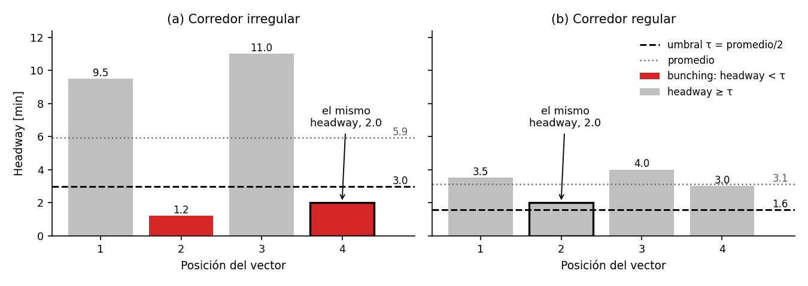
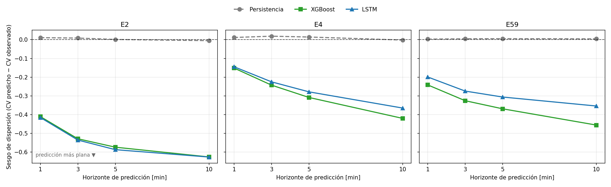
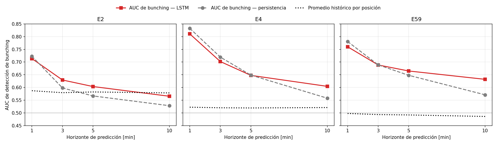
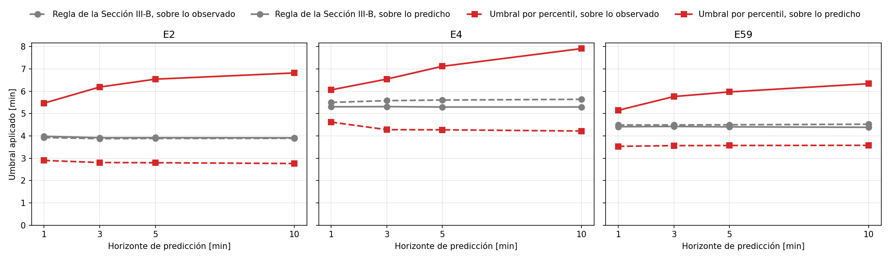
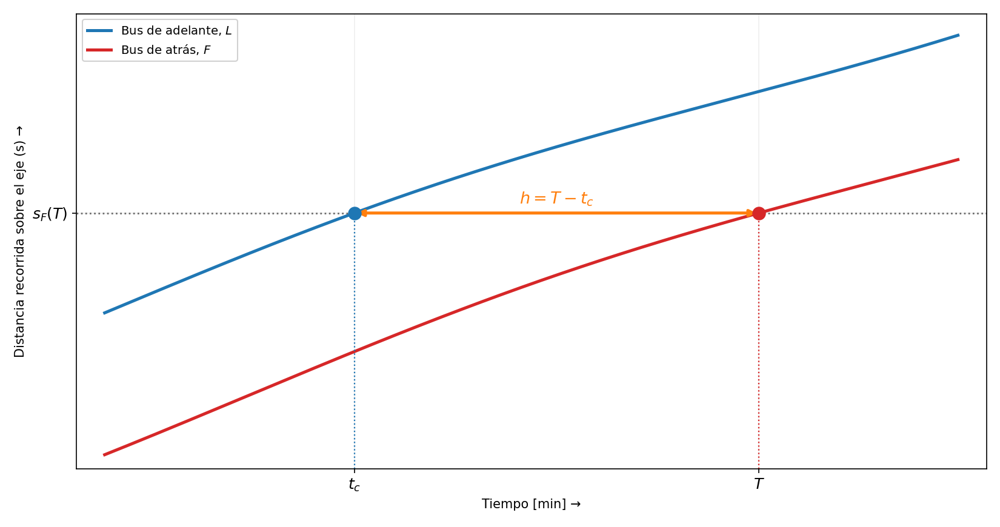

# _(título pendiente)_

## Resumen

_(pendiente — se escribe al final)_

---

## I. Introducción

El headway es el tiempo que separa el paso de dos buses consecutivos por un
mismo punto de una ruta. El bunching es la circulación conjunta de dos buses que
ese tiempo debería mantener separados, y desiguala la espera entre los pasajeros
de esa ruta. Trompet, Liu y Graham comparan doce empresas de bus urbano, y las
que publican un indicador de servicio lo definen sobre la regularidad agregada
del recorrido y no sobre un headway aislado [@trompet2011].

La predicción de ese evento sigue un procedimiento de dos etapas: primero se
estima el headway futuro, y después se lo compara contra un umbral que decide si
hay evento [@yu2016] [@jiao2023]. Su segunda etapa no tiene un valor acordado:
los umbrales publicados van desde veinte segundos hasta un cuarto del headway
programado [@rezazada2024].

Ese procedimiento deja dos huecos. Usama y Koutsopoulos predicen el vector
completo de headways de una línea de metro con una red profunda, y reportan solo
el error en minutos, sin convertir lo predicho en un indicador de evento
[@usama2025]. Sun, Schmöcker y Nakamura sí llegan a la detección, y dejan
pendiente construir la curva que compararía a los métodos basados en headway sin
fijar un umbral [@sun2021]. Queda sin medir qué le hace el error de la primera
etapa a la decisión de la segunda.

La primera etapa introduce el defecto que la segunda hereda. Un modelo entrenado
con error cuadrático medio, cuando no sabe si un headway será corto o largo,
predice un valor intermedio, porque así su error promedio es menor
[@gneiting2011]. Por eso los headways que predice para un mismo instante se
parecen entre sí más que los reales: la predicción queda **subdispersa**
(*underdispersion*), con menos dispersión que lo observado [@mayer2023]. El
bunching es justamente un headway mucho más corto que los demás, y una
predicción subdispersa casi no los contiene. Si el umbral que marca bunching en
los datos reales se aplica sin cambios a lo predicho, casi ninguna posición
queda por debajo de él, y el detector deja de avisar aunque el error en minutos
mejore. Ocurre aunque el umbral sea relativo, una fracción del promedio del
propio vector predicho (Sección III-B).

Este trabajo mide ese efecto y separa lo que aporta el modelo de lo que aporta
el umbral. Predice el vector completo de headways de un corredor —los buses de
una empresa que circulan sobre una misma ruta— con una red recurrente. La regla
de la Sección III-B convierte lo predicho en un indicador de bunching, y la
evaluación puntúa esa detección con y sin umbral. Las dos puntuaciones se
contradicen: con el umbral del evento observado trasladado sin cambios, la
persistencia —que repite el último vector observado— llega a superar a la red
por un factor de 253 en el F1. Sin umbral, la misma predicción ordena mejor que
la persistencia en las nueve combinaciones de corredor y origen de evaluación,
cada uno con su propio período de prueba, a diez minutos. La Sección II-C
delimita cuánto del mecanismo que este trabajo mide ya estaba publicado.
Nuestras contribuciones son tres:

- Medimos esa subdispersión sobre el vector de headways, la aislamos con la
  persistencia, que no la produce, como control, y la leemos en la escala de
  nivel de servicio del *Transit Capacity and Quality of Service Manual*
  (TCQSM). El mismo corredor queda en nivel A según lo predicho y en nivel F
  según lo observado.
- Mostramos que la evaluación en dos etapas, con el umbral trasladado, cambia
  qué método detecta mejor, frente a las mismas predicciones puntuadas sin
  umbral. Acotamos esa comparación con un baseline de promedio histórico por
  posición, que no lee la ventana de entrada.
- Mostramos que el colapso alcanza a toda regla que lleve a lo predicho un
  umbral fijado sobre la escala de lo observado, relativa o absoluta. Un umbral
  fijado sobre lo predicho recupera la comparación sin umbral en once de las
  doce celdas, sea recalibrado sobre un origen anterior o como un percentil de
  cada vector, que por construcción no puede colapsar.

---

## II. Antecedentes

### A. Predicción de bunching en dos etapas

Yu y colaboradores dan la formulación canónica del procedimiento de dos etapas
de la Sección I: un headway cuenta como bunching si cae por debajo de la cuarta
parte del headway observado en la primera parada del mismo viaje [@yu2016].
Jiao, Shen y Zhang heredan esa misma regla, y su pérdida suma un término de
clasificación, porque una pérdida atenta solo al error de regresión trata como
ruido los casos que la regla marca [@jiao2023]. La segunda etapa se evalúa con
un solo umbral: ninguna de las ocho filas con que Santos y colaboradores resumen
el subcampo registra una medida que puntúe el ordenamiento sin fijar antes un
umbral [@santos2022]. Este trabajo puntúa las mismas predicciones con el umbral
y sin él, para aislar el efecto del umbral.

### B. Subdispersión bajo error cuadrático medio

La primera etapa arrastra una propiedad que es un teorema y no una regularidad
empírica: lo ajustado para minimizar el error cuadrático sale menos disperso que
la cantidad que predice, y se dice subdisperso. La predicción óptima es la media
condicional [@gneiting2011], y la varianza del objetivo se descompone en la de
esa predicción más el error cuadrático esperado, con una subdispersión que crece
al alargar el horizonte [@patton2012]. Esa subdispersión está medida sobre la
varianza temporal de una serie escalar [@mayer2023], sobre conjuntos de
instancias en seis dominios, entre ellos el tráfico [@green2026], y sobre la
dispersión transversal de un campo espacial [@bonavita2024].

El daño sobre una regla de umbral también está documentado: el método con mejor
error cuadrático es el que peor detecta los episodios altos de ozono, porque
subestima la variabilidad [@petetin2022]. Lo que no encontramos es esa medición
sobre el vector de headways de un corredor, ni un control que separe la
subdispersión del resto del procedimiento; la Sección V-A usa la persistencia
para eso.

### C. Correcciones del umbral y delimitación

El efecto de la subdispersión sobre una regla de umbral tiene dos correcciones
publicadas fuera del transporte, y ambas alinean cuantiles entre lo predicho y
lo observado: uno reubica el umbral en el valor que su percentil ocupa dentro de
lo predicho [@hoffmann2018], y el otro lleva la distribución de lo predicho a la
de lo observado con el umbral quieto [@petetin2022]. El *Extreme Forecast Index*
declara extremo un pronóstico comparándolo contra la climatología **del propio
modelo** [@ecmwffug], así que referir el umbral a lo que el modelo produce no es
nuevo.

Hoffmann y colaboradores observan que un indicador definido sobre un percentil
queda libre de sesgo por definición [@hoffmann2018]. Eso ocurre porque un
percentil **conserva la frecuencia del evento** bajo cualquier transformación
monótona de lo predicho. Roberts y Lean calculan ese percentil **dentro de cada
campo** de lluvia, sobre lo pronosticado y lo observado por separado, para
quitar el sesgo de intensidad [@roberts2008]. Este trabajo lleva ese umbral por
percentil al vector de headways: el de la Sección IV-B marca en cada vector una
fracción fija de sus posiciones, tomada de un origen anterior, y así marca en lo
predicho la misma cantidad de posiciones que en lo observado.

Dentro del transporte el precedente más cercano es Sun, Schmöcker y Nakamura:
diagnostican que el paradigma de predecir y umbralizar falla, y reportan el área
bajo la curva para su clasificador probabilístico [@sun2021]. Su etiqueta es un
umbral absoluto de un minuto, y la Sección V-D muestra que, en nuestros datos,
un umbral absoluto del mismo tipo también colapsa bajo la subdispersión. El
umbral de Jiao y colaboradores es relativo pero se ancla en una observación
fija, y su corrección cambia el objetivo que el modelo optimiza [@jiao2023].
Este trabajo corrige la regla y no el modelo: no reentrena, no cambia el
objetivo y fija lo único que ajusta, el umbral, sobre un período anterior
disjunto.

---

## III. Formulación y definición del evento

El estudio cubre tres corredores de Arequipa, identificados como E2, E4 y E59,
con 152 días seguidos de registros GPS. Se comparan tres métodos sobre las
mismas muestras. El método bajo estudio es una red recurrente (**LSTM**), un
conjunto de árboles con refuerzo de gradiente (**XGBoost**) [@chen2016] sirve de
control de arquitectura, y la **persistencia** repite el último vector
observado. Cada corredor se predice a cuatro horizontes, y cada combinación de
corredor y horizonte es una **celda**: hay doce. La evaluación se repite sobre
tres **orígenes de evaluación** (*rolling origin*): tres fechas de fin de
entrenamiento, cada una con su propio período de prueba. El tercero es el que se
publica, y el XGBoost se ajusta solo sobre él. El Apéndice A detalla los datos,
los métodos y el protocolo.

### A. Formulación de la tarea de predicción

Lo que predecimos es el **vector de headways** del corredor: un headway por cada
par de buses consecutivos que circulan en el mismo sentido, todas sus posiciones
a la vez y no un promedio. El Apéndice A lo construye desde los registros GPS,
que son la única entrada disponible. Dado el historial de los últimos $T$
minutos y un contexto de calendario, se busca el vector del corredor $H$ minutos
más adelante:

$$\hat{\mathbf{h}}(t+H) \;=\; f\big(\mathbf{h}(t-T+1), \dots, \mathbf{h}(t);\;
c(t-T+1), \dots, c(t)\big), \qquad T = 12, \tag{1}$$

donde $\mathbf{h}(t)$ es el vector de headways del corredor en el minuto $t$ y
$\hat{\mathbf{h}}(t+H)$ es el vector predicho para $H$ minutos más adelante. El
término $c(t)$ reúne cuatro variables de calendario del minuto $t$: el seno y el
coseno de la hora, y el seno y el coseno del día de la semana. Aquí $f$ es el
modelo ajustado.

Se predice a cuatro horizontes —uno, tres, cinco y diez minutos— con un modelo
ajustado por separado para cada uno, sin recursión. A un minuto la predicción no
deja margen de intervención, y es el régimen donde la persistencia es difícil de
superar [@manibardo2022]; ese horizonte queda como referencia, y las
afirmaciones operativas de la Sección V-D se leen sobre los de cinco y diez. El
vector no tiene longitud fija, porque $N$ varía minuto a minuto. El modelo emite
entonces una salida de longitud fija y el error se computa solo sobre las
posiciones donde hay bus. **El objetivo que se minimiza es el error
cuadrático**, promediado sobre esas posiciones válidas:

$$\mathcal{L} \;=\; \frac{1}{|\mathcal{V}|}\sum_{i \in \mathcal{V}}
\big(\hat{h}_i - h_i\big)^{2}, \tag{2}$$

donde $\mathcal{V}$ es el conjunto de posiciones del vector con bus asignado en
el instante objetivo, y $|\mathcal{V}|$ es su cardinal. Los términos $\hat{h}_i$
y $h_i$ son el valor predicho y el observado en la posición $i$, expresados en
la escala tipificada por sentido que fija el Apéndice A, sección B y no en
minutos.

### B. Definición del evento de bunching

Los registros GPS no traen pasajeros, ocupación ni estado del tránsito, de modo
que el evento se define sobre la geometría del vector de headways y no sobre sus
causas. Un mismo instante puede llevar varias posiciones afectadas a la vez.

La convención del campo marca el evento con una fracción del headway programado:
un cuarto en las formulaciones más citadas [@moreiramatias2016], y la mitad en
el TCQSM [@tcqsm2003]. Estos corredores no tienen programación. La Sección II-A
recoge la práctica de sustituirla por un headway observado, y aquí se la
sustituye por el promedio del propio vector en ese instante. Ese promedio cumple
la función de la programación, fijar la separación normal del corredor, que un
umbral fijo en minutos no cumple entre corredores de frecuencias distintas. La
fracción de un medio se hereda del TCQSM y la sustitución es nuestra. El
resultado es el **umbral relativo** del evento, que se mueve con cada vector.

El vector de la Sección III-A se escribe por componentes como
$\mathbf{h}(t) = (h_1, \dots, h_m)$. Su promedio y el umbral del evento son

$$\bar{h}(t) \;=\; \frac{1}{m}\sum_{j=1}^{m} h_j(t),
\qquad \tau(t) \;=\; \rho\,\bar{h}(t), \qquad \rho = \tfrac{1}{2}, \tag{3}$$

donde $m$ es la cantidad de posiciones con headway resuelto, $h_j(t)$ es el
headway de la posición $j$ y $\rho$ es la fracción que fija el umbral $\tau(t)$;
las posiciones «sin valor» del Apéndice A no entran en el cómputo. La posición
$i$ cuenta como bunching cuando cae por debajo de ese umbral:

$$b_i(t) \;=\; \mathbb{1}\!\left[\, h_i(t) < \tau(t) \,\right],
\qquad \text{definido solo si } m \ge 3, \tag{4}$$

donde $\mathbb{1}[\cdot]$ es la función indicadora. Cada posición con
$b_i(t) = 1$ es un evento, y se dice que la regla la **marca**. La condición
$m \ge 3$ existe porque con dos headways cualquier medida de irregularidad se
reduce a la diferencia entre ellos y no describe un patrón.

El detector que este trabajo evalúa es esa misma regla aplicada al vector
predicho de la Ecuación (1), con el promedio de ese mismo vector fijando el
umbral:

$$\hat{b}_i(t) \;=\; \mathbb{1}\!\left[\, \hat{h}_i(t) < \rho\,\bar{\hat{h}}(t)
\,\right], \tag{5}$$

donde $\hat{b}_i(t)$ es la detección emitida sobre la posición $i$ y
$\bar{\hat{h}}(t)$ es el promedio del vector predicho. Cada posición con
$\hat{b}_i(t) = 1$ es una **alarma** (*alarm*) [@moreiramatias2016]: la señal
que el detector emite, y lo único que un operador vería. El umbral sale del
vector predicho porque quien opera un corredor no dispone del observado al
momento de decidir.

La fracción $\rho = \tfrac{1}{2}$ del detector es la del evento observado,
heredada sin cambios, y a esa herencia se le llama aquí el **umbral
trasladado**. No es neutral. La fracción se fijó sobre vectores con la
dispersión real, y un vector predicho más regular que el observado deja pocas
posiciones por debajo de la mitad de su promedio, aunque ese promedio, y con él
el umbral en minutos, se parezca al observado. La Sección V-B mide cuántas.
Dividir por un promedio observado, como el de la Sección II-A, iguala el umbral
en minutos de los dos lados, y la Sección V-D mide si eso evita el colapso. La
Figura 1 ilustra la regla con el mismo headway en dos corredores.

**Fig. 1.** El mismo headway de 2.0 min bajo el umbral relativo. Cada barra es
una posición del vector y la línea discontinua es τ = promedio/2. (a) Corredor
irregular, umbral 3.0 min: el headway de 2.0 min es bunching. (b) Corredor
regular, umbral 1.6 min: el mismo headway no lo es. Valores ilustrativos, no
datos reales.

### C. Métricas

El modelo entrega un vector de headways que la regla de la Sección III-B
convierte en un indicador binario de bunching, y la evaluación mide esos dos
objetos en cadena. El error del vector es el error absoluto medio (MAE) sobre
las posiciones válidas de la Ecuación (2), y se reporta en lugar del error
cuadrático porque expresa el resultado en minutos de headway.

El MAE no describe la forma del vector. El coeficiente de variación (CV) es su
desviación estándar muestral dividida por su promedio:

$$\mathrm{CV}(\mathbf{h}) \;=\; \frac{1}{\bar{h}}
\sqrt{\frac{1}{m-1}\sum_{j=1}^{m}\big(h_j - \bar{h}\big)^{2}}, \tag{6}$$

donde $m$, $h_j$ y $\bar{h}$ conservan el significado de la Ecuación (3). Se
calcula sobre los vectores de tres posiciones o más que exige la Ecuación (4).
Se reporta porque es adimensional, de modo que corredores de frecuencias
distintas quedan sobre la misma escala, y porque es la cantidad con que se lee
la escala de nivel de servicio del TCQSM [@tcqsm2003]: el manual indexa sus
bandas por la dispersión del headway respecto del programado, y en un corredor
sin programación esa dispersión es la Ecuación (6). Su sesgo es el CV de lo
predicho menos el de lo observado, y un valor negativo dice que lo predicho es
más regular que la realidad.

El CV compara la forma de lo predicho con la de lo observado, pero no dice
cuánto de esa diferencia se debe al error. La varianza entre las posiciones de
un mismo vector la reparte:

$$V_h \;=\; V_{\hat h} + V_e + 2\,C_{\hat h e}, \qquad
r \;=\; \frac{V_{\hat h}}{V_h}, \qquad r_0 \;=\; 1 - \frac{V_e}{V_h}, \tag{7}$$

donde $V_h$, $V_{\hat h}$ y $V_e$ son las varianzas entre posiciones del headway
observado, del predicho y del error $e_i = h_i - \hat{h}_i$, promediadas sobre
los vectores de la celda, y $C_{\hat h e}$ es la covarianza entre lo predicho y
el error. La fracción $r$ es la parte de la dispersión observada que sobrevive
en lo predicho. La fracción $r_0$ es la que el error deja explicada, y coincide
con $r$ cuando el error no covaría con lo predicho, como ocurre con la media
condicional de la Sección II-B.

El indicador derivado se puntúa con tres cantidades, ordenadas por cuánto
dependen del umbral, sobre la matriz de confusión entre el indicador observado
de la Ecuación (4) y el detector de la Ecuación (5). Sean TP las posiciones con
$b_i = \hat{b}_i = 1$, FP las que tienen $\hat{b}_i = 1$ y $b_i = 0$, FN las que
tienen $b_i = 1$ y $\hat{b}_i = 0$, y TN las restantes. La precisión, el recall
y el F1 son entonces

$$\mathrm{F}_1 \;=\; \frac{2PR}{P+R}, \qquad
P \;=\; \frac{\mathrm{TP}}{\mathrm{TP}+\mathrm{FP}}, \qquad
R \;=\; \frac{\mathrm{TP}}{\mathrm{TP}+\mathrm{FN}}, \tag{8}$$

El F1 no usa TN [@chicco2020], y premia por eso al **baseline siempre
positivo**, que marca bunching en toda posición. Maximizar el F1 sobre una
predicción sin información conduce a ese baseline con independencia de la tasa
base [@lipton2014]. La tasa base de una celda es la fracción de sus posiciones
donde el indicador observado vale 1. Ese baseline alcanza recall 1 y precisión
igual a la tasa base [@flach2015], así que su F1 queda fijado por ella y
acompaña como baseline a todo F1 reportado. El coeficiente de correlación de
Matthews (MCC) usa los cuatro conteos. Para ese baseline su cociente queda
indeterminado, porque numerador y denominador se anulan a la vez, y se le asigna
cero por extensión por continuidad [@chicco2020]. El área bajo la curva ROC
(AUC) [@handtill2001] prescinde del umbral y puntúa el ordenamiento del puntaje
continuo $-\hat{h}_i/\bar{\hat{h}}$, del cual la Ecuación (5) es el umbral en
$-\rho$. Se calcula por celda, con todas las posiciones y los dos sentidos en un
solo ordenamiento, y vale 0.5 cuando la predicción no ordena.

Ese 0.5 es el baseline de una predicción sin ninguna información, y no el de una
predicción sin información **temporal**. El **baseline de promedio histórico por
posición** del Apéndice A, sección B fija el segundo: es lo que alcanza el AUC
cuando solo se conoce qué posición del vector suele llevar el headway más corto.
Cumple para el AUC la misma función que el baseline siempre positivo cumple para
el F1, y por eso acompaña a todo AUC reportado.

Sobre esas cantidades se construyen dos cocientes. La tasa de alarma de un
método es la fracción de sus posiciones con $\hat{b}_i = 1$, correspondan o no a
un evento; no es la tasa de falsa alarma, que cuenta solo las que no
corresponden. El factor entre dos métodos es el cociente de sus F1 bajo el mismo
umbral.

---

## IV. Alternativas al umbral trasladado

### A. Recalibración fuera de muestra

La primera alternativa deja intacta la regla del evento y mueve el umbral del
detector de la Ecuación (5). Ese umbral no se hereda de lo observado: se ajusta
maximizando el MCC sobre el período de prueba del origen 2 y se aplica sin
cambios al del origen 3. Los dos períodos son disjuntos y provienen de modelos
entrenados por separado, de modo que el período publicado no informa su propio
umbral.

### B. La regla de denominador observado y el umbral por percentil

La regla de la Sección III-B divide por el promedio del vector predicho, que se
mueve con la predicción. Se la contrastó con otras dos sobre la misma población
y el mismo origen. La primera divide por el promedio del último vector
observado: se recalcula en cada instante y sigue al corredor, pero es el mismo
número para lo observado y para lo predicho. Se la llama aquí **la regla de
denominador observado**. La segunda no divide por nada: es un **umbral por
percentil** (*percentile threshold*) [@roberts2008]. En lugar de preguntar si un
headway queda por debajo de cierto número de minutos, pregunta si está entre los
más cortos de su vector. Marca en cada vector las posiciones más cortas hasta
cubrir una fracción fija, y esa fracción es la que la regla de la Sección III-B
marcó en el origen 2, del que la Sección IV-A toma el umbral recalibrado. Como
solo cuenta el orden y no el valor, marca la misma cantidad de posiciones en lo
predicho que en lo observado, por más subdisperso que esté lo predicho. Esa
cantidad es la longitud del vector por la fracción, redondeada a un entero, y
los vectores llevan entre tres y seis posiciones. En E4 esa fracción queda por
debajo de un sexto desde el horizonte de tres minutos, de modo que los vectores
de tres posiciones no marcan ninguna, y el redondeo mueve la frecuencia del
evento entre -5.0 y +7.0 puntos. El umbral por percentil define además su propio
evento: sobre lo observado también marca las posiciones más cortas de cada
vector, estén o no por debajo de la mitad de su promedio. Para medir cuánto se
parece ese evento al de la Sección III-B, se aplican las dos definiciones a los
mismos headways observados y se cuentan las posiciones que marca cada una. El
**índice de Jaccard** divide las posiciones que marcan las dos entre las que
marca al menos una: vale uno si marcan exactamente las mismas posiciones y cero
si no coinciden en ninguna. Para el umbral por percentil vale 0.58 en la mediana
de las doce celdas (Tabla 3), de modo que los dos eventos coinciden solo en
parte.

---

## V. Resultados

### A. Error escalar y subdispersión

A diez minutos de anticipación, el LSTM predijo el headway mejor que la
persistencia: el error absoluto medio bajó 1.47 minutos en E2, 1.38 en E4 y 1.17
en E59, entre 21 % y 22 %. A un minuto ganó la persistencia, por 0.46 minutos en
E4 y 0.33 en E59. En E2 la diferencia fue de 0.07 minutos y no resistió la
prueba estadística al agrupar las observaciones por día de servicio.

Ese error no dice nada sobre la forma del vector, y el coeficiente de variación
de la Ecuación (6) sí. En E2 a diez minutos valió 0.79 sobre lo observado y 0.16
sobre lo predicho para el mismo instante: el vector predicho describió un
corredor casi cinco veces más regular que el real. Leídas contra la escala del
TCQSM de la Sección III-C, esas cifras califican al mismo corredor como nivel A
—«service provided like clockwork»— según lo predicho y como nivel F —«most
vehicles bunched»— según lo observado.

La brecha no fue un caso aislado. El sesgo del coeficiente de variación resultó
negativo en **las doce celdas y los tres orígenes de evaluación**, y se
profundizó sin excepción al alargar el horizonte, como muestra la Figura 2. La
persistencia no quedó subdispersa, con el sesgo dentro de ±0.022. El control
sitúa el efecto en el **ajuste por error cuadrático**, que la persistencia no
hace, y no en los datos ni en el corredor.

**Fig. 2.** Sesgo del coeficiente de variación, lo predicho menos lo observado,
por método y horizonte. Un panel por corredor, origen 3; un valor negativo es un
vector predicho más regular que el observado.

La Ecuación (7) ata ese efecto a una sola cantidad. Sobre las doce celdas, $r$
siguió a $r_0$ con una correlación de 0.993 en el LSTM, con $r$ entre 0.045 y
0.552, y de 0.996 en el XGBoost, con $r$ entre 0.040 y 0.547. Las dos
arquitecturas no comparten sesgo inductivo y sí el objetivo de ajuste. La
fracción $r_0$ del LSTM cae de 49.5 % en E4 a un minuto hasta 1.3 % en E2 a
diez.

### B. Colapso de la detección al trasladar el umbral

La regla de la Sección III-B, aplicada a lo observado, marcó 15 245 eventos en
E2 a diez minutos. Aplicada a lo predicho por el LSTM, con el mismo umbral,
emitió **catorce alarmas**, y la persistencia emitió 15 083. Puntuada con el F1
de la Sección III-C, la persistencia apareció 253 veces mejor que el LSTM, y en
las otras celdas el factor va de 1.5 a 36. La Tabla 1 recoge las doce celdas, y
la Figura 3 muestra el mismo colapso en la tasa de alarma.

Leído sin más contexto, ese resultado dice que el LSTM es incapaz de ver el
fenómeno que se le pidió anticipar. Tres observaciones lo contradicen. La
primera es que el ganador declarado tampoco detectó bien: el baseline siempre
positivo de la Sección III-C superó a la persistencia en 5 de las doce celdas, y
en 15 de las 36 combinaciones de celda y origen. La segunda es que el LSTM
acertó en las pocas ocasiones en que emitió. De las catorce alarmas de E2, diez
correspondieron a eventos reales, 71 % de precisión contra una tasa base de 30
%, con el intervalo del Apéndice B entre 42 % y 92 %. Las celdas con más
alarmas estrechan ese intervalo y mantienen la precisión por encima de su tasa
base.

La tercera es que el factor no se sostiene al cambiar el origen. Entre el primer
origen y el tercero varía entre 0.90 y 1.58 en diez de las doce celdas. En E2
valió **126**, **58** y **36** a cinco minutos, y **2 299**, **817** y **253** a
diez. Son las dos celdas donde el umbral trasladado dejó al detector casi sin
alarmas. Un cociente cuyo denominador se acerca a cero no mide una capacidad
del modelo, sino la interacción entre el umbral y la distribución subdispersa de
la Sección V-A.

**Fig. 3.** Fracción de posiciones con alarma de la persistencia y del LSTM,
con el umbral del evento observado aplicado sin cambios, contra la tasa real del
evento (punteada), por horizonte. Un panel por corredor, origen 3.

**Tabla 1.** Detección con el umbral del evento observado aplicado sin cambios a
lo predicho, con el F1 del baseline siempre positivo al lado.

| Corredor | h | Tasa base | F1 baseline | F1 persistencia | F1 LSTM | Factor |
| :--- | ---: | ---: | ---: | ---: | ---: | ---: |
| E2 | 1 | 0.299 | 0.460 | 0.581 | 0.207 | 2.8× |
| E2 | 3 | 0.301 | 0.462 | 0.414&nbsp;† | 0.038 | 11× |
| E2 | 5 | 0.300 | 0.462 | 0.375&nbsp;† | 0.011 | 36× |
| E2 | 10 | 0.303 | 0.465 | 0.332&nbsp;† | 0.001 | 253× |
| E4 | 1 | 0.183 | 0.310 | 0.686 | 0.466 | 1.5× |
| E4 | 3 | 0.173 | 0.295 | 0.486 | 0.177 | 2.7× |
| E4 | 5 | 0.172 | 0.294 | 0.381 | 0.066 | 5.8× |
| E4 | 10 | 0.179 | 0.304 | 0.268&nbsp;† | 0.015 | 18× |
| E59 | 1 | 0.212 | 0.350 | 0.620 | 0.308 | 2.0× |
| E59 | 3 | 0.209 | 0.345 | 0.469 | 0.130 | 3.6× |
| E59 | 5 | 0.208 | 0.344 | 0.405 | 0.083 | 4.9× |
| E59 | 10 | 0.208 | 0.344 | 0.303&nbsp;† | 0.034 | 8.8× |

† El baseline siempre positivo supera al ganador declarado en estas celdas.

### C. Detección sin umbral, acotada por el promedio histórico por posición

Si el problema es el umbral, recalibrarlo debería bastar. Con el umbral
trasladado de la Tabla 1, la persistencia ganaba las doce celdas. La
recalibración de la Sección IV-A, que no toca el modelo, llevó al LSTM a ganar 5
de las 12 celdas, entre ellas las tres de diez minutos, si bien la de E4 no
resiste su propio intervalo. Su objetivo es el MCC porque el F1 degenera en este
dataset: sobre la persistencia en E2, de tres minutos en adelante, el umbral que
optimiza el F1 emitió alarma en entre el 99.9 % y el 100 % de las posiciones,
esto es, el baseline siempre positivo de la Tabla 1.

Eliminar el umbral cambia más la comparación. Puntuado mediante el AUC, **el
LSTM ganó en las nueve combinaciones de corredor y origen a diez minutos**, y en
6 de las 12 celdas del origen 3. Los tres orígenes coincidieron en el ganador de
11 de las 12 celdas, incluido el primero, que cubre las fiestas de fin de año;
la excepción es E4 a cinco minutos, donde solo el origen 2 favoreció al LSTM.
Las nueve diferencias de diez minutos sobrevivieron su intervalo, y van de 0.033
a 0.061. La persistencia conservó la ventaja a un minuto en los tres corredores
y los tres orígenes, donde el error escalar también la favorecía. La Figura 4
muestra el AUC de los dos métodos junto al promedio histórico por posición, y la
Tabla 2 da cada diferencia con su intervalo.

Ese AUC no basta por sí solo para atribuirle el ordenamiento a la anticipación,
y el promedio histórico por posición del Apéndice A, sección B lo acota. En E4 y
E59 el baseline queda indistinguible del azar, y el LSTM lo supera en las ocho
celdas, con las ocho diferencias fuera de su intervalo. En E2 el baseline queda
por encima del azar en todos los horizontes, y **a diez minutos el LSTM cae por
debajo de él, 0.565 contra 0.579**, fuera de su intervalo: ahí la ventaja sin
umbral no se sostiene contra un método que no lee la ventana de entrada. Es la
única de las doce celdas donde ocurre, y es la que la Sección V-B usa para
exhibir el colapso.

**Fig. 4.** AUC de detección del LSTM y de la persistencia contra el promedio
histórico por posición (punteado), por horizonte. Un panel por corredor, origen
3; la línea en 0.5 es el azar.

**Tabla 2.** Diferencias del LSTM, sin umbral y con el umbral recalibrado fuera
de muestra, con su intervalo de confianza del 95 %. Un signo positivo favorece
al LSTM, y un intervalo que contiene el cero deja a los dos lados
indistinguibles.

| Corredor | h | Δ AUC frente a la persistencia | Δ AUC frente al promedio histórico por posición | Δ MCC recal. frente a la persistencia |
| :--- | ---: | :---: | :---: | :---: |
| E2 | 1 | -0.009 [-0.015, -0.004] | +0.126 [+0.117, +0.138] | -0.091 [-0.106, -0.078] |
| E2 | 3 | +0.031 [+0.025, +0.036] | +0.050 [+0.040, +0.061] | +0.018 [+0.005, +0.028] |
| E2 | 5 | +0.037 [+0.031, +0.042] | +0.021 [+0.013, +0.031] | +0.037 [+0.026, +0.046] |
| E2 | 10 | +0.037 [+0.026, +0.047] | -0.013 [-0.023, -0.003] | +0.058 [+0.039, +0.073] |
| E4 | 1 | -0.022 [-0.027, -0.016] | +0.288 [+0.273, +0.305] | -0.140 [-0.150, -0.130] |
| E4 | 3 | -0.017 [-0.025, -0.009] | +0.182 [+0.167, +0.199] | -0.106 [-0.122, -0.086] |
| E4 | 5 | -0.001 [-0.010, +0.008] | +0.128 [+0.113, +0.144] | -0.064 [-0.083, -0.043] |
| E4 | 10 | +0.047 [+0.030, +0.063] | +0.083 [+0.068, +0.097] | +0.015 [-0.005, +0.033] |
| E59 | 1 | -0.021 [-0.025, -0.016] | +0.262 [+0.253, +0.271] | -0.154 [-0.164, -0.144] |
| E59 | 3 | 0.000 [-0.005, +0.005] | +0.195 [+0.186, +0.204] | -0.091 [-0.100, -0.081] |
| E59 | 5 | +0.017 [+0.012, +0.022] | +0.173 [+0.162, +0.184] | -0.044 [-0.053, -0.036] |
| E59 | 10 | +0.061 [+0.054, +0.067] | +0.146 [+0.133, +0.159] | +0.042 [+0.033, +0.052] |

### D. Formas de fijar el umbral

La Tabla 3 contrasta, sobre la misma población, el umbral trasladado, las dos
reglas de la Sección IV-B y el umbral recalibrado de la Sección IV-A. Las dos
reglas que llevan a lo predicho un umbral fijado sobre lo observado colapsaron:
dividir por lo observado en lugar de por lo predicho duplicó la tasa de alarma
del LSTM y la dejó un orden de magnitud por debajo de la frecuencia del evento.
El umbral recalibrado y el umbral por percentil no colapsaron, y la persistencia
no colapsó bajo ninguna de las cuatro.

El mecanismo se lee en el umbral que cada regla termina aplicando, medido en
minutos, y la Figura 5 lo muestra. Bajo la regla de la Sección III-B, el umbral
sobre lo predicho quedó a menos de 0.35 minutos del umbral sobre lo observado en
las doce celdas. Con el percentil, el umbral sobre lo predicho subió por encima
del de lo observado, hasta alcanzar la distribución subdispersa, y la distancia
entre los dos crece con el horizonte en los tres corredores. Un umbral fijado
sobre lo observado no puede seguirla, porque su valor no depende de la escala de
lo que evalúa. La recalibración la sigue por otra vía: la fracción ajustada
sobre lo predicho del origen 2 quedó entre 0.58 y 0.91 del promedio, contra el
0.5 heredado. La subdispersión de la Sección V-A alcanza entonces a toda regla
cuyo umbral se fija sobre lo observado, y no solo a la que divide por lo
predicho.

**Fig. 5.** Umbral en minutos que aplica cada regla, promediado sobre las
posiciones, sobre lo observado (discontinua) y sobre lo predicho por el LSTM
(continua), por horizonte. Un panel por corredor, origen 3.

Un umbral absoluto, sin denominador ni percentil, lo confirma. Se fijó en la
cuarta parte del headway mediano observado de cada corredor y sentido, entre 1.4
y 2.4 minutos, a la manera del umbral de un minuto de Sun, Schmöcker y Nakamura
[@sun2021]. Se calibró sobre el origen 2 y se aplicó sin cambios al origen 3.
Frente a la regla de la Sección III-B, la tasa de alarma del LSTM cayó por un
factor de mediana 138 en diez de las doce celdas, y en las otras dos no emitió
ninguna. Con la mitad del headway mediano el factor fue de 2.0: el umbral
dispara menos que una regla ya colapsada.

La consecuencia está en qué método gana. El umbral recalibrado y el umbral por
percentil reproducen la comparación sin umbral de la Sección V-C en once de las
doce celdas, el primero sobre el mismo evento y el segundo sobre uno que
coincide con él en el 58 % de las posiciones, y las dos reglas que colapsan en
la mitad o poco más. La única celda donde discrepan es E59 a cinco minutos.
Cuánto se parecen los eventos no explica esa diferencia: la regla de denominador
observado es la que más se parece a la de la Sección III-B sobre lo observado,
con un Jaccard de 0.71, y es la que colapsa con ella.

El umbral por percentil no convierte al modelo en mejor detector. Su MCC mediano
duplicó el de la regla de la Sección III-B, y lo superó en las doce celdas. Aun
así, bajo el percentil el LSTM **sigue por debajo de la persistencia** en siete
de las doce celdas. Las cinco que gana son las tres de E2 desde los tres
minutos, y las de diez minutos en E4 y E59. El percentil recupera discriminación
y no cambia el ganador a un minuto en ninguno de los tres corredores.

**Tabla 3.** Las cuatro reglas, sobre la misma población y el mismo origen. A/E
es la tasa de alarma dividida por la tasa del evento, y vale uno cuando el
detector avisa tan seguido como el evento ocurre; pers. es la persistencia.
Jaccard mide cuánto se parece el evento de cada regla al de la Sección III-B,
los dos sobre lo observado: de las posiciones que marca al menos una de las dos,
la fracción que marcan ambas; vale uno cuando son el mismo evento. Coincide
cuenta las celdas donde gana el mismo método que sin umbral. Cada valor es la
mediana de las doce combinaciones de corredor y horizonte, salvo Coincide.

| Regla | A/E LSTM | A/E pers. | MCC LSTM | Jaccard | Coincide |
| :--- | ---: | ---: | ---: | ---: | :---: |
| Umbral trasladado | 0.079 | 1.011 | 0.100 | 1.000 | 6/12 |
| Denominador observado | 0.153 | 0.980 | 0.143 | 0.710 | 7/12 |
| Umbral recalibrado | 1.125 | 1.140 | 0.198 | 1.000 | 11/12 |
| Percentil | 1.000&nbsp;‡ | 1.000&nbsp;‡ | 0.210 | 0.580 | 11/12 |

‡ Vale uno por construcción y no por medición: la cantidad de posiciones
marcadas queda fijada antes de leer los valores.

---

## VI. Discusión

El evento sigue la convención del campo, la fracción del promedio, y no se
validó contra un registro de incidentes, que estos corredores no producen. Las
cifras de detección valen entonces para el evento así definido. Contra el evento
del umbral absoluto de la Sección V-D, el AUC mediano del LSTM fue 0.60, frente
a 0.656 contra el de la Sección III-B, y en E2 a diez minutos quedó en 0.493. La
recomendación de fijar el umbral sobre lo predicho no depende de esa definición:
en la Sección V-D, el umbral fijado sobre lo observado deja de avisar tanto si
es relativo como si es absoluto.

La subdispersión se atribuye al ajuste por error cuadrático y admite dos
lecturas alternativas. La primera es el ruido de medición: el eje del corredor y
el sentido de marcha se estiman de los registros, y ese error agranda la
subdispersión. La descomposición de la Ecuación (7) la acota sin eliminarla, con
una correlación de 0.993 entre $r$ y $r_0$, de modo que el dataset fija el
tamaño del efecto y no su existencia. La segunda es el azar: cada modelo se
entrenó con una sola semilla, y un vector reúne en promedio entre 3.8 y 5.9
headways. El efecto se repitió en los tres corredores y los tres orígenes, cada
uno con su propio entrenamiento.

El dataset cubre tres corredores de una sola ciudad durante 152 días. El
promedio histórico por posición se ajustó sobre un solo origen anterior,
mientras que las comparaciones entre métodos se replicaron sobre tres.

---

## VII. Conclusión

Este trabajo mostró que las predicciones entrenadas por error cuadrático
describen un corredor más regular que el real: el mismo corredor queda en nivel
A del TCQSM según lo predicho y en nivel F según lo observado. Mostró también
que, por esa subdispersión, aplicar a lo predicho el umbral de bunching fijado
sobre lo observado cambia qué método detecta mejor, frente a la comparación sin
umbral. Para corregirlo, fijamos el umbral sobre lo predicho, recalibrado en un
origen anterior o como un percentil de cada vector [@roberts2008], y ambas
formas recuperan la comparación sin umbral. Sugerimos además contrastar todo
modelo con el promedio histórico por posición, que el LSTM no superó en E2 a
diez minutos. Esperamos que la detección de bunching sobre predicciones se
evalúe en adelante con el umbral fijado sobre lo predicho.

---

## VIII. Declaraciones

Los datos primarios son registros GPS del Sistema Integrado de Transporte de
Arequipa, cuya fuente es la Municipalidad Provincial de Arequipa. El dataset
crudo y el procesado están disponibles en Kaggle, en
`kaggle.com/datasets/alexhuaracha/multibus-headway-forecast-raw` y
`kaggle.com/datasets/alexhuaracha/multibus-headway-forecast-clean`. El código de
preprocesamiento, entrenamiento y análisis, junto con los guiones que generan
cada tabla y cada figura de este documento, está disponible en
`github.com/Alex-Huaracha/multibus-headway-forecast`.

Se usaron herramientas asistidas por inteligencia artificial generativa para la
redacción del texto y para la verificación de las citas contra sus fuentes. El
diseño experimental, la implementación, las cifras reportadas y su
interpretación fueron revisados y verificados por los autores, que asumen la
responsabilidad del contenido final.

---

## Apéndice A. Datos, métodos comparados y protocolo

### A. Datos y construcción del headway

El trabajo usa los registros GPS de empresas del Sistema Integrado de Transporte
de Arequipa. Cada bus emite su coordenada **cada 20 segundos**. Se cubren tres
corredores —identificados aquí como E2, E4 y E59, uno por empresa operadora—
durante 152 días seguidos, del 1 de octubre de 2023 al 29 de febrero de 2024,
sin huecos de calendario. Son 90 buses en total. Una empresa entra como corredor
bajo dos condiciones. La primera es que el desplazamiento de sus buses esté
dominado por una sola dirección: la varianza de las coordenadas a lo largo de
esa dirección supera cuatro veces la lateral. La segunda es que circulen al
menos cinco buses a la vez, sin lo cual un vector de headways no describe nada.

Estos registros no traen la lista de paradas ni los horarios de paso con que se
mide habitualmente el headway: cada bus emite su identificador, el instante y su
coordenada, y ese **registro GPS** es la única entrada. Andres y Nair construyen
headways desde registros GPS con una secuencia de pasos, cada uno con su umbral
[@andres2017]. Aquí se sigue esa forma, pero el eje se ajusta de los propios
registros en lugar de la geometría GTFS que su ciudad publica. La secuencia
tiene seis pasos.

1. **El eje.** No existe una geometría publicada de la ruta, de modo que el eje
   —la línea que los buses siguen a lo largo del corredor— se ajusta de los
   propios registros [@quek2020] [@biagioni2012]: componentes principales para
   la orientación, mediana de la coordenada transversal en 50 tramos y promedio
   móvil de cinco tramos como suavizado. Solo entran registros a más de
   10 km/h.

2. **La proyección al eje.** Cada coordenada se lleva a metros con una
   aproximación plana local y se proyecta al punto más cercano del eje, la
   referenciación lineal de la norma ISO 19148 [@iso19148]. Quedan la
   **coordenada de arco** $s$ —los metros recorridos sobre el eje— y el
   **desvío lateral**, la distancia al eje; el registro se descarta si el
   desvío pasa de 300 m.

3. **El sentido de marcha.** El sentido es el signo del cambio de la
   coordenada de arco, promediado sobre los cinco últimos registros; con
   promedio nulo, el bus queda fuera de los pares de ese minuto.

4. **El eje por sentido.** En dos de los tres corredores la ida y la vuelta
   circulan por calles paralelas, la dificultad que Andres y Nair señalan para
   asignar el antecesor usando solo GPS [@andres2017]. Los pasos 1 y 2 se
   repiten una vez por sentido, ya con el sentido asignado.

5. **La rejilla común.** La coordenada de arco se interpola entre los dos
   registros vecinos sobre una **rejilla** de sesenta segundos —tres registros
   por bus y minuto—, y cada minuto queda descrito por un **snapshot**: la
   coordenada de todos los buses del corredor en ese minuto.

6. **El headway.** Sobre ese snapshot, para un par de buses consecutivos en el
   mismo sentido —el de adelante $L$, el de atrás $F$— en el instante $T$:

$$t_{c} = \max\{\, t \le T \;:\; s_{L}(t) = s_{F}(T) \,\},
\qquad h = T - t_{c}, \tag{9}$$

donde $s_{L}$ y $s_{F}$ son las coordenadas de arco del bus de adelante y del de
atrás. El instante $t_{c}$ es el último en que el de adelante pasó por la
coordenada que el de atrás ocupa en $T$, y $h$ es el headway resultante. La
definición es la de Pilachowski [@pilachowski2009], que Andres y Nair evalúan en
la coordenada del bus de atrás [@andres2017], y la Figura 6 la ilustra. El cruce
se resuelve sobre los registros originales del bus de adelante; la rejilla solo
fija el instante $T$ y el orden de los buses. Si no existe tal $t_{c}$, o si $h$
supera los treinta minutos, se emite «sin valor».

**Fig. 6.** El headway de la Ecuación (9) sobre dos trayectorias ilustrativas:
el tiempo entre el paso del bus de adelante por la coordenada $s_F(T)$ y la
llegada del de atrás a ella.

Ese headway describe un solo par. En cada snapshot, los buses de un mismo
sentido se ordenan por su coordenada de arco, y con $N$ buses quedan $N-1$
pares: el vector de headways ordenado desde el frente. Ese orden numera las
posiciones del vector —la primera es la del par que va más adelante—, y un par
sin headway válido conserva su posición con «sin valor», para que el orden no
dependa de cuántos pares resolvieron.

El tope de treinta minutos del paso 6 existe porque, sin él, dos calles
paralelas proyectadas sobre un mismo eje producen cruces de horas antes. La
cobertura —la fracción de pares evaluados con headway válido— es del 63.5 % en
E2, del 64.8 % en E4 y del 77.1 % en E59: 3 938 174 pares sobre 5 601 738
evaluados. Casi todo el faltante viene de ese tope, que recorta los intervalos
más largos, y la ausencia de cruce explica menos de un punto porcentual en cada
corredor. Una posición sin headway válido se enmascara.

### B. Métodos comparados

El XGBoost es un control de arquitectura: si reproduce el patrón del LSTM, ese
patrón no proviene del aprendizaje profundo sino del objetivo de la Ecuación
(2). La persistencia no ajusta parámetros y fija el error de referencia, que
crece con el horizonte.

El LSTM y el XGBoost se ajustan por separado en cada celda. Los dos sentidos
comparten el modelo de su corredor y entran juntos al entrenamiento. Lo que se
separa por sentido son los estadísticos de estandarización, de modo que lo
predicho se devuelve a minutos con los del sentido que le corresponde. El LSTM
usa 32 unidades ocultas, una o dos capas según la celda, tasa de aprendizaje de
5 × 10⁻⁴, lotes de 128 y semilla fija en 42. El XGBoost usa hasta 400 rondas con
parada temprana tras 30 sin mejora, y la misma semilla. Los presupuestos de
búsqueda no son iguales: el XGBoost eligió veinticuatro configuraciones por
celda sobre las muestras definitivas, mientras que el LSTM heredó la suya de una
búsqueda previa que no se rehízo sobre esas muestras, en dos de los tres
corredores.

El LSTM se eligió antes de fijar el protocolo de la sección C, frente a dos
arquitecturas que modelan la relación entre posiciones del vector: una
convolución sobre las contiguas y una atención entre todas. Las tres quedaron a
entre 0.017 y 0.074 minutos de MAE en las doce celdas, ninguna ganó las doce, y
se conservó la más simple.

El **baseline de promedio histórico por posición** no compite con los tres
métodos: es el baseline del AUC de la Sección III-C. El promedio histórico es un
baseline habitual en la predicción de transporte [@rodrigues2022], y aquí se
agrupa por posición del vector en lugar de por hora. Responde con el headway
promedio que cada posición del vector registró en un período anterior, y lo
repite sin cambios en cada minuto del período de prueba, sin leer la ventana de
entrada. Existe porque las posiciones del vector no son intercambiables: las de
más adelante llevan headways sistemáticamente más cortos, y algunas caen por
debajo de la mitad del promedio de su vector por la posición que ocupan y no por
lo que ocurrió ese minuto. Se ajusta sobre el período de prueba del origen 2 y
se aplica al del origen 3, los mismos dos períodos que la Sección IV-A usa para
el umbral y por la misma razón.

### C. Protocolo de evaluación

La partición es **por fecha y nunca al azar**, porque un operador solo dispone
del pasado. El protocolo completo se evalúa sobre tres orígenes, numerados aquí
1, 2 y 3: los tres comienzan el mismo día, alargan el entrenamiento a 61, 83 y
107 días, y sus períodos de prueba no se solapan entre sí. El primero entrena
hasta el 30 de noviembre de 2023 y prueba del 23 de diciembre al 13 de enero. El
segundo entrena hasta el 22 de diciembre y prueba del 14 de enero al 4 de
febrero. El tercero —el que se publica, con 107 días de entrenamiento, 23 de
validación y 22 de prueba— entrena hasta el 15 de enero, valida hasta el 7 de
febrero y prueba del 8 al 29 de febrero de 2024. Como los entrenamientos están
anidados, esto establece estabilidad frente a la elección del período de prueba
y no réplica independiente.

La comparación exige además tres condiciones, cada una sobre una fuente distinta
de fuga: el tiempo, la población evaluada y los valores extremos. La primera es
la continuidad estricta: una muestra es válida solo si sus minutos son
consecutivos. Sin ella la ventana de entrada puede atravesar un hueco de señal,
y el horizonte mediría un intervalo mayor que el declarado. La regla retiene
entre el 81.9 % y el 90.2 % de los snapshots del período de prueba.

La segunda es la población compartida: los métodos se puntúan sobre exactamente
las mismas filas, y el entrenamiento aborta si el resumen SHA-256 de su lista de
muestras no coincide con el registrado. La tercera es el tope al percentil 99
del headway de entrenamiento, aplicado como techo a las tres particiones.
Calcularlo por partición dejaría entrar información del período de prueba. El
techo afecta entre el 0.78 % y el 1.11 % de los objetivos, y las posiciones sin
headway válido siguen enmascaradas.

---

## Apéndice B. Pruebas estadísticas

Una comparación pareada enfrenta dos métodos sobre las mismas muestras bajo una
métrica declarada, y consta de tres partes: cuál de los dos gana, por cuánto y
si la diferencia sobrevive su prueba. Exigir muestras idénticas lo distingue de
restar dos métricas agregadas, que pueden venir de poblaciones distintas. Este
trabajo hace comparaciones pareadas sobre el MAE, el MCC y el AUC de la Sección
III-C, y la que usa el AUC es sin umbral, porque puntúa todos los umbrales a la
vez.

Una diferencia de MAE puede ser ruido del período de prueba. Se contrasta con la
prueba de Diebold–Mariano [@diebold1995] sobre el diferencial de pérdida por
muestra, con la corrección de muestra pequeña de Harvey–Leybourne–Newbold
[@harvey1997]. La varianza se estima agrupando por día de servicio, porque las
muestras de un mismo día comparten clima, incidentes y demanda, y eso lleva el
tamaño efectivo de entre 75 747 y 240 907 filas, según la celda, a los 22 días
del período de prueba.

El AUC y el MCC no se descomponen en una pérdida por muestra, así que esa prueba
no les sirve. Su diferencia entre dos métodos se acota remuestreando días de
servicio con reemplazo, por la misma razón: se recalculan ambas cantidades sobre
cada uno de dos mil remuestreos, con semilla fija, y se toma el intervalo
percentil al 95 %.

La precisión de la Ecuación (8) puede descansar sobre muy pocas alarmas, y con
conteos pequeños la aproximación normal deja parte de su intervalo fuera del
rango válido de una proporción. Se acota entonces con el intervalo exacto de
Clopper–Pearson [@clopper1934] al 95 %, sobre los conteos de TP y de FP de cada
celda. Una celda sin ninguna alarma no recibe intervalo, porque no hay precisión
que acotar.

---

## Referencias

`[@andres2017]` M. Andres and R. Nair, "A predictive-control framework to address
bus bunching," *Transportation Research Part B: Methodological*, vol. 104,
pp. 123–148, 2017, doi: 10.1016/j.trb.2017.06.013.

`[@biagioni2012]` J. Biagioni and J. Eriksson, "Inferring Road Maps from Global
Positioning System Traces: Survey and Comparative Evaluation," *Transportation
Research Record*, vol. 2291, no. 1, pp. 61–71, 2012, doi: 10.3141/2291-08.

`[@bonavita2024]` M. Bonavita, "On some limitations of data-driven weather
forecasting models," arXiv:2309.08473, 2023.

`[@chen2016]` T. Chen and C. Guestrin, "XGBoost: A Scalable Tree Boosting System,"
in *Proceedings of the 22nd ACM SIGKDD International Conference on Knowledge
Discovery and Data Mining*, San Francisco, CA, USA, 2016, pp. 785–794,
doi: 10.1145/2939672.2939785.

`[@chicco2020]` D. Chicco and G. Jurman, "The advantages of the Matthews
correlation coefficient (MCC) over F1 score and accuracy in binary classification
evaluation," *BMC Genomics*, vol. 21, no. 1, art. 6, 2020,
doi: 10.1186/s12864-019-6413-7.

`[@clopper1934]` C. J. Clopper and E. S. Pearson, "The use of confidence or
fiducial limits illustrated in the case of the binomial," *Biometrika*, vol. 26,
no. 4, pp. 404–413, 1934, doi: 10.1093/biomet/26.4.404.

`[@diebold1995]` F. X. Diebold and R. S. Mariano, "Comparing Predictive Accuracy,"
*Journal of Business & Economic Statistics*, vol. 13, no. 3, pp. 253–263, 1995,
doi: 10.1080/07350015.1995.10524599.

`[@ecmwffug]` *Forecast User Guide*, European Centre for Medium-Range Weather
Forecasts, Reading, U.K., §5.3.1 "M-Climate, the Medium Range Model Climate" and
§8.1.9.2 "Extreme Forecast Index — EFI", accessed Sep. 16, 2026. [Online].
Available: https://confluence.ecmwf.int/display/FUG/

`[@flach2015]` P. A. Flach and M. Kull, "Precision-Recall-Gain Curves: PR
Analysis Done Right," in *Advances in Neural Information Processing Systems 28*,
2015, pp. 838–846.

`[@gneiting2011]` T. Gneiting, "Making and Evaluating Point Forecasts," *Journal
of the American Statistical Association*, vol. 106, no. 494, pp. 746–762, 2011,
doi: 10.1198/jasa.2011.r10138.

`[@green2026]` S. Green, Z. Abdallah, and T. Silva Filho, "Expectations vs.
Realities: The Cost of MSE-Optimal Forecasting Under Conditional Uncertainty,"
arXiv:2606.04342, 2026.

`[@handtill2001]` D. J. Hand and R. J. Till, "A Simple Generalisation of the Area
Under the ROC Curve for Multiple Class Classification Problems," *Machine
Learning*, vol. 45, no. 2, pp. 171–186, 2001, doi: 10.1023/A:1010920819831.

`[@hoffmann2018]` P. Hoffmann, C. Menz, and A. Spekat, "Bias adjustment for
threshold-based climate indicators," *Advances in Science and Research*, vol. 15,
pp. 107–116, 2018, doi: 10.5194/asr-15-107-2018.

`[@harvey1997]` D. Harvey, S. Leybourne, and P. Newbold, "Testing the equality of
prediction mean squared errors," *International Journal of Forecasting*, vol. 13,
no. 2, pp. 281–291, 1997, doi: 10.1016/S0169-2070(96)00719-4.

`[@iso19148]` Geographic information — Linear referencing, ISO 19148:2021, 2nd ed.,
International Organization for Standardization, Geneva, Switzerland, 2021.

`[@jiao2023]` J. Jiao, P. Shen, and Y. Zhang, "Headway-based Bus Bunching
Prediction Using LSTM with Attention," in *2023 IEEE 8th International Conference
on Intelligent Transportation Engineering (ICITE)*, 2023, pp. 451–458,
doi: 10.1109/ICITE59717.2023.10733869.

`[@lipton2014]` Z. C. Lipton, C. Elkan, and B. Naryanaswamy, "Optimal
Thresholding of Classifiers to Maximize F1 Measure," in *ECML PKDD 2014*, Lecture
Notes in Computer Science, vol. 8725, 2014, pp. 225–239,
doi: 10.1007/978-3-662-44851-9_15.

`[@manibardo2022]` E. L. Manibardo, I. Laña, and J. Del Ser, "Deep Learning for
Road Traffic Forecasting: Does it Make a Difference?," *IEEE Transactions on
Intelligent Transportation Systems*, vol. 23, no. 7, pp. 6164–6188, 2022,
doi: 10.1109/TITS.2021.3083957.

`[@mayer2023]` M. J. Mayer and D. Yang, "Calibration of deterministic NWP
forecasts and its impact on verification," *International Journal of
Forecasting*, vol. 39, no. 2, pp. 981–991, 2023,
doi: 10.1016/j.ijforecast.2022.03.008.

`[@moreiramatias2016]` L. Moreira-Matias, O. Cats, J. Gama, J. Mendes-Moreira, and
J. Freire de Sousa, "An online learning approach to eliminate Bus Bunching in
real-time," *Applied Soft Computing*, vol. 47, pp. 460–482, 2016,
doi: 10.1016/j.asoc.2016.06.031.

`[@petetin2022]` H. Petetin, D. Bowdalo, P.-A. Bretonnière, M. Guevara, O. Jorba,
J. Mateu Armengol, M. Samso Cabre, K. Serradell, A. Soret, and C. Pérez
Garcia-Pando, "Model output statistics (MOS) applied to Copernicus Atmospheric
Monitoring Service (CAMS) O₃ forecasts: trade-offs between continuous and
categorical skill scores," *Atmospheric Chemistry and Physics*, vol. 22,
pp. 11603–11630, 2022, doi: 10.5194/acp-22-11603-2022.

`[@patton2012]` A. J. Patton and A. Timmermann, "Forecast Rationality Tests Based
on Multi-Horizon Bounds," *Journal of Business & Economic Statistics*, vol. 30,
no. 1, pp. 1–17, 2012, doi: 10.1080/07350015.2012.634337.

`[@pilachowski2009]` J. M. Pilachowski, "An Approach to Reducing Bus Bunching,"
Ph.D. dissertation, Univ. of California, Berkeley, CA, USA, 2009. [Online].
Available: https://escholarship.org/uc/item/6zc5j8xg

`[@quek2020]` W. L. Quek, N. N. Chung, V.-L. Saw, and L. Y. Chew, "Analysis and
simulation of intervention strategies against bus bunching by means of an
empirical agent-based model," arXiv:2004.13022, 2020.

`[@rezazada2024]` M. Rezazada, N. Nassir, E. Tanin, and A. Ceder, "Bus bunching: a
comprehensive review from demand, supply, and decision-making perspectives,"
*Transport Reviews*, vol. 44, no. 4, pp. 766–790, 2024,
doi: 10.1080/01441647.2024.2313969.

`[@roberts2008]` N. M. Roberts and H. W. Lean, "Scale-selective verification of
rainfall accumulations from high-resolution forecasts of convective events,"
*Monthly Weather Review*, vol. 136, no. 1, pp. 78–97, 2008, doi:
10.1175/2007MWR2123.1.

`[@rodrigues2022]` F. Rodrigues, "On the importance of stationarity, strong
baselines and benchmarks in transport prediction problems," arXiv:2203.02954,
2022.

`[@santos2022]` V. B. Santos, C. E. S. Pires, D. C. Nascimento, and A. R. M. de
Queiroz, "A Decision Tree Ensemble Model for Predicting Bus Bunching," *The
Computer Journal*, vol. 65, no. 8, pp. 2044–2062, 2022,
doi: 10.1093/comjnl/bxab045.

`[@sun2021]` W. Sun, J.-D. Schmöcker, and T. Nakamura, "On the tradeoff between
sensitivity and specificity in bus bunching prediction," *Journal of Intelligent
Transportation Systems*, vol. 25, no. 4, pp. 384–400, 2021,
doi: 10.1080/15472450.2020.1725887.

`[@tcqsm2003]` *Transit Capacity and Quality of Service Manual*, 2nd ed., TCRP
Report 100, Transportation Research Board, 2003, Part 3, ch. 3, p. 3-48,
Exhibit 3-30.

`[@trompet2011]` M. Trompet, X. Liu, and D. J. Graham, "Development of Key
Performance Indicator to Compare Regularity of Service between Urban Bus
Operators," *Transportation Research Record: Journal of the Transportation
Research Board*, vol. 2216, no. 1, pp. 33–41, 2011, doi: 10.3141/2216-04.

`[@usama2025]` M. Usama and H. Koutsopoulos, "Real Time Headway Predictions in
Urban Rail Systems and Implications for Service Control: A Deep Learning
Approach," arXiv:2510.03121, 2025.

`[@yu2016]` H. Yu, D. Chen, Z. Wu, X. Ma, and Y. Wang, "Headway-based bus bunching
prediction using transit smart card data," *Transportation Research Part C:
Emerging Technologies*, vol. 72, pp. 45–59, 2016,
doi: 10.1016/j.trc.2016.09.007.
