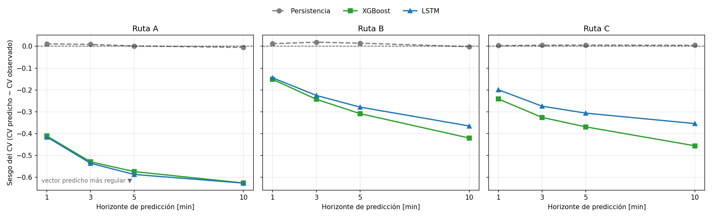
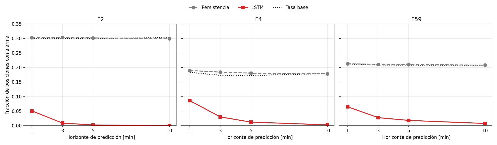
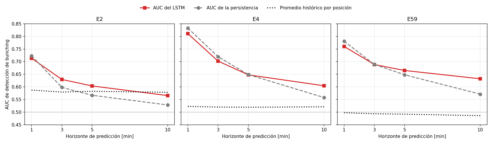
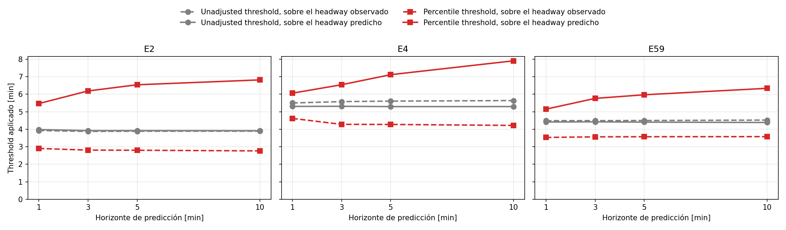
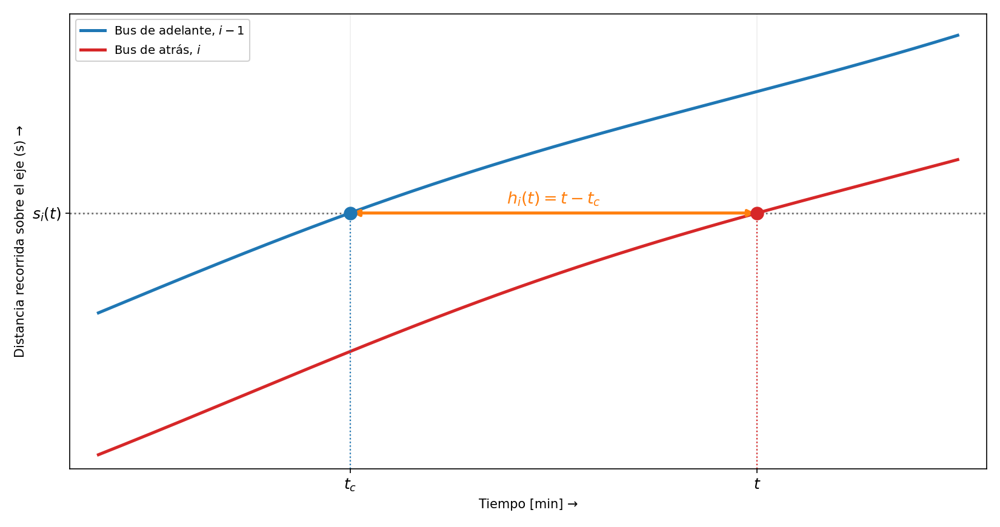

# Un threshold diseñado para el headway observado hace que la persistencia gane la detección de bunching

## Resumen

Para anticipar el bunching, un modelo predice el headway de los próximos minutos y lo compara contra un threshold, el valor por debajo del cual un headway cuenta como demasiado corto. Se da por hecho que una predicción con menos error detecta mejor el bunching. Sin embargo, ese threshold se diseña para el headway observado y se aplica sin cambios al headway predicho. Mostramos que un modelo entrenado con error cuadrático predice headways más parejos que los reales, y que por eso casi ninguno queda por debajo de ese threshold. Con 152 días de registros GPS de tres rutas de Arequipa, una red LSTM predijo a diez minutos con menos error que la persistencia, que repite los últimos headways observados, pero emitió muy pocas alarmas. La persistencia ganó la detección en las doce combinaciones de ruta y horizonte. La evaluación premia así al método que emite más alarmas y no al que acierta más. Sin threshold, ordenando los headways predichos del más corto al más largo, el LSTM ubicó mejor el bunching a diez minutos en las tres rutas. Proponemos ajustar el threshold sobre el headway predicho. Con las dos formas de ajuste probadas, ambas evaluaciones vuelven a elegir el mismo ganador en 17 de 19 casos. Esperamos que la detección de bunching sobre predicciones se evalúe en adelante con un threshold ajustado a la predicción.

---

## I. Introducción

El headway es el tiempo que separa el paso de dos buses consecutivos por un
mismo punto de una ruta. El bunching ocurre cuando ese tiempo se acorta tanto
que los dos buses circulan juntos, y deja a los pasajeros con esperas
desiguales. Para anticiparlo se siguen dos etapas [@yu2016] [@jiao2023].
Primero, un modelo estima el headway de dentro de unos minutos, el **headway
predicho**. Después, ese headway predicho se compara contra un **threshold**:
el valor por debajo del cual un headway cuenta como demasiado corto. Si queda
por debajo, se anuncia bunching. El GPS registra después el headway que
ocurrió, el **headway observado**, y con él se comprueba la predicción.

El threshold no tiene un valor acordado [@rezazada2024]. Unos trabajos lo fijan
en tiempo, entre veinte segundos y tres minutos, y otros como una fracción del
headway programado, de hasta un cuarto. El procedimiento supone que la
detección sigue al error. Si la predicción empeora, la detección también
empeora. Yu y colaboradores lo observan así. Al predecir cinco paradas
adelante en lugar de dos, el error de su modelo en una de sus rutas subió de dos
a seis minutos, y la fracción de eventos detectados bajó del 100 % al 74 %
[@yu2016].

En nuestros datos esa suposición no se cumplió. Se comparó una red LSTM
(*long short-term memory*) con la persistencia, el método más simple, que
predice que los headways de dentro de unos minutos serán iguales a los de
ahora. Los dos métodos predicen a la vez todos los headways de una ruta, su
**vector de headways**, en tres rutas de Arequipa, A, B y C. A diez minutos, en
la ruta C, el error promedio del LSTM fue 1.17 minutos menor que el de la
persistencia. Pero el LSTM detectó peor el bunching. El threshold fue la mitad
del promedio del vector, y con él uno de cada cinco headways observados fue
bunching. La persistencia emitió alarma en uno de cada cinco headways
predichos, igual que en la realidad. El LSTM, en menos de uno de cada cien. El
F1, que mide cuánto coinciden las alarmas con el bunching ocurrido, fue 8.8
veces mayor para la persistencia. Esa cifra significa que el LSTM casi nunca
emitió alarma.

La causa está en la primera etapa. Un modelo entrenado con error cuadrático
medio, cuando no sabe si un headway será corto o largo, predice un valor
intermedio [@gneiting2011], y la predicción queda **subdispersa**
(*underdispersion*), con menos dispersión que el headway observado
[@mayer2023]. Casi no contiene headways mucho más cortos que los demás, que son
los que marcan el bunching. Por eso casi ninguno queda bajo un threshold pensado
para la dispersión del headway observado, aunque ese threshold se calcule con el
promedio del propio vector predicho.

Ese efecto no se ha medido. Sun, Schmöcker y Nakamura comparan la predicción
del headway con un clasificador de bunching [@sun2021]. Al clasificador lo
evalúan con una curva ROC (*receiver operating characteristic*), que no necesita
threshold, y a la predicción del headway solo con un threshold fijo de un
minuto. Así, su comparación no separa el error de la predicción del efecto del
threshold.

Este trabajo lo mide puntuando la misma detección con y sin threshold. Sin
threshold, los headways predichos de cada vector se ordenan del más corto al más
largo, cada uno medido como fracción del promedio de su vector. El área bajo la
curva ROC, el AUC, mide si el bunching real queda al principio de ese orden.
Vale 1 si queda todo al principio y 0.5 si el orden no informa nada. Las dos
puntuaciones se contradicen. Con el threshold, la persistencia ganó en todas las
rutas y horizontes. Sin threshold, el LSTM ordenó mejor que la persistencia a
diez minutos en las tres rutas y en tres períodos de prueba distintos.

Mostramos tres cosas. Primero, el headway predicho describe una ruta más
regular que la real. El *Transit Capacity and Quality of Service Manual*
(TCQSM) califica la regularidad de un servicio de A a F. A diez minutos, en la
ruta A, el headway predicho la pone en nivel A, el de un servicio que funciona
como un reloj, y el headway observado en nivel F, el de un servicio con casi
todos los buses agrupados. Segundo, por esa subdispersión, un threshold pensado para el headway
observado, sea la mitad del promedio del vector o un valor fijo en minutos, hace
que el LSTM casi no emita alarmas y que la persistencia gane la evaluación.
Tercero, ajustar el threshold sobre el headway predicho corrige el defecto. Se
probaron dos formas de ajustarlo, y con ellas el ganador coincide con el que da
el AUC en 8 de 9 casos y en 9 de 10.

---

## II. Antecedentes

### A. Predicción de bunching en dos etapas

El procedimiento de dos etapas de la Sección I tiene una formulación canónica.
Un headway cuenta como bunching si cae por debajo de la cuarta parte del headway
observado en la primera parada del mismo viaje [@yu2016] [@jiao2023]. El
threshold se fija así sobre la escala del headway observado y se compara contra
el headway predicho. Los trabajos previos evalúan la segunda etapa solo con un
threshold, sin ninguna medida que puntúe sin él [@santos2022].

### B. Subdispersión bajo error cuadrático medio

La subdispersión de la Sección I está demostrada. Gneiting muestra que un modelo
entrenado con error cuadrático predice la media condicional, el valor intermedio
de la Sección I [@gneiting2011]. Patton y Timmermann muestran que, para esa
predicción, la varianza del valor observado es la varianza de la predicción más
el error cuadrático medio [@patton2012]. Por eso la predicción es menos dispersa
que el valor observado, y la diferencia crece con el horizonte, porque el error
crece.

### C. Precedentes y delimitación

La subdispersión ya se midió en series escalares [@mayer2023], en cinco dominios,
entre ellos el tráfico [@green2026], y en campos espaciales [@bonavita2024].
Petetin y colaboradores muestran su daño sobre una regla de threshold: el método
con mejor error cuadrático es el que peor detecta los episodios altos de ozono
[@petetin2022].

Fuera del transporte, las correcciones publicadas actúan después de la
predicción y no sobre el modelo. Hoffmann y colaboradores recalculan el
threshold como el percentil equivalente dentro de las predicciones
[@hoffmann2018], Petetin y colaboradores ajustan la distribución de las
predicciones a la de las mediciones [@petetin2022], y Roberts y Lean calculan el
percentil dentro de cada campo de lluvia [@roberts2008].

En transporte, Sun, Schmöcker y Nakamura muestran que predecir el headway y
aplicarle un threshold fijo de un minuto detecta el bunching peor que un
clasificador, sobre todo cuando se predice diez paradas adelante [@sun2021]. Jiao y
colaboradores corrigen el modelo, con un término de clasificación en la pérdida
[@jiao2023]. Este trabajo, en cambio, corrige la regla y no reentrena el modelo.

---

## III. Defecto de la evaluación con el *unadjusted threshold*

### A. Formulación del problema

Lo que se predice es el **vector de headways** de la ruta: un headway por cada
par de buses consecutivos que circulan en el mismo sentido, con todas sus
posiciones a la vez. El Apéndice A lo construye desde los registros GPS. Dado el
historial de los últimos $L$ minutos y un contexto de calendario, se busca el
vector de la ruta $H$ minutos más adelante:

$$\hat{\mathbf{h}}(t+H) \;=\; f\big(\mathbf{h}(t-L+1), \dots, \mathbf{h}(t);\;
c(t-L+1), \dots, c(t)\big), \qquad L = 12, \tag{1}$$

donde $\mathbf{h}(t)$ es el vector de headways de la ruta en el minuto $t$ y
$\hat{\mathbf{h}}(t+H)$ es el vector predicho para $H$ minutos más adelante. El
término $c(t)$ reúne cuatro variables de calendario del minuto $t$: el seno y el
coseno de la hora, y el seno y el coseno del día de la semana. Aquí $f$ es el
modelo ajustado.

Se predice a uno, tres, cinco y diez minutos, con un modelo ajustado por
separado para cada horizonte. El vector no tiene longitud fija, porque la
cantidad de buses varía minuto a minuto, de modo que el error se computa solo
sobre las posiciones con headway válido. **El objetivo que se minimiza es el error
cuadrático**, promediado sobre esas posiciones:

$$\mathcal{L} \;=\; \frac{1}{|\mathcal{V}|}\sum_{i \in \mathcal{V}}
\big(\hat{h}_i - h_i\big)^{2}, \tag{2}$$

donde $\mathcal{V}$ es el conjunto de posiciones del vector con headway válido en
el instante objetivo, y $|\mathcal{V}|$ es su cardinal. Los términos $\hat{h}_i$
y $h_i$ son el headway predicho y el headway observado en la posición $i$, en la
escala estandarizada por sentido que fija el Apéndice A.2.

Los registros GPS no traen pasajeros ni estado del tránsito, de modo que el
evento se define sobre la geometría del vector. La convención del campo marca el
evento con una fracción de un headway de referencia, programado u observado
(Secciones I y II-A); el TCQSM, en cambio, usa la mitad del programado [@tcqsm2003].
Estas rutas no tienen programación, y aquí la referencia es el promedio del
propio vector en ese instante. Ese promedio refleja la separación normal de cada
ruta, cosa que un threshold fijo no hace entre rutas de frecuencias
distintas. El resultado, la mitad de ese promedio, es el ***event threshold***.

Con $\mathcal{V}(t)$ el conjunto de posiciones con headway válido del vector
$\mathbf{h}(t)$, su promedio y el *event threshold* son

$$\bar{h}(t) \;=\; \frac{1}{m}\sum_{j \in \mathcal{V}(t)} h_j(t),
\qquad \tau(t) \;=\; \rho\,\bar{h}(t), \qquad \rho = \tfrac{1}{2}, \tag{3}$$

donde $m = |\mathcal{V}(t)|$ es la cantidad de posiciones con headway válido,
$h_j(t)$ es el headway de la posición $j$ y $\rho$ es la fracción que fija el
threshold $\tau(t)$; los pares sin headway válido del Apéndice A no entran en el
cómputo.
La posición $i$ cuenta como bunching cuando cae por debajo de ese threshold:

$$b_i(t) \;=\; \mathbb{1}\!\left[\, h_i(t) < \tau(t) \,\right],
\qquad \text{definido solo si } m \ge 3, \tag{4}$$

donde $\mathbb{1}[\cdot]$ es la función indicadora. Cada posición con
$b_i(t) = 1$ es un evento, y se dice que la regla la **marca**. La condición
$m \ge 3$ existe porque con dos headways cualquier medida de irregularidad se
reduce a la diferencia entre ellos y no describe un patrón.

El detector aplica esa misma regla al vector predicho de la Ecuación (1), con el
promedio de ese mismo vector fijando el threshold:

$$\hat{b}_i(t) \;=\; \mathbb{1}\!\left[\, \hat{h}_i(t) < \rho\,\bar{\hat{h}}(t)
\,\right], \tag{5}$$

donde $\hat{b}_i(t)$ es la detección emitida sobre la posición $i$ y
$\bar{\hat{h}}(t)$ es el promedio del vector predicho. Cada posición con
$\hat{b}_i(t) = 1$ es una **alarma** (*alarm*) [@moreiramatias2016]. El
threshold sale del vector predicho porque quien opera una ruta no dispone del
headway observado al momento de decidir. La fracción $\rho = \tfrac{1}{2}$ pasa
así sin cambios del headway observado al headway predicho, y a ese threshold,
aplicado sin ajustarlo a la predicción, se le llama el ***unadjusted
threshold*** [@hoffmann2018].

La evaluación compara el detector de la Ecuación (5) contra el indicador de la
Ecuación (4). Sean TP las posiciones con $b_i = \hat{b}_i = 1$, FP las que
tienen $\hat{b}_i = 1$ y $b_i = 0$, y FN las que tienen $b_i = 1$ y
$\hat{b}_i = 0$. La precisión, el recall y el F1 son entonces

$$\mathrm{F}_1 \;=\; \frac{2PR}{P+R}, \qquad
P \;=\; \frac{\mathrm{TP}}{\mathrm{TP}+\mathrm{FP}}, \qquad
R \;=\; \frac{\mathrm{TP}}{\mathrm{TP}+\mathrm{FN}}, \tag{6}$$

donde la precisión $P$ es la fracción de alarmas que caen sobre un evento, y el
recall $R$ es la fracción de eventos que reciben alarma.

### B. El F1 bajo el *unadjusted threshold*

El F1 de la Ecuación (6) mezcla dos cantidades de naturaleza distinta. Sea $n$
la cantidad de posiciones evaluadas. Como TP es la precisión multiplicada por la
cantidad de alarmas, al dividir por $n$ el F1 se reescribe como

$$\mathrm{F}_1 \;=\;
\frac{2\,\mathrm{TP}}{(\mathrm{TP}+\mathrm{FP}) + (\mathrm{TP}+\mathrm{FN})}
\;=\; P \cdot \frac{2q}{q+\pi}, \tag{7}$$

donde $q = (\mathrm{TP}+\mathrm{FP})/n$ es la **tasa de alarma**, la fracción de
posiciones con alarma, y $\pi = (\mathrm{TP}+\mathrm{FN})/n$ es la **tasa
base**, la fracción de posiciones con evento.

La precisión $P$ mide si las alarmas aciertan. El término $2q/(q+\pi)$
depende solo de cuántas se emiten, y vale 1 cuando la tasa de alarma iguala a la
tasa base. Si la tasa de alarma cae muy por debajo de la tasa base, ese término
se acerca a $2q/\pi$ y arrastra el F1 hacia cero, aunque todas las
alarmas acierten. El **baseline siempre positivo**, que marca bunching en toda
posición, tiene $q = 1$ y $P = \pi$ [@flach2015]. Alcanza así
$\mathrm{F}_1 = 2\pi/(1+\pi)$ sin ningún modelo, y acompaña como baseline a
todo F1 reportado.

Queda por ver qué tasa de alarma recibe cada método. La persistencia predice
$\hat{\mathbf{h}}(t+H) = \mathbf{h}(t)$, de modo que su detector aplica la regla
del evento a un vector observado $H$ minutos antes. Su tasa de alarma es la tasa
base de ese instante anterior. Mientras la tasa base no cambie en $H$ minutos,
el término $2q/(q+\pi)$ vale casi 1 y el F1 de la persistencia queda igual a su
precisión.

El LSTM, en cambio, se ajusta con la Ecuación (2), se aproxima a la media
condicional y queda subdisperso (Sección II-B). Para recibir alarma, un headway
predicho tiene que alejarse de su promedio, hacia abajo, en más de la mitad de
ese promedio. Un vector subdisperso casi no tiene headways tan alejados, de modo
que la tasa de alarma del LSTM cae por debajo de la tasa base y su F1 cae con
ella.

Con el *unadjusted threshold*, el F1 ordena entonces a los métodos por la
dispersión de su vector predicho antes que por su acierto. Un método que predice
con más error puede superar en F1 a uno que predice con menos, aun con menor
precisión, porque copia la dispersión del headway observado.

---

## IV. Puntuación de la detección bajo subdispersión

### A. Puntuación sin threshold

La Ecuación (7) deja el F1 atado a la tasa de alarma, y la tasa de alarma del
*unadjusted threshold*, a la dispersión del vector predicho. La forma más
directa de que esa dispersión deje de decidir el resultado es puntuar sin
threshold, de modo que no quede tasa de alarma que medir. El detector de la
Ecuación (5) compara el cociente $\hat{h}_i/\bar{\hat{h}}$ contra la fracción
$\rho$. Sin fijar $\rho$, ese cociente, calculado dentro de cada vector, ordena
las posiciones de la más corta a la más larga respecto del promedio de su
vector. El AUC [@handtill2001] puntúa ese ordenamiento. Vale 1 si todos los
eventos quedan antes que todas las posiciones sin evento, y 0.5 si el
ordenamiento no informa. Se calcula por **celda**, una combinación de ruta y
horizonte, juntando en un solo ordenamiento las posiciones de todos sus vectores
y de los dos sentidos.

Un AUC de 0.5 corresponde a una predicción sin ninguna información. Superarlo
no basta para mostrar que el método usa la ventana de entrada, porque las
posiciones del vector no son intercambiables: algunas llevan headways más cortos
que otras sin que haga falta leer esa ventana. Por eso se agrega el **baseline
de promedio histórico por posición** (Apéndice A.2), que repite para cada
posición su headway promedio de un período anterior. Un método que no le gana
no muestra que use la ventana de entrada. Este baseline cumple para el AUC la
función que el baseline siempre positivo cumple para el F1, y acompaña a todo
AUC reportado.

### B. *Adjusted threshold*

La otra forma conserva un threshold, pero lo ajusta sobre el headway predicho en
lugar de heredarlo del headway observado, para que la tasa de alarma deje de
depender de su dispersión. A ese threshold se le llama ***adjusted threshold***,
y se prueba de dos maneras.

Las dos usan los **orígenes de evaluación**. Un origen es una fecha de corte. El
modelo se entrena con los datos anteriores a ella, se valida y se prueba en un
período posterior de 22 días (Apéndice A.3). Hay tres orígenes, y los resultados
principales son los del origen 3, el más reciente.

La primera manera es el ***optimized threshold***. Reemplaza la fracción $\rho$
de la Ecuación (5) por un valor elegido para cada método y cada celda. Ese valor
se elige en el período de prueba del origen 2 y se aplica sin cambios al del
origen 3. Los dos períodos no se solapan y sus modelos se entrenaron por
separado, de modo que el período reportado no interviene en la elección de su
propio threshold.

El objetivo del ajuste es el coeficiente de correlación de Matthews (MCC) y no
el F1. Por la Ecuación (7), el F1 premia subir la tasa de alarma, y maximizarlo
sobre una predicción sin información conduce al baseline siempre positivo
[@lipton2014]. El MCC es la correlación entre las alarmas y los eventos: vale 1
cuando coinciden y 0 cuando las alarmas no informan sobre los eventos, como en
el baseline siempre positivo [@chicco2020]. Emitir más alarmas no basta para
subirlo, porque también cuenta las posiciones sin evento ni alarma, los
verdaderos negativos (TN).

La segunda manera es el ***percentile threshold*** [@roberts2008]. En lugar de
comparar cada headway contra un valor, marca en cada vector una fracción fija de
posiciones, las más cortas. Esa fracción es la que la regla de la Ecuación (4)
marcó en promedio en la celda, en el origen 2. La regla se aplica igual a los dos
vectores. En el vector predicho, sus marcas son las alarmas. En el vector
observado, son los eventos contra los que se puntúan esas alarmas. Como los dos
vectores reciben la misma cantidad de marcas, la tasa de alarma iguala a la tasa
base, y el término $2q/(q+\pi)$ de la Ecuación (7) vale 1 para todo método.

Ese evento no es el de la Ecuación (4): marca las posiciones más cortas de cada
vector, estén o no por debajo de la mitad de su promedio. El **índice de
Jaccard** mide cuánto coinciden los dos eventos: divide las posiciones que
marcan ambos entre las que marca al menos uno. Vale 0.58 en la mediana de las
doce celdas (Tabla 3), de modo que los dos eventos coinciden solo en parte.

---

## V. Resultados

### A. Datos y métodos comparados

Los datos son 152 días seguidos de registros GPS de las rutas A, B y C. Se
comparan tres métodos sobre las mismas muestras. El LSTM es el método bajo
estudio. Un conjunto de árboles con refuerzo de gradiente (**XGBoost**)
[@chen2016] sirve de control. Se ajusta con el mismo error cuadrático y no
comparte la arquitectura del LSTM, de modo que lo que los dos tengan en común se
debe al ajuste. La persistencia no se ajusta. Salvo aviso, las cifras son del
origen 3, el único sobre el que se ajustó el XGBoost, y el Apéndice A da el
detalle. Un método **gana** solo si la diferencia pasa su prueba del Apéndice B.
Esa prueba es un intervalo del 95 % que no incluye el cero o, en el error
absoluto medio (MAE), una prueba de Diebold–Mariano con p < 0.05. Si no la pasa,
los dos **empatan**.

Con cuatro horizontes por ruta hay doce celdas, y se reportan todas. A un
minuto no hay margen para intervenir y la persistencia es más difícil de superar
[@manibardo2022].

### B. Error escalar y subdispersión

El error de la predicción se mide con el MAE sobre las
posiciones de la Ecuación (2). Se reporta en lugar del error cuadrático
porque queda en minutos de headway. A diez minutos, el LSTM bajó el MAE de la
persistencia entre 21 % y 22 %. La reducción fue de 1.47 minutos en la ruta A,
1.38 en la B y 1.17 en la C.
A un minuto ganó la persistencia en las rutas B y C, y en la A empataron, con una
diferencia de 0.07 minutos.

El MAE no describe la forma del vector. El coeficiente de variación (CV) sí: es
la desviación estándar del vector dividida por su promedio,

$$\mathrm{CV}(\mathbf{h}) \;=\; \frac{1}{\bar{h}}
\sqrt{\frac{1}{m-1}\sum_{j \in \mathcal{V}}\big(h_j - \bar{h}\big)^{2}}, \tag{8}$$

donde $\mathcal{V}$, $m$, $h_j$ y $\bar{h}$ son los de la Ecuación (3), y se calcula sobre los
vectores de tres posiciones o más de la Ecuación (4). El CV vale 0 cuando todos
los buses de la ruta van igual de separados, y crece a medida que los
headways se desigualan. No tiene unidades, de modo que compara rutas de
frecuencias distintas. Su **sesgo** es el CV del vector predicho menos el del
vector observado en el mismo instante, y un valor negativo indica un vector
predicho más regular que el observado.

En la ruta A a diez minutos, el CV valió 0.79 sobre el headway observado y 0.16 sobre
el headway predicho por el LSTM. El TCQSM califica la regularidad de un
servicio en niveles de A a F según la dispersión del headway respecto del
programado [@tcqsm2003], y en una ruta sin programación esa dispersión es la
de la Ecuación (8). Leídas en esa escala, las dos cifras ponen a la misma
ruta en nivel A —«service provided like clockwork»— según el headway
predicho, y en nivel F —«most vehicles bunched»— según el headway observado.

El sesgo del CV del LSTM fue negativo en **las doce celdas y los tres
orígenes**, y creció sin excepción con el horizonte (Figura 1). El de la
persistencia, que no se ajusta, quedó dentro de ±0.022, es decir, su vector
predicho conservó la dispersión del observado. Por eso el efecto está en el
ajuste, no en los datos ni en la ruta.

**Fig. 1.** Sesgo del CV, el CV del vector predicho menos el del vector
observado, por método y horizonte. Un panel por ruta, origen 3; un valor negativo es un
vector predicho más regular que el observado.

La Ecuación (9) mide la descomposición de la Sección II-B entre las posiciones
de cada vector:

$$V_h \;=\; V_{\hat h} + V_e + 2\,C_{\hat h e}, \qquad
r \;=\; \frac{V_{\hat h}}{V_h}, \qquad r_0 \;=\; 1 - \frac{V_e}{V_h}, \tag{9}$$

donde $V_h$, $V_{\hat h}$ y $V_e$ son las varianzas entre posiciones del headway
observado, del headway predicho y del error $e_i = h_i - \hat{h}_i$, promediadas
sobre los vectores de la celda, y $C_{\hat h e}$ es la covarianza entre el
headway predicho y el error. La fracción $r$ es la parte de la varianza
del headway observado que conserva el headway predicho. La fracción $r_0$ es la
que la Sección II-B anticipa a partir del tamaño del error, y las dos coinciden
si esa covarianza es nula. En el LSTM, $r$ fue del 55.2 % en la ruta B a un
minuto y bajó al 4.5 % en la ruta A a diez minutos. En esa celda, el headway
predicho conservó menos de una vigésima parte de la variación real entre los
buses. En el XGBoost, $r$ fue del 54.7 % al 4.0 %. Sobre las doce celdas, $r$
siguió a $r_0$ con una correlación de 0.993 en el LSTM y de 0.996 en el
XGBoost. Cada celda perdió la dispersión que el tamaño de su error anticipa.

Dos causas ajenas al ajuste podrían producir la subdispersión. La primera es el
ruido de medición del eje de la ruta y del sentido de marcha. Ese ruido agranda
el error y, con él, la subdispersión. Pero $r$ siguió a $r_0$ en las doce
celdas, de modo que el headway predicho perdió solo la dispersión que su error
anticipa. El ruido cambia cuánto se comprime el vector, pero no explica que se
comprima. La segunda es el azar. Cada modelo se entrenó con una sola semilla,
pero el sesgo del CV fue negativo en las tres rutas y los tres orígenes, cada
uno con su propio entrenamiento.

### C. Tasa de alarma y precisión bajo el *unadjusted threshold*

En la ruta C a diez minutos, el caso de la Sección I, el LSTM emitió alarma en el
0.75 % de las posiciones, contra una tasa base del 20.8 %. Acertó el 49 % de sus
alarmas y la persistencia el 30 %, pero el F1 invirtió ese orden, con 0.303 para
la persistencia contra 0.034 para el LSTM. La Ecuación (7) da la causa. El
término $2q/(q+\pi)$ valió 1.00 para la persistencia y 0.07 para el LSTM. El F1
de la persistencia quedó igual a su precisión, y el del LSTM quedó en el 7 % de
la suya.

El patrón se repitió en las doce celdas de la Tabla 1: el LSTM tuvo más
precisión que la persistencia y una tasa de alarma por debajo de la tasa base, y
el F1 de la persistencia fue de 1.5 a 253 veces el suyo. La Figura 2 muestra cómo esa tasa cae
al alargar el horizonte.

La ruta A a diez minutos es el caso extremo: sobre 15 245 eventos, la persistencia
emitió 15 083 alarmas y el LSTM, **catorce**. Diez de las catorce acertaron, una
precisión del 71 % (intervalo del Apéndice B, 42 % a 92 %) contra una tasa base
del 30 %, y aun así el F1 de la persistencia fue 253 veces el suyo.

Que la persistencia tenga más F1 que el LSTM tampoco significa que detecte bien.
El baseline siempre positivo, que marca bunching en todas las posiciones sin
usar ningún modelo, tuvo un F1 mayor que el de ella en 5 de las doce celdas,
marcadas con † en la Tabla 1, y en 15 de las 36 combinaciones de celda y origen.
En esas celdas, marcar todo puntúa mejor que la persistencia.

**Fig. 2.** Tasa de alarma de la persistencia y del LSTM con el *unadjusted
threshold*, contra la tasa base (punteada), por horizonte. Un panel por
ruta, origen 3.

**Tabla 1.** Detección con el *unadjusted threshold*, con el F1 del baseline
siempre positivo al lado. Factor es el F1 de la persistencia dividido por el del
LSTM.

| Ruta | h | Tasa base | F1 baseline | F1 persistencia | F1 LSTM | Factor |
| :--- | ---: | ---: | ---: | ---: | ---: | ---: |
| A | 1 | 0.299 | 0.460 | 0.581 | 0.207 | 2.8× |
| A | 3 | 0.301 | 0.462 | 0.414&nbsp;† | 0.038 | 11× |
| A | 5 | 0.300 | 0.462 | 0.375&nbsp;† | 0.011 | 36× |
| A | 10 | 0.303 | 0.465 | 0.332&nbsp;† | 0.001 | 253× |
| B | 1 | 0.183 | 0.310 | 0.686 | 0.466 | 1.5× |
| B | 3 | 0.173 | 0.295 | 0.486 | 0.177 | 2.7× |
| B | 5 | 0.172 | 0.294 | 0.381 | 0.066 | 5.8× |
| B | 10 | 0.179 | 0.304 | 0.268&nbsp;† | 0.015 | 18× |
| C | 1 | 0.212 | 0.350 | 0.620 | 0.308 | 2.0× |
| C | 3 | 0.209 | 0.345 | 0.469 | 0.130 | 3.6× |
| C | 5 | 0.208 | 0.344 | 0.405 | 0.083 | 4.9× |
| C | 10 | 0.208 | 0.344 | 0.303&nbsp;† | 0.034 | 8.8× |

† El F1 del baseline siempre positivo es mayor que el de la persistencia en estas celdas.

### D. Detección sin threshold, acotada por el promedio histórico por posición

Sin threshold, el orden de la Tabla 1 se invierte a diez minutos (Tabla 2 y
Figura 3). Puntuado mediante el AUC de la Sección IV-A, **el LSTM ganó en las
nueve combinaciones de ruta y origen a diez minutos**, con diferencias de
0.033 a 0.061. En el origen 3 ganó en 6 de las 12 celdas. A un
minuto ganó la persistencia en las tres rutas y los tres orígenes, como
en el MAE de las rutas B y C.

El promedio histórico por posición de la Sección IV-A, que no lee la ventana de
entrada, acota esa ventaja. En las rutas B y C el baseline queda cerca del azar, entre
0.49 y 0.52, y el LSTM le ganó en las ocho celdas. En la ruta A el baseline queda por
encima del azar en todos los horizontes, y **a diez minutos el LSTM pierde
contra él, 0.565 contra 0.579**. Es la única celda donde ocurre, la misma del
caso extremo de la Sección V-C.

**Fig. 3.** AUC de detección del LSTM y de la persistencia contra el promedio
histórico por posición (punteado), por horizonte. Un panel por ruta, origen
3; la línea en 0.5 es el azar.

**Tabla 2.** Diferencias del LSTM, sin threshold y con el *optimized threshold*,
con su intervalo de confianza del 95 %. Un signo positivo favorece al LSTM, y un
intervalo que contiene el cero es un empate (Sección V-A).

| Ruta | h | Δ AUC frente a la persistencia | Δ AUC frente al promedio histórico por posición | Δ MCC *optimized* frente a la persistencia |
| :--- | ---: | :---: | :---: | :---: |
| A | 1 | -0.009 [-0.015, -0.004] | +0.126 [+0.117, +0.138] | -0.091 [-0.106, -0.078] |
| A | 3 | +0.031 [+0.025, +0.036] | +0.050 [+0.040, +0.061] | +0.018 [+0.005, +0.028] |
| A | 5 | +0.037 [+0.031, +0.042] | +0.021 [+0.013, +0.031] | +0.037 [+0.026, +0.046] |
| A | 10 | +0.037 [+0.026, +0.047] | -0.013 [-0.023, -0.003] | +0.058 [+0.039, +0.073] |
| B | 1 | -0.022 [-0.027, -0.016] | +0.288 [+0.273, +0.305] | -0.140 [-0.150, -0.130] |
| B | 3 | -0.017 [-0.025, -0.009] | +0.182 [+0.167, +0.199] | -0.106 [-0.122, -0.086] |
| B | 5 | -0.001 [-0.010, +0.008] | +0.128 [+0.113, +0.144] | -0.064 [-0.083, -0.043] |
| B | 10 | +0.047 [+0.030, +0.063] | +0.083 [+0.068, +0.097] | +0.015 [-0.005, +0.033] |
| C | 1 | -0.021 [-0.025, -0.016] | +0.262 [+0.253, +0.271] | -0.154 [-0.164, -0.144] |
| C | 3 | 0.000 [-0.005, +0.005] | +0.195 [+0.186, +0.204] | -0.091 [-0.100, -0.081] |
| C | 5 | +0.017 [+0.012, +0.022] | +0.173 [+0.162, +0.184] | -0.044 [-0.053, -0.036] |
| C | 10 | +0.061 [+0.054, +0.067] | +0.146 [+0.133, +0.159] | +0.042 [+0.033, +0.052] |

### E. Detección con el *adjusted threshold*

El *optimized threshold* de la Sección IV-B, que no toca el modelo, llevó al
LSTM a ganar en MCC 4 de las 12 celdas, entre ellas las rutas A y C a diez minutos, y
a empatar en la ruta B a diez minutos (última columna de la Tabla 2).

La Tabla 3 compara las cinco reglas sobre la misma población. Su columna A/E
es el sesgo de frecuencia (*frequency bias*) [@ferro2011]: la tasa de alarma
dividida por la tasa base, el cociente $q/\pi$ de la Ecuación (7). Vale uno
cuando el detector avisa tan seguido como ocurre el evento.

Tres reglas aplican al headway predicho un threshold diseñado para el headway
observado. La primera es el *unadjusted threshold*. La segunda es una variante
suya que usa un solo threshold para el evento y para la alarma, la mitad del
promedio del último vector observado antes de predecir. La tercera es el
**threshold fijo**. Moreira-Matias y colaboradores fijan este último en la
cuarta parte del headway programado [@moreiramatias2016]. Estas rutas no
tienen horario, así que aquí se usó la cuarta parte del headway mediano
observado de cada ruta y sentido, en el origen 2. Las tres dejaron al LSTM
casi sin alarmas. Su A/E mediano fue de 0.001 a 0.153, es decir, el LSTM emitió
entre 1 y 153 alarmas por cada mil eventos. El de la persistencia fue de 0.980
a 1.062, casi una alarma por evento. Con el threshold fijo, el LSTM no emitió ninguna alarma en dos
celdas. Con el *unadjusted threshold* y con el threshold fijo, la persistencia
ganó en MCC en las doce celdas. Con los dos *adjusted thresholds*, el A/E
mediano del LSTM fue de 1.125 y 1.000, también cerca de una alarma por evento.

La Figura 4 muestra por qué. Con el *unadjusted threshold*, el valor aplicado al
headway predicho quedó a menos de 0.35 minutos del aplicado al headway
observado, mientras que el *percentile threshold* lo sube entre 1.4 y 4.1
minutos, hasta donde caen los headways predichos.

**Fig. 4.** Threshold en minutos que aplica cada regla, promediado sobre las
posiciones, sobre el headway observado (discontinua) y sobre el headway predicho
por el LSTM (continua), por horizonte. Un panel por ruta, origen 3.

La columna Coincide de la Tabla 3 cuenta, sobre las celdas sin empate en AUC ni
en MCC, aquellas en que los dos dan el mismo ganador. Con el *optimized
threshold* coincidieron en 8 de 9, y con el *percentile threshold*, en 9 de 10.
Con el *unadjusted threshold* y con el threshold fijo, la persistencia ganó
siempre en MCC, de modo que solo coincidieron en las 4 celdas donde también ganó
en AUC. Aun así, el percentil no convierte al LSTM en mejor detector: pierde
contra la persistencia en siete de las doce celdas, entre ellas las tres de un
minuto.

**Tabla 3.** Las cinco reglas sobre la misma población, origen 3. Cada valor es
la mediana de las doce celdas, salvo Coincide; pers. es la persistencia y
Jaccard es el índice de la Sección IV-B contra el evento de la Ecuación (4).

| Regla | A/E LSTM | A/E pers. | MCC LSTM | Jaccard | Coincide |
| :--- | ---: | ---: | ---: | ---: | :---: |
| *Unadjusted* | 0.079 | 1.011 | 0.100 | 1.000 | 4/10 |
| *Unadjusted*, promedio observado | 0.153 | 0.980 | 0.143 | 0.710 | 5/7 |
| Fijo | 0.001 | 1.062 | 0.004 | 0.351 | 4/10 |
| *Optimized* | 1.125 | 1.140 | 0.198 | 1.000 | 8/9 |
| *Percentile* | 1.000&nbsp;‡ | 1.000&nbsp;‡ | 0.210 | 0.580 | 9/10 |

‡ Vale uno por construcción: la alarma y el evento marcan la misma cantidad de
posiciones en cada vector (Sección IV-B).

---

## VI. Discusión

Para evaluar la detección de bunching sobre predicciones sugerimos cuatro prácticas: reportar el AUC junto a todo F1
(Sección V-D); acompañar cada puntuación con un baseline que no use la
predicción (Secciones V-C y V-D); ajustar sobre el headway predicho todo
threshold que la operación necesite (Sección V-E); y reportar la tasa de alarma
junto a la tasa base, porque su cociente dice cuánto del F1 mide la cantidad de
alarmas (Ecuación 7).

El evento se define sobre el headway observado, medido aquí por GPS, como en Yu
y colaboradores [@yu2016] y en Sun, Schmöcker y Nakamura [@sun2021], y las
cifras de detección valen para la definición de la Ecuación (4). La
recomendación de ajustar el threshold sobre el headway predicho no depende de
esa definición: con el evento de la Ecuación (4) y con el del threshold fijo, el
threshold diseñado para el headway observado dejó al LSTM casi sin alarmas.

---

## VII. Conclusión

Este trabajo mostró que las predicciones entrenadas por error cuadrático
describen una ruta más regular que la real. A diez minutos, la ruta A queda en
nivel A del TCQSM según el headway predicho y en nivel F según el headway
observado.
Mostró también que, por esa subdispersión, el *unadjusted threshold* hace que el
F1 ordene a los métodos por cuántas alarmas emiten y no por cuántas aciertan, y
que a diez minutos la puntuación sin threshold invierte ese orden. Para
corregirlo, ajustamos el threshold sobre el headway predicho de dos maneras,
optimizado en un origen anterior o como un percentil de cada vector. Con ambas,
el ganador vuelve a coincidir con el que da el AUC en 8 de 9 casos y en 9 de 10. El dataset cubre tres rutas de una sola ciudad
durante 152 días, y el promedio histórico por posición se ajustó sobre un solo
origen anterior. Queda por repetir la medición en otras ciudades. Esperamos que
la detección de bunching sobre predicciones se evalúe en adelante con un *adjusted threshold*.

---

## VIII. Declaraciones

Se usaron herramientas asistidas por inteligencia artificial generativa para la
redacción del texto y para la verificación de las citas contra sus fuentes. El
diseño experimental, la implementación, las cifras reportadas y su
interpretación fueron revisados y verificados por los autores, que asumen la
responsabilidad del contenido final.

---

## Apéndice A. Datos, métodos comparados y protocolo

### A.1. Datos y construcción del headway

El trabajo usa los registros GPS de tres rutas del Sistema Integrado de
Transporte de Arequipa —A, B y C, una por empresa operadora—, con 90 buses
en total. Cada bus emite su coordenada **cada 20 segundos** durante 152 días
seguidos, del 1 de octubre de 2023 al 29 de febrero de 2024.

Estos registros no traen la lista de paradas ni los horarios de paso con que se
mide habitualmente el headway: cada bus emite su identificador, el instante y su
coordenada. El headway se construye entonces desde la posición de cada bus a lo
largo de la ruta, como en Andres y Nair [@andres2017], con una diferencia: su
ciudad publica la geometría de la ruta en GTFS y la nuestra no, de modo que el
eje de la ruta —la línea que los buses siguen— se ajusta de los propios
registros [@quek2021] [@biagioni2012]. Cada coordenada se proyecta sobre ese
eje, la referenciación lineal de la norma ISO 19148 [@iso19148], y queda su
**coordenada de arco** $s$: los metros recorridos sobre el eje. El sentido de
marcha es el signo del cambio de $s$. En las rutas A y C la ida y la vuelta circulan
por calles paralelas, la dificultad que Andres y Nair señalan para asignar el
bus de adelante usando solo GPS [@andres2017], y ahí el eje se ajusta una vez
por sentido. La posición de cada bus se interpola a cada minuto, y cada minuto
queda descrito por un **snapshot**: la coordenada de todos los buses de la
ruta.

Sobre ese snapshot, para un par de buses consecutivos en el mismo sentido —el de
adelante $i-1$, el de atrás $i$— en el minuto $t$:

$$t_{c} = \max\{\, t' \le t \;:\; s_{i-1}(t') = s_{i}(t) \,\},
\qquad h_i(t) = t - t_{c}, \tag{10}$$

donde $s_{i-1}$ y $s_{i}$ son las coordenadas de arco del bus de adelante y del
de atrás. El instante $t_{c}$ es el último en que el de adelante pasó por la
coordenada que el de atrás ocupa en $t$, y $h_i(t)$ es el headway resultante. La
definición es la de Pilachowski [@pilachowski2009], que Andres y Nair evalúan en
la coordenada del bus de atrás [@andres2017], y la Figura 5 la ilustra. Si no
existe tal $t_{c}$, o si $h_i(t)$ supera los treinta minutos, el par queda sin valor.

**Fig. 5.** El headway de la Ecuación (10) sobre dos trayectorias ilustrativas:
el tiempo entre el paso del bus de adelante por la coordenada $s_i(t)$ y la
llegada del de atrás a ella.

Ese headway describe un solo par. En cada snapshot, los buses de un mismo
sentido se ordenan por su coordenada de arco, y con $N$ buses quedan $N-1$
pares: el vector de headways ordenado desde el frente. Ese orden numera las
posiciones del vector —la primera es la del par que va más adelante—, y un par
sin headway válido conserva su posición con «sin valor», para que el orden no
dependa de cuántos pares resolvieron.

El máximo de treinta minutos existe porque, cuando la trayectoria del bus de
adelante tiene huecos, la búsqueda del cruce retrocede hasta una vuelta
anterior, horas antes. La cobertura —la
fracción de pares evaluados con headway válido— es del 63.5 % en la ruta A, del 64.8 %
en la B y del 77.1 % en la C: 3 938 174 pares sobre 5 601 738 evaluados. Una
posición sin headway válido se enmascara.

### A.2. Métodos comparados

El LSTM y el XGBoost se ajustan por separado en cada celda, con un modelo por
ruta para los dos sentidos. Los estadísticos de estandarización son por
sentido, y con ellos el headway predicho vuelve a minutos.

- **LSTM:** 32 unidades ocultas, una o dos capas según la celda, tasa de
  aprendizaje de 5 × 10⁻⁴, lotes de 128 y semilla 42. En dos de las tres
  rutas, su configuración viene de una búsqueda previa que no se rehízo
  sobre las muestras definitivas.
- **XGBoost:** solo en el origen 3, hasta 800 rondas, parada temprana tras 40
  sin mejora y semilla 42, con la mejor de veinticuatro configuraciones por celda
  elegida en validación.
- **Persistencia:** repite el último vector observado y no tiene parámetros.
- **Promedio histórico por posición** [@rodrigues2023]: repite en cada minuto
  del período de prueba el headway promedio que cada posición registró en el
  período de prueba del origen 2, sin leer la ventana de entrada.

### A.3. Protocolo de evaluación

La partición es por fecha y nunca al azar. Los tres orígenes comienzan el 1 de
octubre de 2023, y sus períodos de prueba no se solapan:

| Origen | Entrenamiento | Validación | Prueba |
| :---: | :--- | :--- | :--- |
| 1 | hasta el 30 nov 2023 (61 días) | 1–22 dic | 23 dic – 13 ene |
| 2 | hasta el 22 dic 2023 (83 días) | 23 dic – 13 ene | 14 ene – 4 feb |
| 3 | hasta el 15 ene 2024 (107 días) | 16 ene – 7 feb | 8–29 feb |

Como los entrenamientos están anidados, los tres orígenes miden estabilidad
frente al período de prueba y no son réplicas independientes. Tres condiciones
evitan fugas de información:

- **Continuidad estricta:** una muestra entra solo si sus minutos son
  consecutivos, para que la ventana no atraviese un hueco de señal. Retiene
  entre el 81.9 % y el 90.2 % de los snapshots de prueba.
- **Población compartida:** todos los métodos se puntúan sobre las mismas filas,
  y el entrenamiento aborta si el resumen SHA-256 de la lista de muestras no
  coincide con el registrado.
- **Tope:** el percentil 99 del headway de entrenamiento se aplica como techo a
  las tres particiones, y afecta entre el 0.78 % y el 1.11 % de los objetivos.

---

## Apéndice B. Pruebas estadísticas

Toda comparación entre métodos es pareada, sobre las mismas muestras, y agrupa
por día de servicio: las muestras de un mismo día comparten clima, incidentes y
demanda, y eso lleva el tamaño efectivo de entre 75 747 y 240 907 filas a los 22
días de prueba.

- **MAE:** prueba de Diebold–Mariano [@diebold1995] sobre el diferencial de
  pérdida por muestra, con la corrección de Harvey–Leybourne–Newbold
  [@harvey1997].
- **AUC y MCC:** como no se descomponen en una pérdida por muestra, intervalo
  percentil al 95 % sobre dos mil remuestreos de días con reemplazo.
- **Precisión:** intervalo exacto de Clopper–Pearson [@clopper1934] al 95 %,
  porque puede descansar sobre muy pocas alarmas. Una celda sin alarmas no
  recibe intervalo.

---

## Referencias

`[@andres2017]` M. Andres and R. Nair, "A predictive-control framework to address
bus bunching," *Transportation Research Part B: Methodological*, vol. 104,
pp. 123–148, 2017, doi: 10.1016/j.trb.2017.06.013.

`[@biagioni2012]` J. Biagioni and J. Eriksson, "Inferring Road Maps from Global
Positioning System Traces: Survey and Comparative Evaluation," *Transportation
Research Record*, vol. 2291, no. 1, pp. 61–71, 2012, doi: 10.3141/2291-08.

`[@bonavita2024]` M. Bonavita, "On Some Limitations of Current Machine Learning
Weather Prediction Models," *Geophysical Research Letters*, vol. 51, no. 12,
art. e2023GL107377, 2024, doi: 10.1029/2023GL107377.

`[@chen2016]` T. Chen and C. Guestrin, "XGBoost: A Scalable Tree Boosting System,"
in *Proceedings of the 22nd ACM SIGKDD International Conference on Knowledge
Discovery and Data Mining*, San Francisco, CA, USA, 2016, pp. 785–794,
doi: 10.1145/2939672.2939785.

`[@chicco2020]` D. Chicco and G. Jurman, "The advantages of the Matthews
correlation coefficient (MCC) over F1 score and accuracy in binary classification
evaluation," *BMC Genomics*, vol. 21, no. 1, art. 6, 2020,
doi: 10.1186/s12864-019-6413-7.

`[@clopper1934]` C. J. Clopper and E. S. Pearson, "The use of confidence or
fiducial limits illustrated in the case of the binomial," *Biometrika*, vol. 26,
no. 4, pp. 404–413, 1934, doi: 10.1093/biomet/26.4.404.

`[@diebold1995]` F. X. Diebold and R. S. Mariano, "Comparing Predictive Accuracy,"
*Journal of Business & Economic Statistics*, vol. 13, no. 3, pp. 253–263, 1995,
doi: 10.1080/07350015.1995.10524599.

`[@ferro2011]` C. A. T. Ferro and D. B. Stephenson, "Extremal Dependence
Indices: Improved Verification Measures for Deterministic Forecasts of Rare
Binary Events," *Weather and Forecasting*, vol. 26, no. 5, pp. 699–713, 2011,
doi: 10.1175/WAF-D-10-05030.1.

`[@flach2015]` P. A. Flach and M. Kull, "Precision-Recall-Gain Curves: PR
Analysis Done Right," in *Advances in Neural Information Processing Systems 28*,
2015, pp. 838–846.

`[@gneiting2011]` T. Gneiting, "Making and Evaluating Point Forecasts," *Journal
of the American Statistical Association*, vol. 106, no. 494, pp. 746–762, 2011,
doi: 10.1198/jasa.2011.r10138.

`[@green2026]` R. Green, Z. S. Abdallah, and T. M. Silva Filho, "Expectations
vs. Realities: The Cost of MSE-Optimal Forecasting Under Conditional
Uncertainty," in *Proceedings of the 32nd ACM SIGKDD Conference on Knowledge
Discovery and Data Mining*, Jeju, Republic of Korea, 2026, pp. 1298–1309,
doi: 10.1145/3770855.3818087.

`[@handtill2001]` D. J. Hand and R. J. Till, "A Simple Generalisation of the Area
Under the ROC Curve for Multiple Class Classification Problems," *Machine
Learning*, vol. 45, no. 2, pp. 171–186, 2001, doi: 10.1023/A:1010920819831.

`[@hoffmann2018]` P. Hoffmann, C. Menz, and A. Spekat, "Bias adjustment for
threshold-based climate indicators," *Advances in Science and Research*, vol. 15,
pp. 107–116, 2018, doi: 10.5194/asr-15-107-2018.

`[@harvey1997]` D. Harvey, S. Leybourne, and P. Newbold, "Testing the equality of
prediction mean squared errors," *International Journal of Forecasting*, vol. 13,
no. 2, pp. 281–291, 1997, doi: 10.1016/S0169-2070(96)00719-4.

`[@iso19148]` Geographic information — Linear referencing, ISO 19148:2021, 2nd ed.,
International Organization for Standardization, Geneva, Switzerland, 2021.

`[@jiao2023]` J. Jiao, P. Shen, and Y. Zhang, "Headway-based Bus Bunching
Prediction Using LSTM with Attention," in *2023 IEEE 8th International Conference
on Intelligent Transportation Engineering (ICITE)*, 2023, pp. 451–458,
doi: 10.1109/ICITE59717.2023.10733869.

`[@lipton2014]` Z. C. Lipton, C. Elkan, and B. Naryanaswamy, "Optimal
Thresholding of Classifiers to Maximize F1 Measure," in *Machine
Learning and Knowledge Discovery in Databases (ECML PKDD 2014)*, Lecture Notes in
Computer Science, vol. 8725, Nancy, France, 2014, pp. 225–239,
doi: 10.1007/978-3-662-44851-9_15.

`[@manibardo2022]` E. L. Manibardo, I. Laña, and J. Del Ser, "Deep Learning for
Road Traffic Forecasting: Does it Make a Difference?," *IEEE Transactions on
Intelligent Transportation Systems*, vol. 23, no. 7, pp. 6164–6188, 2022,
doi: 10.1109/TITS.2021.3083957.

`[@mayer2023]` M. J. Mayer and D. Yang, "Calibration of deterministic NWP
forecasts and its impact on verification," *International Journal of
Forecasting*, vol. 39, no. 2, pp. 981–991, 2023,
doi: 10.1016/j.ijforecast.2022.03.008.

`[@moreiramatias2016]` L. Moreira-Matias, O. Cats, J. Gama, J. Mendes-Moreira, and
J. Freire de Sousa, "An online learning approach to eliminate Bus Bunching in
real-time," *Applied Soft Computing*, vol. 47, pp. 460–482, 2016,
doi: 10.1016/j.asoc.2016.06.031.

`[@petetin2022]` H. Petetin, D. Bowdalo, P.-A. Bretonnière, M. Guevara, O. Jorba,
J. Mateu Armengol, M. Samso Cabre, K. Serradell, A. Soret, and C. Pérez
Garcia-Pando, "Model output statistics (MOS) applied to Copernicus Atmospheric
Monitoring Service (CAMS) O₃ forecasts: trade-offs between continuous and
categorical skill scores," *Atmospheric Chemistry and Physics*, vol. 22,
no. 17, pp. 11603–11630, 2022, doi: 10.5194/acp-22-11603-2022.

`[@patton2012]` A. J. Patton and A. Timmermann, "Forecast Rationality Tests Based
on Multi-Horizon Bounds," *Journal of Business & Economic Statistics*, vol. 30,
no. 1, pp. 1–17, 2012, doi: 10.1080/07350015.2012.634337.

`[@pilachowski2009]` J. M. Pilachowski, "An Approach to Reducing Bus Bunching,"
Ph.D. dissertation, Univ. of California, Berkeley, CA, USA, 2009. [Online].
Available: https://escholarship.org/uc/item/6zc5j8xg

`[@quek2021]` W. L. Quek, N. N. Chung, V.-L. Saw, and L. Y. Chew, "Analysis and
Simulation of Intervention Strategies against Bus Bunching by means of an
Empirical Agent-Based Model," *Complexity*, vol. 2021, art. 2606191, 2021,
doi: 10.1155/2021/2606191.

`[@rezazada2024]` M. Rezazada, N. Nassir, E. Tanin, and A. Ceder, "Bus bunching: a
comprehensive review from demand, supply, and decision-making perspectives,"
*Transport Reviews*, vol. 44, no. 4, pp. 766–790, 2024,
doi: 10.1080/01441647.2024.2313969.

`[@roberts2008]` N. M. Roberts and H. W. Lean, "Scale-selective verification of
rainfall accumulations from high-resolution forecasts of convective events,"
*Monthly Weather Review*, vol. 136, no. 1, pp. 78–97, 2008, doi:
10.1175/2007MWR2123.1.

`[@rodrigues2023]` F. Rodrigues, "On the Importance of Stationarity, Strong
Baselines and Benchmarks in Transport Prediction Problems," in *2023 IEEE 26th
International Conference on Intelligent Transportation Systems (ITSC)*, Bilbao,
Spain, 2023, pp. 4927–4932, doi: 10.1109/ITSC57777.2023.10422030.

`[@santos2022]` V. B. Santos, C. E. S. Pires, D. C. Nascimento, and A. R. M. de
Queiroz, "A Decision Tree Ensemble Model for Predicting Bus Bunching," *The
Computer Journal*, vol. 65, no. 8, pp. 2044–2062, 2022,
doi: 10.1093/comjnl/bxab045.

`[@sun2021]` W. Sun, J.-D. Schmöcker, and T. Nakamura, "On the tradeoff between
sensitivity and specificity in bus bunching prediction," *Journal of Intelligent
Transportation Systems*, vol. 25, no. 4, pp. 384–400, 2021,
doi: 10.1080/15472450.2020.1725887.

`[@tcqsm2003]` *Transit Capacity and Quality of Service Manual*, 2nd ed., TCRP
Report 100, Transportation Research Board, 2003, Part 3, ch. 3, p. 3-48,
Exhibit 3-30.

`[@yu2016]` H. Yu, D. Chen, Z. Wu, X. Ma, and Y. Wang, "Headway-based bus bunching
prediction using transit smart card data," *Transportation Research Part C:
Emerging Technologies*, vol. 72, pp. 45–59, 2016,
doi: 10.1016/j.trc.2016.09.007.
