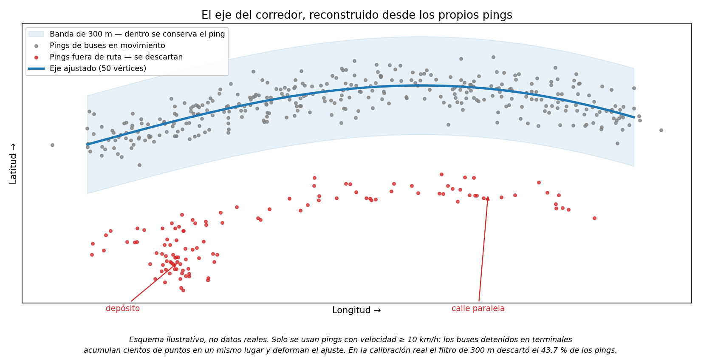
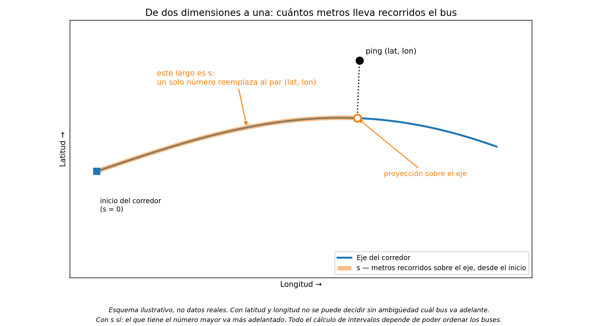
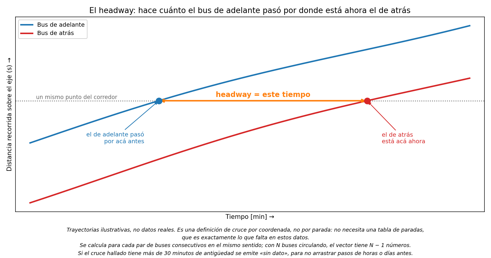
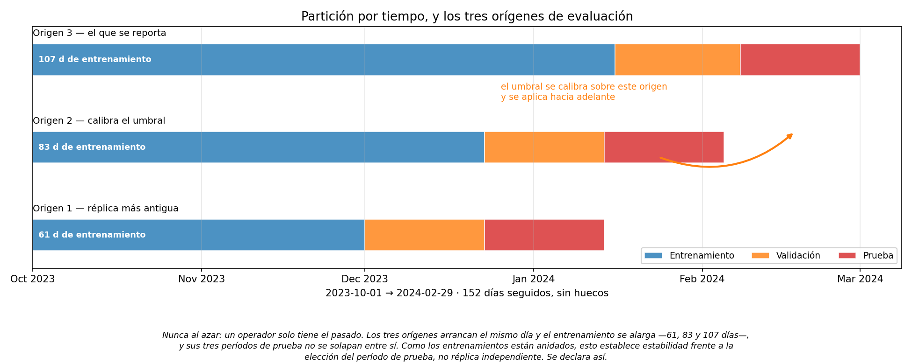
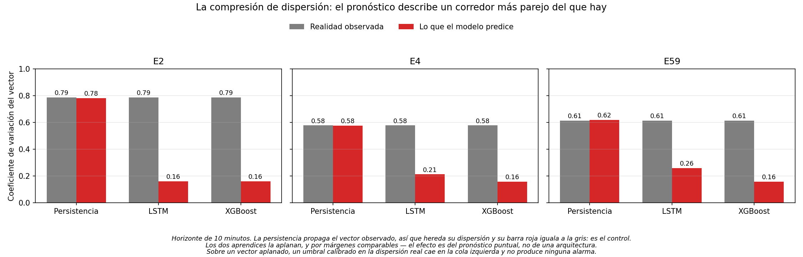
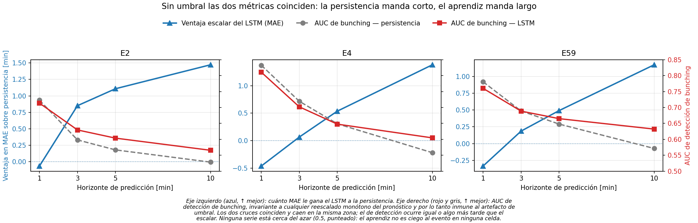

# Qué se hizo, y qué se encontró

Síntesis del trabajo, para leerse de una sentada. No hay ecuaciones ni nombres de
archivo. El detalle completo —cada decisión, cada número, cada límite— está en
[`metodologia.md`](metodologia.md), que es unas seis veces más largo que esto.

---

## El problema

Cuando dos buses de la misma línea terminan circulando pegados, seguido de un hueco
largo sin servicio, el fenómeno se llama ***bunching***. Es el modo de falla
característico de los corredores de alta frecuencia: degrada el servicio aunque la
cantidad de buses sea la correcta.

La cantidad que importa se llama ***headway***: el tiempo que pasa entre un bus y
el siguiente por un mismo punto. Un corredor sano los tiene parecidos entre sí. Uno
con *bunching* los tiene muy desparejos.

El objetivo del trabajo fue **anticiparlo**: predecir, con varios minutos de
antelación, cómo van a quedar esos intervalos, para que un operador pueda intervenir
antes de que el problema ocurra.

Los datos son de **tres corredores de Arequipa**, del sistema de GPS a bordo de los
buses: 152 días seguidos, sin huecos.

Cada corredor es el conjunto de unidades de una empresa operadora. Se los nombra con
la letra **E** —de *empresa*— y su número:

| Corredor | Unidades operativas | Registros GPS crudos |
|---|---|---|
| E2 | 31 | ~17.7 millones |
| E4 | 19 | ~7.8 millones |
| E59 | 40 | ~17.9 millones |
| **Total** | **90** | **~43.4 millones** |

---

## El hecho del que cuelga todo lo demás

Los datos de Arequipa **no traen horario programado**. No existe una tabla que diga
"este bus debe pasar cada 8 minutos". Tampoco hay tabla de paradas confiable.

Esa única carencia encadena todo el trabajo:

```
Sin horario
   └─> tampoco hay paradas confiables
          └─> hubo que reconstruir el recorrido desde las posiciones del GPS
                 └─> eso permitió definir el headway por cruce de posición
                        └─> con el headway definido se armó el experimento
                               └─> pero medir detección exige definir el evento,
                                   y la definición estándar necesita el horario
                                   que no existe
                                      └─> hubo que fabricar una alternativa
                                             └─> y al medirla contra la convención
                                                 del campo quedó al descubierto un
                                                 defecto que esa convención arrastra
```

Cada paso resuelve el problema que dejó abierto el anterior. Es la razón de que el
trabajo tenga la forma que tiene.

---

## Lo que hubo que fabricar

Sin horario y sin paradas, el *headway* no viene en el dato. Hay que construirlo
desde cero, usando solamente las posiciones que reporta el GPS.

**Primero, el recorrido.** Se ajusta una línea al montón de posiciones de los buses
en movimiento. Lo que queda lejos de esa línea —calles paralelas, depósitos, otras
líneas— se descarta.



**Segundo, se pasa de dos dimensiones a una.** Cada posición se lleva
perpendicularmente sobre esa línea y se convierte en un solo número: cuántos metros
lleva recorridos el bus a lo largo del corredor.



Esto es clave y conviene detenerse un segundo. Con latitud y longitud no se puede
decidir sin ambigüedad cuál bus va adelante. Con un solo número sí: el bus que
lleva más metros recorridos es el que va delante. Todo el cálculo de intervalos
depende de poder ordenar los buses.

**Tercero, la definición del intervalo:**

> El *headway* de un bus es **hace cuánto tiempo el bus de adelante pasó por el punto
> donde el bus de atrás está ahora.**



Es una definición por cruce de posición, no por parada. Y eso importa: la vuelve
inmune a la ausencia de una tabla de paradas, que es exactamente lo que falta acá.

No se eligió por intuición. Se compararon cuatro definiciones posibles sobre siete
criterios de calidad —con qué frecuencia se puede calcular, cuánta señal tiene, si
lo de ahora anticipa lo de dentro de un rato, si hay volumen suficiente, si la
distribución aguanta cambios de parámetros—, y se adoptó la única que mide tiempo
entre pasadas, que es la cantidad que el operador necesita, sin depender de datos
que no existen.

---

## Cómo se armó el experimento

El modelo mira **12 minutos de historia reciente** y predice cómo va a estar el
corredor completo a 1, 3, 5 y 10 minutos hacia adelante.



Los 152 días se parten **por tiempo, no al azar**: el modelo aprende con los
primeros, se afina con los del medio, y se mide con los últimos, que no vio nunca.
Si se mezclara al azar, el modelo entrenaría con minutos del futuro y el resultado
sería optimista de mentira, porque en la operación real solo se tiene el pasado.

El modelo que se entrena es una **LSTM**: una red neuronal pensada para series de
tiempo, que procesa la secuencia paso a paso y arrastra memoria de lo anterior.

Se la compara contra tres rivales, y el orden importa:

- **La persistencia.** No es un modelo, es una regla: repetir el último valor
  observado. No aprende nada y no se entrena. Es la vara mínima, y la referencia
  habitual en pronóstico de series de tiempo. Si un modelo no le gana a esto, no
  sirve.
- **XGBoost.** Aprendizaje automático clásico, no profundo: un conjunto de árboles
  de decisión que se corrigen entre sí. Es muy fuerte en datos de tabla, y es el
  competidor serio de la red.
- **El promedio histórico por hora.** Estadística descriptiva: qué intervalo suele
  haber a esa hora, según lo observado en el pasado. Es ciego al presente —solo
  mira el reloj— y lo llamamos *almanaque* por eso.

Que la persistencia sea la vara y no un modelo sofisticado no es pereza: **es la
regla más tonta posible, y a horizonte corto es difícil de superar.** Eso es en sí
un resultado, y la mayoría de los trabajos del campo ni siquiera la incluyen.

Todo se evalúa **sobre exactamente las mismas filas**, verificado automáticamente.
Sin eso, parte de la diferencia entre dos modelos viene de qué filas le tocaron a
cada uno y la comparación deja de significar algo.

---

## Lo que se encontró

### 1. El modelo pronostica bien

A 10 minutos de anticipación mejora el error frente a la persistencia en los tres
corredores, y por un margen prácticamente igual en los tres:

| Corredor | Error del modelo | Error de la persistencia | Mejora |
|---|---|---|---|
| E2 | 5.32 min | 6.79 min | **−21.7 %** |
| E4 | 5.15 min | 6.53 min | **−21.2 %** |
| E59 | 4.16 min | 5.33 min | **−22.0 %** |

*El error es el promedio de cuántos minutos se equivoca el pronóstico. Menos es
mejor.*

Que los tres corredores caigan dentro de un punto porcentual, siendo distintos en
tamaño y en volumen de datos, es lo que hace creíble la mejora: no es un corredor
afortunado. Y la ventaja se concentra donde más importa: en los momentos en que el
corredor viene más irregular.

Con dos fronteras que conviene dejar dichas: **a 1 y a 3 minutos no hay ventaja** —
a un minuto gana la persistencia. La afirmación sólida empieza a los 5 minutos.

### 2. Pero la alarma no sonaba

Antes del resultado hace falta la unidad de medida, porque de ahí salen todos los
números que siguen.

La evaluación parte el período de prueba en **celdas**: un bus, en un minuto. En E2
a 10 minutos de anticipación hay 50 353 celdas. Y la regla que decide si una celda
es *bunching* es esta:

> Un intervalo cuenta como *bunching* cuando cae por debajo de **la mitad del
> promedio de su corredor en ese instante**.

Con ese criterio, **15 245 de las 50 353 celdas son evento**: casi una de cada
tres. El corredor viene apretado alrededor de un tercio del tiempo. Ese es el
problema que había que detectar.

Ahora sí, el resultado. Al aplicar el procedimiento de detección estándar del campo,
el mismo modelo que pronostica mejor tocó la alarma **catorce veces**:

| E2, a 10 minutos | LSTM | Persistencia | Detector que marca todo |
|---|---|---|---|
| Alarmas que tocó | **14** | 15 083 | 50 353 |
| Eventos reales que había | 15 245 | 15 245 | 15 245 |
| Puntaje de detección | **0.0013** | 0.332 | **0.465** |

*El puntaje de detección resume dos cosas a la vez: de las alarmas que sonaron,
cuántas eran de verdad; y de los eventos que hubo, cuántos se agarraron. Va de 0 a
1, y más es mejor.*

**Y no es solo E2.** A 10 minutos, en los tres corredores:

| A 10 minutos | E2 | E4 | E59 |
|---|---|---|---|
| Eventos reales que había | 15 245 | 9 760 | 43 470 |
| Alarmas que tocó el modelo | 14 | 150 | 1 572 |
| Fracción de lo que debía | **0.1 %** | **1.5 %** | **3.6 %** |

E2 es el caso más extremo, y por eso es el que se desarrolla arriba. Pero E59, el
más benigno de los tres, igual toca la alarma unas **veintiocho veces menos** seguido
de lo que el problema ocurre. El colapso es general, no una celda desafortunada.

Leído de frente: parecía haberse vuelto completamente ciego a la irregularidad.

Pero la tabla trae una pista incómoda en la última columna. Un detector que no sabe
nada —que marca absolutamente todas las celdas como *bunching*, sin mirar el dato—
saca **0.465 y le gana a los dos**. Los dos métodos perdían contra una regla vacía.
Lo único que los distinguía era cuánto perdían.

**Ninguna de las dos cifras estaba midiendo qué sabe el modelo. Estaban midiendo
dónde había quedado el corte.**

### 3. Era el instrumento, no el modelo

La pregunta que desarma el veredicto es una sola: ese número, ¿mide al modelo, o
mide a la regla con la que se lo está midiendo?

Es contestable, porque las dos respuestas predicen cosas distintas. Si al modelo le
falta la información, mover el corte no la va a recuperar. Si la información está y
lo que falla es dónde quedó la raya, entonces correrla la hace reaparecer.

Se hicieron las dos pruebas que separan esas hipótesis. Las dos dieron lo mismo:
**la información estaba presente. El modelo no es ciego.**

### 4. Por qué pasaba

Todo modelo que predice un solo número **aplana la realidad**: describe un corredor
más parejo de lo que es.

Un ejemplo con buses que pasan cada 10 minutos en promedio. Un corredor ordenado da
intervalos como 9, 10, 11, 10. Uno con *bunching*, como 2, 18, 3, 17. **El promedio
de los dos es el mismo.** Lo que los distingue es qué tan desparejos son.

Medido con esa idea, la realidad de un corredor da **0.79 y la predicción del modelo
da 0.16**. El pronóstico describe un corredor casi cinco veces más parejo de lo que
realmente es.



Y no es un defecto de las redes neuronales: el XGBoost aplana igual o más.
Es lo que hace cualquier pronóstico que devuelve un único número, porque predecir el
valor esperado es exactamente promediar los futuros posibles. En estadística está
demostrado como teorema desde hace más de una década.

**Ahí está el mecanismo completo.** La regla que define el *bunching* está calibrada
sobre la realidad, que es despareja. Aplicada sobre una predicción aplanada,
simplemente nunca se dispara.

### 5. Se repara moviendo el corte, no el modelo

El problema, en una línea: **la alarma estaba puesta para sonar en un nivel de
irregularidad que un pronóstico aplanado nunca alcanza.**

Hay dos maneras de comprobar que el culpable es ese y no el modelo. Se hicieron las
dos.

**La primera: correr la raya.** Es un detector de humo tan poco sensible que nunca
suena. No se tira el detector — se le sube la sensibilidad. ¿Cuánto? Eso se mide
sobre un período anterior, nunca sobre el que después se usa para evaluar. Si no,
sería hacer trampa mirando la respuesta.

Con la raya en su nuevo lugar, la alarma vuelve a sonar:

| A 10 minutos | E2 | E4 | E59 |
|---|---|---|---|
| Antes — de las alarmas que debía tocar, tocó | 0.1 % | 1.5 % | 3.6 % |
| **Después** | **89 %** | **164 %** | **135 %** |

De estar prácticamente muda pasa a sonar en el orden correcto. En E2 se queda un
poco corta; en E4 y E59 se excede, suena más seguido de lo que el problema ocurre.
No queda perfecta — queda utilizable.

**La segunda: medir sin ninguna raya.** Si el problema es dónde está la raya,
entonces hay que medir algo que no la tenga. En lugar de preguntar "¿suena o no
suena?", se pregunta:

> Tomamos dos momentos al azar, uno con *bunching* y otro sin. ¿El modelo le da más
> riesgo al que corresponde?

Una moneda acierta la mitad de las veces. Eso es el 0.5:

| A 10 minutos | El modelo | La persistencia |
|---|---|---|
| E2 | **0.565** | 0.528 |
| E4 | **0.604** | 0.558 |
| E59 | **0.632** | 0.571 |

Acierta más que la moneda, y más que la persistencia, en los tres corredores.

**Las dos pruebas no se eligieron al azar:** se eligieron porque las dos
explicaciones posibles predicen resultados distintos. Si al modelo le faltara la
información, correr la raya no la haría aparecer, y medir sin raya tampoco.
Apareció en las dos. Eso descarta una explicación y deja la otra en pie: **el
modelo tiene la información, y el procedimiento estándar no la deja ver.**

**Ahora, la magnitud.** Un 0.565 le gana a la moneda, pero no por mucho. Estos
números muestran que la información está y que el orden entre los dos métodos se da
vuelta con el horizonte. No muestran que ninguno esté listo para operar un servicio
real.



---

## El aporte, en una frase

> **La degradación de detección que este campo viene atribuyendo a los modelos es,
> al menos en parte, un artefacto de medición. Se toma la regla que define qué es
> *bunching* en la realidad —hecha a la medida de un corredor real, que es
> desparejo— y se la usa tal cual para decidir si suena la alarma sobre un
> pronóstico, que está aplanado por construcción. Y se corrige moviendo el corte, no
> cambiando de modelo.**

Lo que le da peso es que no es una opinión sobre el campo: el procedimiento que
produce el problema está enunciado, con esas palabras, por el trabajo más citado del
subcampo. Y la consecuencia no es un accidente de implementación — es necesaria,
porque el aplanamiento del pronóstico es un teorema, no una casualidad.

**Aporte secundario, y no menor:** todo el método funciona sin horario publicado, sin
GTFS y sin tabla de paradas. Eso lo vuelve aplicable a la mayoría de las ciudades
donde el *bunching* es un problema real y el dato ordenado no existe.

---

## Lo que este trabajo NO hace

Conviene ser explícito, porque marca el borde de lo que se puede afirmar.

- **No construye un sistema de despacho.** Lo que se establece es que la información
  está presente y es explotable, no que alcance para operar un servicio real.
- **Las magnitudes absolutas son modestas.** El error de pronóstico sigue siendo
  grande frente al tamaño típico de un intervalo, y la calidad de detección, aunque
  mejor que el azar, recorre una fracción chica del camino.
- **Contra una vara más exigente que la persistencia** —el almanaque por franja
  horaria— el modelo gana en dos de los tres corredores, no en los tres.
- **Tres corredores de una ciudad, cinco meses.** El alcance geográfico y temporal es
  el que es.
- **Hay defectos declarados**, identificados en revisión interna y documentados con
  su efecto: entre ellos, una variable de entrada que no respeta del todo la regla de
  no usar información del futuro. Está medido que el hallazgo no depende de ella.

Los límites completos, con su magnitud medida, están en la Parte VI de
[`metodologia.md`](metodologia.md).

---

## Dónde está cada cosa

| | |
|---|---|
| Este documento | La síntesis. Qué se hizo y qué se encontró |
| [`metodologia.md`](metodologia.md) | El registro completo: cada decisión, con su justificación y su número |
| [`fuentes-verificadas.md`](fuentes-verificadas.md) | Las fuentes citadas, verificadas una por una contra el texto original |
