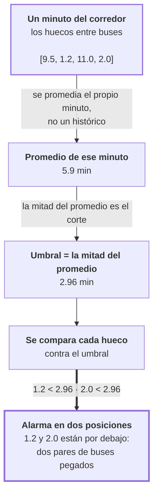

# El apelotonamiento y su alarma

Este documento usa el mismo ejemplo que [`lstm_explain.md`](lstm_explain.md): el corredor
E2, sentido `+1`, con 5 buses, a las 12:32.

## Qué es el problema

**Dos buses circulando pegados.**

Es un problema por tres razones:

- Detrás de ellos queda un hueco grande. Las personas que esperan más atrás esperan el
  doble.
- El primero del par recoge a todos los pasajeros acumulados y va lleno. El segundo va casi
  vacío inmediatamente detrás.
- Se agrava por sí solo: el primero se demora más en cada parada porque sube más gente, y
  el segundo lo alcanza cada vez más.

Un corredor con 10 buses apelotonados en 3 grupos tiene el mismo headway promedio que uno
con 10 buses bien espaciados, y presta un servicio mucho peor. **Eso es lo que el error
promedio no distingue.**

## Cómo se lee el vector

Cada número es un hueco entre dos buses, en minutos. Se lee de adelante hacia atrás.

```
   ← atrás                                              adelante →

     E           D                        C  B              A  →→→
     |--- 2.0 ---|-------- 11.0 ----------|1.2|---- 9.5 ----|

vector:         [ 9.5 ,  1.2 ,  11.0 ,  2.0 ]
                   ↑      ↑       ↑      ↑
                  B–A    C–B     D–C    E–D
```

**5 buses → 4 huecos.** El bus más adelantado (A) no tiene número propio: no hay nadie
delante de él.

En este vector se leen dos problemas y un efecto: **B y C están pegados** (1.2 min), **D y
E están pegados** (2.0 min), y **entre C y D hay un hueco de 11 minutos**.

## Cómo funciona la alarma

No es "menos de 2 minutos". El umbral es relativo al estado del corredor en ese momento.

```
vector:                 [9.5, 1.2, 11.0, 2.0]

1. promedio             = 5.9 min
2. mitad del promedio   = 2.96 min
3. marcar lo que esté por debajo:

     9.5   → no
     1.2   → SÍ  ← apelotonamiento
    11.0   → no
     2.0   → SÍ  ← apelotonamiento
```

En palabras: **este bus está mucho más cerca del de adelante que lo normal para este
momento.**

## El recorrido



## Tres reglas del cálculo

| Regla | Por qué |
|---|---|
| **El promedio es del propio minuto**, no un histórico | Un corredor con buses cada 15 minutos y otro cada 4 se juzgan cada uno contra sí mismo |
| **Menos de 3 buses en el minuto → se descarta** | Con dos buses no hay una forma del vector que medir |
| **Para una predicción se usa el promedio de la predicción** | Un operador no conoce el promedio real. Medirlo contra el real evaluaría algo que nadie podría aplicar |

## Por qué el modelo no dispara la alarma

Con el mismo minuto, comparando lo que el modelo predijo contra lo que ocurrió:

```
real:      [9.5, 1.2, 11.0, 2.0]    promedio 5.9    umbral 2.96  →  marca dos
predicho:  [6.0, 5.8,  6.2, 5.9]    promedio 5.98   umbral 2.99  →  no marca ninguna
```

Si todos los números son parecidos entre sí, ninguno queda por debajo de la mitad del
promedio. La alarma no se activa nunca.

Y no es un error de programación. El modelo fue entrenado para equivocarse lo menos posible
**en promedio**, y la forma de conseguirlo es predecir valores cercanos al promedio.
Uniformar el vector es la solución óptima al problema que se le planteó, y es incompatible
con detectar apelotonamiento.

Los números están en la fase 12: a 10 minutos en E2, el modelo detectó **10
apelotonamientos de 15 245**, cuando el apelotonamiento real ocurre en el 30 % de las
posiciones.

## Existe una segunda versión de la alarma, sin umbral

En lugar de decidir sí o no, se puede solo **ordenar** las posiciones por riesgo:

```
puntaje = − hueco / promedio del vector      (más alto = más apelotonado)
```

Eso mide si el modelo identifica **cuáles** posiciones son las más riesgosas, sin depender
de en qué escala vivan sus números.

Y en esa versión el modelo sí funciona: en horizontes largos ordena mejor que la
persistencia (fase 13).

**Conclusión de las dos versiones juntas:** el modelo identifica qué posiciones son más
riesgosas. Lo que no acierta es dónde poner el corte. Reajustando el umbral con datos de
un período anterior, la detección se recupera bastante — pero la persistencia sigue
ganando en la mayoría de las celdas.

## El control que hay que mirar siempre

Existe un detector tramposo: **marcar absolutamente todas las posiciones como
apelotonadas**. Nunca se pierde ninguna, así que a primera vista parece bueno.

Con el 30 % de apelotonamiento real, ese detector obtiene un F1 de **0.462**.

Cualquier detector por debajo de esa línea es peor que no analizar nada. Y en **5 de las 12
celdas ni la persistencia lo supera** (fase 15).

Por eso la afirmación "la persistencia detecta mejor que el modelo" es cierta pero
limitada: en horizontes largos es una diferencia entre dos detectores que no superan a
marcar todo.

## Glosario

| Término | Qué significa aquí |
|---|---|
| **Apelotonamiento** | Dos buses circulando demasiado cerca uno del otro |
| **Tasa base** | Qué porcentaje de las posiciones está realmente apelotonado. En E2 es cerca del 30 % |
| **Precisión** | De las alarmas que se dispararon, cuántas eran reales |
| **Exhaustividad** | De los apelotonamientos reales, cuántos se detectaron |
| **F1** | Un solo número entre 0 y 1 que combina precisión y exhaustividad. 1 es perfecto |
| **AUC** | Mide solo si el orden por riesgo es correcto, sin depender de dónde esté el umbral. 0.5 equivale a ordenar al azar; 1.0 es un orden perfecto |
| **Umbral** | El valor a partir del cual se dispara la alarma. Aquí es la mitad del promedio del vector |

## Referencias al código

`src/evaluation/vector_metrics.py`:

| Qué | Nombre |
|---|---|
| La mitad del promedio | `BUNCHING_RATIO = 0.5` |
| Mínimo de buses en el minuto | `MIN_VECTOR_LEN = 3` |
| La alarma sí/no | `bunching_flags` |
| La versión continua, para ordenar | `bunching_score` |
| El control de marcar todo | `trivial_f1` |

La calibración del umbral fuera de muestra está en `src/build_detection_calibrated.py`.
