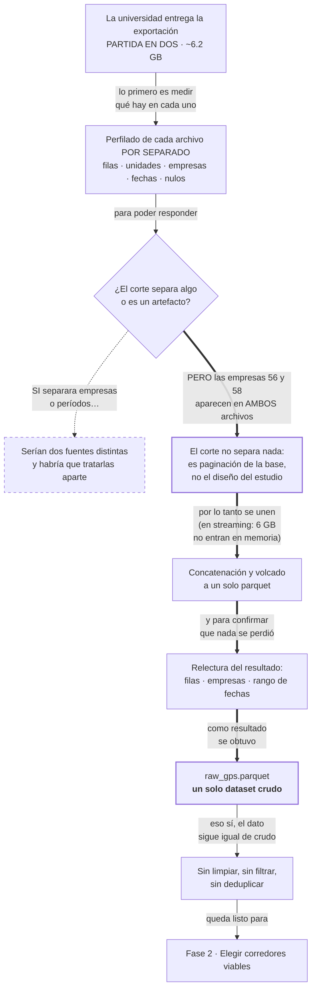

# Fase 1 · Consolidar el GPS crudo

La exportación llegó partida en dos. Esta fase decide si eso significa algo y
deja un solo dataset crudo.

La rama punteada es el camino que **no** se tomó: se dibuja porque el perfilado
existía justamente para poder descartarla. La línea gruesa es el recorrido real.

## Qué se hizo

| # | Paso | Qué hace | Dónde |
|---|---|---|---|
| 1.1 | Perfilar cada archivo | Filas, unidades, empresas, nulos de `lat` y `time`, rango de fechas, y filas por empresa — por archivo, para poder compararlos | `inspect_raw.py:10-32` |
| 1.2 | Decidir | Las empresas 56 y 58 aparecen en los dos archivos: el corte no separa nada. Se unen | `merge_raw.py:3-7` |
| 1.3 | Unir y volcar | Concatenación vertical en streaming a parquet zstd nivel 3, sin materializar en memoria | `merge_raw.py:28-34` |
| 1.4 | Verificar | Relee el parquet y reporta filas, empresas distintas y rango de fechas | `merge_raw.py:41-48` |

## Entrada y salida

| | Detalle |
|---|---|
| Entrada | `satchek1.csv` y `satchek2.csv`, ~6.2 GB en total. Rutas absolutas embebidas en el código (`merge_raw.py:20-23`) |
| Columnas | `empresaid`, `unidadid`, `time`, `lat`, `lon`. Esquema **inferido** sobre las primeras 10 000 filas, no declarado (`merge_raw.py:29`) |
| Salida | `data/raw/raw_gps.parquet` (`merge_raw.py:18`, `:34`) |

## Riesgos de esta fase

| Riesgo | Detalle |
|---|---|
| No reproducible desde el repositorio | Las rutas de entrada son absolutas y de WSL (`/mnt/c/...`); en otra máquina hay que editar el código. Los CSV no están versionados |
| La verificación no cierra el círculo | `merge_raw.py:41-48` cuenta filas del parquet, pero no las compara contra los conteos que `inspect_raw.py` reportó por archivo. Una pérdida de filas en la concatenación no se detectaría acá |
| Sin tests | Ninguno de los dos scripts tiene cobertura |
