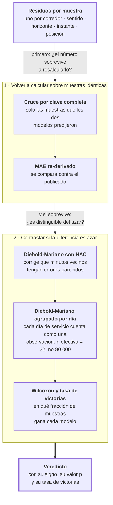

# Fase 10 · Veredicto pareado

Un MAE más bajo no prueba que un modelo sea mejor. Esta fase verifica dos cosas: que los
dos modelos se midieron sobre las mismas muestras, y que la diferencia no es azar.

- **Entra:** los residuos por muestra de la fase 9.
- **Sale:** el veredicto publicado, con sus valores p.

## Por qué hace falta

Dos problemas distintos, y cada uno invalida la comparación por su lado.

**Uno: puede que los modelos no se hayan medido sobre lo mismo.** Si el modelo A falló en
algunas muestras y el B en otras, y cada uno reporta el promedio de las suyas, los dos
promedios no son comparables.

**Dos: los errores de minutos consecutivos están correlacionados.** Con 80 000 muestras,
casi cualquier diferencia sale "significativa" si se las trata como independientes. No lo
son: el error del minuto 12:29 y el del 12:30 se parecen.

## El recorrido

## Resultado 1 · Cuatro veredictos cambiaron de signo

La auditoría se corrió sobre la generación anterior: 72 celdas, recalculando el MAE sobre
las muestras que el modelo y la persistencia comparten.

**En 4 celdas el signo se invirtió.** Lo publicado decía que la red era mejor; el
recálculo sobre muestras idénticas dice que era peor:

| Modelo | Corredor | Horizonte | Publicado | Re-derivado |
|---|---|---|---|---|
| LSTM | E2 | 1 min | −0.293 (red mejor) | **+0.037** (persistencia mejor) |
| ConvLSTM | E2 | 1 min | −0.293 | **+0.036** |
| Transformer | E2 | 1 min | −0.275 | **+0.057** |
| Transformer | E4 | 3 min | −0.029 | **+0.039** |

Y la distorsión no fue simétrica: el MAE de la red se movió en promedio 0.14 min al
recalcularlo, y el de la persistencia 0.36 min. La métrica del rival estaba más
deformada que la del modelo.

Esto es lo que justifica la fase: sin este paso, cuatro conclusiones publicadas eran del
signo contrario.

## Resultado 2 · Los veredictos de la línea recertificada

La cobertura del cruce va de 99.95 % a 99.998 %, así que el pareado no descarta
prácticamente nada.

### LSTM contra persistencia

`Δ` negativo significa que el LSTM tiene menos error. `p` es el del test agrupado por día,
el más exigente.

| Corredor | h | Δ MAE | p agrupado | Gana | Tasa de victorias |
|---|---|---|---|---|---|
| E2 | 1 | +0.067 | 0.062 | persistencia | 0.442 |
| E2 | 3 | −0.851 | 1e-18 | **LSTM** | 0.545 |
| E2 | 5 | −1.109 | 4e-21 | **LSTM** | 0.564 |
| E2 | 10 | −1.473 | 9e-25 | **LSTM** | 0.589 |
| E59 | 1 | +0.334 | 3e-13 | persistencia | 0.372 |
| E59 | 3 | −0.186 | 1e-07 | **LSTM** | 0.473 |
| E59 | 5 | −0.491 | 7e-19 | **LSTM** | 0.516 |
| E59 | 10 | −1.173 | 3e-24 | **LSTM** | 0.577 |
| E4 | 1 | +0.464 | 1e-13 | persistencia | 0.340 |
| E4 | 3 | −0.064 | **0.185** | sin decidir | 0.460 |
| E4 | 5 | −0.536 | 3e-10 | **LSTM** | 0.514 |
| E4 | 10 | −1.381 | 3e-18 | **LSTM** | 0.572 |

### LSTM contra XGBoost

| Corredor | 1 min | 3 min | 5 min | 10 min |
|---|---|---|---|---|
| E2 | XGB | XGB | XGB | XGB |
| E59 | XGB | LSTM | LSTM | LSTM |
| E4 | XGB | XGB | LSTM | LSTM |

Prueba de signos sobre las 12 celdas: el LSTM gana **7 de 12**, p = 0.774 a dos colas.

## Los hallazgos de esta fase

### 1. Contra la persistencia el veredicto se sostiene, salvo en un caso

De 3 minutos en adelante el LSTM tiene menos error, y el test más exigente lo confirma en
8 de 9 celdas. La excepción es E4 a 3 minutos: `p = 0.185`, no se puede afirmar
diferencia.

A 1 minuto gana la persistencia en los tres corredores.

### 2. Contra el XGBoost es empate

7 de 12 celdas a favor del LSTM, `p = 0.774`. No hay evidencia de que una de las dos sea
mejor. El resultado del trabajo es "el aprendizaje profundo le gana a la persistencia a
partir de 3 minutos", no "el LSTM es el mejor modelo".

### 3. La ventaja no está repartida: está concentrada

Mirá la tasa de victorias. En E2 a 10 minutos el LSTM tiene 1.47 minutos menos de error —
una diferencia grande — y sin embargo solo gana en el **58.9 %** de las muestras.

Y hay casos donde gana en promedio pero pierde en la mayoría:

| Comparación | Δ MAE (promedio) | Δ mediana | Tasa de victorias |
|---|---|---|---|
| LSTM vs persistencia · E59 · 3 min | −0.186 (LSTM mejor) | +0.155 (LSTM peor) | 0.473 |
| LSTM vs persistencia · E4 · 3 min | −0.064 (LSTM mejor) | +0.185 (LSTM peor) | 0.460 |

En esas dos celdas el LSTM **pierde en más de la mitad de las muestras** y aun así tiene
menor error promedio. La única explicación posible: gana por mucho en pocas muestras y
pierde por poco en muchas.

Eso reencuadra el resultado. El modelo no predice mejor en general; predice mucho mejor
en algunas situaciones. Encontrar cuáles es la fase 11.

### 4. El test agrupado por día es el que manda

Con 80 000 muestras y minutos correlacionados, tratar cada fila como independiente infla
la significancia. El test agrupado trata cada día de servicio como una observación: **n
efectiva = 22**, no 80 000.

Tres veredictos que el test con HAC declaró significativos no sobreviven al agrupado:

| Comparación | p con HAC | p agrupado |
|---|---|---|
| LSTM vs persistencia · E2 · 1 min | 0.00013 | 0.062 |
| LSTM vs persistencia · E4 · 3 min | 0.00084 | 0.185 |
| XGBoost vs persistencia · E2 · 1 min | 0.028 | 0.232 |

## Archivos que produce

| Archivo | Contenido |
|---|---|
| `paired_vs_reported_audit.csv` | La auditoría de la generación anterior: publicado contra re-derivado, con la marca de discrepancia de signo. 72 filas |
| `contiguous_significance.csv` | Los veredictos de la línea recertificada: Δ, cuatro valores p, tasa de victorias. 72 filas |
| `contiguous_paired_summary.csv` | Resumen compacto por corredor y horizonte |
| `xgb_vs_lstm_signtest.csv` | La prueba de signos LSTM contra XGBoost sobre las 12 celdas |

Todos en `docs/resultados/csv-multihorizon/`.

## Riesgos

- **22 días de test es poco para el test agrupado.** La n efectiva son 22 observaciones.
  Es la medición honesta, pero deja poco margen: un veredicto con `p` cerca de 0.05
  depende de pocos días. Por eso existe la fase 15.
- **La tasa de victorias por debajo de 0.5 con MAE mejor está declarada, no explicada.**
  Se sabe que la ventaja es concentrada; en qué régimen se concentra lo responde la fase
  11, y si ese régimen se puede anticipar, la 13.
- **Las cuatro discrepancias de signo son de la generación anterior.** No afectan a los
  números publicados, que salen de la línea recertificada. Están acá porque son la razón
  por la que la recertificación se hizo.
- **El empate contra XGBoost es ausencia de evidencia, no evidencia de igualdad.** Con 12
  celdas la prueba de signos tiene poco poder: no distinguiría una ventaja chica pero
  real.
