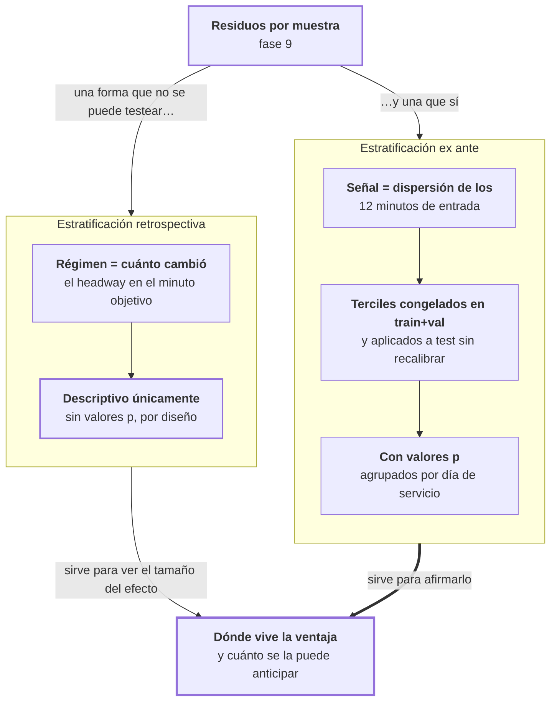

# Fase 11 · Localizar el mecanismo

La fase 10 mostró que la ventaja del modelo está concentrada: gana por mucho en pocas
muestras y pierde por poco en muchas. Esta fase busca en qué situaciones gana.

- **Entra:** los residuos por muestra de la fase 9.
- **Sale:** el error de cada modelo separado por régimen de volatilidad.

## La hipótesis y el problema para probarla

La hipótesis es directa: cuando el headway está estable, repetir el último valor acierta;
cuando salta, no. Así que la ventaja debería estar en los minutos volátiles.

El problema es cómo definir "volátil". Hay dos formas, y solo una se puede contrastar:

| | Cómo define el régimen | Se puede testear |
|---|---|---|
| **Retrospectivo** | Por cuánto cambió el headway *en el minuto que se predijo* | **No** |
| **Ex ante** | Por cuánto varió el headway *en los 12 minutos de entrada* | Sí |

El retrospectivo usa información del futuro: para saber en qué régimen cae una muestra
hay que conocer el valor que se quería predecir. No sirve para decidir nada, y tampoco
para un valor p.

## El recorrido

## Por qué el retrospectivo no lleva valores p

No es una precaución: es una comprobación. En `volatility_multihorizon.csv`, la columna
que define el régimen y el MAE de la persistencia son **el mismo número**. Lo verifiqué:
la diferencia máxima entre las dos columnas es exactamente `0.0`.

El régimen retrospectivo está definido por el error de la persistencia. Estratificar así
y después comparar contra la persistencia es circular.

Lo que sí muestra es el tamaño del efecto (E2, LSTM):

| Horizonte | Régimen | Muestras | MAE persistencia | MAE LSTM |
|---|---|---|---|---|
| 3 min | bajo | 20 % | 0.463 | 3.415 |
| 3 min | moderado | 23 % | 1.998 | 3.424 |
| 3 min | **alto** | 57 % | **9.208** | **5.962** |
| 10 min | bajo | 14 % | 0.484 | 3.835 |
| 10 min | moderado | 22 % | 1.947 | 3.519 |
| 10 min | **alto** | 64 % | **9.688** | **6.003** |

En el régimen estable la persistencia es casi perfecta (0.46 min de error) y el LSTM es
mucho peor. En el volátil se invierte. El LSTM es notablemente parejo entre regímenes
—entre 3.5 y 6.0— mientras la persistencia va de 0.46 a 9.7.

Pero, de nuevo: esos regímenes se conocen solo después. No se puede decidir con ellos.

## La estratificación que sí se puede afirmar

La señal ex ante es la dispersión de los 12 minutos de entrada. Los cortes de tercil se
calcularon sobre train+val (1.45 millones de muestras) y se aplicaron a test sin volver a
ajustarlos.

Prueba de que no se recalibraron: los terciles no salen en 33 % cada uno sobre test. En E2
quedan en 28 / 36 / 36 %. Si se hubieran ajustado sobre test, darían exactos.

**Δ MAE del LSTM contra la persistencia.** Negativo = el LSTM tiene menos error:

| Corredor | Horizonte | Tercil bajo | Tercil medio | Tercil alto |
|---|---|---|---|---|
| E2 | 1 min | +0.218 | +0.086 | −0.080 |
| E2 | 3 min | −0.189 | −0.552 | **−1.662** |
| E2 | 5 min | −0.331 | −0.774 | **−2.041** |
| E2 | 10 min | −0.554 | −1.038 | **−2.614** |
| E59 | 1 min | +0.410 | +0.295 | +0.295 |
| E59 | 3 min | +0.159 | −0.157 | −0.559 |
| E59 | 5 min | −0.097 | −0.439 | −0.940 |
| E59 | 10 min | −0.607 | −0.975 | **−1.959** |
| E4 | 1 min | +0.593 | +0.486 | +0.333 |
| E4 | 3 min | +0.370 | +0.006 | −0.451 |
| E4 | 5 min | −0.036 | −0.387 | −1.039 |
| E4 | 10 min | −0.659 | −1.116 | **−2.172** |

## El hallazgo de esta fase

**En las 12 celdas, la ventaja crece al pasar a un tercil más volátil. Sin excepciones.**

Es el patrón más limpio de todo el trabajo. Y responde la pregunta que dejó abierta la
fase 10: la ventaja no está repartida porque **depende del régimen**.

Tres lecturas concretas:

**El efecto es grande donde se concentra.** En E2 a 10 minutos, el tercil alto da 2.61
minutos menos de error. El promedio de esa celda era 1.47 — el promedio diluye.

**En el tercil bajo el modelo suele ser peor.** A 1 y 3 minutos, con poca volatilidad de
entrada, la persistencia gana en los tres corredores. El modelo no es mejor en todas
partes; es mejor en un régimen y peor en otro.

**El cruce se mueve con el horizonte.** A 1 minuto el LSTM pierde en casi todos los
terciles; a 10 minutos gana en todos. Cuanto más lejos el objetivo, menos alcanza la
inercia.

## El límite: la señal ex ante predice mal el régimen

La estratificación funciona, pero la señal es débil. La correlación entre la dispersión de
entrada y la volatilidad que realmente ocurre:

| Corredor | Horizonte | Pearson r | r² | Ganancia en el tercil alto |
|---|---|---|---|---|
| E2 | 3 min | 0.274 | 0.075 | 1.15× |
| E2 | 10 min | 0.252 | 0.064 | 1.11× |
| E59 | 3 min | 0.268 | 0.072 | 1.20× |
| E59 | 10 min | 0.224 | 0.050 | 1.12× |
| E4 | 3 min | 0.257 | 0.066 | 1.29× |
| E4 | 10 min | 0.225 | 0.051 | 1.14× |

**r² entre 0.05 y 0.075.** La dispersión de la ventana de entrada explica entre el 5 % y el
7 % de la variación de la volatilidad real. Y estar en el tercil alto ex ante solo eleva
la probabilidad de caer en régimen volátil entre 1.1 y 1.3 veces.

O sea: se sabe **dónde** está la ventaja, pero se anticipa mal **cuándo** va a estar. Eso
es lo que acota lo que puede lograr una política de conmutación, y es el problema que
enfrentan las fases 13 y 14.

## Archivos que produce

| Archivo | Contenido |
|---|---|
| `contiguous_exante_volatility.csv` | Lo principal: MAE por tercil ex ante con Δ y valores p. 36 filas |
| `volatility_multihorizon.csv` | La estratificación retrospectiva, descriptiva. 108 filas |
| `exante_correlation_multihorizon.csv` | Correlación entre la señal ex ante y la volatilidad realizada |
| `exante_alignment_multihorizon.csv` | Concordancia entre las dos estratificaciones |
| `contiguous_ha_volatility.csv` | El mismo corte contra la media histórica en vez de la persistencia |

Todos en `docs/resultados/csv-multihorizon/`.

## Riesgos

- **La estratificación retrospectiva es circular y está publicada como descriptiva.** El
  riesgo no es el análisis, es que se lea como evidencia. Los números del régimen alto
  (persistencia con 9.7 min de error) son reales pero no se pueden usar para afirmar
  ventaja, porque el régimen se define con el error de la persistencia.
- **Tres celdas no alcanzan significancia.** E2 a 1 min tercil alto (`p = 0.215`), E4 a 3
  min tercil medio (`p = 0.872`) y E4 a 5 min tercil bajo (`p = 0.509`). El patrón
  monótono se sostiene, pero no todas las casillas están confirmadas.
- **Los terciles se congelaron en train+val, no en test — pero se congelaron una vez.** Si
  el régimen del corredor cambiara con el tiempo, los cortes quedarían desalineados. La
  fase 15 es la que prueba si eso ocurre en otros orígenes.
- **La señal ex ante con r² de 0.07 no es un predictor útil por sí sola.** Sirve para
  partir la muestra en tres y mostrar el patrón. No sirve para decidir muestra por muestra
  sin más información.
