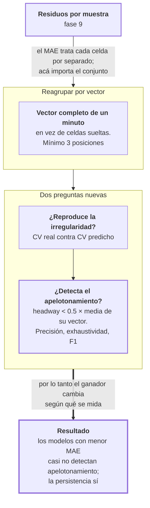

# Fase 12 · Evaluar a nivel de vector

El MAE mide el error de cada headway por separado. Pero la pregunta operativa no es
"¿cuántos minutos me equivoqué?", es "¿va a haber dos buses pegados?". Esta fase mide eso.

- **Entra:** los residuos por muestra de la fase 9.
- **Sale:** dos métricas que el MAE no puede ver: regularidad del servicio y detección de
  apelotonamiento.

## Lo que el MAE no ve

Un vector predicho puede tener buen MAE y ser inútil. Ejemplo con tres posiciones:

```
real:       [2, 8, 8]     ← hay apelotonamiento: el primer par está pegado
predicho A: [6, 6, 6]     ← MAE = 2.67, y no detecta nada
predicho B: [2, 5, 11]    ← MAE = 3.00, y detecta el apelotonamiento
```

A tiene mejor MAE y no sirve. B tiene peor MAE y sirve. El MAE no distingue.

Dos métricas para separarlos:

| | Qué mide |
|---|---|
| **CV del vector** | Desvío dividido media. Alto = buses mal espaciados, bajo = servicio regular. Se compara el CV real contra el predicho |
| **Detección de apelotonamiento** | Un headway se marca cuando es menor a **0.5 × la media de su propio vector**. Se cuenta cuántos aciertos y errores tiene cada modelo. Mínimo 3 posiciones por vector |

## El recorrido



## Resultado 1 · Los modelos aplanan el vector

CV real contra CV predicho, corredor E2:

| Modelo | h | CV real | CV predicho | Sesgo | Correlación |
|---|---|---|---|---|---|
| Persistencia | 1 | 0.777 | 0.788 | **+0.011** | 0.493 |
| Persistencia | 10 | 0.787 | 0.782 | **−0.005** | 0.100 |
| LSTM | 1 | 0.777 | 0.362 | −0.415 | 0.303 |
| LSTM | 10 | 0.787 | 0.161 | **−0.626** | 0.062 |
| XGBoost | 10 | 0.787 | 0.161 | **−0.626** | **−0.017** |

La persistencia reproduce la irregularidad real casi exactamente: sesgo de 0.011 y
−0.005. Tiene sentido, porque copia el último vector observado.

Los modelos entrenados predicen vectores mucho más uniformes que la realidad. A 10
minutos el LSTM predice un CV de 0.161 cuando el real es 0.787: predice buses casi
perfectamente espaciados en un corredor que no lo está.

Y la correlación del XGBoost a 10 minutos es **−0.017**: su estimación de irregularidad no
tiene relación con la real.

## Resultado 2 · Los modelos casi no detectan apelotonamiento

F1 de detección, corredor E2. El apelotonamiento real ocurre en el 30 % de las celdas:

| Modelo | 1 min | 3 min | 5 min | 10 min |
|---|---|---|---|---|
| **Persistencia** | **0.581** | **0.414** | **0.375** | **0.332** |
| LSTM | 0.207 | 0.038 | 0.011 | **0.0013** |
| XGBoost | 0.185 | 0.007 | **0.000** | **0.000** |

A 10 minutos en E2:

| | Casos marcados | Casos reales |
|---|---|---|
| Persistencia | 30.0 % | 30.3 % |
| LSTM | **0.03 %** | 30.3 % |
| XGBoost | **0 %** | 30.3 % |

El LSTM detectó **10 apelotonamientos de 15 245**. El XGBoost detectó **cero** — en E2 a 5
y 10 minutos, y en E4 a 10 minutos.

**Pero la precisión se mantiene alta.** Cuando el LSTM marca, acierta el 71 % de las
veces. El problema no es que marque mal: es que casi nunca marca.

## El hallazgo de esta fase

**El MAE eligió al ganador equivocado para la tarea operativa.**

Las fases 9 y 10 concluyeron que el LSTM le gana a la persistencia de 3 minutos en
adelante, con valores p contundentes. Esta fase mide lo que un despachador necesita y el
orden se invierte:

| | E2, 10 min |
|---|---|
| MAE — gana el LSTM | 5.297 contra 6.793 |
| F1 de apelotonamiento — gana la persistencia | 0.332 contra 0.0013 |

La persistencia detecta 250 veces más apelotonamiento que el modelo que le gana en MAE.

### Por qué pasa

La causa es la función de pérdida. El entrenamiento minimiza el error cuadrático, y el
error cuadrático se minimiza prediciendo cerca del promedio. Eso aplana el vector.

Y el apelotonamiento está definido como estar **por debajo de la media del propio
vector**. Un vector aplanado no puede tener valores muy por debajo de su media. La
predicción que minimiza el MAE es estructuralmente incapaz de disparar la detección.

La persistencia no tiene ese problema porque no optimiza nada: copia el vector anterior,
irregularidad incluida.

## Resultado 3 · El error por posición

MAE según la posición dentro del vector (E2, 3 min):

| Posición | LSTM | Persistencia | XGBoost | Muestras |
|---|---|---|---|---|
| 1 | 5.289 | 5.789 | 5.089 | 16 040 |
| 3 | **4.475** | 5.288 | **4.464** | 11 943 |
| 4 | 4.423 | 5.248 | 4.489 | 11 228 |
| 7 | 4.827 | 5.970 | 4.924 | 5 323 |
| 10 | 5.876 | 6.997 | 5.827 | 899 |
| 12 | 6.431 | 7.041 | 6.425 | 137 |
| 14 | 7.168 | 12.890 | 5.811 | **4** |
| 15 | 0.882 | 3.000 | 0.357 | **1** |

Dos cosas:

**El error es peor en los extremos.** Mínimo en las posiciones 3 y 4, y crece hacia
adelante y hacia atrás. La posición 1 —el par más adelantado— es de las más difíciles.

**La cola no tiene datos.** La posición 14 tiene 4 muestras y la 15 tiene 1. El modelo
tiene casillas de salida para posiciones que prácticamente no existen: es el ancho de
vector inflado que viene de la fase 5, ahora visible celda por celda.

## Archivos que produce

| Archivo | Contenido |
|---|---|
| `contiguous_vector_metrics.csv` | CV y detección de apelotonamiento para los tres modelos. 36 filas |
| `contiguous_error_profile.csv` | MAE por posición del vector. 492 filas |

Ambos en `docs/resultados/csv-multihorizon/`.

## Riesgos

- **El umbral de 0.5 × la media es un punto de operación, no una verdad.** Está calibrado
  sobre vectores observados. Un modelo que aplana el vector nunca lo cruza, así que este
  resultado mezcla dos cosas: que el modelo no ordena bien el riesgo, y que el umbral no
  está ajustado a la escala de sus predicciones. Separarlas es la fase 13.
- **La precisión alta con exhaustividad casi nula apunta a lo segundo.** Que el LSTM
  acierte el 71 % de lo que marca sugiere que la señal existe y el corte está mal puesto.
  Es una hipótesis, y la fase 13 la contrasta con un umbral reajustado fuera de muestra.
- **La comparación de F1 no lleva valores p.** Los MAE de las fases 9 y 10 sí. Las
  diferencias son enormes (0.332 contra 0.0013), pero no están contrastadas
  estadísticamente en este archivo.
- **La métrica de CV mide forma, no nivel.** Un modelo podría acertar el CV con todos los
  valores mal. Se lee junto al MAE, no en lugar de él.
