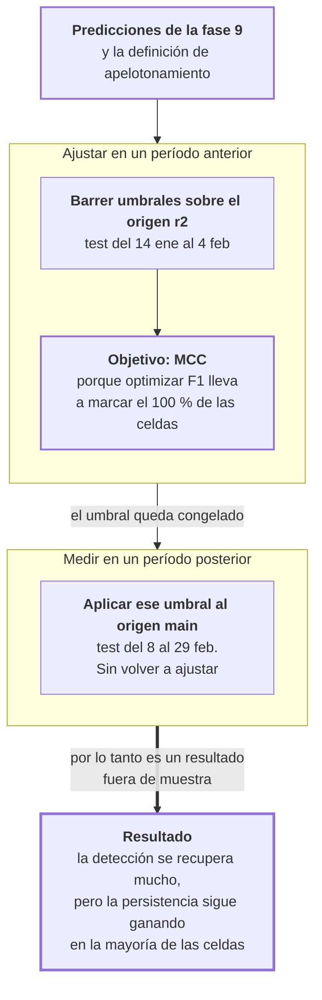

# Fase 13 · Calibrar el umbral de decisión

La fase 12 dejó una hipótesis: el modelo casi no detecta apelotonamiento porque el umbral
está mal puesto, no porque le falte señal. Esta fase la contrasta.

- **Entra:** los residuos por muestra y la definición de apelotonamiento de la fase 12.
- **Sale:** el rendimiento de detección con el umbral reajustado fuera de muestra.

## El experimento

El umbral fijo de la fase 12 —marcar cuando el headway es menor a 0.5 × la media del
vector— está pensado para vectores observados. Un modelo que aplana el vector nunca lo
cruza.

Así que se busca el umbral que mejor funciona para cada modelo, **y se lo busca en un
período distinto del que se usa para medir**:

| | |
|---|---|
| Dónde se ajusta el umbral | origen `r2` (test: 14 ene – 4 feb) |
| Dónde se mide | origen `main` (test: 8 – 29 feb) |

Si se ajustara y midiera en el mismo período, el resultado sería el mejor caso posible y
no diría nada sobre uso real.

## Por qué el objetivo es MCC y no F1

Se probaron los dos. Ajustar buscando el mejor F1 **degenera**: el umbral se corre hasta
marcar todo.

| Ajustando para F1 (E2) | Fracción de celdas marcadas | F1 obtenido | F1 de marcar todo |
|---|---|---|---|
| Persistencia · 3 min | **1.000** | 0.462 | 0.462 |
| Persistencia · 5 min | **1.000** | 0.462 | 0.462 |
| Persistencia · 10 min | 0.999 | 0.465 | 0.465 |
| LSTM · 10 min | 0.976 | 0.465 | 0.465 |

Con una tasa base del 30 %, marcar todo da F1 = 0.46. El ajuste por F1 llega exactamente
a ese número: encontró que la mejor estrategia es no discriminar nada.

MCC no tiene ese problema porque penaliza los falsos positivos de forma simétrica. Los
umbrales ajustados por MCC marcan entre el 15 % y el 36 % de las celdas, cerca de la tasa
base real.

## El recorrido

## Resultado 1 · La hipótesis de la fase 12 era correcta

Recalibrar recupera casi toda la detección perdida. F1 del LSTM:

| Corredor | Horizonte | Umbral fijo | Recalibrado |
|---|---|---|---|
| E2 | 1 min | 0.207 | **0.522** |
| E2 | 3 min | 0.038 | **0.428** |
| E2 | 5 min | 0.011 | **0.412** |
| E2 | 10 min | **0.001** | **0.346** |
| E59 | 10 min | 0.034 | **0.359** |
| E4 | 10 min | 0.015 | **0.316** |

En E2 a 10 minutos el F1 pasa de 0.001 a 0.346: **265 veces**. La señal estaba ahí. Lo que
fallaba era el punto de corte.

Esto corrige la lectura de la fase 12: el modelo no es incapaz de ordenar el riesgo de
apelotonamiento. Es que sus predicciones viven en una escala más comprimida, y el umbral
pensado para datos observados no se traslada.

## Resultado 2 · Pero la persistencia sigue ganando en la mayoría de las celdas

Con los dos modelos calibrados de la misma forma, MCC sobre el origen `main`:

| Corredor | Horizonte | LSTM | Persistencia | Gana |
|---|---|---|---|---|
| E2 | 1 min | 0.310 | **0.401** | persistencia |
| E2 | 3 min | **0.178** | 0.160 | LSTM |
| E2 | 5 min | **0.139** | 0.102 | LSTM |
| E2 | 10 min | **0.085** | 0.027 | LSTM |
| E59 | 1 min | 0.363 | **0.517** | persistencia |
| E59 | 3 min | 0.237 | **0.328** | persistencia |
| E59 | 5 min | 0.205 | **0.249** | persistencia |
| E59 | 10 min | **0.161** | 0.119 | LSTM |
| E4 | 1 min | 0.476 | **0.615** | persistencia |
| E4 | 3 min | 0.269 | **0.375** | persistencia |
| E4 | 5 min | 0.190 | **0.254** | persistencia |
| E4 | 10 min | **0.126** | 0.111 | LSTM |

**Persistencia 7, LSTM 5.**

El patrón es claro y es el mismo de la fase 11: el LSTM gana en los horizontes largos.
A 10 minutos gana en los tres corredores; a 1 minuto pierde en los tres.

## Resultado 3 · La capacidad de ordenar el riesgo

El AUC no depende de ningún umbral: mide solo si el modelo ordena bien las celdas por
riesgo.

| Corredor | 1 min | 3 min | 5 min | 10 min |
|---|---|---|---|---|
| E2 · LSTM | 0.714 | **0.629** | **0.604** | **0.565** |
| E2 · Persistencia | **0.723** | 0.598 | 0.567 | 0.528 |
| E59 · LSTM | 0.760 | 0.688 | **0.665** | **0.632** |
| E59 · Persistencia | **0.781** | 0.689 | 0.648 | 0.571 |
| E4 · LSTM | 0.811 | 0.702 | 0.648 | **0.604** |
| E4 · Persistencia | **0.833** | **0.719** | 0.649 | 0.558 |

Mismo patrón. Y una observación sobre el nivel absoluto: a 10 minutos el AUC de la
persistencia en E2 es 0.528, casi indistinguible de tirar una moneda (0.5). El del LSTM es
0.565. Los dos son débiles; el del LSTM lo es menos.

## Resultado 4 · El umbral es estable, salvo el de la persistencia por F1

El umbral se ajustó también en el origen `r1` para ver si la elección del período importa:

| | Umbral en r1 | en r2 | en main | Dispersión |
|---|---|---|---|---|
| LSTM · E2 · 1 min | −0.755 | −0.801 | −0.819 | 0.064 |
| LSTM · E2 · 10 min | −0.907 | −0.903 | −0.960 | 0.057 |
| Persistencia · E2 · 10 min | −0.385 | −1.202 | −0.338 | **0.864** |
| Persistencia · E2 · 3 min, por F1 | −1.450 | −4.863 | −5.016 | **3.566** |

El umbral del LSTM es estable: cambia menos de 0.07 entre orígenes, y el MCC que produce
en `main` es prácticamente el mismo se ajuste en `r1` o en `r2` (0.3087 contra 0.3104).

El de la persistencia no lo es, y el ajustado por F1 es errático. Otra señal de que ese
objetivo no sirve acá.

## Resultado 5 · Con umbral absoluto el modelo tampoco marca

Comprobación de robustez: en vez de definir apelotonamiento como "por debajo de la mitad
de la media del vector", usar un corte fijo en minutos (1.45 min). Con umbral fijo, sin
recalibrar:

| E2 | F1 relativo | F1 absoluto |
|---|---|---|
| LSTM · 5 min | 0.011 | **0.000** |
| LSTM · 10 min | 0.001 | **0.000** |
| Persistencia · 5 min | 0.375 | 0.239 |
| Persistencia · 10 min | 0.332 | 0.184 |

El problema del umbral fijo no era un artefacto de la definición relativa. Bajo cualquiera
de las dos, sin recalibrar, el LSTM no marca.

## Archivos que produce

| Archivo | Contenido |
|---|---|
| `contiguous_detection_calibrated.csv` | Lo principal: F1 y MCC con umbral fijo y recalibrado, más AUC y precisión media. 24 filas |
| `threshold_stability.csv` | El umbral ajustado en cada uno de los tres orígenes, con su dispersión |
| `threshold_absolute_comparison.csv` | La misma detección con un corte absoluto en minutos |

Todos en `docs/resultados/csv-multihorizon/`.

## Riesgos

- **El resultado de la fase 12 queda matizado, no anulado.** Con el umbral pensado para
  datos observados, el modelo no detecta nada; recalibrado, detecta. Las dos cosas son
  ciertas, y cuál importa depende de si en producción se puede recalibrar.
- **Aun recalibrado, la persistencia gana 7 de 12 celdas.** La conclusión de la fase 12 se
  invierte solo en los horizontes largos.
- **El nivel absoluto de detección es bajo en todos los casos.** El mejor MCC del LSTM a
  10 minutos es 0.126, y el mejor AUC 0.632. Que un modelo gane no significa que sirva
  para operar.
- **El umbral se calibró en 22 días y se midió en otros 22.** Es fuera de muestra, que es
  lo correcto, pero con poco material. La estabilidad entre `r1` y `r2` es tranquilizadora
  y no es una garantía.
- **No hay valores p en este análisis.** Las diferencias de MCC no están contrastadas
  estadísticamente, a diferencia de los MAE de la fase 10.
