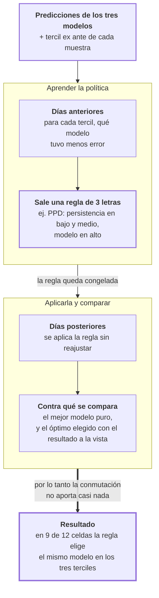

# Fase 14 · Probar una política de conmutación

La fase 11 encontró que cada modelo gana en un régimen distinto. La consecuencia práctica
sería: usar la persistencia cuando el corredor está estable y el modelo cuando está
volátil. Esta fase prueba si eso funciona.

- **Entra:** las predicciones de los tres modelos y la señal ex ante de la fase 11.
- **Sale:** el error de una política que elige modelo muestra por muestra.

## Qué es la política

No es un modelo nuevo. Es una regla de tres casillas: para cada tercil de volatilidad ex
ante, qué modelo usar.

```
tercil bajo  → persistencia
tercil medio → persistencia
tercil alto  → modelo
```

Esa regla se escribe con tres letras: `PPD`. Se aprende en un período y se aplica en otro.

Y hay un detalle que decide la validez del experimento: **cómo se parte el período**.

| | Cómo parte | Problema |
|---|---|---|
| Aleatorio | Muestras al azar para aprender y para evaluar | Ventanas solapadas casi idénticas caen a los dos lados. La política se evalúa sobre muestras que ya vio |
| **Temporal** | Días anteriores para aprender, posteriores para evaluar | Ninguno. Es el que vale |

## El recorrido



## Resultado · La política colapsa a un solo modelo

Con partición temporal, las 12 celdas. `P` = persistencia, `D` = modelo profundo. La
última columna es lo que se gana **sobre usar directamente el mejor modelo puro**:

| Corredor | h | Política | MAE persistencia | MAE modelo | MAE política | Ganancia sobre el mejor puro |
|---|---|---|---|---|---|---|
| E2 | 1 | `PPD` | 4.1600 | 4.2910 | 4.1597 | **−0.0003** |
| E2 | 3 | `DDD` | 5.7777 | 4.9290 | 4.9290 | **0.0000** |
| E2 | 5 | `DDD` | 6.2487 | 5.1014 | 5.1014 | **0.0000** |
| E2 | 10 | `DDD` | 6.8270 | 5.2539 | 5.2539 | **0.0000** |
| E59 | 1 | `PPP` | 2.8965 | 3.2060 | 2.8965 | **0.0000** |
| E59 | 3 | `PDD` | 3.9666 | 3.7634 | 3.7072 | **−0.0562** |
| E59 | 5 | `DDD` | 4.4562 | 3.9765 | 3.9765 | **0.0000** |
| E59 | 10 | `DDD` | 5.3140 | 4.2362 | 4.2362 | **0.0000** |
| E4 | 1 | `PPP` | 2.8344 | 3.3836 | 2.8344 | **0.0000** |
| E4 | 3 | `PPD` | 4.4174 | 4.4712 | 4.3036 | **−0.1676** |
| E4 | 5 | `DDD` | 5.4157 | 4.9641 | 4.9641 | **0.0000** |
| E4 | 10 | `DDD` | 6.8930 | 5.5021 | 5.5021 | **0.0000** |

Contando las letras: **`DDD` aparece 7 veces y `PPP` 2**. En 9 de 12 celdas la política
elige el mismo modelo en los tres terciles — o sea, no conmuta nada.

Las 3 celdas donde sí conmuta ganan 0.0003, 0.056 y 0.168 minutos. La mejor es E4 a 3
minutos: **10 segundos**.

Promedio de la ganancia sobre las 12 celdas: **0.0076 minutos**, menos de medio segundo.

## Los hallazgos de esta fase

### 1. El límite no es el ajuste, es la regla

La columna del óptimo elegido con el resultado a la vista es prácticamente idéntica a la
de la política aprendida: la brecha promedio es de 0.0042 minutos.

Eso descarta la explicación fácil. No es que la política se aprenda mal: es que **incluso
eligiendo la mejor asignación de terciles con el resultado ya conocido, no hay nada que
ganar**. El espacio de reglas de tres casillas no tiene margen.

### 2. Es la consecuencia directa de la fase 11

La fase 11 midió que la señal ex ante explica entre el 5 % y el 7 % de la volatilidad real,
con una ganancia de 1.1 a 1.3 veces en el tercil alto. Con esa capacidad de anticipación,
una regla basada en esos terciles no puede separar los casos.

Se sabe que la ventaja existe y dónde vive. No se la puede anticipar lo bastante bien para
decidir con ella.

### 3. El corte aleatorio da un resultado mejor y es el equivocado

Se corrieron las dos particiones, con 21 semillas:

| Partición | Celdas | Ganancia media | Brecha al óptimo |
|---|---|---|---|
| Aleatoria | 240 | 0.0114 | 0.0008 |
| **Temporal** | 12 | **0.0076** | 0.0042 |

La aleatoria muestra más ganancia y menos brecha al óptimo, que es exactamente lo que se
espera cuando ventanas casi gemelas caen a los dos lados de la partición: la política se
evalúa sobre muestras que ya vio.

La diferencia es chica porque el resultado es chico en los dos casos. Pero el orden es el
que importa: la partición más permisiva es la que da mejor resultado.

## Archivos que produce

| Archivo | Contenido |
|---|---|
| `router_temporal_multihorizon.csv` | El resultado válido: partición temporal, 12 celdas |
| `router_multihorizon.csv` | La misma política con partición por semilla fija |
| `contiguous_router.csv` | El barrido completo: 252 filas, 21 semillas, las dos particiones |
| `router_seed_sweep_multihorizon.csv` | Sensibilidad a la semilla de partición |

Todos en `docs/resultados/csv-multihorizon/`.

## Riesgos

- **Este es un resultado negativo, y como tal es más débil que uno positivo.** Dice que
  *esta* regla, con *esta* señal, no aporta. No dice que ninguna política de conmutación
  pueda funcionar. Una señal con mejor poder predictivo cambiaría la conclusión.
- **El espacio de reglas es muy chico a propósito.** Tres casillas y dos modelos: ocho
  reglas posibles. Es transparente y auditable, y también es lo que limita el margen. Una
  política continua sobre la señal ex ante no se probó.
- **La partición aleatoria está publicada junto a la temporal.** Sus números son mejores y
  no son válidos. El riesgo es que se citen sin la aclaración.
- **La política se evalúa por MAE.** Dado lo que encontraron las fases 12 y 13, una
  política orientada a detectar apelotonamiento podría dar otro resultado. No se probó.
