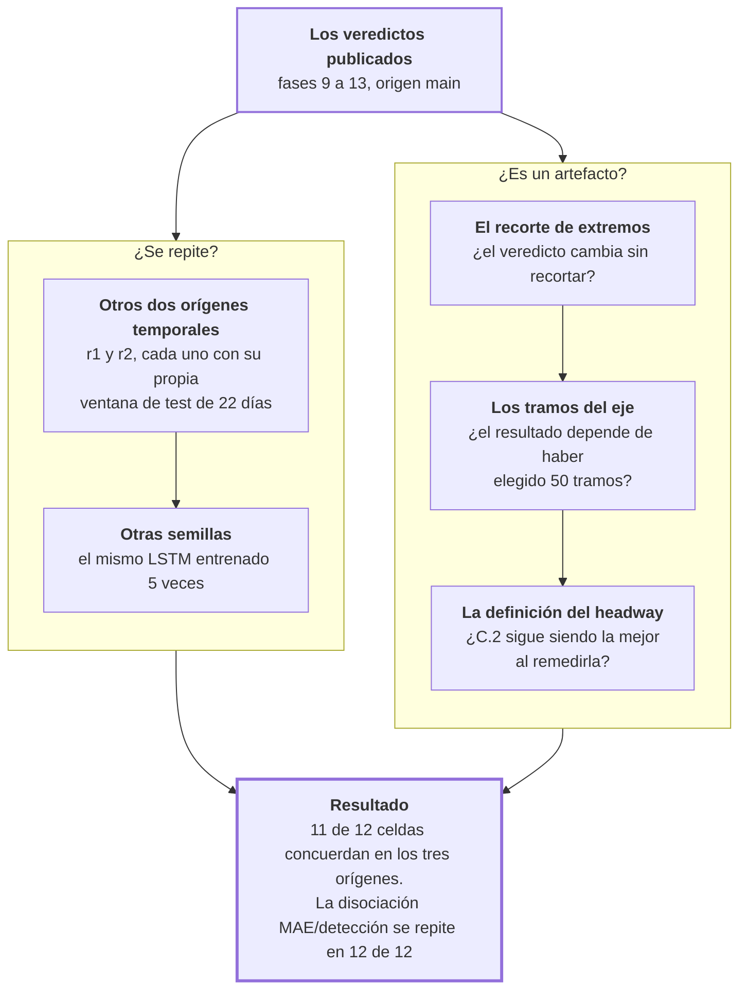

# Fase 15 · Validez externa y amenazas

Dos preguntas sobre todo lo anterior: ¿se repite en otros períodos y con otras semillas?
¿Y hay alguna decisión del pipeline que esté produciendo el resultado?

- **Entra:** todos los veredictos de las fases 9 a 13.
- **Sale:** en qué celdas el resultado se sostiene y en cuáles no.

## El recorrido

## Replicación 1 · Otros orígenes temporales

El veredicto de MAE, LSTM contra persistencia, en los tres orígenes:

| Corredor | h | `r1` | `r2` | `main` | Concuerda |
|---|---|---|---|---|---|
| E2 | 1 | persistencia | persistencia | persistencia | sí |
| E2 | 3 | LSTM | LSTM | LSTM | sí |
| E2 | 5 | LSTM | LSTM | LSTM | sí |
| E2 | 10 | LSTM | LSTM | LSTM | sí |
| E59 | 1 | persistencia | persistencia | persistencia | sí |
| E59 | 3 | LSTM | LSTM | LSTM | sí |
| E59 | 5 | LSTM | LSTM | LSTM | sí |
| E59 | 10 | LSTM | LSTM | LSTM | sí |
| E4 | 1 | persistencia | persistencia | persistencia | sí |
| **E4** | **3** | **persistencia** | **LSTM** | **LSTM** | **no** |
| E4 | 5 | LSTM | LSTM | LSTM | sí |
| E4 | 10 | LSTM | LSTM | LSTM | sí |

**11 de 12 concuerdan.** La excepción es E4 a 3 minutos, y no es una excepción nueva: es
la misma celda que en la fase 10 no pasó el test agrupado por día (`p = 0.185`) y la
misma que en la fase 11 tenía el tercil medio sin significancia (`p = 0.872`).

Tres análisis independientes señalan la misma casilla. Eso es coherencia, no ruido.

## Replicación 2 · Otras semillas

El mismo LSTM entrenado 5 veces con distinta inicialización. Variación del MAE, en
porcentaje:

| | Mínima | Media | Máxima |
|---|---|---|---|
| Coeficiente de variación | 0.027 % | 0.152 % | **0.476 %** |

Por debajo de medio punto porcentual en el peor caso. El resultado no depende de la
semilla.

## Replicación 3 · La disociación se repite en todas las celdas

Esto es lo importante de la fase. La contradicción que encontró la fase 12 —el MAE elige
un modelo y la detección de apelotonamiento elige el otro— se evaluó en los tres orígenes:

| Corredor | h | Gana por detección | Concuerda | Gana por AUC | Concuerda | Cociente F1 |
|---|---|---|---|---|---|---|
| E2 | 1 | persistencia | sí | persistencia | sí | 2.8× |
| E2 | 3 | persistencia | sí | LSTM | sí | 10.9× |
| E2 | 5 | persistencia | sí | LSTM | sí | 35.6× |
| E2 | 10 | persistencia | sí | LSTM | sí | **253.4×** |
| E59 | 1 | persistencia | sí | persistencia | sí | 2.0× |
| E59 | 3 | persistencia | sí | persistencia | sí | 3.6× |
| E59 | 5 | persistencia | sí | LSTM | sí | 4.9× |
| E59 | 10 | persistencia | sí | LSTM | sí | 8.8× |
| E4 | 1 | persistencia | sí | persistencia | sí | 1.5× |
| E4 | 3 | persistencia | sí | persistencia | sí | 2.7× |
| E4 | 5 | persistencia | sí | dividido | **no** | 5.8× |
| E4 | 10 | persistencia | sí | LSTM | sí | 17.7× |

**La persistencia gana la detección en 12 de 12 celdas, y concuerda en los tres orígenes
en 12 de 12.** El cociente crece con el horizonte: a 10 minutos en E2, la persistencia
detecta 253 veces más apelotonamiento.

Al mismo tiempo el AUC —la capacidad de ordenar el riesgo— favorece al LSTM en los
horizontes largos, y también concuerda entre orígenes en 11 de 12.

Las dos cosas son estables. La contradicción no es un accidente de un período.

### Con un matiz que hay que declarar

En 5 de las 12 celdas la persistencia **no le gana al detector trivial** —el que marca
todas las celdas—: E2 a 3, 5 y 10 minutos, E4 a 10 y E59 a 10.

Así que en los horizontes largos "la persistencia gana la detección" es una victoria
relativa. Ninguno de los dos supera a marcar todo.

## Amenaza 1 · El recorte de extremos no cambia el veredicto

El recorte al percentil 99 afecta a poco más del 1 % de los objetivos. Recalculando contra
el objetivo sin recortar (E2, LSTM):

| h | % recortado | Δ con recorte | Δ sin recorte | p |
|---|---|---|---|---|
| 1 | 1.07 % | +0.067 | +0.063 | 0.078 |
| 3 | 1.04 % | −0.851 | −0.857 | 9e-19 |
| 5 | 1.03 % | −1.109 | −1.116 | 4e-21 |
| 10 | 1.11 % | −1.473 | −1.480 | 8e-25 |

Las diferencias entre las dos columnas son de milésimas y ningún signo cambia. El recorte
no produce el resultado.

## Amenaza 2 · El eje del corredor sí depende del número de tramos

Acá el resultado es menos tranquilizador. Barriendo el número de tramos del eje:

| Corredor | 10 tramos | 20 | 40 | **50 (producción)** | 80 |
|---|---|---|---|---|---|
| E2 · largo del corredor | 6.98 km | 7.86 | 8.69 | **9.12** | 9.94 |
| E2 · desvío lateral mediano | 411.9 m | 232.6 | 113.6 | **90.2** | 59.0 |
| E59 · largo del corredor | 12.62 km | 14.24 | 16.15 | **16.80** | 18.49 |
| E59 · desvío lateral mediano | 472.9 m | 334.0 | 153.3 | **122.9** | 57.0 |

Dos cosas:

**El ajuste mejora monótonamente con más tramos.** No hay un óptimo: 80 tramos ajusta
mejor que 50 en los tres corredores. Así que 50 no es el resultado de maximizar nada.

**El largo del corredor cambia con la elección.** En E59 va de 12.6 a 18.5 km. Como `s` se
mide en metros sobre ese eje, todas las distancias del trabajo dependen de este parámetro.

Lo que sí respalda la elección: la distribución de headways es más parecida entre 40 y 50
tramos que entre cualquier otro par (divergencia 0.063 en E2, 0.033 en E4, 0.037 en E59).
Eso ubica a 50 en una zona estable. Pero **ninguna de las 30 comparaciones del barrido pasa
el umbral declarado**, así que es un argumento de estabilidad relativa, no de suficiencia.

## Amenaza 3 · La definición del headway, remedida

Se recalculó la información mutua entre headways vecinos —el criterio que decidió la
fase 4— sobre una muestra independiente de 3 días:

| Corredor | A | B | C.1 | **C.2 (adoptada)** |
|---|---|---|---|---|
| E2 | **1.367** | 0.153 | 0.088 | 0.585 |
| E59 | 0.638 | 0.059 | 0.022 | **1.268** |
| E4 | **2.466** | 0.142 | 0.052 | 1.096 |

C.2 le gana claramente a B y a C.1 en los tres corredores, por factores de 4 a 20. Pero
**A tiene más información mutua que C.2 en E2 y en E4**.

Con una advertencia que impide leerlo como un ranking: A produce muchas menos filas
(12 188 contra 42 654 en E2), porque es una definición distinta sobre una población
distinta. Las cifras no son directamente comparables. Lo que se puede decir es que el
recheck confirma el descarte de B y C.1, y **no confirma el descarte de A**.

## Los hallazgos de esta fase

1. **El veredicto de MAE se replica**: 11 de 12 celdas, tres orígenes, y la única
   excepción ya estaba señalada por otros dos análisis.
2. **No depende de la semilla**: variación por debajo del 0.5 %.
3. **La disociación entre MAE y detección es el resultado más estable del trabajo**: 12 de
   12 celdas, en los tres orígenes.
4. **El recorte de extremos está descartado como causa.**
5. **La geometría del corredor no está cerrada**: el eje mejora con más tramos y el largo
   del corredor depende de esa elección.
6. **La elección de la definición del headway no queda plenamente confirmada**: la
   formulación A supera a la adoptada en dos de tres corredores bajo esta medida.

## Archivos que produce

| Archivo | Contenido |
|---|---|
| `rolling_origin_agreement.csv` | El veredicto de MAE en los tres orígenes, con su concordancia |
| `rolling_origin_significance.csv` | Los valores p de cada origen |
| `rolling_origin_dissociation_agreement.csv` | La disociación MAE/detección en los tres orígenes |
| `multiseed_ci_multihorizon.csv` | Media, desvío e intervalo de confianza sobre 5 semillas |
| `contiguous_winsorization_sensitivity.csv` | El veredicto con y sin recorte de extremos |
| `centerline_bins_sweep.csv` + `_kl.csv` | El barrido de tramos del eje y la divergencia entre distribuciones |
| `mi_recheck.csv` | La información mutua de las cuatro formulaciones, remedida |

Todos en `docs/resultados/csv-multihorizon/`.

## Riesgos

- **Los tres orígenes comparten entrenamiento.** Todos arrancan el 1 de octubre y solo
  cambia dónde cortan, así que no son réplicas independientes: comparten la mayor parte de
  los datos. Es replicación temporal, no muestral.
- **Las 5 semillas prueban estabilidad de optimización, no de datos.** Una variación del
  0.15 % dice que el entrenamiento converge al mismo lugar. No dice nada sobre qué pasaría
  con otro corredor u otro año.
- **Solo se probaron tres amenazas.** Quedan sin sondear el tope de 30 minutos de la fase
  5 —el umbral que decide un tercio del corpus— y los pings sin posición que entran como
  sentido `+1`.
- **El barrido del eje mide el ajuste geométrico, no su efecto en el veredicto.** Muestra
  que el eje cambia con el parámetro; no se reentrenó con otro número de tramos para ver si
  el resultado se mueve.
