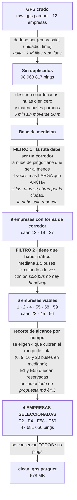

# Fase 2 · Elegir corredores viables

El crudo trae 12 empresas. Esta fase decide cuáles se pueden estudiar, con dos
filtros, y deja escrito el motivo de cada descarte.

## Qué es un ping

> **Un ping es un registro de GPS: una fila del dataset.** Cada bus reporta cada
> tanto dónde está, y eso es un ping. Todo el proyecto se construye sobre esto y
> nada más.

Un ping trae:

| Campo | Qué es |
|---|---|
| `empresaid` | Qué empresa opera el bus |
| `unidadid` | Qué bus, dentro de esa empresa |
| `time` | Cuándo se reportó |
| `lat`, `lon` | Dónde estaba |
| `velocidad`, `direccion` | Velocidad y rumbo declarados por el proveedor |

Tres cosas de los pings condicionan todo el trabajo posterior:

- **Los dos últimos campos no son confiables.** Las empresas 58 y 59 no los
  reportan (`propuesta.md:57`). Por eso el proyecto **deriva** la velocidad del
  desplazamiento entre pings consecutivos y el sentido de marcha del avance sobre
  la ruta, en lugar de creerle al proveedor.
- **Cada bus reporta por su cuenta.** La cadencia nominal es de 20 s y se cumple
  (la fase 3 lo verifica), pero los buses no están sincronizados entre sí: cada
  uno manda su ping cuando le toca. Para saber dónde estaban **todos** en el mismo
  instante hay que interpolar sobre una rejilla común, y eso es lo que hace la
  fase 5.
- **No hay paradas.** El ping dice dónde está el bus, no en qué parada está ni
  cuándo llegó a ella. No existe tabla de paradas en ninguna parte del dataset.
  De ahí que el headway se defina por cruce de posición y no por parada.

Escala: **98 968 817 pings** tras deduplicar las 12 empresas, de los cuales
**47 681 656** pertenecen a los 4 corredores seleccionados.

## El embudo, con los números medidos

| empresa | pings | unidades | ratio de forma | buses activos (mediana) | forma | densidad | viable |
|---|---|---|---|---|---|---|---|
| 1 | 31 961 341 | 70 | 4.87 | **30** | ✅ | ✅ | **✅** |
| **2** | 17 730 937 | 31 | **33.55** | 16 | ✅ | ✅ | ✅ |
| **4** | 7 846 657 | 20 | 5.67 | 9 | ✅ | ✅ | ✅ |
| 12 | 2 851 262 | 20 | 1.69 | 3 | ❌ | ❌ | ❌ |
| 19 | 4 975 522 | 13 | 1.90 | 5 | ❌ | ✅ | ❌ |
| 22 | 3 371 298 | 9 | 9.73 | 4 | ✅ | ❌ | ❌ |
| 27 | 6 | 6 | — | 0 | — | ❌ | ❌ |
| 45 | 3 857 581 | 12 | 10.65 | 4 | ✅ | ❌ | ❌ |
| 55 | 4 004 876 | 23 | 5.14 | 6 | ✅ | ✅ | **✅** |
| 56 | 265 275 | 1 | 9.18 | 1 | ✅ | ❌ | ❌ |
| **58** | 4 207 479 | 29 | 4.20 | 6 | ✅ | ✅ | ✅ |
| **59** | 17 896 583 | 40 | 5.92 | 20 | ✅ | ✅ | ✅ |

En negrita, las cuatro que el proyecto usó. **E1 y E55 también son viables**: no se
descartaron por criterio sino por alcance — el recorte a 4 se hizo por tiempo de
proyecto y está declarado en `propuesta.md:43` y §4.3, con E1 y E55 reservadas para
validación posterior.

Fuente: `viability.csv`, salida del kernel `alexhuaracha/01-viability-and-filter`.

## Qué se hizo

## Qué mide el filtro de forma

La empresa reporta miles de pings. Puestos en un mapa forman una nube. La pregunta
es si esa nube tiene forma de **corredor** o de **mancha**:

- Si los buses recorren una misma avenida de ida y vuelta, la nube es una franja
  larga y angosta.
- Si las rutas de la empresa se abren por toda la ciudad, la nube sale redonda.

El código mide eso: calcula el largo y el ancho de la nube, y exige que el largo
sea **al menos 4 veces** el ancho. E2 dio 33.55 — es un corredor extremadamente
recto. E12 dio 1.69, o sea una nube casi redonda, y quedó fuera.

Técnicamente es la razón entre los dos valores propios de la matriz de covarianza
de las coordenadas — el equivalente formal de "largo sobre ancho".

## Qué se hizo

| # | Paso | Qué hace | Dónde |
|---|---|---|---|
| 2.1 | Auditar la clave | `unidadid` se reusa entre empresas; la clave del proyecto queda fijada como `(empresaid, unidadid)` | `build_notebook_01.py:118-144` |
| 2.2 | Deduplicar | ~1 millón de filas repetidas por `(empresaid, unidadid, time)`, misma causa que la partición de la fase 1: paginación en el origen | `:147-159` |
| 2.3 | Marcar buses parados | Por bus, ventana móvil de 5 min: menos de 50 m recorridos = parado. Ventana con menos de 5 puntos queda en `null`, no se fuerza | `:226-243` |
| 2.4 | Filtro de forma | PCA sobre las coordenadas, solo de puntos en movimiento; eje principal ≥ 4× el secundario | `:265-280`, umbral `:89` |
| 2.5 | Filtro de densidad | Buses distintos activos por minuto; mediana ≥ 5 | `:283-295`, umbral `:90` |
| 2.6 | Veredicto con motivo | Al descartado se le escribe el motivo: ruta no lineal, flota insuficiente, o ambos | `:351-381` |
| 2.7 | Confrontar con la propuesta | Compara las que pasaron contra la lista esperada y avisa si discrepan | `:384-402` |
| 2.8 | Sensibilidad de umbrales | Rejilla 4×4: linealidad 3/4/5/6 × simultáneas 3/5/7/10 | `:411-428` |
| 2.9 | Escribir el dataset | Filtra a las empresas seleccionadas, sin aplicar el filtro de parados | `:500-505` |

## Las dos decisiones de fondo

| Decisión | Razonamiento del código |
|---|---|
| Excluir los buses parados del cálculo de la forma | El tiempo detenido en terminal acumula cientos de puntos en un mismo lugar y deforma la medición (`:183-185`) |
| Contar como activo al bus de movimiento indeterminado | Está reportando GPS, así que cuenta para la flota aunque todavía no se sepa si se mueve (`:259-261`) |

El trato de los nulos es **asimétrico a propósito**: se excluyen del cálculo de la
forma y se incluyen en el conteo de flota.

## Robustez de los umbrales

`sensitivity.csv` muestra qué empresas pasarían con umbrales vecinos. El umbral de
forma es prácticamente inerte: mover 3 → 4 no cambia nada. El que decide todo es
el de densidad.

| forma \ densidad | ≥ 3 | ≥ 5 | ≥ 7 | ≥ 10 |
|---|---|---|---|---|
| ≥ 3 | 8 | 6 | 4 | 3 |
| **≥ 4** | 8 | **6** | 4 | 3 |
| ≥ 5 | 6 | 4 | 3 | 2 |
| ≥ 6 | 3 | 1 | 1 | 1 |

## Entrada y salida

| | Detalle |
|---|---|
| Entrada | `raw_gps.parquet` de la fase 1, localizado por búsqueda recursiva bajo `/kaggle/input` (`:77-79`) |
| Salida de datos | `clean_gps.parquet`, 678 MB, zstd nivel 3 (`:500-505`) |
| Salida de evidencia | `viability.csv`, `sensitivity.csv`, y dos figuras: forma por empresa y buses simultáneos por hora |

## Riesgos de esta fase

| Riesgo | Detalle |
|---|---|
| **La justificación de excluir E55 se cayó** | `propuesta.md:157` excluye a E55 diciendo que *"el rango de flota pequeña ya está cubierto por la empresa 58 (mediana=6)"*. Pero E58 nunca se procesó. La flota más chica efectivamente estudiada es E4, con mediana 9 — nadie cubrió el rango de 6. El argumento que descartó a E55 dependía de una empresa que no entró |
| E58 queda dentro y nunca se usa | E58 entra a `clean_gps.parquet`, pero de la fase 5 en adelante solo se procesan 2, 59 y 4. De las 4 seleccionadas, se estudiaron 3, y el rango de flota declarado (6 a 20) se volvió 9 a 20 |
| La alerta del código se dispara siempre | `:389-401` avisa cuando el criterio no reproduce la lista esperada. Dado que el criterio deja pasar 6 y la lista tiene 4, esa alerta **se dispara en toda corrida**, por diseño. Está resuelta en `propuesta.md`, no en el código: quien lea solo el log verá una advertencia que parece un problema abierto |
| El filtro final no usa el resultado del criterio | `:503` filtra por la lista fija `SELECTED_EMPRESAS`, no por las empresas que pasaron. Es lo correcto dado el recorte de alcance, pero significa que el criterio es documental: no gobierna la salida |
| La evidencia no está versionada | `viability.csv` y `sensitivity.csv` se escriben en `/kaggle/working`. Hay que bajarlas del kernel para auditar cualquier cifra de esta fase |
| La distancia es plana, no geodésica | Metros por grado fijos para la latitud de Arequipa (`:94-96`); válido a esta escala, pero es una aproximación |
