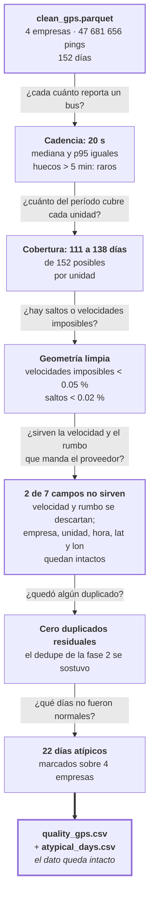

# Fase 3 · Caracterizar la calidad del dato

Ya están elegidos los 4 corredores. Antes de construir nada sobre ellos, hay que
saber con qué se está trabajando: cada cuánto reportan los buses, cuánto del
período cubren, qué campos sirven, y qué días no fueron normales.

**Esta fase no modifica el dato.** No escribe ningún parquet: solo mide y deja
evidencia.

## Lo que se midió, con los números

| Medición | E2 | E4 | E58 | E59 |
|---|---|---|---|---|
| Unidades | 31 | 19 | 12 | 40 |
| Días activos (mediana por unidad) | 138 | 133 | **111.5** | 137.5 |
| Proporción de actividad | 0.934 | 0.921 | **0.831** | 0.934 |
| Intervalo entre pings (mediana / p95) | 20 s / 20 s | 20 s / 20 s | 20 s / 20 s | 20 s / 20 s |
| Huecos > 5 min | 3 124 | 2 782 | 1 389 | 3 385 |
| Velocidad observada (mediana) | 3.27 km/h | 4.90 | 4.46 | 4.82 |
| Velocidad observada (p95) | 35.01 km/h | 34.52 | 30.83 | 35.23 |
| Velocidades imposibles (> 80 km/h) | 0.044 % | 0.021 % | 0.031 % | 0.015 % |
| Saltos espaciales (> 500 m en ≤ 60 s) | 0.008 % | 0.012 % | 0.017 % | 0.010 % |
| "Velocidad 0" pero el bus se movió | 1.889 % | 3.257 % | 0 % | 0 % |
| Rumbo en cero | 0.803 % | 0.575 % | 0 % | 0 % |
| Duplicados residuales | 0 | 0 | 0 | 0 |

Fuente: `quality_gps.csv`, salida del kernel `alexhuaracha/02-eda-corridors`.

## Los cuatro hallazgos que condicionan el resto del proyecto

| Hallazgo | Por qué importa después |
|---|---|
| **La cadencia es de 20 s y es regular** — mediana y p95 coinciden (`build_notebook_02.py:200`) | El dato no es errático. Pero cada bus reporta en **su propio** momento, no sincronizado con los demás. Para comparar dónde está cada bus en el mismo instante hace falta una rejilla común: eso es la fase 5 |
| **La velocidad mediana es de 3 a 5 km/h** | No es que los buses vayan a paso de hombre: la mediana incluye buses detenidos. Confirma que hay que distinguir bus parado de bus circulando antes de medir cualquier cosa |
| **El GPS es geométricamente limpio** — menos del 0.05 % de velocidades imposibles y menos del 0.02 % de saltos | No hace falta una limpieza agresiva de trayectorias. Los umbrales de plausibilidad de la fase 5 descartan una fracción marginal |
| **Dos campos del ping se descartan: velocidad y rumbo** — E58 y E59 no los reportan, y en E2 y E4 la velocidad dice 0 mientras el bus se movió en el 1.9 % y 3.3 % de los casos | Por eso el proyecto **deriva** la velocidad del desplazamiento y el sentido de marcha del avance sobre la ruta, en vez de leerlos del dato. No es una preferencia de diseño: es que el campo no existe en la mitad del corpus |

### Qué campo sirve y qué campo no

De los siete campos que trae un ping, cinco se usan y dos se tiran:

| Campo | Veredicto | Por qué |
|---|---|---|
| `empresaid` | ✅ se usa | Mitad de la clave compuesta |
| `unidadid` | ✅ se usa | La otra mitad. Se reusa entre empresas, nunca va solo |
| `time` | ✅ se usa | Eje temporal de todo el proyecto |
| `lat` | ✅ se usa | Junto con `lon`, la única fuente de posición |
| `lon` | ✅ se usa | Ídem |
| `velocidad` | ❌ **se descarta** | Ausente en E58 y E59. En E2 y E4 dice 0 mientras el bus se movió ≥ 50 m en el 1.9 % y 3.3 % de los pasos. Se reemplaza por la velocidad derivada del desplazamiento |
| `direccion` (rumbo) | ❌ **se descarta** | Ausente en E58 y E59. Se reemplaza por el sentido derivado del avance sobre la ruta |

Los cinco campos que quedan son suficientes: sobre `(empresa, unidad, hora, lat,
lon)` se construye todo lo demás. Los dos descartados no se pierden — se
**recalculan** desde la posición, que es el campo que sí es confiable.

## Los días atípicos

Un día es atípico para una empresa cuando su huella operativa cae por debajo de la
mitad de lo habitual **de esa misma empresa** (`:619-628`):

- **Volumen bajo**: registros del día < 50 % de la mediana diaria de la empresa.
- **Flota baja**: unidades activas < 50 % de la mediana de la empresa. Señal más
  fuerte de disrupción que el volumen solo.

Resultado: **22 días marcados**.

| Empresa | Días marcados | ¿Alguna vez por flota baja? |
|---|---|---|
| E2 | 7 | no |
| E4 | 4 | no |
| **E58** | **10** | **sí, 6 veces** |
| E59 | 1 | no |

Lo que se lee en el calendario:

- **2023-10-28 aparece en las cuatro empresas.** Es el único día con esa
  propiedad: un evento sistémico, no una falla de una operadora.
- **Los feriados salen solos**: 2024-01-01 (E2, E4), 2023-12-25 (E4, E58),
  2023-12-31 (E4). El criterio no sabe qué es un feriado y los encuentra igual.
- **E58 arranca a medio gas**: sus cuatro primeros días de octubre están marcados,
  y por flota baja. Sumado a que tiene la peor cobertura del grupo (111.5 días
  activos, proporción 0.831) y 10 de los 22 días atípicos, es la empresa con el
  dato más débil de las cuatro.

## Entrada y salida

| | Detalle |
|---|---|
| Entrada | `clean_gps.parquet` de la fase 2 |
| Salida de evidencia | `quality_gps.csv` (una fila por empresa, 14 métricas), `atypical_days.csv` (una fila por empresa-día marcado) |
| Figuras | distribución temporal, distribución de huecos, mapa de calor espacial, estadísticas por unidad, calidad de GPS, rosa de rumbos, calendario de días atípicos |
| Salida de datos | **ninguna** — esta fase no reescribe el corpus |

## Riesgos de esta fase

| Riesgo | Detalle |
|---|---|
| Los días de apagón total son invisibles | Solo se marcan días con **al menos un registro** (`:583-585`). Un día sin ningún ping no aparece en `atypical_days.csv`: falta como fecha ausente. El propio código lo advierte y deja pendiente materializar el calendario completo para contarlos |
| El destino de este artefacto cambió después | El código declara que la lista alimenta el diseño de la partición y el análisis de robustez (`:587-591`). En la línea final eso se revirtió: `atypical_flag` quedó **prohibido como variable de entrada** por fuga, y el CSV se usa solo para auditar. Al leer esta fase hay que tener presente que su salida ya no es un insumo del modelo |
| El umbral del 50 % es una elección | No hay análisis de sensibilidad para este criterio, a diferencia de los filtros de la fase 2 |
| La evidencia no está versionada | `quality_gps.csv` y `atypical_days.csv` se escriben en `/kaggle/working`; hay que bajarlas del kernel para auditar cualquier cifra de esta fase |
