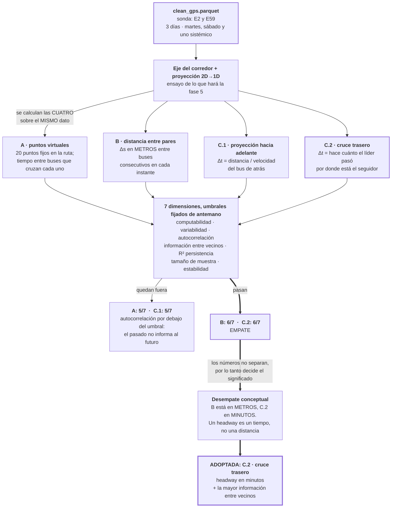

# Fase 4 · Elegir cómo medir el headway

No hay tabla de paradas, así que el headway hay que **definirlo**. Esta fase pone
cuatro definiciones posibles a competir sobre el mismo dato y elige una.

Es la fase más importante del proyecto: todo lo que viene después mide lo que se
haya decidido acá.

## Las cuatro definiciones

Todas parten del mismo insumo: la posición de cada bus reducida a un solo número
`s` — cuántos metros lleva recorridos sobre el eje del corredor.

| | Definición | Unidad | Idea |
|---|---|---|---|
| **A** | Puntos virtuales | minutos | Se fijan 20 puntos a lo largo de la ruta. Cada vez que un bus cruza uno, se anota la hora. El headway es el tiempo entre dos buses que cruzan el mismo punto |
| **B** | Distancia entre pares | **metros** | En cada instante se ordenan los buses activos y se mide la distancia que los separa |
| **C.1** | Proyección hacia adelante | minutos | Se toma la distancia entre dos buses y se divide por la velocidad del de atrás: *"a esta velocidad, tardaría tanto en llegar"* |
| **C.2** | Cruce trasero | minutos | Se busca en la trayectoria pasada del bus de adelante el instante en que pasó por donde está ahora el de atrás. El headway es esa antigüedad |

La diferencia entre C.1 y C.2 es el punto fino: **C.1 divide por la velocidad
instantánea**, así que se rompe cuando el bus está detenido — hay que descartar
todo caso con velocidad casi nula. **C.2 no divide por nada**: consulta lo que el
bus de adelante realmente hizo.

## El veredicto, con los números medidos

| | válidos | variabilidad | autocorr. 5 min | info. vecinos | R² persist. | estabilidad | **pasa** |
|---|---|---|---|---|---|---|---|
| A · E2 | 98.9 % ✅ | 1.10 ✅ | **0.167 ❌** | 1.145 ✅ | −0.582 ❌ | ✅ | **5/7** |
| A · E59 | 98.9 % ✅ | 1.20 ✅ | **−0.005 ❌** | 0.567 ✅ | −1.354 ❌ | ✅ | **5/7** |
| B · E2 | 99.9 % ✅ | 1.12 ✅ | 0.351 ✅ | 0.266 ✅ | −0.294 ❌ | ✅ | **6/7** |
| B · E59 | 99.9 % ✅ | 1.08 ✅ | 0.545 ✅ | 0.371 ✅ | 0.099 ❌ | ✅ | **6/7** |
| C.1 · E2 | 88.4 % ✅ | 1.98 ✅ | **0.162 ❌** | 0.226 ✅ | −0.656 ❌ | ✅ | **5/7** |
| C.1 · E59 | 87.0 % ✅ | 1.60 ✅ | **0.218 ❌** | 0.326 ✅ | −0.527 ❌ | ✅ | **5/7** |
| **C.2 · E2** | 96.6 % ✅ | 8.13 ✅ | 0.313 ✅ | 0.358 ✅ | −0.451 ❌ | ✅ | **6/7** |
| **C.2 · E59** | 92.7 % ✅ | 5.27 ✅ | 0.603 ✅ | **1.256** ✅ | 0.181 ❌ | ✅ | **6/7** |

Umbrales: válidos ≥ 80 %, variabilidad ≥ 0.2, autocorrelación ≥ 0.3, información
entre vecinos ≥ 0.1 bits, R² de persistencia entre 0.5 y 0.85, muestras ≥ 50 000,
divergencia por cambio de parámetros < 0.1 (`build_notebook_03.py:1022-1029`).

Fuente: `viability_matrix.csv`, kernel `alexhuaracha/03-headway-viability` v5.

## Qué es la autocorrelación, y de dónde sale el 0.30

**Autocorrelación** es cuánto se parece una serie a sí misma un rato antes. Acá se
mide con un desfase de 5 minutos: se toma el headway de un par de buses ahora y se
compara con el de ese mismo par cinco minutos atrás, a lo largo de toda la serie.

- Cerca de **1**: el headway de hace 5 minutos predice casi perfectamente el de
  ahora. La serie es suave.
- Cerca de **0**: no hay relación. Saber el pasado no dice nada del presente.
- **Negativa**: el pasado se relaciona al revés, lo que en la práctica es ruido.

Importa porque el modelo recibe los últimos 12 minutos y tiene que predecir el
siguiente. Si esa correlación es nula, no hay nada que aprender: el problema no es
el modelo, es que la señal no tiene memoria.

**Y ahora el 0.30: no está justificado en ninguna parte.** Lo busqué. El código lo
declara en un diccionario sin comentario (`build_notebook_03.py:1025`) y la tabla
que lo acompaña solo lo enuncia (`:847`). No hay derivación, ni referencia, ni
baseline medido detrás.

Peor: el propio proyecto registró esa falla como lección aprendida —
*"Spec inicial: targets aspiracionales. Lección registrada: futuros SDD deben
derivar thresholds de baselines medidos, no de aspiraciones"*
(`decisiones-headway-fase2.md:469`).

Hay dos pruebas de que los siete umbrales estaban mal calibrados:

| Umbral | Qué pasó |
|---|---|
| R² de persistencia `[0.5, 0.85]` | Lo reprobaron **las 8 celdas**. Se declaró inválido y **se eliminó de los criterios** (`decisiones-headway-fase2.md:168`) |
| Muestras ≥ 50 000 | La métrica arroja del orden de 10¹² pares, imposible. Se registró como bug (`:169`). Pasa por magnitudes, no por evidencia |

Así que de los 7 criterios, uno se anuló, otro es un bug, y el 0.30 de
autocorrelación es un número puesto a ojo.

**Lo que sí sostiene la decisión** es que los cuatro candidatos se midieron con la
misma regla. Aunque el corte sea arbitrario, el **orden** entre ellos no lo es: A
da 0.167 y −0.005, C.1 da 0.162 y 0.218, C.2 da 0.313 y 0.603. C.2 es entre 2 y 3
veces mejor que las descartadas, y eso no depende de dónde se ponga la línea.

**Pero C.2 pasa raspando en E2: 0.313 contra 0.30.** El documento de decisión lo
marca como marginal y anota algo que cambió el diseño del proyecto: con un desfase
de **1 minuto** en lugar de 5, la autocorrelación sube a 0.53 en E2 y a más de 0.76
en E59. De ahí sale la recomendación de *"explorar horizontes de 1, 2, 3 y 5
minutos como hiperparámetro, no fijar 5 min desde el inicio"*
(`decisiones-headway-fase2.md:191`) — que es exactamente el origen de los cuatro
horizontes (1, 3, 5 y 10 min) que el proyecto termina evaluando.

## Por qué se adoptó C.2

Cuatro razones, en orden de peso:

**1. Es la magnitud que el problema pide.** El headway es un tiempo. C.2 lo entrega
en minutos. B, que empató en puntaje, lo entrega en metros — y una distancia entre
buses no es un headway: dos buses separados por 400 m están a 2 minutos en avenida
libre y a 15 en congestión. Es el argumento decisivo, porque los números no
separaban a las dos.

**2. No divide por nada, así que no se rompe cuando el bus está detenido.** C.1
calcula distancia sobre velocidad, y con el bus parado la velocidad tiende a cero:
hay que descartar esos casos y se pierde el 12 % del dato. Y se pierde justo en la
situación de interés, porque el apelotonamiento pasa cuando los buses se frenan.
C.2 no estima: consulta la trayectoria real del bus de adelante y lee cuándo pasó
por ahí.

**3. El pasado informa al futuro.** C.2 pasa el umbral de autocorrelación (0.313 en
E2 y 0.603 en E59, contra 0.30 exigido). A y C.1 lo reprueban. Sin esa propiedad no
hay nada que predecir: un modelo que recibe los últimos 12 minutos necesita que
esos 12 minutos digan algo del minuto siguiente.

**4. Tiene la mayor información entre buses vecinos.** 1.256 bits en E59, contra
0.371 de B y 0.326 de C.1. Esa cifra es la evidencia empírica de que el headway de
un par informa sobre el de su vecino — el supuesto que sostiene la tesis entera del
proyecto, que es predecir el **vector completo** y no cada headway por separado.
Con una definición de bajo valor acá, modelar el corredor como sistema no tendría
sustento.

En resumen: **C.2 mide lo correcto (1), lo mide sin romperse donde importa (2), y
lo que mide es predecible (3) y está acoplado entre vecinos (4).**

## Por qué cayeron las otras tres

| | Motivo del descarte |
|---|---|
| **A** | La autocorrelación se derrumba: 0.167 y −0.005 contra un umbral de 0.30. El headway medido en un punto fijo de la ruta no guarda relación con el de cinco minutos antes — no sirve para un modelo que predice a partir del pasado reciente |
| **C.1** | Misma falla de autocorrelación (0.162 y 0.218), y además pierde el 12 % de los casos al descartar los buses con velocidad casi nula |
| **B** | **No falló nada que C.2 pasara**: empató 6/7 en las dos empresas. Cae por la unidad — mide metros, no minutos. Es el único descarte que no se apoya en una métrica |

## La dimensión que nadie pasó

El **R² de persistencia falla en las ocho celdas**. El umbral esperaba que copiar
el último valor explicara entre el 50 % y el 85 % de la varianza; explica mucho
menos, y en la mayoría de los casos da negativo — o sea, peor que predecir la
media.

El documento de decisión lo trata como **umbral mal calibrado**, no como falla del
método: la lectura correcta no es "la definición no sirve" sino "la persistencia es
un baseline débil en esta señal" (`decisiones-headway-fase2.md:70`).

Vale registrar la tensión: ese diagnóstico dice que la persistencia debería ser
fácil de superar, y la línea final del proyecto termina midiéndose precisamente
contra ella. Las dos cosas se miden distinto — este R² es sobre 3 días y otro
encuadre — pero la expectativa que quedó escrita acá conviene tenerla presente al
leer los resultados.

## Cómo se eligió, formalmente

El notebook **no elige**: calcula y reporta (`build_notebook_03.py:1299-1301`). La
decisión se tomó aparte y quedó firmada en `docs/decisiones-headway-fase2.md`,
aprobada el 2026-05-19 como contrato de las fases 2 a 7, con la regla de que
cambiarla exige reemitir el documento con motivación explícita.

Definición adoptada, en una línea:

> `Δt(L, F, T) = T − t_cross(L, s_F(T))`
>
> donde `L` es el bus de adelante y `F` el de atrás: **hace cuánto tiempo el líder
> estuvo donde está ahora el que lo sigue.** En minutos.

## Entrada y salida

| | Detalle |
|---|---|
| Entrada | `clean_gps.parquet`, restringido a E2 y E59 y a 3 días: 2024-01-23 (martes), 2024-01-27 (sábado) y 2023-10-28 (el día sistémico que la fase 3 marcó en las cuatro empresas) |
| Salida de evidencia | `viability_matrix.csv`, `viability_log.txt` y 5 figuras: ejes ajustados, distribuciones de señal, autocorrelación, mapa de información entre vecinos, estabilidad |
| Salida de datos | 24 parquets de prueba (4 definiciones × 2 empresas × 3 días). Son artefactos de sonda, **no** el dataset del proyecto |
| Decisión | `docs/decisiones-headway-fase2.md` |

## Riesgos de esta fase

| Riesgo | Detalle |
|---|---|
| La sonda es de 3 días y 2 empresas | La definición que gobierna todo el proyecto se eligió sobre 2 de los 4 corredores y 3 de los 152 días. E4 no participó de la decisión |
| El conteo de muestras es una comprobación vacía | La estimación de pares en 151 días arroja magnitudes imposibles — del orden de 10¹² pares — en 7 de las 8 celdas. Todas pasan el umbral de 50 000, pero por un defecto de cálculo, no por evidencia. No cambió la decisión, y no debe citarse como respaldo |
| **Los umbrales eran aspiracionales, no derivados** | Ninguno de los siete cortes tiene derivación documentada. El propio proyecto lo registró como lección: *"futuros SDD deben derivar thresholds de baselines medidos, no de aspiraciones"* (`decisiones-headway-fase2.md:469`). Uno se anuló tras reprobarlo las 8 celdas, otro era un bug. Al citar esta fase conviene apoyarse en el **orden** entre las cuatro definiciones, que es robusto, y no en el "pasa 6 de 7", que depende de cortes puestos a ojo |
| C.2 pasa autocorrelación al filo | 0.313 contra 0.30 exigido en E2: margen de 0.013. Con otro corte razonable — 0.35, por ejemplo — C.2 también habría reprobado esa dimensión |
| El empate B vs C.2 se resolvió por conveniencia declarada | El documento admite que B *"pasaría las pruebas"* y que se descarta en parte porque adoptarla obligaba a reescribir secciones de la propuesta. El argumento de fondo (un headway es tiempo, no distancia) es correcto y suficiente; el otro conviene no usarlo como justificación |
| Las etiquetas del resultado quedaron invertidas | En los parquets, `bus_back` es el bus que va **adelante**. La aritmética es correcta y está verificada empíricamente (72 % de cobertura y 9.6 km/h implícitos con la lectura implementada, contra 29 % y 2.0 km/h con la lectura que sugieren los nombres), pero los nombres mienten y se decidió documentarlo en lugar de renombrar |
