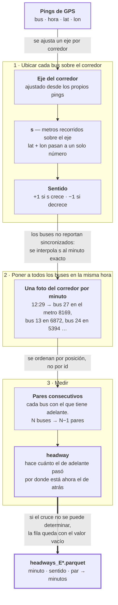

# Fase 5 · Construir el headway

Convierte pings de GPS en la variable que el modelo predice: el **headway**.

- **Entra:** `clean_gps.parquet` — pings de GPS: empresa, bus, hora, lat, lon.
- **Sale:** `headways_E*.parquet` — el headway de cada par de buses, cada minuto.

## El recorrido



## Cómo se mide

1. **Foto cada 60 s.** Los buses reportan cada 20 s pero sin sincronizarse entre ellos, así que se interpola `s` a minutos exactos.
2. **Ordenar por posición**, no por id. La clave depende del sentido (`s` para `−1`, `−s` para `+1`) para que el líder quede primero en ambos casos.
3. **Emparejar consecutivos.** Buses independientes ordenados por posición; el más adelantado no genera fila porque no tiene a nadie delante.
4. **Buscar el cruce.** En la trayectoria del bus de adelante, dónde pasó por la posición actual del de atrás, e interpolar entre los dos pings que rodean ese punto.
5. **Emitir nulo si no se puede medir**, en vez de borrar la fila. 6 causas etiquetadas.

## Resultado medido

| | Unidades | Pares | % con headway | Mediana headway | Mediana del vector |
|---|---|---|---|---|---|
| E2 | 31 | 1 590 659 | 63.5 % | 5.82 min | 4 |
| E59 | 40 | 2 684 878 | 77.1 % | 7.24 min | 6 |
| E4 | 19 | 1 326 201 | 64.8 % | 9.20 min | 3 |

**Unidades** = buses distintos en los 152 días, no cuántos hay a la vez: en un minuto y
un sentido la mediana es 9 en E2, 10 en E59 y 5 en E4.

## La salida

Un archivo por empresa, plano. Una fila = un par de buses en un minuto, identificada
por `t` (timestamp completo), `direction` y `pair_rank`. Ida y vuelta son series
independientes, nunca se mezclan.

**Está al minuto porque es el plazo al que se quiere predecir** — 1, 3, 5 y 10 minutos.
Agregar por hora o por día haría desaparecer el fenómeno: dos buses pegados seguidos de
20 minutos vacíos dan el mismo promedio que buses cada 10 minutos.

## Archivos que produce

Salidas del kernel `alexhuaracha/04-preprocessing` (E4 sale del 16, mismo código):

| Archivo | Para qué |
|---|---|
| `headways_E*.parquet` | **El insumo del modelo.** Todo el entrenamiento y la evaluación parten de acá |
| `headway_null_buckets_E*.parquet` | Explica el resto: el 36.5 % / 22.9 % / 35.2 % de pares sin headway, desglosado en 6 causas |
| `cleaned_gps_E*.parquet` | Auditoría y figuras. El entrenamiento **no** lo lee |

## Riesgos

- **El tope de 30 minutos no tiene análisis de sensibilidad.** Un cruce más antiguo que
  eso se descarta, y eso genera casi toda la data faltante (`stale-crossing`: 35.9 % /
  22.9 % / 35.0 %). Es el único umbral grande de la fase sin barrido.
- **El buscador de cruces no separa por viaje ni por día.** Indexa la trayectoria por
  `(empresa, unidad, sentido)` sobre todo el corpus (`headways.py:384-392`); el
  `trip_id` se calcula pero se descarta. Nada impide estructuralmente que el cruce
  hallado sea de otra vuelta — lo único que lo corta es el tope de 30 min.
- **El filtro lateral de pares no es inerte**, aunque `decisiones-headway-fase2.md:259`
  dice que sí: con `NaN` (no `null`) la condición de retención falla y el par se cae.
  51 % de los snapshots de E2 tienen menos pares que `n_buses − 1`. Como `max_N` se
  cuenta *antes* de esa caída, el vector declarado es más ancho que el real.
- **Los pings sin posición pierden su marca y entran como sentido `+1`.** Cadena de tres
  pasos: (1) un bus parado tiene `ds = 0`, así que el sentido queda en `0`
  (`direction.py:48-51`); (2) en la segunda pasada no hay eje para el sentido `0`, así
  que esos pings reciben `s = NaN` y quedan marcados para descartar
  (`projection.py:186-187`); (3) el sentido se vuelve a inferir, y en polars
  **`NaN > 0` devuelve `True`** (verificado), así que se etiquetan como `+1`.
  Medido en E2: los 2 959 526 pings con `s` en `NaN` están **todos** en el sentido `+1`
  (46.6 % de ese sentido), con velocidad mediana **0.0 km/h** y 88 % parados; los
  sentidos `−1` y `0` tienen cero. E59: 35.5 %. **E4: 0 %** — es el único de una sola
  pasada, así que nunca ejecuta el paso (2).
  Consecuencias: alimenta el riesgo del filtro lateral, infla `n_buses`, y deja el
  sentido `+1` de E2/E59 no comparable con su propio `−1`. Los faltantes que produce no
  son aleatorios: se concentran en buses detenidos, o sea en congestión.

## Ejemplo: E2, 2023-12-14 12:29:00, sentido `+1`

### 1 · Entra — `clean_gps.parquet`

Una fila = un bus reportando dónde está. Solo coordenadas:

| `unidadid` | `time` | `lat` | `lon` |
|---|---|---|---|
| 6 | 12:28:20 | −16.422564 | −71.554184 |
| 6 | 12:28:40 | −16.421467 | −71.553291 |
| 13 | 12:28:30 | −16.405893 | −71.540161 |
| 13 | 12:28:50 | −16.406326 | −71.539680 |
| 13 | 12:29:00 | −16.406593 | −71.539505 |
| 25 | 12:28:20 | −16.448101 | −71.551811 |
| 25 | 12:28:40 | −16.447517 | −71.551659 |
| 25 | 12:29:00 | −16.446619 | −71.552437 |

### 2 · Se proyecta al eje — `cleaned_gps_E2.parquet`

Las mismas filas, con `lat` + `lon` reducidas a un solo número. Este es el paso que
hace posible ordenar los buses.

| `unidadid` | `t` | `s` (m) | `speed_kmh` |
|---|---|---|---|
| 6 | 12:28:20 | 4 076.52 | 23.4 |
| 6 | 12:28:40 | 4 183.51 | 27.8 |
| 13 | 12:28:30 | 6 837.38 | 15.9 |
| 13 | 12:28:50 | 6 866.78 | 12.6 |
| 13 | 12:29:00 | 6 872.91 | 12.6 |
| 25 | 12:28:20 | 772.07 | 0.0 |
| 25 | 12:28:40 | 835.01 | 12.0 |
| 25 | 12:29:00 | 905.89 | 23.3 |

**Cómo se calcula `s`** (`projection.py:201-249`). Es **proyección de punto sobre
polilínea**, y `s` es la **longitud de arco** acumulada. Nada es a medida: cada paso es
una operación estándar.

1. `lat` y `lon` a metros con **aproximación plana local** (equirectangular):
   `lat × 111 000`, `lon × 111 000 × cos(16.4°)` (`config.py:16-17`). Vale porque el
   corredor mide 9–17 km.
2. El eje es una polilínea de ~50 vértices, ajustada por **PCA**. Se mide el largo de
   cada tramo y se acumulan desde 0 en el primer vértice.
3. Para cada ping se busca el tramo más cercano y se proyecta perpendicularmente sobre
   él. La fracción del tramo sale del **producto punto** — la fórmula estándar del punto
   más cercano sobre un segmento, recortada al rango `[0, 1]` para no salirse:

   ```
   t = (P − A) · (B − A) / |B − A|²        con A, B los extremos del tramo
   s = acumulado_hasta_A + t × largo_del_tramo
   ```

4. La distancia perpendicular del ping al eje queda como `lateral_m`. Es lo que se usa
   para descartar pings a más de 300 m.

`s` es la distancia en metros desde un extremo del corredor. Más grande = más avanzado.
Cuál de los dos extremos es el cero lo decide el ajuste por PCA, no una elección: es el
extremo que cae del lado negativo del eje principal. Los extremos medidos:

| | `s = 0` | `s` máximo | Largo |
|---|---|---|---|
| E2 | −16.453619, −71.557472 | −16.391907, −71.530647 | 9 339 m |
| E59 | −16.414690, −71.484695 | −16.330051, −71.570084 | 17 248 m |
| E4 | −16.481161, −71.488228 | −16.402365, −71.524956 | 10 581 m |

Como el origen no es un punto elegido, `s` no se traduce a una dirección de calle: solo
sirve para comparar posiciones sobre el mismo eje. Y en E2 y E59 hay **un eje por
sentido**, cada uno con su propio origen, así que `s` tampoco es comparable entre ida y
vuelta.

### 3 · Sale — `headways_E2.parquet`

Una fila = un par de buses. Ordenados por posición: el bus 27 va primero (metro 8 169),
el 19 último (metro 49):

| `pair_rank` | bus atrás | su `s` | bus adelante | su `s` | `delta_t_min` |
|---|---|---|---|---|---|
| 1 | 13 | 6 872.91 | 27 | 8 169.22 | **9.53** |
| 2 | 24 | 5 394.88 | 13 | 6 872.91 | **5.22** |
| 3 | 30 | 4 876.43 | 24 | 5 394.88 | — |
| 4 | 6 | 4 466.23 | 30 | 4 876.43 | — |
| 5 | 25 | 905.89 | 6 | 4 466.23 | **12.34** |
| 6 | 33 | 539.59 | 25 | 905.89 | **2.02** |
| 7 | 9 | 71.62 | 33 | 539.59 | — |
| 8 | 19 | 49.13 | 9 | 71.62 | — |

Vector del minuto: `[9.53, 5.22, —, —, 12.34, 2.02, —, —]`.

> `bus_front` contiene el bus de **atrás** y `bus_back` el de **adelante** — `s_back` es
> siempre mayor. Los nombres están invertidos a propósito; la aritmética es correcta.

## Los vacíos

Un guion es un par cuyo headway no se pudo medir. Los dos buses están ahí, uno detrás
del otro, ese mismo minuto. Lo que falla es la medición.

### Por qué aparecen

Medir exige responder *cuándo pasó el de adelante por donde está ahora el de atrás*. Se
recorre su trayectoria buscando ese punto. Seis resultados posibles, y uno domina:

| Causa | E2 | E59 | E4 |
|---|---|---|---|
| `success` — hay headway | 63.5 % | 77.1 % | 64.8 % |
| **`stale-crossing`** — el cruce existe, pero es de hace más de 30 min | **35.9 %** | **22.9 %** | **35.0 %** |
| `no-crossing` — nunca pasó por esa posición | 0.6 % | 0.0 % | 0.2 % |
| `traj-miss`, `cutoff-lt-2`, `ds-zero` | ~0 % | ~0 % | ~0 % |

Casi todo el faltante es una sola causa. Y esos cruces salen tan viejos porque la
trayectoria tiene huecos: el paso reciente no se ve, así que la búsqueda retrocede hasta
uno visible, de una vuelta anterior. El tope de 30 min lo rechaza.

### Por qué se dejan en el archivo

Porque borrar la fila rompería dos cosas: el vector perdería su tamaño real, y la serie
perdería la continuidad de minutos que el entrenamiento exige. Se emite la fila con el
valor vacío y la causa registrada aparte.

### Si dan problemas

**No corrompen nada.** Ningún headway inventado entra al entrenamiento, y la posición
vacía queda marcada: no cuenta en el error del modelo.

**Cuestan de dos formas.** Se pierde un tercio de la data en E2 y E4. Y en la ventana de
entrada el hueco llega como cero — que tras el reescalado equivale al valor promedio —
porque la marca de vacío protege la respuesta, no la entrada.

**El problema de fondo es que no faltan al azar.** Se concentran en buses detenidos, o
sea en congestión, que es el régimen donde vive el apelotonamiento que se quiere
predecir. Eso es una amenaza a la validez, no un detalle de limpieza. Sin medir: no está
comprobado que la tasa de faltantes sea mayor en los minutos con apelotonamiento.

La comparación entre modelos se salva, porque es pareada sobre muestras idénticas y
todos sufren la misma pérdida. Lo que no se salva es la caracterización absoluta: el
headway mediano real del corredor es probablemente peor que el medido.
