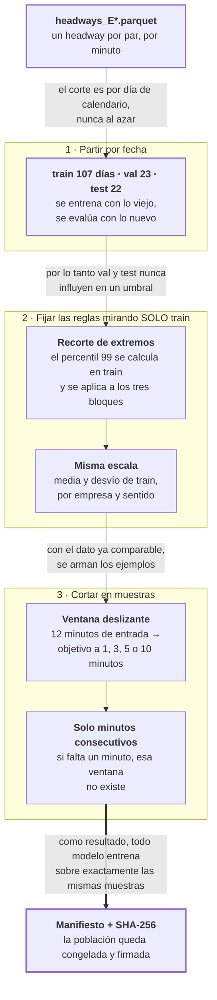

# Fase 6 · Construir la población de muestras

No calcula nada nuevo del corredor. Prepara el dato para que el entrenamiento sea
honesto: define qué se puede mirar y qué no.

- **Entra:** `headways_E*.parquet` — un headway por par de buses, por minuto.
- **Sale:** el manifiesto de muestras con su huella SHA-256 — la población congelada que
  todos los modelos deben usar.

## El recorrido

## Qué se hace y por qué

1. **Cortar por fecha, no al azar.** Train 2023-10-01 → 2024-01-15, validación hasta
   02-07, test hasta 02-29 (`splits.py:57-64`). Si el corte fuera aleatorio, el modelo
   tendría el minuto anterior y el siguiente en entrenamiento y le pediríamos adivinar el
   del medio: resultado excelente y falso.
2. **Recortar los extremos.** El percentil 99 se calcula **solo con train** y se aplica a
   los tres bloques. Los valores por encima se recortan, no se borran; los vacíos siguen
   vacíos (`splits.py:211-254`). Si el umbral se calculara con todo, el test le habría
   filtrado información al entrenamiento.
3. **Poner todo en la misma escala.** Z-score por `(empresa, sentido)`, con
   estadísticos otra vez solo de train (`normalization.py`). Un LSTM no aprende si las
   magnitudes son dispares.
4. **Armar las ventanas.** 12 minutos de entrada, objetivo a 1, 3, 5 o 10 minutos,
   deslizando de a un minuto. Una muestra vale solo si esos minutos son **consecutivos
   de verdad**; si falta uno, la ventana no existe (`sample_index.py:25-27`).
5. **Congelar y firmar.** Se emite un manifiesto con el SHA-256 de cada población. Cada
   kernel de entrenamiento lo recalcula y **aborta antes de tocar la GPU** si no
   coincide: `SHARED-POPULATION GATE FAILED`. Así el LSTM y el XGBoost se comparan sobre
   las mismas muestras, no sobre poblaciones parecidas.

## Resultado medido

Origen `main`, objetivo a 3 minutos:

| | train | val | test |
|---|---|---|---|
| **Días** | 107 | 23 | 22 |
| E2 | 174 537 | 37 214 | 35 651 |
| E59 | 229 672 | 48 052 | 46 899 |
| E4 | 185 118 | 41 464 | 39 946 |

De los minutos disponibles, se aprovechan el 89 % en E2, el 85 % en E59 y el 86 % en E4.
El resto se pierde por la exigencia de minutos consecutivos.

Y cuanto más lejos el objetivo, más minutos seguidos hace falta, así que hay menos
muestras (E2, train):

| Objetivo | Muestras | % aprovechado |
|---|---|---|
| 1 min | 176 290 | 90.4 % |
| 3 min | 174 537 | 89.5 % |
| 5 min | 172 915 | 88.6 % |
| 10 min | 169 294 | 86.8 % |

## Los tres orígenes

Todo el protocolo se ejecuta tres veces. Cada uno tiene su propia ventana de test de 22
días, y el entrenamiento **se expande**: cada origen entrena desde el primer día hasta su
propio corte (`splits.py:147-161`).

| Origen | Train | Validación | Test | Muestras |
|---|---|---|---|---|
| `r1` | 61 días · oct 1 – nov 30 | dic 1 – 22 | dic 23 – ene 13 | 2 303 901 |
| `r2` | 83 días · oct 1 – dic 22 | dic 23 – ene 13 | ene 14 – feb 4 | 2 781 159 |
| `main` | 107 días · oct 1 – ene 15 | ene 16 – feb 7 | feb 8 – 29 | 3 336 147 |

Sirve para responder una objeción concreta: si el resultado publicado se apoya en una
sola ventana de 22 días de febrero, no se distingue "el método funciona" de "esos 22 días
colaboraron". El último origen **es** exactamente el corte publicado, así que el
resultado principal queda como el final de la secuencia, no como un análisis aparte.

Navidad y Año Nuevo caen dentro del test de `r1` y de la validación de `r2`. Es
deliberado: si el resultado depende del período de fiestas, este es el análisis que tiene
que mostrarlo.

## Archivos que produce

| Archivo | Para qué |
|---|---|
| `docs/resultados/csv-multihorizon/sample_index_manifest.csv` | La población firmada: 108 filas (3 orígenes × 3 corredores × 4 objetivos × 3 bloques) con conteos y SHA-256. Es lo que cada kernel valida antes de entrenar |

## Riesgos

- **El ancho del vector viene inflado de la fase 5.** `max_N` es el percentil 99 de
  `n_buses − 1`, y `n_buses` se cuenta antes de que el filtro lateral tire pares. El
  modelo dedica salidas a posiciones que casi nunca existen.
- **El conteo del manifiesto es una cota superior.** No aplica el truncamiento por
  `max_N` que sí aplican los modelos, así que las muestras reales son algo menos
  (`build_sample_index.py:127-131`). Está declarado en el propio código.
- **El día atípico quedó excluido a propósito, y no se debe restaurar.** El
  `atypical_flag` se calculó con un umbral ajustado sobre los 152 días, test incluido:
  clasificar un día exige el registro completo de ese día. Es fuga por construcción, así
  que se eliminó en vez de recalibrarse, y el cargador **falla** si aparece
  (`contiguous_dataset.py:142`, `:236`).
- **El recorte de extremos tuvo un error histórico.** Se aplicaba solo a train, dejando
  val y test sin recortar. Está corregido y ahora hay tests que lo custodian
  (`test_preprocessing_winsorization_contract.py`).
- **LSTM y XGBoost no dimensionan igual el vector.** La red usa un `max_N` global por
  corredor y el XGBoost el de cada sentido, así que la red predice unas posiciones de
  cola que el otro no emite. Afecta al 0.05 % de las filas, queda fuera de toda
  intersección y está declarado en los resultados.
