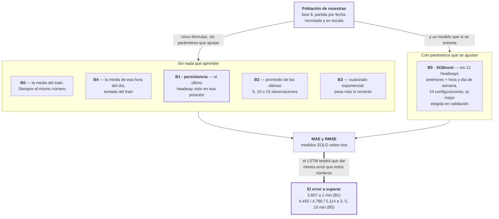

# Fase 7 · Establecer los baselines

Antes de entrenar una red hay que saber contra qué se compara. Esta fase mide cuánto
acierta el predictor más tonto posible, para que el resultado del LSTM signifique algo.

- **Entra:** la población de muestras de la fase 6.
- **Sale:** el MAE y el RMSE de 6 predictores de referencia, medidos solo en test.

## El recorrido

## Los seis competidores

**B = baseline**, predictor de referencia. Numerados B0 a B5 en orden de cuánta
información usan: B0 no usa ninguna, B5 usa la misma que la red.

| | Qué predice | Qué datos usa para predecir |
|---|---|---|
| **B0** | La media que esa posición tuvo en el train | ninguno. Es un número fijo por posición |
| **B1 · persistencia** | El último headway observado en esa posición | un solo valor: el anterior |
| **B2** | El promedio de las últimas 5, 10 o 15 observaciones | las últimas 5, 10 o 15, según la variante |
| **B3** | Suavizado exponencial con α = 0.3 | todas las anteriores, pesando más las recientes |
| **B4** | La media que esa posición tuvo en el train **a esa misma hora** | la hora (0–23) del minuto que se predice |
| **B5 · XGBoost** | Lo que su modelo entrenado estime | los 12 headways anteriores, más la hora y el día de semana |

Los cinco primeros no tienen nada que ajustar: son fórmulas. Todos son **causales por
construcción** — el valor de la fila actual nunca puede aparecer como su propia
predicción.

### Para qué está cada uno

| | Para qué sirve | Por qué |
|---|---|---|
| **B0** | Comparar el error del LSTM contra el de predecir siempre el mismo número | Si el LSTM no tiene menos error que eso, no está aprovechando la historia |
| **B1** | Comparar contra el error de repetir el último headway observado | Es la predicción que se obtiene sin ningún modelo |
| **B2** | Comparar contra el error de promediar las últimas 5, 10 o 15 observaciones | Si promediar da el mismo error, la serie no tiene estructura que valga aprender |
| **B3** | Comparar contra el error del suavizado exponencial | Es el método clásico más fuerte que no requiere ajuste |
| **B4** | Comparar contra el error de predecir usando solo la hora del día | Si da el mismo error, el headway se explica por la hora y no por lo que pasó en los minutos previos |
| **B5** | Comparar contra el error de un modelo entrenado con los mismos 12 minutos de entrada | Separa qué parte del resultado viene de los datos y qué parte de usar una red |

## Resultado medido

MAE promedio sobre las 6 celdas (3 corredores × 2 sentidos), test:

| | 1 min | 3 min | 5 min | 10 min |
|---|---|---|---|---|
| **B1 · persistencia** | **3.607** 🥇 | 4.964 | 5.600 | 6.528 |
| **B5 · XGBoost** | 3.692 | **4.455** 🥇 | **4.780** 🥇 | **5.114** 🥇 |
| B3 · suavizado | 4.023 | 4.728 | 5.151 | 5.779 |
| B2 · media móvil (w5) | 4.248 | 4.950 | 5.355 | 5.946 |
| B4 · media por hora | 5.251 | 5.251 | 5.251 | 5.251 |
| B0 · media del train | 5.289 | 5.289 | 5.289 | 5.289 |

B0 y B4 no usan la historia, así que su error no cambia con el horizonte y su fila es
plana. Cualquier predictor que use la historia y tenga MÁS error que ellos está usando
esa historia en contra.

## El hallazgo de esta fase

**El error de la persistencia crece con el horizonte más rápido que el de todos los
demás.**

| Horizonte | Puesto de B1 entre los 8 | MAE de B1 | MAE de B0 (número fijo) |
|---|---|---|---|
| 1 min | 1.º | 3.607 | 5.289 |
| 3 min | 4.º | 4.964 | 5.289 |
| 5 min | 8.º | 5.600 | 5.289 |
| 10 min | 8.º | 6.528 | 5.289 |

A 1 minuto B1 tiene el menor error de los ocho. A 5 y 10 minutos tiene más error que
predecir siempre el mismo número.

Consecuencia para el diseño: a 1 minuto el headway cambia tan poco que repetir el último
valor ya da el mejor error, y un modelo no puede mostrar diferencia. La diferencia solo
puede aparecer a horizontes más largos. De ahí los cuatro horizontes.

Y el número a superar cambia según el horizonte: a 1 minuto es el de B1 (3.607); a 3, 5 y
10 minutos es el de B5 (4.455 / 4.780 / 5.114).

## Archivos que produce

| Archivo | Para qué |
|---|---|
| `docs/resultados/csv-multihorizon/baselines_results_multih.csv` | E2 y E59: MAE y RMSE por corredor, sentido, baseline y horizonte. 384 filas |
| `docs/resultados/csv-multihorizon/baselines_E4_results_multih.csv` | Lo mismo para E4. 192 filas |

Salen de los notebooks 10 (E2, E59) y 16 (E4).

## Riesgos

- **Estos baselines son de la generación anterior.** Usan `atypical_flag`, la marca de
  día atípico que después se declaró fuga y se prohibió (`fitted.py:21-22`). La línea
  recertificada recalcula sus baselines sin ese campo, sobre la rejilla contigua
  (`contiguous_features.py`). No se deben mezclar los dos juegos de números.
- **El XGBoost recibe la misma información que la red, a propósito.** 12 headways
  previos, que es la misma ventana de entrada. Es la comparación justa, pero implica que
  B5 no es un baseline barato: es un competidor entrenado, con búsqueda de
  hiperparámetros. Los baselines realmente triviales son B0–B4.
- **La ventaja a 1 minuto puede ser un artefacto del grano.** El headway está definido al
  minuto y a ese plazo casi no se mueve, así que la persistencia parte con ventaja
  estructural. No es un defecto del cálculo, pero conviene no leer "la persistencia es
  buena" sino "a un minuto no hay nada que predecir".
