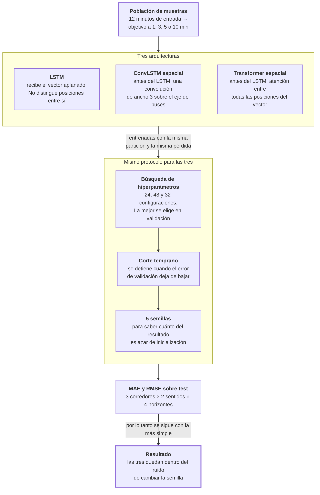

# Fase 8 · Comparar arquitecturas

Tres redes distintas, la misma población de muestras y el mismo protocolo. La pregunta es
si agregar mecanismos que mira la relación entre buses reduce el error.

- **Entra:** la población de la fase 6 y los errores de referencia de la fase 7.
- **Sale:** el MAE y el RMSE de cada arquitectura, por corredor, sentido y horizonte.

## El recorrido

## Las tres arquitecturas

Las tres terminan en un LSTM y predicen el mismo vector. Lo que cambia es qué hacen
**antes** de entrar al LSTM:

| | Qué agrega | Configuraciones probadas |
|---|---|---|
| **LSTM** | Nada. Concatena el vector de headways con las variables de contexto y lo pasa como una lista de números | 24 |
| **ConvLSTM espacial** | Una convolución de ancho 3 que recorre el eje de los buses, así cada posición ve a sus dos vecinas | 48 |
| **Transformer espacial** | Atención entre todas las posiciones del vector: cada una puede mirar a cualquier otra | 32 |

La hipótesis a probar era que el headway de una posición depende de sus vecinas, y que
darle al modelo una forma explícita de mirarlas reduciría el error.

## Resultado medido

MAE promedio sobre las 6 celdas (3 corredores × 2 sentidos), test, en minutos:

| | 1 min | 3 min | 5 min | 10 min |
|---|---|---|---|---|
| **LSTM** | **3.781** | **4.426** | **4.648** | **4.856** |
| ConvLSTM espacial | 3.793 | 4.431 | 4.662 | 4.867 |
| Transformer espacial | 3.812 | 4.469 | 4.688 | 4.868 |

El LSTM tiene el menor error en los cuatro horizontes. Y la diferencia máxima entre la
primera y la última arquitectura es de 0.043 minutos: **2.6 segundos**.

## El hallazgo de esta fase

Las diferencias entre arquitecturas son **más chicas que el efecto de cambiar la semilla
aleatoria**.

El mismo LSTM, entrenado 5 veces con distinta semilla, da este rango de MAE:

| | Rango entre semillas (E2) | Diferencia LSTM ↔ ConvLSTM (E2) |
|---|---|---|
| 1 min | 0.015 | 0.012 |
| 3 min | 0.012 | 0.0001 |
| 5 min | 0.017 | 0.014 |
| 10 min | 0.013 | 0.011 |

En E2 a 3 minutos, LSTM da 4.9164 y ConvLSTM 4.9163. Esa diferencia es **cien veces menor**
que la que produce reinicializar la misma red.

Conclusión: sobre estos datos, los mecanismos espaciales no aportan. No es que fallen —
es que no se distinguen. Por eso la línea final continúa con el LSTM simple: mismo error,
menos parámetros y menos superficie que justificar.

## Contra los baselines de la fase 7

| | 1 min | 3 min | 5 min | 10 min |
|---|---|---|---|---|
| B1 · persistencia | **3.607** | 4.964 | 5.600 | 6.528 |
| B5 · XGBoost | 3.692 | 4.455 | 4.780 | 5.114 |
| **LSTM** | 3.781 | **4.426** | **4.648** | **4.856** |

Dos lecturas:

**A 1 minuto ninguna red le gana a la persistencia.** 3.781 contra 3.607 — la red es peor.
Es exactamente lo que la fase 7 anticipaba: a un minuto el headway casi no cambia.

**A partir de 3 minutos la red gana, y la ventaja crece con el horizonte.** Contra el
XGBoost: 0.029 min a 3 minutos, 0.132 a 5 y 0.258 a 10. En segundos: 1.7, 7.9 y 15.5.

La ventaja a 3 minutos (0.029) es apenas el doble del ruido de semilla (0.012). A 10
minutos (0.258) es veinte veces ese ruido.

## Archivos que produce

| Archivo | Contenido |
|---|---|
| `lstm_results_h{1,3,5,10}.csv` + `lstm_E4_results_h*.csv` | MAE y RMSE del LSTM, por corredor y sentido |
| `spatial_conv_lstm_results_h*.csv` + variantes `_E4` | Lo mismo para el ConvLSTM |
| `spatial_transformer_results_h*.csv` + variantes `_E4` | Lo mismo para el Transformer |
| `lstm_multiseed_h*.csv` | El mismo LSTM con 5 semillas — de acá sale el ruido de inicialización |

Todos en `docs/resultados/csv-multihorizon/`. Salen de los notebooks 11–13 (E2, E59) y
17–19 (E4).

## Riesgos

- **Estos resultados son de la generación anterior y no son los publicados.** Usan
  `atypical_flag`, que después se declaró fuga, y su archivo de residuos no tiene
  `pair_rank` ni timestamp, así que no se puede auditar si dos modelos se evaluaron sobre
  las mismas muestras. Esa es precisamente la razón de la fase 9. No mezclar estos
  números con los de la línea recertificada.
- **"El LSTM gana" no está respaldado por una prueba estadística.** Gana en los cuatro
  horizontes, pero por márgenes dentro del ruido de semilla. La lectura honesta es
  empate, y la elección del LSTM se justifica por simplicidad, no por rendimiento.
- **La única arquitectura que usa de verdad la marca de posición vacía es la que peor
  anda.** El Transformer excluye las posiciones vacías de la atención
  (`spatial_transformer.py:170`); el ConvLSTM las multiplica por cero cuando ya valen cero
  (`spatial_conv_lstm.py:134`), y el LSTM plano no recibe la marca. Es una observación, no
  una causa demostrada.
- **La ventaja sobre el XGBoost es chica en términos absolutos.** 15 segundos de MAE a 10
  minutos de horizonte. Que sea real no significa que sea operativamente relevante; eso lo
  responden las fases 12 y 13, no esta.
