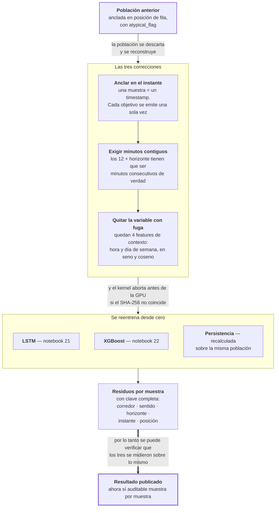

# Fase 9 · Recertificar la línea final

Rehacer el entrenamiento sobre una población corregida. No es una mejora del modelo: es
volver a medir porque se encontró que la población anterior estaba mal definida.

- **Entra:** el parquet de headways y la población canónica de la fase 6.
- **Sale:** los resultados publicados — LSTM y XGBoost contra persistencia.

## Por qué se rehízo

Tres defectos de la generación anterior. Los dos primeros están declarados en el propio
código (`sample_index.py:1-19`):

| Defecto | Qué pasaba |
|---|---|
| **Cada objetivo se contaba varias veces** | Una muestra se anclaba en una posición de fila dentro de un slot, así que el mismo minuto objetivo se emitía entre 2.4 y 5.4 veces. El MAE reportado era un promedio ponderado por densidad de flota, no un MAE |
| **El horizonte no era tiempo** | No se verificaba que las filas consecutivas fueran minutos consecutivos. Una ventana que cruzaba un fin de día o un corte de viaje daba un objetivo "a 10 minutos" que en realidad estaba a horas |
| **Una variable con fuga** | `atypical_flag` marcaba los días atípicos con un umbral ajustado sobre los 152 días, test incluido. Clasificar un día exige el registro completo de ese día |

El primero invalida la métrica. El segundo invalida el horizonte. El tercero invalida la
separación entre entrenamiento y test.

## El recorrido

## Qué cambió, exactamente

| | Generación anterior | Línea recertificada |
|---|---|---|
| Ancla de la muestra | posición de fila | instante (timestamp) |
| Minutos contiguos | no se verificaba | obligatorio, o la muestra no existe |
| Veces que se cuenta un objetivo | 2.4 a 5.4 | una |
| Variables de contexto | 5, incluyendo `atypical_flag` | 4, sin él. El cargador **falla** si aparece |
| Clave del residuo | sin posición ni instante | corredor · sentido · horizonte · split · instante · posición |
| Competidores | 3 arquitecturas de red | LSTM, XGBoost y persistencia |

El cambio en la clave del residuo es el que habilita todo lo que viene después: sin
instante ni posición no se puede verificar que dos modelos se evaluaron sobre las mismas
muestras, y sin eso ninguna comparación pareada es posible.

## Resultado medido

MAE en minutos, test, origen `main`. La columna `n` son las muestras — idéntica para los
tres, que es la prueba de que se midieron sobre la misma población:

| Corredor | Horizonte | Persistencia | XGBoost | LSTM | `n` |
|---|---|---|---|---|---|
| E2 | 1 min | **4.128** | 4.163 | 4.433 | 90 469 |
| E2 | 3 min | 5.689 | **4.823** | 4.957 | 81 695 |
| E2 | 5 min | 6.174 | **5.018** | 5.136 | 79 150 |
| E2 | 10 min | 6.793 | **5.208** | 5.297 | 75 747 |
| E59 | 1 min | **2.800** | 3.108 | 3.315 | 240 907 |
| E59 | 3 min | 3.881 | 3.790 | **3.826** | 229 826 |
| E59 | 5 min | 4.380 | 4.107 | **4.005** | 226 539 |
| E59 | 10 min | 5.335 | 4.547 | **4.221** | 219 755 |
| E4 | 1 min | **2.594** | 2.769 | 3.462 | 99 829 |
| E4 | 3 min | 4.099 | **3.931** | 4.376 | 92 408 |
| E4 | 5 min | 5.043 | **4.587** | 4.765 | 88 655 |
| E4 | 10 min | 6.526 | 5.441 | **5.209** | 83 190 |

Promedio de los tres corredores:

| | 1 min | 3 min | 5 min | 10 min |
|---|---|---|---|---|
| Persistencia | **3.174** | 4.556 | 5.199 | 6.218 |
| XGBoost | 3.347 | **4.181** | **4.571** | 5.065 |
| LSTM | 3.737 | 4.386 | 4.635 | **4.909** |

## El hallazgo de esta fase

**El ganador cambia según el horizonte, y el LSTM solo gana en el más largo.**

| Horizonte | Menor error |
|---|---|
| 1 min | Persistencia, en los tres corredores |
| 3 min | XGBoost |
| 5 min | XGBoost |
| 10 min | LSTM, en 2 de 3 corredores (E59 y E4; en E2 gana XGBoost) |

Esto es más restringido que lo que sugería la generación anterior, donde el LSTM tenía el
menor error en todos los horizontes desde 3 minutos. Sobre la población corregida, el
XGBoost gana a 3 y 5 minutos.

Y a 1 minuto la persistencia le gana a los dos modelos en los tres corredores. En E4 por
0.87 minutos — casi un minuto de diferencia a favor de no hacer nada.

Que el veredicto se haya movido al corregir la población es el argumento de esta fase:
las tres correcciones no eran cosméticas.

## Archivos que produce

| Archivo | Contenido |
|---|---|
| `lstm_contig_results_h{1,3,5,10}.csv` + `lstm_contig_E4_results_h*.csv` | MAE y RMSE del LSTM recertificado |
| `xgb_contig_results.csv` | XGBoost y persistencia sobre la misma población, con el conteo de muestras |
| `xgb_contig_search_config.csv` | La configuración de hiperparámetros elegida |

Todos en `docs/resultados/csv-multihorizon/`. Salen de los notebooks 21 (LSTM) y 22
(XGBoost).

## Riesgos

- **Las diferencias son chicas.** A 3 minutos el XGBoost le gana al LSTM por 0.205 min
  (12 segundos) y a 10 minutos el LSTM gana por 0.156 (9 segundos). Con el ruido de
  semilla medido en la fase 8 alrededor de 0.013, son diferencias reales pero pequeñas.
  Que sean significativas es lo que responde la fase 10, no esta.
- **Los defectos heredados de la fase 5 siguen ahí.** El ancho del vector viene inflado y
  un tercio de las posiciones está vacío, con faltantes concentrados en congestión. La
  recertificación arregló la definición de muestra, no la calidad del headway.
- **La comparación con la generación anterior no es aritmética.** Los números viejos
  promedian por sentido y estos por corredor, y la población es distinta por
  construcción. Se puede comparar el orden de los competidores, no restar los MAE.
- **Estos resultados son de un solo origen temporal.** Que se sostengan en otros orígenes
  y con otras semillas es lo que prueba la fase 15.
