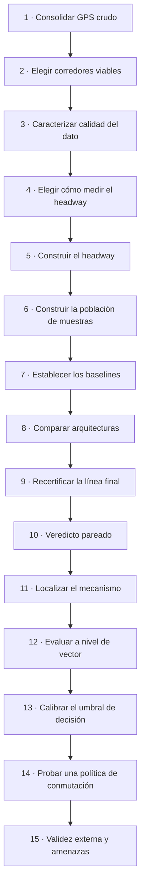

# Fases del proceso

Las fases generales del trabajo, del GPS crudo a las conclusiones.
Derivado de lectura directa de `src/`. 2026-08-25.

| # | Fase | Qué se hizo | Dónde vive |
|---|---|---|---|
| 1 | Consolidar el GPS crudo | Unir los CSV del proveedor en un solo parquet | `src/merge_raw.py` |
| 2 | Elegir corredores viables | Decidir qué empresas entran al estudio, por forma del corredor y densidad de buses simultáneos | notebook 01 |
| 3 | Caracterizar la calidad del dato | Huecos, saltos, velocidades imposibles, duplicados, días atípicos | notebook 02 |
| 4 | Elegir cómo medir el headway | Cuatro definiciones distintas compiten; gana la de cruce trasero por posición | notebook 03 |
| 5 | Construir el headway | Ajustar el eje del corredor, proyectar 2D→1D, inferir sentido, segmentar viajes, resamplear al minuto, emparejar buses y calcular el headway | `src/preprocessing/`, notebooks 04 y 16 |
| 6 | Construir la población de muestras | Partición temporal, winsorización, normalización, ventanas de 12 min con objetivo a 1/3/5/10 min, y su huella SHA-256 | `src/evaluation/splits.py`, `src/data/` |
| 7 | Establecer los baselines | Seis predictores de referencia, incluida la persistencia, que es el rival a vencer | `src/baselines/`, notebooks 10 y 16 |
| 8 | Comparar arquitecturas | LSTM, ConvLSTM espacial y Transformer espacial sobre los tres corredores | `src/models/`, `src/train.py`, notebooks 11–13 y 17–19 |
| 9 | Recertificar la línea final | Reentrenar sobre población contigua en tiempo y sin variables con fuga; LSTM y XGBoost contra persistencia | notebooks 21 y 22 |
| 10 | Veredicto pareado | Comparar sobre muestras idénticas y contrastar con pruebas estadísticas que corrigen autocorrelación y correlación intradía | `src/evaluation/paired_audit.py`, `significance*.py` |
| 11 | Localizar el mecanismo | Estratificar por volatilidad para ver dónde vive la ventaja | `src/evaluation/volatility.py`, `exante_volatility.py` |
| 12 | Evaluar a nivel de vector | Medir lo que el error escalar no ve: regularidad del servicio y detección de apelotonamiento | `src/evaluation/vector_metrics.py` |
| 13 | Calibrar el umbral de decisión | Ajustar el punto de operación en una ventana anterior y puntuarlo en una posterior | `src/build_detection_calibrated.py` |
| 14 | Probar una política de conmutación | Evaluar si un despachador puede elegir modelo por muestra usando solo información previa | `src/build_router*.py` |
| 15 | Validez externa y amenazas | Repetir en otros orígenes temporales y otras semillas, y descartar artefactos del pipeline | `src/evaluation/multiseed.py`, `build_rolling_origin_*.py`, sondas de auditoría |
