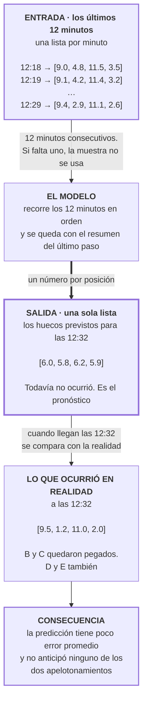

# El LSTM · qué recibe, qué devuelve y para qué sirve

Modelo publicado: notebook 21 (fase 9).

Todos los ejemplos de este documento usan el mismo caso: el corredor E2, sentido `+1`, con
5 buses en circulación, prediciendo a 3 minutos.

## En una frase

Recibe los últimos 12 minutos del corredor y devuelve cómo van a estar espaciados los
buses en un minuto que todavía no llegó.

## Primero: cómo se lee un vector de headways

Cada número es **un hueco entre dos buses, en minutos**. El vector se lee **de adelante
hacia atrás**.

Con 5 buses en el corredor:

```
   ← atrás                                              adelante →

     E           D                        C  B              A  →→→
     |--- 2.0 ---|-------- 11.0 ----------|1.2|---- 9.5 ----|

vector:         [ 9.5 ,  1.2 ,  11.0 ,  2.0 ]
                   ↑      ↑       ↑      ↑
                  B–A    C–B     D–C    E–D
```

| Posición | Qué mide |
|---|---|
| 1 | Hace 9.5 min que **A** pasó por donde está **B** |
| 2 | Hace 1.2 min que **B** pasó por donde está **C** |
| 3 | Hace 11.0 min que **C** pasó por donde está **D** |
| 4 | Hace 2.0 min que **D** pasó por donde está **E** |

**5 buses → 4 huecos.** El bus más adelantado (A) no tiene número propio: no hay nadie
delante de él.

Sin esto, el resto del documento no se entiende. Cada lista de números que aparece más
abajo se lee de esta manera.

## El recorrido



## Qué recibe

Los últimos **12 minutos**. Cada minuto es una lista de huecos, uno por cada par de buses
consecutivos:

```
12:18  [9.0, 4.8, 11.5, 3.5]
12:19  [9.1, 4.2, 11.4, 3.2]
  ...
12:29  [9.4, 2.9, 11.1, 2.6]
```

En este ejemplo se observa que las posiciones 2 y 4 van disminuyendo minuto a minuto: dos
buses se están acercando a los de adelante.

Además recibe dos datos de reloj por minuto: la **hora** y el **día de la semana**.

Y una condición: los 12 minutos deben ser consecutivos. Si falta uno, esa muestra no se
utiliza.

## De dónde salen esos 12 minutos

| Fase | Qué produce |
|---|---|
| **5** | El headway de cada par de buses, minuto a minuto |
| **6** | Corta esa serie en ventanas de 12 minutos consecutivos |

La fase 5 deja una serie continua al minuto. La fase 6 la recorta desplazándose un minuto
cada vez:

```
ventana 1:  12:18 … 12:29   → predice 12:32
ventana 2:  12:19 … 12:30   → predice 12:33
ventana 3:  12:20 … 12:31   → predice 12:34
```

### No son los metros

En la fase 5 se calculó la posición de cada bus en metros sobre el eje del corredor. Ese
número sirvió para dos cosas —**ordenar los buses** y **encontrar el momento del cruce**—
y ahí terminó su uso.

```
fase 5:   lat/lon  →  metros sobre el eje  →  headway (minutos)
                              ↑
                        se queda aquí
```

Lo que el modelo recibe son **minutos**, no metros.

### Cómo se arma un minuto de la ventana

Un minuto es una fila de la tabla por cada par de buses, ordenadas por posición:

```
minuto 12:29, sentido +1:

  posición 1  →  9.4 min
  posición 2  →  2.9 min
  posición 3  →  11.1 min
  posición 4  →  2.6 min

           ↓

  vector del minuto:  [9.4, 2.9, 11.1, 2.6]
```

El número de posición es la casilla. El headway es el valor que va en esa casilla.

Ese orden de casillas **sí proviene de los metros**: la fase 5 ordenó los buses por
posición para numerarlas. Los metros están detrás del orden, pero no dentro de los
valores.

## Qué devuelve

**Una sola lista**: los huecos previstos para un minuto que todavía no llegó.

```
12:32  [6.0, 5.8, 6.2, 5.9]
```

Es un pronóstico. Existe un modelo por cada plazo: 1, 3, 5 y 10 minutos.

Y devuelve **números**, no alarmas. El modelo nunca afirma "va a haber apelotonamiento".

## Para qué sirve el resultado

Para examinarlo y decidir. Si alguna posición queda muy por debajo del promedio de su
propia lista, significa que dos buses van a estar demasiado cerca, y un despachador puede
detener a uno o adelantar al de atrás.

El criterio exacto de esa decisión está en [`bunching.md`](bunching.md).

## Cómo se mide si acertó

Cuando llegan las 12:32 se compara lo predicho con lo que ocurrió:

```
predicho:  [6.0, 5.8,  6.2, 5.9]
real:      [9.5, 1.2, 11.0, 2.0]
diferencia: 3.5  4.6   4.8  3.9
```

Cada diferencia es un **residuo**, y se guarda uno por cada número predicho.

El archivo de residuos es lo único que consumen las fases 10 a 15. Ninguna vuelve a
entrenar el modelo: todas leen esos residuos.

## El problema central del trabajo

Con el mismo ejemplo:

```
predicho:  [6.0, 5.8, 6.2, 5.9]    ← todas las posiciones parecidas
real:      [9.5, 1.2, 11.0, 2.0]   ← dos pares apelotonados
```

La predicción tiene un error promedio razonable: se equivoca entre 3.5 y 4.8 minutos en
cada posición. Pero **no anticipó ninguno de los dos apelotonamientos**, porque para
detectarlos hace falta que algún número quede muy por debajo del promedio de su lista, y
en la predicción todos son parecidos entre sí.

Esto no es un error de programación. El modelo fue entrenado para equivocarse lo menos
posible **en promedio**, y la forma de conseguirlo es predecir valores cercanos al
promedio. Uniformar la lista es la solución óptima al problema que se le planteó, y es
incompatible con detectar apelotonamiento.

Los números están en la fase 12: a 10 minutos en E2, el modelo detectó **10
apelotonamientos de 15 245**.

## Un defecto del modelo publicado

Cuando en un minuto no hay dato para una posición, esa casilla entra al modelo como un
**cero**.

Y antes de entrar, todos los valores se **reescalan**: se les resta el promedio y se los
divide por su dispersión, para que queden en un rango comparable. Después de esa
transformación, **el cero es exactamente el valor promedio**.

Resultado: donde no había dato, el modelo lee "aquí hubo un bus con un hueco normal".

Se le podría indicar cuáles casillas están vacías. De las tres arquitecturas probadas en
la fase 8, solo el Transformer recibe ese aviso. **El modelo publicado, no.**

## De dónde salen los números 12 y 1/3/5/10

### Los cuatro plazos tienen una razón medida

En la fase 4 se midió la **autocorrelación** del headway —cuánto se parece un valor al
anterior— y dio entre 0.53 y 0.76. Un valor cercano a 1 significa que casi no cambia. A un
minuto de distancia, el headway apenas se mueve.

Por eso se abrieron varios plazos: para tener horizontes donde repetir el último valor deje
de ser suficiente. Los resultados lo confirmaron: a 1 minuto ningún modelo supera a la
persistencia, y la ventaja aparece a partir de 3 minutos.

### Los 12 minutos no tienen criterio documentado

El ancho de la ventana está fijado como una constante en el código, sin explicación. Ni el
código ni ningún documento del repositorio indican de dónde sale el 12; los documentos solo
lo registran como configuración.

**Tampoco hay análisis de sensibilidad.** No se probó con 6, ni con 20, ni con 30. No hay
evidencia de que 12 sea mejor que cualquier otro ancho.

| | |
|---|---|
| **No afecta la validez interna** | Los tres modelos y el XGBoost reciben la misma ventana, así que la comparación entre ellos es justa |
| **Sí limita lo que se puede afirmar** | No se puede sostener que 12 sea el ancho adecuado. Con 20 el modelo podría ganar más; con 6 podría alcanzarle igual |

Es una amenaza barata de cerrar: reentrenar una celda con dos anchos más y verificar si el
veredicto se mueve. Si no se cierra, conviene declararla.

## Glosario

| Término | Qué significa aquí |
|---|---|
| **Headway** | El hueco de tiempo entre dos buses consecutivos, en minutos |
| **Vector** | La lista de huecos de un minuto: un número por cada par de buses |
| **Horizonte** | A cuántos minutos hacia adelante se predice: 1, 3, 5 o 10 |
| **Residuo** | La diferencia entre lo predicho y lo que ocurrió, para una posición |
| **Reescalar** | Convertir todos los valores a un rango común restando el promedio y dividiendo por la dispersión. Después de esto, el cero equivale al valor promedio |
| **Autocorrelación** | Cuánto se parece un valor al anterior de la misma serie. Cercano a 1 significa que casi no cambia |
| **Persistencia** | El predictor más simple: suponer que el próximo headway será igual al último observado |

## Referencias al código

| Qué | Dónde |
|---|---|
| El modelo | `src/models/lstm.py` |
| El entrenamiento | `src/train.py` |
| El ancho de la ventana | `src/data/windowing.py:29` — `DEFAULT_T_IN: int = 12` |
| La población de muestras | `src/data/sample_index.py` |
| El notebook publicado | `src/build_notebook_21_lstm_contiguous.py` |
