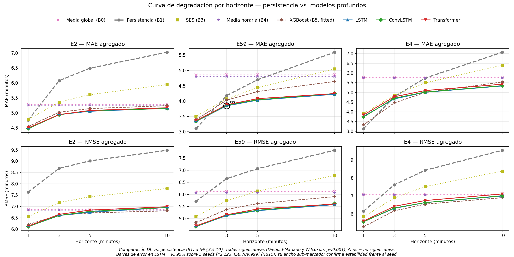
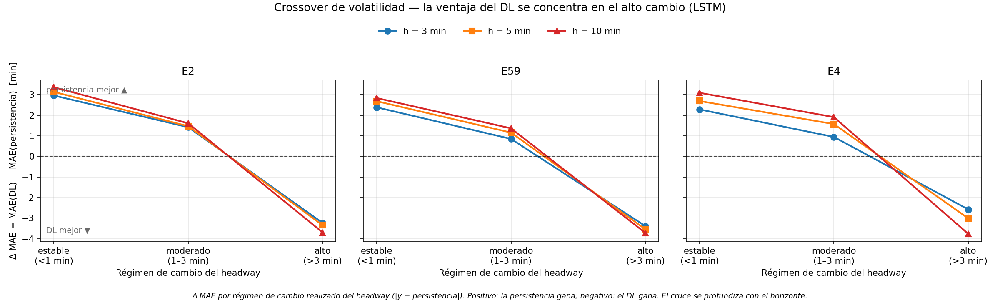
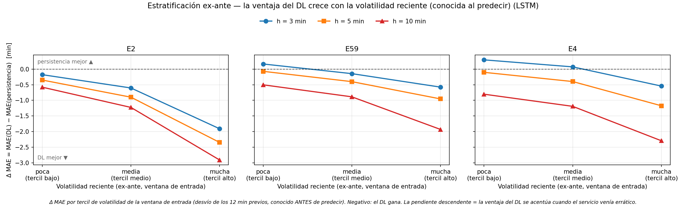

# Deep Learning para el pronóstico de *headway*[^headway] de buses: ventaja condicionada al horizonte y a la volatilidad del servicio

**Documento de resultados** · Corredores E2, E59 y E4 · Horizontes de 1 a 10 minutos

> Este documento presenta **qué encontramos**, no cómo se limpiaron o normalizaron los datos. El preprocesamiento se resume al mínimo necesario para que los resultados sean reproducibles; el foco está en la evidencia.

---

## 1. La pregunta

> **¿Cuándo vale la pena usar un modelo de Deep Learning[^dl] para predecir el *headway* de buses, en lugar de un método estadístico clásico?**

La respuesta corta —y el aporte de este trabajo— es que **no siempre conviene**. El Deep Learning (DL) gana cuando se predice con suficiente anticipación (horizonte[^horizonte] **≥ 3 min**); a 1 minuto un método clásico simple es igual de bueno o mejor. Esa condición —el horizonte— se conoce de antemano, así que la recomendación es directamente accionable. Además mostramos *de dónde* viene la ventaja: se concentra en los tramos de **alta volatilidad**[^volatilidad] del servicio —cuando el *headway* da saltos grandes—, que es donde un pronóstico preciso más valdría.

Este documento demuestra esa afirmación en tres pasos: **(1)** el DL gana → **(2)** la diferencia es estadísticamente real → **(3)** explicamos *por qué* gana.

---

## 2. La comparativa: quién compite contra quién

Enfrentamos dos familias de modelos sobre exactamente los mismos datos y la misma métrica.

### Modelos estadísticos clásicos (*baselines*[^baseline])

| ID | Modelo | Qué hace |
|----|--------|----------|
| B0 | Media global | Promedio constante del *headway* histórico |
| **B1** | **Persistencia[^persistencia]** | **Repite el último valor observado — el rival a batir** |
| B2 | Media móvil | Promedio de las últimas *w* observaciones (*w* = 5, 10, 15) |
| B3 | Suavizado exponencial | Promedio que pondera más lo reciente (α = 0.3) |
| B4 | Media histórica horaria | Promedio típico para esa hora del día |

### Baseline ajustado (*fitted ML*)

| ID | Modelo | Qué hace |
|----|--------|----------|
| **B5_XGB** | **Gradient boosting (XGBoost[^xgboost])** | Modelo **entrenado** que ve la **misma ventana de 12 pasos** que el LSTM (su primer *lag* es exactamente la persistencia) más hora, día y dirección — el competidor *aprendido* a batir |

> **Por qué sumamos un baseline ajustado.** Ganarle solo a fórmulas naive (B0–B4) podría descartarse como "vencer rivales débiles". B5_XGB es un aprendiz de verdad: se entrena, se ajusta sobre validación y recibe **exactamente la misma información que la red neuronal**. Si el DL le gana también a esto, la ventaja deja de ser un artefacto de *baselines* pobres.

### Modelos de Deep Learning

| Modelo | Idea de la arquitectura |
|--------|-------------------------|
| **LSTM**[^lstm] | Red recurrente que aprende patrones en la secuencia temporal de *headways* |
| **SpatialConvLSTM**[^convlstm] | Añade una convolución que mira la relación entre buses cercanos antes del LSTM |
| **SpatialTransformer**[^transformer] | Añade auto-atención espacial entre buses antes del LSTM |

### El terreno de juego

- **3 corredores:** E2, E59 y E4 (tres líneas de bus reales de distinta escala de flota; E4 es el más chico, 19 buses, e ingresa como **validez externa acotada a la escala de flota** —una línea independiente y mucho más pequeña, no otra ciudad: la generalización geográfica queda fuera de alcance, ver Sección 6).
- **4 horizontes:** predecir a 1, 3, 5 y 10 minutos vista.
- **2 métricas:** MAE[^mae] y RMSE[^rmse], ambas en minutos (cuanto más bajas, mejor). El texto reporta MAE; el RMSE confirma el mismo patrón y se ve en la Figura 1.
- **Datos:** 5 meses contiguos (2023-10-01 → 2024-02-29, 152 días) divididos temporalmente[^split]:
  - **Entrenamiento:** 2023-10-01 → 2024-01-15 (107 días, ≈3.5 meses) — el modelo aprende.
  - **Validación:** 2024-01-16 → 2024-02-07 (23 días, ≈3 semanas) — se ajustan los hiperparámetros[^hiperparametros].
  - **Prueba:** 2024-02-08 → 2024-02-29 (22 días, ≈3 semanas) — evaluación final; **todo lo reportado es sobre este conjunto, que el modelo nunca vio.**

> **Por qué la persistencia (B1) es el rival serio.** Es tentador comparar el DL contra un promedio tonto y "ganar" fácil. Pero en series temporales cortas, *repetir el último valor* es sorprendentemente difícil de superar: si el bus venía con 4 minutos de *headway*, lo más probable es que dentro de 1 minuto siga cerca de 4. Batir a la persistencia es la verdadera prueba. Por eso B1 es la referencia central de las comparaciones; los demás *baselines* (B0, B2–B4) se incluyen como contexto en la Figura 1.

---

## 3. Resultado central: la curva de degradación

*Figura 1 — MAE y RMSE frente al horizonte de predicción, para E2, E59 y E4. Cuanto más bajo, mejor. Se grafican la persistencia (B1), los baselines formulaicos B0/B3/B4_HA como contexto, el baseline ajustado XGBoost (B5) y los tres modelos profundos. El símbolo ⊘ marca comparaciones no significativas. Las barras de error del LSTM son el IC 95 % sobre 5 seeds (ver Sección 4, "¿O es casualidad del seed?"); su ancho sub-marcador refleja la estabilidad frente al seed.*

**El mensaje:** a 1 minuto la persistencia es imbatible pero **operativamente inútil** (nadie puede reaccionar con 1 minuto de aviso). El valor del DL **emerge al anticipar a 3, 5 y 10 minutos** — justo el margen que un operador necesita para intervenir.

Mirá el cruce (*crossover*[^crossover]) en el extremo izquierdo de cada panel (✓ = gana el DL; ❌ = gana la persistencia):

| Corredor | h = 1 min | h = 3 min | h = 5 min | h = 10 min |
|----------|-----------|-----------|-----------|------------|
| **E59** (MAE) | B1 **3.10** vs LSTM 3.33 ❌ *gana persistencia* | 4.18 vs **3.85** ✓ | 4.70 vs **4.03** ✓ | 5.59 vs **4.22** ✓ |
| **E2** (MAE) | B1 4.76 vs **4.46** ✓ | 6.07 vs **4.92** ✓ | 6.49 vs **5.04** ✓ | 7.03 vs **5.13** ✓ |
| **E4** (MAE) | B1 **3.13** vs LSTM 3.77 ❌ *gana persistencia* | 4.78 vs **4.68** ✓ | 5.74 vs **5.01** ✓ | 7.07 vs **5.35** ✓ |

**Lo más importante — la brecha crece con el horizonte frente a la persistencia.** A medida que predecimos más lejos, la persistencia se degrada rápido y el DL aguanta. Esta comparación es la **canónica** del trabajo: se mide sobre **muestras idénticas** (pareadas) —cada predicción del LSTM se enfrenta a la persistencia sobre exactamente la misma observación—, no sobre agregados de distinto tamaño:

- **E2 a 10 min:** persistencia 6.734 vs LSTM **5.163** → **−1.57 min de error (−23.3 %)**.
- **E59 a 10 min:** persistencia 5.282 vs LSTM **4.188** → **−1.09 min de error (−20.7 %)**.
- **E4 a 10 min:** persistencia 6.776 vs LSTM **5.360** → **−1.42 min de error (−20.9 %)**.

> **Pareado vs. agregado.** Los valores de esta lista provienen de la comparación **pareada** sobre muestras idénticas (`csv-multihorizon/paired_dl_persistence_metrics.csv`), mientras que la tabla de *crossover* de arriba usa las métricas **agregadas** sobre el test completo (por eso allí la persistencia a E2·h=10 es 7.03 y aquí 6.73). La diferencia es de **conjunto de muestras**: el DL descarta las filas de arranque en frío que no completan la ventana de entrada, así que la comparación pareada se restringe a las muestras que el DL efectivamente predice. El gap entre ambos encuadres es pequeño y **no altera ninguna conclusión**: en el auditado muestra a muestra (`paired_vs_reported_audit.csv`) el signo de la ventaja coincide en 53 de las 54 celdas. Los porcentajes se calculan sobre los valores con 3 decimales para que la aritmética sea exacta.

**Chequeo contra el mejor baseline simple (h = 3, 5, 10).** La persistencia es la referencia operativa central, pero no siempre es el baseline simple con menor MAE: el rival más duro **cambia con el horizonte** —persistencia (B1) en el muy corto plazo, suavizado exponencial (B3) en el medio y media horaria (B4_HA) en el largo—. Contra ese mejor baseline simple **por celda**, el LSTM gana en los tres corredores en todos los horizontes operativos (h ≥ 3), aunque con márgenes más chicos que frente a la sola persistencia:

| Corredor | Horizonte | Mejor baseline simple | LSTM | Mejora LSTM |
|---|---|---:|---:|---:|
| **E2** | h = 3 | B4_HA 5.259 | **4.916** | −0.34 min (−6.5 %) |
| **E2** | h = 5 | B4_HA 5.259 | **5.040** | −0.22 min (−4.2 %) |
| **E2** | h = 10 | B4_HA 5.259 | **5.128** | −0.13 min (−2.5 %) |
| **E59** | h = 3 | B3 (SES) 4.068 | **3.847** | −0.22 min (−5.4 %) |
| **E59** | h = 5 | B3 (SES) 4.438 | **4.029** | −0.41 min (−9.2 %) |
| **E59** | h = 10 | B4_HA 4.805 | **4.224** | −0.58 min (−12.1 %) |
| **E4** | h = 3 | B1 (persist.) 4.783 | **4.679** | −0.10 min (−2.2 %) |
| **E4** | h = 5 | B3 (SES) 5.492 | **5.014** | −0.48 min (−8.7 %) |
| **E4** | h = 10 | B4_HA 5.746 | **5.348** | −0.40 min (−6.9 %) |

El margen más ajustado es E4 a h = 3 (−2.2 %) y E2 a h = 10 (−2.5 %); aun así el signo favorece al DL en las nueve celdas. Esto no cambia la tesis operativa contra persistencia, pero evita sobredimensionar la magnitud del margen cuando el rival es el mejor baseline simple por celda. (A h = 1 el mejor baseline simple aún supera al DL en E59 y E4 —el *crossover* ya discutido—; por eso este chequeo se acota a los horizontes operativamente accionables.)

> **Nota honesta sobre los modelos espaciales.** El mejor DL terminó siendo el **LSTM plano**: es el mejor en agregado en E59 y E4 (promediando horizontes) y queda **empatado con el ConvLSTM en E2** (diferencia < 0.01 min); las variantes con convolución y atención no aportaron mejora clara. En celdas puntuales el ConvLSTM iguala o supera al LSTM por márgenes diminutos (< 0.01 min, p. ej. E2 a h=5 y h=10, y E59 a h=1); en E59 y E4 el LSTM lidera a h ≥ 5, y en E2 queda a la par del ConvLSTM (< 0.01 min). Esto se reporta tal cual: añadir complejidad espacial **no** mejoró el pronóstico en estos datos. (En E4, el spread entre los tres modelos profundos es < 0.1 min a h ≥ 5 — el resultado nulo espacial se replica.)

### El DL también le gana al competidor ajustado — pero esto escala con el tamaño del corredor

La objeción natural a "el DL le gana a la persistencia" es: *¿y si los baselines son demasiado débiles?* Por eso entrenamos **B5_XGB** (gradient boosting) con la misma ventana de 12 pasos que ve el LSTM. Es un competidor **creíble**: le gana a la persistencia y al mejor baseline formulaico en casi todas las celdas (p. ej. E59 a h=10: mejor clásico 4.81 → XGBoost **4.64**). Y aun así:

| Corredor | h = 1 | h = 3 | h = 5 | h = 10 |
|----------|-------|-------|-------|--------|
| **E2** — Δ MAE (XGBoost − LSTM) | +0.08 | +0.10 | +0.10 | +0.11 |
| **E59** — Δ MAE (XGBoost − LSTM) | +0.05 | +0.19 | +0.28 | **+0.42** |

**El LSTM le gana al XGBoost en las 8 celdas de E2 y E59**, y —de nuevo— **la brecha crece con el horizonte** (E59: de +0.05 a +0.42 min). Es la misma curva de degradación, ahora contra un **aprendiz fuerte** en vez de una fórmula naive. La ventaja del DL no es un artefacto de comparar contra rivales pobres. **Esta ventaja sobre el XGBoost, sin embargo, no es universal: depende de la escala del corredor**, como muestra de inmediato el corredor chico E4.

> En E59 a h=1 la persistencia (3.10) sigue siendo la mejor de todos —incluido el XGBoost (3.39)—, coherente con que a 1 minuto el pronóstico es trivial.

**Matiz de escala (corredor E4).** La ventaja del LSTM sobre el XGBoost **no es universal: escala con el tamaño del corredor.** En E4 —el corredor más chico (19 buses, ~0.5 M muestras por celda)— el XGBoost es un competidor mucho más duro y le gana al LSTM en los horizontes cortos y medios; el LSTM solo lo supera a **h = 10**:

| E4 — MAE | h = 1 | h = 3 | h = 5 | h = 10 |
|----------|-------|-------|-------|--------|
| **XGBoost (B5)** | **3.33** | **4.46** | **5.00** | 5.54 |
| **LSTM** | 3.77 | 4.68 | 5.01 | **5.35** |

Lo reportamos tal cual porque refuerza el mensaje central del trabajo. Conviene separar **dos tesis de distinta fuerza**:

- **Tesis robusta (se replica en los tres corredores, incluido el chico):** frente a la **persistencia**, el DL gana a h ≥ 3 en E2, E59 y E4. Este es el hallazgo que sobrevive al cambio de escala de flota.
- **Tesis condicional (depende de la escala):** frente a un **aprendiz fuerte** como el XGBoost, la ventaja del DL es clara en los corredores grandes (E2, E59) pero **se desvanece en el chico (E4)**, donde el XGBoost gana en los horizontes corto y medio y el LSTM solo lo supera a h = 10.

La ventaja del DL es, por lo tanto, **condicional, no incondicional**: cuanto mayor el corredor, más clara es también sobre el baseline aprendido.

---

## 4. ¿Es real o es casualidad? — Significancia estadística

Que un número sea más bajo no basta: podría ser ruido. Para descartarlo aplicamos dos tests pareados a cada comparación DL-vs-persistencia.

- **Tests usados:** Diebold-Mariano[^dm] (compara el error medio) y Wilcoxon[^wilcoxon] (compara las medianas por rangos). El estadístico DM se calcula con una **varianza de largo plazo Newey-West (HAC)** —lag de truncación data-driven ⌊n^{1/3}⌋, kernel de Bartlett—, de modo que la **autocorrelación serial** que introducen las ventanas de entrada solapadas **no infla la significancia**: está corregida por construcción.
- **Advertencia sobre el p-valor.** Aun con esa corrección HAC, con n = 0.5–2.2 M muestras pareadas por celda cualquier diferencia mínima da p ≈ 0: el p-valor confirma que el **signo** del efecto no es ruido, pero **no mide su importancia práctica**. Por eso esta sección lidera con el **tamaño del efecto** (Δ MAE en minutos, Sección 3) y trata la significancia como un **piso de sanidad**, no como la evidencia principal.
- **Resultado (tamaño del efecto):** el DL tiene el menor error en **53 de las 54** comparaciones (3 modelos DL × 3 corredores × 3 horizontes h ∈ {3,5,10} × 2 métricas; se excluye h=1, donde la persistencia gana). Cada comparación se juzga sobre **su propia métrica**: la victoria/derrota en RMSE se decide por el diferencial de error cuadrático, no por el de MAE.
- **Resultado (significancia como piso):** de esas 53, **51 son significativas a p[^pvalor] < 0.001** en *ambos* tests, y **las 53 a p < 0.05**.

Las tres desviaciones, declaradas en su totalidad:

| Desviación | Caso | Lectura |
|---|---|---|
| Gana la persistencia (1 celda) | Transformer · E4 · h=3 (solo MAE) | El Transformer queda apenas detrás en MAE (Δ MAE +0.04); en RMSE ese mismo Transformer **sí** gana, aunque solo a p<0.05 (Wilcoxon p = 0.003); el LSTM y el ConvLSTM ganan ese RMSE a p<0.001 |
| DL gana, significativo solo a p<0.05 | ConvLSTM · E4 · h=3 (MAE) | DM p = 0.039 (pasa 0.05, no 0.001); efecto chico pero a favor del DL |
| DL gana, significativo solo a p<0.05 | Transformer · E4 · h=3 (RMSE) | Wilcoxon p = 0.003 (pasa 0.05, no 0.001); DM sí a p ≈ 0 |

> **Las desviaciones no contradicen el patrón.** Las tres se concentran en **h=3** (el horizonte más corto de los testeados) y todas en el corredor chico **E4**; a h ≥ 5 los tres modelos ganan con holgura en los tres corredores. Son casos límite, no contraejemplos.

**Conclusión de esta sección:** la ventaja del DL a h ≥ 3, **medida en minutos de error**, es sistemática y consistente; la significancia estadística la respalda como piso, no como su justificación.

### ¿O es casualidad del hiperparámetro?

Queda un último flanco: ¿el resultado del LSTM depende de haber acertado un ajuste fino y frágil? Para descartarlo corrimos un **mini-grid de sensibilidad** a h = 10. Para cada corredor se entrenaron 4 configuraciones —la **ganadora congelada** del grid de Fase 5 más **3 vecinas**, cada una alterando **un solo** hiperparámetro (capacidad oculta, *dropout*[^dropout] o tasa de aprendizaje)— con el **mismo seed, pipeline y *splits***. La comparación es interna: no depende de números históricos.

| Corredor | Vecindario (4 configs) | MAE de la ganadora | Rango de MAE del vecindario | Dispersión |
|---|---|---|---|---|
| **E2** | hidden∈{32,64}, dropout∈{0,0.2}, lr∈{5e-4,1e-3} | 5.128 | 5.128 – 5.152 | **0.5 %** |
| **E59** | hidden∈{32,64}, dropout∈{0,0.2}, lr∈{5e-4,1e-3} | 4.224 | 4.224 – 4.244 | **0.5 %** |

*Datos: [`csv-multihorizon/lstm_minigrid_h10.csv`](csv-multihorizon/lstm_minigrid_h10.csv) (8 filas: 2 corredores × 4 configs).*

**El rendimiento es estable: mover cualquier perilla mueve el MAE menos del 1 %.** En ambos corredores la configuración elegida es la **mejor** de su vecindario: en E59 lo es por sí sola, y en E2 empata exactamente con una vecina (misma MAE hasta la milésima) —ninguna la supera—. En ningún caso el rendimiento se desploma al perturbar el ajuste. La ventaja del DL **no es un artefacto de un hiperparámetro afortunado**: es robusta a su propia configuración.

### ¿O es casualidad del seed?

El reclamo más automático contra cualquier resultado de Deep Learning: *todos los números salen de una sola corrida con un único seed[^seed] — ¿y si esa inicialización tuvo suerte?* Para cerrarlo re-entrenamos la **misma configuración ganadora congelada del LSTM** con **5 seeds** `[42, 123, 456, 789, 999]`, en cada horizonte (h ∈ {1, 3, 5, 10}) y ambos corredores, y reportamos **media ± intervalo de confianza del 95 %** (t de Student, n = 5).

| Corredor (MAE agregado, h=10) | Media de 5 seeds | IC 95 % | CV entre seeds |
|---|---|---|---|
| **E2** | 5.130 | [5.123, 5.136] | 0.10 % |
| **E59** | 4.224 | [4.218, 4.230] | 0.12 % |

*Datos: [`csv-multihorizon/multiseed_ci_multihorizon.csv`](csv-multihorizon/multiseed_ci_multihorizon.csv) (48 celdas: 2 corredores × 3 direcciones × 2 métricas × 4 horizontes, 5 seeds c/u). Las barras de error de la Figura 1 son justamente estos intervalos.*

**Los intervalos son diminutos: en las 48 celdas el coeficiente de variación entre seeds es de a lo sumo 0.476 %, y el IC 95 % más ancho es de ±0.05 min** — más angosto que el grosor del marcador en la curva. El valor canónico de la sección 3 proviene de una corrida **independiente** del lote de 5 seeds; difiere de la media multi-seed en **a lo sumo 0.03 min** en las 48 celdas (cae dentro del IC —angostísimo— en 38 de 48, y a ≤ 0.01 min del borde en el resto). A escala operativa es indistinguible de la media: el resultado canónico es **representativo**, no un golpe de suerte.

¿Por qué un IC tan angosto? No por un entrenamiento casi determinista, sino por dos razones legítimas: **(a)** el conjunto de test es enorme (0.5–2.2 M observaciones por celda), así que el estimador del MAE/RMSE es muy estable; y **(b)** el *early stopping* sobre validación lleva a todos los seeds a óptimos muy parecidos. Los seeds están realmente cableados (init de pesos, barajado y *dropout* vía `torch`/`cuda`/`numpy`, ver `src/train.py:set_seed`) y producen modelos **distintos** — el desvío entre seeds es **no nulo** (0.001–0.037 min). Como las tres arquitecturas profundas comparten curva (spread < 0.04 min en E2 y E59), la varianza por seed del LSTM **acota a toda la familia DL**. La ventaja del DL **no depende de un seed afortunado**: es estable frente al azar del entrenamiento.

---

## 5. ¿Dónde gana el DL? — El patrón de la volatilidad

Esta sección descompone el promedio global en regímenes para mostrar **dónde** se concentra la ventaja del DL. Convierte un número agregado en un patrón interpretable.

> **Advertencia metodológica (leer primero).** El régimen de volatilidad se define **de forma retrospectiva**, como la magnitud del cambio real del *headway* (`|y_real − persistencia|`), conocida solo *después* del hecho. Esto introduce una **dependencia parcial con el error de la persistencia**: el régimen "alto" es, por construcción, donde la persistencia más se equivoca. Por eso este análisis es **descriptivo, no causal**: muestra que la ventaja del DL se concentra en las ventanas que *resultaron* volátiles, no que el DL "detecte" la volatilidad por adelantado. La parte informativa —que sobrevive a la circularidad— es que el **error absoluto del DL se mantiene acotado** mientras el de la persistencia se dispara con la magnitud del cambio (ver más abajo). Y para cerrar la objeción de raíz, repetimos el análisis con un estratificador **ex-ante** —volatilidad conocida *antes* de predecir— en la última parte de esta sección: la ventaja del DL no solo se sostiene, sino que se acentúa.

Partimos las predicciones en tres **regímenes de volatilidad**[^volatilidad] según cuánto cambió realmente el *headway*:

*Figura 2 — Diferencia de MAE (DL − persistencia) en cada régimen de volatilidad. Por debajo de cero, gana el DL.*

| Régimen | Cambio real del *headway* | ¿Quién gana? | Δ MAE (DL − persistencia) |
|---------|-----------------------------|--------------|----------------------------|
| **Estable** | < 1 min | Persistencia | +2.3 a +3.4 (DL peor) |
| **Moderado** | 1–3 min | Persistencia (justo) | +0.85 a +1.9 |
| **Alto** | ≥ 3 min | **DL, decisivo** | **−2.6 a −3.7 (DL mejor)** |

*Los rangos de Δ MAE abarcan los 3 corredores (E2, E59, E4) y los 3 horizontes (h = 3, 5, 10); el patrón —persistencia en estable/moderado, DL en alto— es idéntico en todas las celdas, con la magnitud variando algo según el corredor. Los cortes de régimen son fijos en minutos (1 y 3 min), no cuantiles.*

**El hallazgo clave:** el DL **no mejora el promedio mejorando todo un poco**. El promedio "el DL le gana" es en realidad la **suma de dos regímenes opuestos**:

- En servicio **estable**, predecir es trivial (el *headway* casi no cambia) → la persistencia gana, pero es una victoria **sin valor operativo**.
- En servicio que se **desestabiliza** —el inicio del *bunching*[^bunching]— (saltos ≥ 3 min) → el DL gana de forma decisiva: **es el régimen donde un pronóstico preciso tendría más valor operativo** (siempre que pueda anticiparse el régimen — ver Sección 6).

> **El punto que NO depende de la circularidad.** Aunque el régimen se defina por el error de la persistencia, hay un hecho genuino: el **error absoluto del DL se mantiene acotado** a través de los regímenes, mientras el de la persistencia *es* la volatilidad. En E59 a h=10, el MAE de la persistencia salta 0.49 → 1.88 → **8.65** min (estable → moderado → alto), pero el del LSTM apenas se mueve: 3.34 → 3.23 → **4.95**. En E4 a h=10, ídem: persistencia 0.48 → 1.88 → **10.10** vs LSTM 3.55 → 3.79 → **6.37**. El DL no "gana porque definimos el régimen a su favor": gana porque **es robusto a la volatilidad** justo donde la persistencia se rompe.

**Y esto explica por qué la brecha crece con el horizonte** (Sección 3): a mayor horizonte, más muestras caen en el régimen de alto cambio.

- En E59, las ventanas de alto cambio pasan de **38.5 %** (h=3) a **54.4 %** (h=10).
- A 10 minutos, **más de la mitad de los casos** caen en el terreno donde el DL domina.

### El test ex-ante: la ventaja se confirma con información disponible al predecir

El análisis anterior agrupa por el cambio *realizado* del *headway* (conocido a posteriori), lo que lo vuelve **descriptivo**. Para convertirlo en una afirmación **operativa** —ejecutable en el momento de decidir— repetimos el corte usando un estratificador **ex-ante**: la **volatilidad de la ventana de entrada** (el desvío estándar de los últimos 12 minutos de *headway* observados), que se conoce *antes* de predecir. Partimos el test en terciles por esa volatilidad reciente y medimos quién gana en cada uno.

*Figura 3 — Δ MAE (DL − persistencia) por tercil de volatilidad **ex-ante** (el desvío de la ventana de entrada, conocido al momento de predecir), por corredor, una línea por horizonte. Por debajo de cero gana el DL. La pendiente descendente es el hallazgo: la ventaja del DL se acentúa cuanto más errático venía el servicio. A diferencia de la Figura 2 (régimen retrospectivo), aquí el régimen se asigna con información disponible a priori, así que el patrón es operativamente accionable.*

**El patrón clave se sostiene en los tres corredores y los tres horizontes (h = 3, 5, 10):** la ventaja del DL **crece monótonamente** con la volatilidad reciente —es máxima justo cuando el servicio venía más errático—, y en el tercil de **alta** volatilidad ex-ante el DL le gana a la persistencia en los nueve casos. En ese tercil alto a h = 10:

| Corredor | Persistencia | LSTM | Δ MAE |
|----------|--------------|------|-------|
| **E2** | 8.57 | 5.76 | **−2.81** |
| **E59** | 6.81 | 4.84 | **−1.97** |
| **E4** | 8.41 | 6.20 | **−2.21** |

**Matiz honesto por horizonte.** A h = 5 y h = 10 el DL gana en los **tres** terciles (incluido el calmo). A h = 3 la ventaja queda **concentrada** en el régimen volátil: el DL gana el tercil alto en los tres corredores, pero en el tercil calmo la persistencia todavía iguala o supera (E59 +0.16, E4 +0.35 de Δ MAE). Esto refuerza —no debilita— la lectura operativa: cuanto más corto el horizonte, más se confina la ventaja del DL a los momentos que importan (servicio errático), que es precisamente cuando la regla ex-ante lo activa.

*Datos: [`csv-multihorizon/exante_volatility_multihorizon.csv`](csv-multihorizon/exante_volatility_multihorizon.csv) (27 filas: 3 corredores × 3 horizontes × 3 terciles). La estratificación corre sobre las muestras con desvío de ventana computable —se descarta ~1 % con datos de entrada insuficientes—. La alineación con los residuos se verificó muestra a muestra: la persistencia y el objetivo reconstruidos desde los datos crudos coinciden con los residuos a precisión de punto flotante (Δ máx **observado** ≈ 3e-6 en los nueve corredor×horizonte, muy por debajo de la tolerancia de 1e-2 del chequeo de alineación).*

**¿La señal ex-ante no es el régimen retrospectivo disfrazado?** La objeción natural es que la volatilidad reciente esté tan correlacionada con el cambio realizado del *headway* que el corte ex-ante reprodujera, encubierto, el régimen retrospectivo de la Figura 2 —y con él, su circularidad—. Lo medimos de frente. La correlación entre la σ de la ventana de entrada y el cambio realizado |y_real − persistencia| (la variable que *define* el régimen retrospectivo) es **moderada**: Pearson r ≈ 0.25 y Spearman ρ ≈ 0.21 (r² ≈ 0.06) en los nueve corredor×horizonte —la señal ex-ante explica **menos del 8 %** de la varianza del régimen retrospectivo—. La tabla de contingencia lo confirma: el tercil de **alta** volatilidad ex-ante es apenas **1.1–1.3× más propenso** a caer en el régimen alto retrospectivo que la media (no el ~2× que implicaría un solapamiento fuerte), y entre el **29 % y el 54 %** de ese tercil corresponde a ventanas que *no* resultaron volátiles —régimen estable o moderado— y aun ahí el DL gana. El corte ex-ante no es, por lo tanto, un proxy del retrospectivo: comparten poca información, de modo que la ventaja del DL en el tercil de alta volatilidad ex-ante **no puede atribuirse a la circularidad** del estratificador a posteriori.

*Datos: [`csv-multihorizon/exante_correlation_multihorizon.csv`](csv-multihorizon/exante_correlation_multihorizon.csv) (9 filas: 3 corredores × 3 horizontes).*

**Por qué esto importa:** la regla pasa a ser **ejecutable en vivo**. Un operador, al momento de decidir, mira qué tan errático vino el servicio en los últimos minutos y —si venía movido— confía en el DL. La ventaja del DL **no** es un artefacto de definir el régimen a posteriori: se confirma con información disponible *antes* de predecir, y se **acentúa** (no se desvanece) al asignar el régimen ex-ante. Esto vuelve creíble y construible el sistema híbrido de la Sección 6.

---

## 6. Conclusión

> **El Deep Learning conviene para predecir el *headway* a horizontes operativos (≥ 3 min): a partir de ahí le gana a la persistencia, y la ventaja se concentra —y se acentúa— en los tramos de alta volatilidad del servicio. Esa ventaja se confirma con un estratificador ex-ante (la volatilidad reciente observada, conocida al momento de predecir), así que la recomendación es ejecutable en vivo, no solo a posteriori. A 1 minuto, o en servicio estable, un método clásico como la persistencia es igual de bueno o mejor.**

La conclusión madura **no** es "el DL reemplaza a la persistencia": cada modelo domina un régimen distinto. Esto abre la puerta a combinarlos (ver trabajo futuro).

### Alcance y limitaciones

**Análisis deliberadamente no realizados (no por carencia, por redundancia).** La comparación pico vs. valle quedó subsumida en el análisis de volatilidad (Sección 5): las franjas pico coinciden con el régimen de alto cambio del *headway*, y la volatilidad caracteriza el régimen —cuánto se mueve el *headway*— mejor que la mera hora del día (y, validada ex-ante en la Sección 5, de forma operativa). Un análisis pico/valle separado mediría el mismo fenómeno con peor resolución.

**Limitaciones reales del estudio.**
- Evaluado sobre 3 corredores (E2, E59, E4) de una misma ciudad y una ventana de 5 meses; la generalización a otras ciudades queda por validar. E4 aporta **validez externa acotada a la escala de flota** —una línea independiente y mucho más chica (19 buses), no otra ciudad ni otro período— y replica los dos hallazgos centrales (ventaja del DL sobre la persistencia a h ≥ 3, y nulo aporte de la complejidad espacial). La validez externa **geográfica y temporal** sigue abierta. Los estudios de robustez por seed y por hiperparámetro (Sección 4) se realizaron sobre E2 y E59.
- La ventaja del DL **sobre el baseline aprendido (XGBoost)** depende de la escala del corredor: es clara en E2 y E59, pero en el corredor más chico (E4) el XGBoost es competitivo y el LSTM solo lo supera al horizonte más largo (h = 10). Frente a la persistencia, en cambio, el DL gana a h ≥ 3 en los tres corredores.
- Los modelos espaciales (Conv, Transformer) no superaron de forma consistente al LSTM plano en estos datos (solo lo igualan o superan en celdas aisladas por márgenes < 0.01 min); queda abierto si lo harían con más buses por *snapshot*[^snapshot].

**Trabajo futuro: sistema híbrido.** Los resultados sugieren un enrutador que use persistencia en régimen estable y DL en régimen de alta volatilidad. La Sección 5 da el primer paso clave: un estratificador **ex-ante** —la volatilidad reciente observada, conocida al momento de predecir— ya separa los regímenes con información disponible a priori, y el DL mantiene (y acentúa) su ventaja bajo ese corte. Lo que falta es construir y evaluar el enrutador en operación: elegir el umbral de conmutación, medir el costo de los errores de clasificación de régimen y validar la ganancia neta en una corrida real. Eso se plantea como dirección futura; el componente que antes era un problema abierto —disponer de una señal de régimen ex-ante— queda resuelto.

---

## Glosario de términos técnicos

[^headway]: **Headway** — el intervalo de tiempo entre el paso de un bus y el siguiente en una misma parada/corredor. Es la variable que predecimos, medida en minutos. Un *headway* estable significa buses espaciados regularmente; uno irregular indica bunching (buses amontonados) o huecos en el servicio.

[^dl]: **Deep Learning (DL)** — familia de modelos de redes neuronales con varias capas que aprenden patrones complejos directamente de los datos, sin que un humano defina las reglas. Aquí se contrasta con métodos "clásicos" que aplican una fórmula fija.

[^horizonte]: **Horizonte de predicción (h)** — cuánto tiempo hacia el futuro se predice. *h = 10 min* significa "predecir el *headway* que habrá dentro de 10 minutos". Cuanto mayor el horizonte, más difícil la predicción, pero más útil operativamente.

[^baseline]: **Baseline (línea base)** — un modelo de referencia simple contra el cual se compara el modelo nuevo. Si un modelo complejo no le gana a un *baseline* simple, no aporta valor. Son la vara de medir.

[^persistencia]: **Persistencia (modelo naive)** — el *baseline* más básico: predice que el valor futuro será igual al último valor observado ("mañana lloverá lo mismo que hoy"). En series temporales es difícil de superar a corto plazo, por eso es el rival serio.

[^lstm]: **LSTM (Long Short-Term Memory)** — un tipo de red neuronal recurrente diseñada para aprender de secuencias, capaz de "recordar" información relevante a lo largo del tiempo. Procesa la historia reciente de *headways* para anticipar el siguiente.

[^convlstm]: **SpatialConvLSTM** — variante que, antes del LSTM, aplica una convolución 1D sobre los buses cercanos. La idea es capturar relaciones *espaciales* entre buses (qué le pasa al de adelante afecta al de atrás) además de las temporales.

[^transformer]: **SpatialTransformer / auto-atención** — variante que usa un mecanismo de *atención* (el del modelo Transformer) para que cada bus "mire" a los demás y pondere cuáles son relevantes, antes de pasar la secuencia al LSTM.

[^mae]: **MAE (Error Absoluto Medio)** — promedio de la diferencia absoluta entre lo predicho y lo real, en minutos. Trata todos los errores por igual. Un MAE de 4 significa que, en promedio, la predicción se equivoca por 4 minutos.

[^rmse]: **RMSE (Raíz del Error Cuadrático Medio)** — similar al MAE pero eleva al cuadrado los errores antes de promediar, por lo que **penaliza más los errores grandes**. Si el RMSE es mucho mayor que el MAE, hay errores grandes ocasionales.

[^split]: **División train / validación / prueba** — los datos se separan en tres bloques temporales: *entrenamiento* (el modelo aprende), *validación* (se ajustan los hiperparámetros) y *prueba* (evaluación final sobre datos nunca vistos). Reportar sobre prueba evita engañarse con resultados inflados.

[^dm]: **Test de Diebold-Mariano (DM)** — prueba estadística específica para comparar la precisión de dos modelos de pronóstico. Responde: ¿la diferencia de error medio entre los dos modelos es real o producto del azar? Aquí se usa su forma robusta (varianza Newey-West/HAC), que ajusta el cálculo para que la correlación entre los errores de minutos consecutivos no exagere la significancia.

[^wilcoxon]: **Test de Wilcoxon (pareado, de rangos con signo)** — prueba no paramétrica que compara dos modelos mirando las *medianas* de sus errores por rangos, sin asumir que los datos siguen una distribución normal. Complementa a Diebold-Mariano.

[^pvalor]: **p-valor** — probabilidad de observar una diferencia así de grande si en realidad **no hubiera** diferencia entre los modelos. Un p-valor < 0.001 significa "menos de 1 en 1000 de que sea casualidad" → la diferencia se considera estadísticamente significativa.

[^volatilidad]: **Régimen de volatilidad** — clasificación de cada predicción según cuánto cambia realmente el *headway* en ese momento, con cortes fijos en minutos: *estable* (cambio < 1 min), *moderado* (1–3 min) y *alto* (≥ 3 min). Los cortes son fijos (no cuantiles) a propósito: así se ve que la *proporción* de muestras en régimen alto crece con el horizonte. Permite ver dónde gana cada modelo en lugar de mirar solo el promedio global.

[^crossover]: **Crossover (cruce)** — el punto donde dos curvas se cruzan e invierten quién va ganando. Aquí marca el horizonte a partir del cual el DL pasa a superar a la persistencia (h ≥ 3 min en E59).

[^hiperparametros]: **Hiperparámetros** — los ajustes de configuración de un modelo que NO se aprenden de los datos sino que se fijan antes de entrenar (p. ej. cuántas capas, tamaño de la red, tasa de aprendizaje). Se eligen probando sobre el conjunto de validación.

[^dropout]: **Dropout** — técnica de regularización que, durante el entrenamiento, "apaga" al azar una fracción de las neuronas en cada paso para evitar que la red memorice el conjunto de entrenamiento (*overfitting*). Es uno de los hiperparámetros del mini-grid de sensibilidad (Sección 4); un valor de 0.2 apaga el 20 % de las unidades, 0.0 desactiva la técnica.

[^seed]: **Seed (semilla)** — el número que fija el azar del entrenamiento: pesos iniciales de la red, barajado de los datos y *dropout*. Mismo seed → entrenamiento idéntico y reproducible; distinto seed → un modelo ligeramente distinto. Entrenar con varios seeds y reportar media ± intervalo de confianza demuestra que el resultado es estable frente a ese azar, no producto de una inicialización afortunada.

[^xgboost]: **XGBoost** — biblioteca de *gradient boosting*: construye un conjunto de árboles de decisión donde cada árbol corrige el error del anterior. Es un modelo de ML *ajustado* (se entrena con datos), a diferencia de los baselines B0–B4 que son fórmulas fijas. Aquí se usa como baseline B5_XGB con la misma ventana de 12 pasos que ve el LSTM, para que la comparación sea justa.

[^snapshot]: **Snapshot** — una "foto" del estado de todos los buses del corredor en un mismo instante: el vector de *headways* de cada bus en ese momento. Los modelos espaciales miran cada *snapshot* para relacionar buses entre sí.

[^bunching]: **Bunching** — fenómeno en que dos o más buses que deberían ir espaciados terminan circulando casi juntos (uno "alcanza" al de adelante), dejando un hueco largo detrás. Es el principal síntoma de un servicio desestabilizado.
