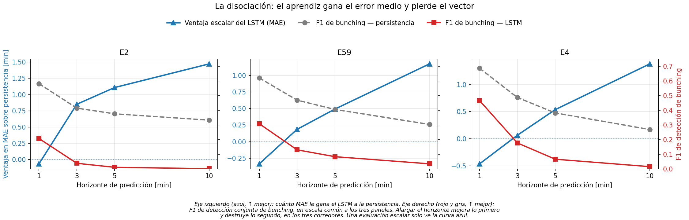

# La métrica decide el ganador: MAE escalar contra fidelidad del vector en el pronóstico de *headways*[^headway]

**Documento de resultados** · Corredores E2, E59 y E4 · Horizontes de 1 a 10 minutos · Pipeline contiguo

> Este documento presenta **qué encontramos**. El preprocesamiento se resume al mínimo necesario para que los resultados sean reproducibles.
>
> **Todas las cifras provienen del pipeline contiguo** (familias `21-lstm-contiguous` y `22-xgb-contiguous`), que cumple los tres contratos de la Sección 2. Los resultados de las familias 11/12/13 y 17/18/19 **no son comparables** con estos y se conservan solo para el ranking entre arquitecturas, cuya validez descansa en que las tres comparten el mismo sesgo.

---

## 1. El hallazgo

> **Un modelo puede ganar el error promedio y, al mismo tiempo, volverse ciego a lo único que el operador necesita ver.**

Entrenamos un LSTM[^lstm] y un XGBoost[^xgboost] nivelado para pronosticar el vector de *headways* de tres corredores reales, y los medimos contra la persistencia[^persistencia] sobre muestras idénticas. El resultado escalar es el esperado y se replica en los tres corredores: **a partir de 5 minutos de anticipación los aprendices le ganan a la persistencia con holgura creciente**, hasta 1.47 min de MAE[^mae] a 10 minutos.

El resultado vectorial va en la dirección **opuesta**, y es el aporte de este trabajo:

| A 10 minutos de anticipación | LSTM | Persistencia |
|---|---|---|
| MAE (menor es mejor) | **5.32 min** | 6.79 min |
| Detección de *bunching*[^bunching] — F1[^f1] (mayor es mejor) | **0.0013** | **0.332** |

El LSTM gana el MAE por 1.47 minutos y pierde la detección de *bunching* por un factor de **253**. No es una celda aislada: **la persistencia gana las 12 combinaciones de corredor y horizonte en las dos métricas vectoriales**, y la brecha se ensancha exactamente donde la ventaja escalar del aprendiz se ensancha.

*Figura 1 — Las dos curvas que este trabajo pone juntas por primera vez. En azul, cuánto MAE le gana el LSTM a la persistencia (eje izquierdo). En rojo y gris, el F1 de detección conjunta de bunching (eje derecho, escala común a los tres paneles). Alargar el horizonte mejora una y destruye la otra, en los tres corredores. **Una evaluación escalar solo ve la curva azul.***

El mecanismo es simple y no es un defecto de implementación. **El MAE premia contraer.** Un modelo que empuja sus predicciones hacia el promedio baja el error medio y, al hacerlo, aplana el vector: el LSTM predice un corredor con un coeficiente de variación[^cv] de 0.16 cuando el real es 0.79. Un servicio que en la realidad es irregular, el modelo lo reporta como regular. Y el *bunching* —un *headway* que colapsa hacia cero mientras el de al lado se abre— **es** irregularidad; un modelo que la promedia no puede anticiparlo.

**La consecuencia metodológica es el punto:** una evaluación basada en MAE o RMSE[^rmse] agregado es **estructuralmente incapaz** de detectar esta pérdida. No es que la métrica sea insensible; es que premia la causa. Cualquier trabajo de pronóstico de transporte que reporte solo error escalar puede tener este problema y no tener forma de saberlo.

Lo demostramos en cuatro pasos: **(1)** el resultado escalar, y que su frontera no es el horizonte sino la volatilidad → **(2)** cuánto de eso resiste una prueba estadística honesta → **(3)** la disociación, medida con tres métricas vectoriales → **(4)** qué sobrevive a los ataques obvios.

---

## 2. El terreno de juego

### Quién compite

| Modelo | Qué hace |
|---|---|
| **Persistencia (B1)**[^persistencia] | Repite el último *headway* observado. El rival serio: en series cortas es sorprendentemente difícil de superar. |
| **XGBoost**[^xgboost] | *Gradient boosting* entrenado que ve la **misma ventana de 12 pasos** que la red, más hora, día y dirección. El competidor aprendido. |
| **LSTM**[^lstm] | Red recurrente sobre la secuencia de *headways*. |

Las arquitecturas espaciales (SpatialConvLSTM, SpatialTransformer) **no superan al LSTM plano** en estos datos. Ese nulo espacial se estableció sobre las familias congeladas y no se rehizo bajo el pipeline contiguo; se reporta como resultado previo, no como parte de esta evidencia.

### El terreno

- **3 corredores:** E2, E59 y E4. E4 es el más chico (19 buses) y aporta **validez externa acotada a la escala de flota** — otra línea, no otra ciudad.
- **4 horizontes:** 1, 3, 5 y 10 minutos.
- **Datos:** 152 días (2023-10-01 → 2024-02-29), divididos temporalmente[^split]: entrenamiento hasta 2024-01-15, validación hasta 2024-02-07, **prueba 2024-02-08 → 2024-02-29** (22 días). Todo lo reportado es sobre prueba.

### Los tres contratos

Una auditoría adversarial previa encontró que la comparación anterior no era atribuible: los modelos puntuaban sobre poblaciones distintas y las ventanas no eran contiguas en el tiempo. El pipeline se reconstruyó sobre tres contratos, y cada uno se verifica en cada corrida:

| Contrato | Qué garantiza | Cómo se verifica |
|---|---|---|
| **C1 — Identidad de muestra** | Una muestra por `(empresa, sentido, instante de inicio, horizonte)`. Los tres modelos puntúan las mismas celdas. | Cada kernel recomputa el índice y compara su SHA-256 contra un manifiesto congelado. |
| **C2 — Contigüidad temporal** | Los `12 + h` instantes de una ventana son minutos **consecutivos**. El horizonte es tiempo, no posición de fila. | Verificado al materializar; una violación aborta. |
| **C3 — Frontera de información** | Ninguna variable usa información posterior al instante de predicción. Se eliminó la bandera de día atípico, que era un agregado del día completo. | El gate de entrada falla cerrado si la variable reaparece. |

**Costo de exigir contigüidad:** entre el 81.9 % y el 90.2 % de los *snapshots*[^snapshot] sobreviven. Se perdió menos del 20 % de los datos y se ganó que el horizonte signifique lo que dice.

**Verificación del contrato C1.** Cada modelo se puntúa dos veces: sobre sus propias filas y sobre la intersección de los tres. Si C1 se cumple, restringir a la intersección no debe mover nada.

> Sesgo de encuadre medido: **0.001 min** como máximo, sobre 36 filas. En el pipeline anterior era de **0.28 a 0.53 min** — más grande que la mayoría de los márgenes que se reclamaban encima. La comparación ahora es atribuible; antes no lo era.

---

## 3. El resultado escalar, y dónde está su frontera real

*Figura 2 — MAE frente al horizonte, por corredor. Cuanto más bajo, mejor. La persistencia parte abajo a h = 1 y termina arriba a h = 10: ese es el cruce, y el XGBoost lo recorre igual que el LSTM.*

Medido sobre la población pareada a tres bandas (entre 75 747 y 240 907 predicciones escalares por celda):

**Δ MAE contra la persistencia** (negativo = el aprendiz gana):

| Corredor | h=1 | h=3 | h=5 | h=10 |
|---|---|---|---|---|
| E2 | +0.067 | −0.851 | −1.109 | **−1.473** |
| E59 | +0.334 | −0.186 | −0.491 | **−1.173** |
| E4 | +0.464 | −0.064 | −0.536 | **−1.381** |

Dos lecturas que cambian el titular respecto de versiones anteriores de este documento:

**El XGBoost reproduce el patrón completo.** Contra persistencia, a h=10: −1.585 en E2, −0.787 en E59, −1.085 en E4. El cruce **no es una propiedad del Deep Learning**, es una propiedad del problema: existe un umbral de anticipación a partir del cual el último valor observado deja de ser suficiente, y cualquier aprendiz razonable lo cruza.

**El LSTM contra el XGBoost se parte por corredor**, con signos opuestos que el horizonte amplifica: a h=10 el XGBoost gana en E2 (+0.113) y el LSTM gana en E59 (−0.385) y E4 (−0.295). No hay un ganador global.

> ⚠️ **Y ese contraste no está nivelado.** El XGBoost recibió **24 configuraciones por celda** elegidas en validación; el LSTM recibió **1** en E2/E59 y **3** en E4, heredadas de una fase previa. La asimetría corre **en contra** de la red. Consecuencia directa: *"el LSTM gana en E59"* es seguro, porque gana con menos presupuesto; *"el XGBoost gana en E2"* **no es atribuible a la clase de modelo**. Nivelar cuesta unas 14 horas de GPU y no se hizo.

### La frontera no es el horizonte, es la volatilidad

Estratificamos cada predicción por la **dispersión de su propia ventana de entrada** — cuánto se movía el *headway* en los 12 minutos que el modelo efectivamente vio. Es una variable conocida al momento de predecir, con umbrales congelados en train+val y aplicados a test, así que condicionar sobre ella y después testear es legítimo.

*Figura 3 — Δ MAE contra la persistencia según la volatilidad de la ventana de entrada. Cada línea es un horizonte. Todas descienden de izquierda a derecha: dentro de cualquier horizonte, el aprendiz gana más cuanto más se movía el corredor. Y alargar el horizonte baja la línea entera, hasta que incluso el tercil calmo queda por debajo de cero.*

**Δ MAE contra la persistencia, por tercil de volatilidad de la ventana:**

| Celda | Ventana calma | Ventana media | Ventana volátil |
|---|---|---|---|
| E2 h=1 | +0.218 | +0.086 | −0.080 |
| E4 h=3 | **+0.370** | +0.006 | **−0.451** |
| E59 h=3 | +0.159 | −0.157 | −0.559 |
| E4 h=10 | −0.659 | −1.116 | −2.172 |

En **11 de las 12 celdas** la ventaja crece de forma ordenada del tercil calmo al volátil, y dentro de cada tercil crece con el horizonte. La excepción es E59 h=1, donde el tercil medio y el volátil quedan empatados (+0.29502 contra +0.29531): la diferencia es de **tres diezmilésimas de minuto**, dos órdenes de magnitud por debajo del ruido de semilla (±0.024 min), así que es un empate y no una inversión. El gradiente calmo → medio sí se cumple en las 12.

> **El cruce no es un umbral de horizonte: es un umbral de volatilidad que el horizonte va cruzando.** El aprendiz gana donde el corredor está inestable; la persistencia gana donde está calmo. Alargar el horizonte empuja la ventaja del aprendiz hacia los terciles cada vez más calmos, hasta cubrirlos todos.

Eso explica de dónde sale el agregado engañoso de E4 a h=3: **−0.064 min** es la mezcla de perder claramente en dos tercios de la masa y ganar claramente en el otro tercio.

---

## 4. ¿Cuánto de esto resiste una prueba honesta?

### El *n* efectivo son 22 días, no 90 000 filas

Las muestras del mismo día de servicio comparten clima, incidentes y demanda: un accidente a las 08:00 moldea toda la mañana. Tratarlas como independientes infla la significancia. La varianza correcta se agrupa por **día de servicio**, y el conjunto de prueba tiene **22 días**. Ese es el tamaño de muestra real.

Al corregirlo, tres verdictos se caen:

| Celda | *p* sin agrupar | *p* agrupado por día |
|---|---|---|
| E2 h=1, LSTM vs persistencia | 0.000129 | **0.0619** |
| E4 h=3, LSTM vs persistencia | 0.00084 | **0.1849** |
| E2 h=1, XGBoost vs persistencia | 0.0285 | **0.2320** |

A h≥5 todo sigue significativo con márgenes amplios (*p* < 1e-9 en las nueve celdas). El daño está concentrado en h=1 y h=3.

### A h=3 no hay victoria declarable

Cuatro métodos independientes convergen en lo mismo:

| Método | Qué dice de h=3 |
|---|---|
| **Media contra mediana** | En E4 y E59 el LSTM gana el MAE promedio pero **pierde en la mayoría de las muestras individuales**: gana el 46.0 % y el 47.3 % de las veces, con medianas de +0.185 y +0.155 min. El Wilcoxon[^wilcoxon] unilateral en la dirección que afirma la media da *p* = 1.000 y *p* = 0.952. |
| **Terciles de volatilidad** | Pierde en el tercil calmo, empata en el medio, gana en el volátil (Sección 3). |
| **Direcciones** | En E4 los dos sentidos se contradicen: +0.078 en uno, −0.170 en el otro. En E59 un sentido prácticamente empata (−0.019). |
| **Enrutador** | Es el **único** horizonte donde conmutar entre modelos paga (Sección 6). |

La lectura honesta —el aprendiz cambia muchas pérdidas chicas por pocas ganancias grandes— es más informativa que "el DL gana", y encaja con todo lo demás del documento.

### El titular defendible

| Horizonte | Qué se puede afirmar |
|---|---|
| **h=1** | Gana la persistencia. Firme en E4 y E59; **al borde en E2** (*p* = 0.062). |
| **h=3** | **Zona de transición.** Sin victoria declarable. |
| **h≥5** | **El aprendiz gana en media y en mediana, con significancia amplia, en los tres corredores.** Esta es la afirmación sólida. |

### ¿Y si el mes fuera otro?

Todo lo anterior sale de **una** ventana de prueba de 22 días. La objeción inmediata es que el titular sea una propiedad de febrero de 2024 y no del problema. Para responderla se re-corrió el protocolo completo —winsorización, portón de población, entrenamiento, exportación— en dos orígenes anteriores. No es una re-partición de los mismos residuos: son 16 entrenamientos nuevos sobre ventanas que no se solapan con la publicada.

| Origen | Entrena | Prueba |
|---|---|---|
| `r1` | 61 días | 2023-12-23 → 2024-01-13 |
| `r2` | 83 días | 2024-01-14 → 2024-02-04 |
| `main` | 107 días | 2024-02-08 → 2024-02-29 (la publicada) |

**11 de las 12 celdas ponen la victoria del mismo lado en los tres orígenes.** El signo de Δ MAE, donde negativo es victoria del aprendiz:

| Celda | `r1` | `r2` | `main` | ¿Coincide? |
|---|---|---|---|---|
| E2 h=1 | +0.041 | +0.054 | +0.066 | sí |
| E2 h=3 | −0.734 | −0.794 | −0.851 | sí |
| E2 h=5 | −0.993 | −1.074 | −1.109 | sí |
| E2 h=10 | −1.398 | −1.413 | −1.473 | sí |
| E59 h=1 | +0.374 | +0.409 | +0.334 | sí |
| E59 h=3 | −0.134 | −0.120 | −0.186 | sí |
| E59 h=5 | −0.429 | −0.405 | −0.491 | sí |
| E59 h=10 | −1.046 | −1.073 | −1.173 | sí |
| E4 h=1 | +0.459 | +0.424 | +0.464 | sí |
| **E4 h=3** | **+0.167** | **−0.017** | **−0.064** | **no** |
| E4 h=5 | −0.286 | −0.520 | −0.536 | sí |
| E4 h=10 | −1.215 | −1.375 | −1.381 | sí |

**La afirmación sólida se sostiene entera.** A h≥5 las **18 celdas** —tres corredores por dos horizontes por tres orígenes— dan ventaja al aprendiz, y las 18 son significativas con la varianza agrupada por día. Ninguna depende del mes.

**La única que se da vuelta es la que nunca fue una afirmación.** E4 h=3 es la celda que esta misma sección ya declaraba no significativa en la ventana publicada. Fuera de ella se comporta igual: *p* = 0.183 en `main` y 0.720 en `r2`, y solo en `r1` alcanza significancia, del lado de la persistencia. El desacuerdo no tumba un resultado — confirma que ahí, para ese corredor, el cruce está justo en el medio y no hay victoria que reclamar. Coincide con lo que ya decían los otros cuatro métodos.

**Y el borde de E2 h=1 tampoco era del mes.** No alcanza significancia en ninguno de los tres orígenes (*p* = 0.299 en `r1`, 0.068 en `r2`, 0.064 en `main`). La ventaja de la persistencia ahí es de cuatro segundos: la dirección es estable, el tamaño no se distingue de cero. La salvedad del titular pasa de "al borde en esta ventana" a **"al borde en las tres"**, que es una afirmación más fuerte, no más débil.

Hay algo más que la tabla de signos no muestra: **en los nueve pares (corredor, origen), Δ MAE cae monótonamente con el horizonte.** No solo aparece el cruce en las tres ventanas — aparece con la misma forma. Es el horizonte el que mueve la ventaja, y lo hace igual en diciembre, en enero y en febrero.

> Una advertencia de lectura. Esta tabla puntúa sobre la población completa del LSTM, mientras que las tablas de significancia de esta sección puntúan sobre la población LSTM∩XGBoost, porque el XGBoost no se re-corrió en los orígenes de rolling. La diferencia es de unas 11 filas en 90 000 y mueve el tercer decimal de *p* (E2 h=1: 0.0619 publicado contra 0.0638 acá). Se eligió comparabilidad **entre** ventanas antes que con la tabla publicada: restringir un origen y no los otros dos habría vaciado de sentido la comparación.

---

## 5. El aporte: la disociación

La afirmación de predecir "el vector completo de *headways*" no puede sostenerse con MAE agregado, porque el MAE agregado no distingue un pronóstico vectorial de N pronósticos escalares sueltos. Medimos tres cosas que sí lo distinguen.

### 5.1 La posición dentro del vector sí importa

El MAE por posición no es plano: la dispersión relativa entre la mejor y la peor posición va de 0.14 a 1.35 según la celda. Hay estructura posicional que el promedio estaba borrando.

**Pero este resultado no soporta el peso que se le puso, y conviene desarmarlo acá antes que un revisor lo haga.** Dos objeciones, las dos válidas:

- **El techo lo fija la cola.** El 1.35 sale de posiciones con casi ningún dato: en E2 h=10 la posición de peor MAE es la 14, con **n = 2** (MAE 13.28) contra 7.09 en la posición 12, que tiene n = 78. El bin más chico de todo el CSV tiene **n = 1**. Exigiendo n ≥ 100 el rango se desploma a **0.14–0.53**, y el perfil que queda es una **U** —mínimo en el medio del vector— y no un gradiente.
- **No es una propiedad del aprendiz.** La persistencia dispersa **más** que el LSTM (0.17–1.84 contra 0.14–1.35; con n ≥ 100, 0.55 contra 0.53), y el XGBoost más todavía. Si el modelo aprendido no dispersa más que copiar el último valor, la estructura posicional es del **dato**, no de lo que el modelo aprendió sobre las posiciones.

Lo que queda en pie es acotado: el MAE agregado borra estructura posicional real, y por eso reportarlo solo es insuficiente. Lo que **no** queda en pie es leerlo como evidencia de que los modelos aprendieron algo específico del vector. La afirmación de versiones anteriores —que este era el resultado que apoyaba el encuadre original— **se retira**.

### 5.2 Los aprendices aplanan el servicio

El coeficiente de variación[^cv] del vector de *headways* es la medida estándar de regularidad del servicio en operación. Es una propiedad **del vector como un todo**: un modelo puede acertar razonablemente cada *headway* individual y aun así destruir la forma.

| | CV real | CV que predice el LSTM | Sesgo |
|---|---|---|---|
| E2 h=1 | 0.777 | 0.362 | −0.415 |
| E2 h=10 | 0.787 | **0.161** | **−0.626** |
| E4 h=10 | 0.577 | 0.213 | −0.365 |
| E59 h=10 | 0.614 | 0.260 | −0.354 |

El sesgo es negativo en las 12 celdas y **empeora monotónicamente con el horizonte**. La persistencia tiene sesgo ≈ 0 — propaga el vector observado, así que conserva su forma por construcción. Eso no es un truco: es exactamente la propiedad que los aprendices pierden.

### 5.3 El *bunching* no se anticipa

Marcamos como *bunching* toda celda cuyo *headway* cae por debajo de la mitad de la media de su propio vector. El umbral es relativo al estado actual del corredor, no un valor absoluto en minutos, y para una predicción se calcula contra la media del **vector predicho** — un operador no tiene acceso a la media real.

Ocurre en el **17 % al 30 %** de las celdas. No es un evento raro.

**F1 de detección:**

| Celda | Persistencia | LSTM | XGBoost |
|---|---|---|---|
| E2 h=1 | **0.581** | 0.207 | 0.185 |
| E2 h=10 | **0.332** | 0.0013 | 0.000 |
| E4 h=10 | **0.268** | 0.015 | 0.000 |
| E59 h=10 | **0.303** | 0.034 | 0.0003 |

La persistencia gana **las 12 celdas**.

Un matiz que importa para el diagnóstico: **la precisión del LSTM se sostiene entre 0.49 y 0.73.** Cuando dispara, acierta tanto como la persistencia. Lo que colapsa es el *recall*: a h=10 detecta entre el 0.07 % y el 1.8 % de los eventos. **El modelo no se equivoca; casi nunca dispara.** Eso es regresión a la media, no ruido — y es la firma exacta de un modelo optimizado para MAE.

### 5.4 Las dos métricas se mueven en direcciones opuestas

| Corredor | h=1 | h=3 | h=5 | h=10 |
|---|---|---|---|---|
| E2 | 2.8× | 10.9× | 35.6× | **253.4×** |
| E4 | 1.5× | 2.8× | 5.8× | 17.7× |
| E59 | 2.0× | 3.6× | 4.9× | 8.8× |

*(Cuántas veces mejor es el F1 de la persistencia que el del LSTM.)*

Alargar el horizonte **mejora** la ventaja escalar del aprendiz y **empeora** su fidelidad vectorial, monotónicamente, en los tres corredores. Reportar solo lo primero —que es lo que hacía este pipeline— ocultaba lo segundo por completo.

### 5.5 La disociación no es de febrero

La Sección 4 mostró que el resultado **escalar** aguanta en tres ventanas. Pero el aporte de este documento no es el escalar: es la disociación, y hasta acá estaba medida en una sola ventana. Las dos métricas vectoriales se recalcularon en los tres orígenes, sobre residuos que ya estaban en disco — sin GPU y sin volver a entrenar, porque la exportación ya traía todo lo que hacía falta.

**12 de las 12 celdas ponen la victoria del mismo lado en los tres orígenes.** La persistencia gana la detección de *bunching* en las 36 combinaciones de corredor, horizonte y origen. No hay una sola excepción.

**Cuántas veces mejor es el F1 de la persistencia que el del LSTM:**

| Celda | `r1` | `r2` | `main` |
|---|---|---|---|
| E2 h=1 | 2.5 | 3.5 | 2.8 |
| E2 h=3 | 15.7 | 21.1 | 10.9 |
| E2 h=5 | 125.9 | 57.6 | 35.6 |
| **E2 h=10** | **2299×** | **817×** | **253×** |
| E4 h=10 | 21.3 | 46.4 | 17.7 |
| E59 h=10 | 11.1 | 9.9 | 8.8 |

Y la brecha **crece con el horizonte en los nueve pares (corredor, origen)**, sin una sola inversión. La disociación no es una celda rara: es una tendencia, y aparece con la misma forma en diciembre, en enero y en febrero.

**El sesgo del coeficiente de variación es negativo en las 36 celdas.** El LSTM predice un corredor más regular que el real en todas, siempre. La persistencia se mantiene en un sesgo de a lo sumo **0.022** en valor absoluto — conserva la forma del vector que copia, que es exactamente la propiedad que el aprendiz pierde.

> **La ventana publicada era la conservadora.** El 253× que abre este documento es el valor **más chico** de los tres orígenes en esa celda; en `r1` la razón es de **2299×**. Elegimos seguir titulando con el número de febrero, porque es el de la ventana que se reporta entera y porque exagerar hacia abajo es el único error barato acá.

*Advertencia de lectura, la misma que la Sección 4.* Esta tabla puntúa sobre la población completa del LSTM, no sobre la intersección con el XGBoost, porque el XGBoost no se re-corrió en los orígenes de rolling. Se eligió comparabilidad **entre** ventanas. Las razones de `main` reproducen las de la Sección 5.4 hasta el primer decimal, así que la diferencia de población no mueve nada material.

**Lo que esto cierra.** La objeción de "el hallazgo es de febrero" queda respondida para las **dos** mitades del argumento —la escalar en la Sección 4 y la vectorial acá— y no solo para la primera. Lo que sigue abierto es el XGBoost, que se midió en una ventana sola.

---

## 6. Qué sobrevive a los ataques obvios

### El techo de winsorización no sostiene nada

El contrato de entrenamiento recorta los *headways* en el percentil 99 de train. La objeción evidente: el 1 % recortado es la cola extrema, justo donde se juega el argumento. Repuntuamos todo contra objetivos **crudos** recuperados del parquet, y con una persistencia también recalculada sin techo, que es la competidora justa.

- Recorta entre **0.78 % y 1.11 %** de los objetivos.
- **Ningún signo cambia** en las 12 celdas; el margen se mueve **menos de 0.01 min** en todas.
- E2 h=1 y E4 h=3 siguen sin ser significativas (*p* = 0.078 y 0.170).
- El F1 de *bunching* cambia **menos de 0.005**.

Hay una razón para esto último y conviene decirla: **lo que el techo recorta es la cola alta, o sea huecos de servicio, no *bunching*.** El *bunching* es un *headway* que colapsa hacia cero y ningún techo puede tocarlo.

> **Un hallazgo lateral que refuerza la tesis.** El techo **ayuda** a la persistencia en vez de perjudicarla. La persistencia propaga la última observación; recortar un extremo de 35 min a 28.5 acerca esa predicción al grueso de los objetivos y **baja** el MAE. La winsorización es una contracción, y el MAE premia contraer — el mismo mecanismo que aplana el vector, llegando por el preprocesamiento en vez de por la función de pérdida. No hace falta ni entrenar un modelo para mostrar que la métrica premia destruir los extremos.

### El enrutador ex-ante: dos párrafos, que es lo que amerita

Si cada modelo domina un régimen distinto, una política que conmute entre ellos usando la volatilidad de la ventana —conocida al predecir— debería ganar algo. Lo construimos con tres candidatos, aprendiendo la política sobre los primeros 13 días de servicio del test y puntuándola sobre los 9 restantes, que es el único corte que imita el despliegue. Un barrido de 20 semillas mide cuánto se mueve la ganancia con la partición.

Supera el ruido de partición en **2 de 12 celdas, ambas a h=3** (E4 −0.073 min, E59 −0.042 min), y en ninguna a h≥5, donde el aprendiz ya domina los tres terciles y no queda nada que conmutar. **7 de 12 políticas son degeneradas** — eligen el mismo modelo en los tres terciles, o sea que el "enrutador" **es** un modelo puro disfrazado. Y en E2 h=1 la política ayuda bajo partición aleatoria (−0.028 de mediana) pero **perjudica** bajo corte temporal (+0.037): no generaliza hacia adelante en el tiempo, que es la única dirección que importa. La conclusión es acotada y honesta: **conmutar paga solo donde ningún modelo puro domina**, o sea en la zona de transición, y ahí paga unos pocos segundos de MAE. Vale como demostración de ejecutabilidad, no como contribución.

---

## 7. Conclusión

> **El aprendiz gana el error promedio a partir de 5 minutos de anticipación, en los tres corredores y por márgenes amplios. En ese mismo rango, y por márgenes que crecen con el horizonte, pierde toda capacidad de anticipar la irregularidad del servicio. Las dos cosas son ciertas a la vez, y una evaluación escalar solo puede ver la primera.**

Tres afirmaciones sostenidas por la evidencia de este documento:

1. **El cruce existe, no es del Deep Learning, y su frontera real es la volatilidad.** El XGBoost lo reproduce entero. Dentro de cada horizonte, la ventaja del aprendiz crece de forma ordenada del tercil calmo al volátil, en las 12 celdas.

2. **La ganancia en MAE se paga con fidelidad vectorial, y el precio crece con el horizonte.** El sesgo del coeficiente de variación empeora monotónicamente; el F1 de *bunching* se degrada hasta 253 veces por debajo de la persistencia. La precisión se conserva y el *recall* colapsa: el modelo aprendió a no arriesgarse, que es lo que el MAE le pidió.

3. **La métrica con la que se evalúa decide qué modelo gana.** No es una observación filosófica: acá cambia el ganador en las 12 celdas, y en direcciones opuestas según qué se mida.

Lo que este trabajo **no** afirma: que estos modelos sirvan para anticipar *bunching*, huecos o congestión. La propuesta original lo planteaba como aporte central. **No está sostenido**, y decirlo con la medición al lado es más útil que reetiquetar el resultado.

---

## 8. Alcance y limitaciones

**Lo que está establecido y contra qué.** El cruce está establecido contra la persistencia y replicado por el XGBoost. La comparación **LSTM contra XGBoost no está nivelada** (24 configuraciones contra 1 o 3): donde el LSTM gana, gana con menos presupuesto y la conclusión es segura; donde pierde, no es atribuible a la clase de modelo.

**Limitaciones reales.**

1. **Alcance geográfico y temporal.** Tres corredores de una ciudad, una ventana de 5 meses. E4 aporta validez externa de escala de flota, no geográfica.
2. **La estabilidad temporal está medida para el LSTM y la persistencia, no para el XGBoost.** El resultado escalar se confirmó en tres ventanas (Sección 4) y la disociación también (Sección 5.5): 12 de 12 celdas coinciden y el sesgo de CV es negativo en las 36. Lo que **no** se re-corrió en los orígenes anteriores es el XGBoost, así que todo lo que involucra al árbol —la réplica del cruce, su colapso vectorial, el contraste LSTM contra XGBoost— sigue apoyado en **una sola** ventana de 22 días. Cerrarlo sí requiere GPU y Kaggle, a diferencia de la disociación, que se recalculó sobre bytes que ya estaban en disco.
3. **Confusor en el período de prueba.** Febrero 2024 en Arequipa incluye Carnaval (12–13 feb). La composición del test no está caracterizada.
4. **Cobertura de semillas.** Solo el LSTM tiene barrido de semillas, y sobre las familias congeladas. ConvLSTM y Transformer no lo tienen.
5. **El nulo espacial es previo.** Se estableció sobre las familias congeladas, que arrastran el sesgo de encuadre. No se rehízo bajo el pipeline contiguo.
6. **La política del enrutador se calibra sobre una porción del test**, no sobre train+val, porque los kernels solo exportaron predicciones del split de prueba. Política y evaluación son disjuntas, así que la ganancia no está contaminada, pero los niveles de MAE del enrutador no son comparables con los del test completo.
7. **Sin estratificar por magnitud del *headway*.** Un error de 1 min sobre un *headway* de 3 min y sobre uno de 15 min no pesan igual, y esa heterogeneidad queda en el promedio.
8. **Valor operativo argumentado, no modelado.** No hay función de costo que muestre que 1.47 min de MAE, o un F1 de *bunching* de 0.33, cambien una decisión concreta de despacho.
9. **Umbral de *bunching* elegido, no calibrado.** La mitad de la media del vector es un criterio estándar y relativo al estado del corredor, pero no está calibrado contra incidentes registrados. La **dirección** del resultado es robusta —la brecha es de órdenes de magnitud, no de puntos— pero los valores absolutos de F1 dependen del umbral.
10. **Un desajuste de ancho de vector, declarado.** El LSTM se dimensiona con un `max_N` global por corredor y el XGBoost con el de cada dirección, así que la red predice unas pocas posiciones de cola que el XGBoost no emite. Afecta al 0.05 % de las filas en el peor caso, quedan fuera de la intersección y de todo verdicto, y el sesgo de encuadre medido (0.001 min) confirma que no mueven nada.

**Trazabilidad.** Las tres figuras de este documento se generan desde los CSV versionados con `uv run python -m src.build_contiguous_figures`, no desde los residuos crudos: así una figura no puede discrepar de la tabla que ilustra. Las figuras `curva-degradacion.png` y `volatilidad-crossover.png` que quedan en este directorio corresponden a las **familias congeladas** y no a este pipeline; se conservan solo como registro de esa comparación.

---

## Glosario de términos técnicos

[^headway]: **Headway** — el intervalo de tiempo entre el paso de un bus y el siguiente en un mismo corredor. Es la variable que predecimos, en minutos. Un *headway* estable significa buses espaciados regularmente; uno irregular indica *bunching* o huecos en el servicio.

[^bunching]: **Bunching** — fenómeno en que dos o más buses que deberían ir espaciados terminan circulando casi juntos, dejando un hueco largo detrás. Es el principal síntoma de un servicio desestabilizado, y es una anomalía **del patrón colectivo**: cada bus por separado puede estar donde corresponde.

[^persistencia]: **Persistencia (modelo naive)** — predice que el valor futuro será igual al último observado. En series temporales cortas es difícil de superar, por eso es el rival serio. En este trabajo resulta además el mejor detector de *bunching*, por una razón estructural: al copiar el vector observado, conserva su forma.

[^lstm]: **LSTM (Long Short-Term Memory)** — red neuronal recurrente diseñada para aprender de secuencias, capaz de retener información relevante a lo largo del tiempo.

[^xgboost]: **XGBoost** — biblioteca de *gradient boosting*: construye árboles de decisión donde cada uno corrige el error del anterior. Acá es el competidor aprendido, nivelado con la misma ventana de entrada que la red.

[^mae]: **MAE (Error Absoluto Medio)** — promedio de la diferencia absoluta entre lo predicho y lo real, en minutos. Trata todos los errores por igual. **Premia contraer**: acercar las predicciones al promedio lo reduce, y ese es el mecanismo central de este documento.

[^rmse]: **RMSE (Raíz del Error Cuadrático Medio)** — como el MAE pero elevando los errores al cuadrado antes de promediar, así que penaliza más los errores grandes.

[^cv]: **Coeficiente de variación (CV)** — desviación estándar dividida por la media. Aplicado al vector de *headways* de un instante, mide **cuán irregular está el servicio** en ese momento: CV alto significa buses muy desigualmente espaciados. Es una propiedad del vector como un todo, no de cada *headway* por separado, y es la medida estándar de regularidad en operación de transporte.

[^f1]: **F1** — media armónica entre precisión (de lo que el modelo marcó, cuánto era cierto) y *recall* (de lo que era cierto, cuánto marcó el modelo). Resume la detección en un número entre 0 y 1. Un F1 bajo con precisión alta, como el del LSTM acá, indica un modelo que acierta cuando habla pero que casi no habla.

[^split]: **División train / validación / prueba** — los datos se separan en tres bloques **temporales**: entrenamiento, validación (ajuste de hiperparámetros) y prueba (evaluación final sobre datos nunca vistos, y posteriores en el tiempo).

[^wilcoxon]: **Test de Wilcoxon (pareado, de rangos con signo)** — prueba no paramétrica que compara dos modelos por las **medianas** de sus errores. Complementa al Diebold-Mariano, que compara medias, y acá los dos se contradicen a h=3 — que es precisamente el hallazgo.

[^snapshot]: **Snapshot** — una "foto" del estado de todos los buses del corredor en un mismo instante: el vector de *headways* completo en ese momento.
